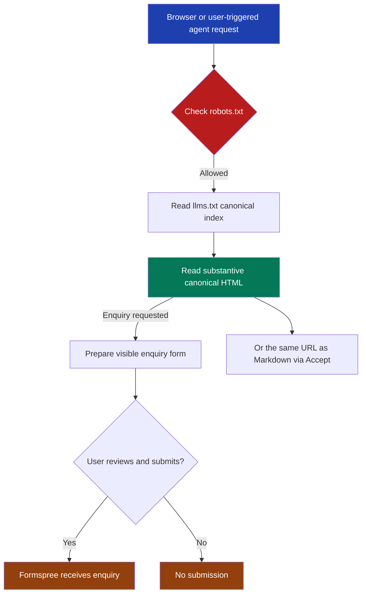

# Agent readiness

FinTrace Root exposes a static, human-first site that browsers and user-triggered agents can read and operate from the same public HTML. This guide owns the discovery files, structured identity, WebMCP form contract, deterministic agent checks and static performance budgets.

## Hosting profile

Cloudflare Workers Static Assets serves the prerendered Astro build in `site/dist`. The supported agent surfaces are:

- substantive canonical HTML for every public route;
- the same canonical URL in Markdown when the request sends `Accept: text/markdown`, with `Vary: Accept` on every document response;
- `/llms.txt` as an agent-operating brief for the service, followed by a curated index of canonical pages;
- `/robots.txt` with wildcard access and a sitemap pointer;
- `/sitemap.xml` with every indexable HTML route;
- declarative WebMCP annotations on the visible enquiry form.

The host now owns response headers through `site/public/_headers`: the hash-free Content Security Policy, `Permissions-Policy`, `Referrer-Policy`, `X-Content-Type-Options`, `X-Frame-Options`, `text/plain; charset=utf-8` on the discovery files, and `public, max-age=31536000, immutable` on `/_astro/*`. Preview URLs carry `X-Robots-Tag: noindex`; the apex never does. There is no HSTS until it is approved separately.

Generated Markdown is written to `site/dist/_agent-markdown/` at build time by `site/scripts/generate-agent-markdown.mjs`. It is never reachable directly: `/_agent-markdown/` returns `404`, and the Worker is the only way to select it. Do not add a visible Markdown mirror or a second discovery surface.

Two hosts appear in validation and they differ by design. Cloudflare Workers answers a slashless document path with `307` to the trailing-slash URL; the test-only static host in `site/scripts/preview-server.mjs` answers `301`. The Playwright suite accepts either and `site/test/http-contract.json` pins the exact status per host. Declared browser identity assets retain their production media types: `image/vnd.microsoft.icon` for `/favicon.ico`, `image/svg+xml` for `/icon.svg` and `image/png` for `/apple-icon.png`.

Cloudflare can rewrite responses after the Worker returns them. Two zone features were found doing so during the migration and are now off for this zone: the managed `robots.txt` (which published `Disallow: /` for the major AI crawlers) and the auto-injected Web Analytics beacon (which the CSP would have blocked on every page view). `site/scripts/verify-hosted-parity.mjs` requests every document a second time with a browser `Accept` header because that is the only shape in which the beacon appeared. See `cloudflare_workers_hosting.md`.

## Ownership

| Contract | Owner |
| --- | --- |
| Site identity, canonical route registry, titles, descriptions and share metadata | `site/src/config/site.ts` and `site/src/lib/metadata.ts::indexablePageKeys` |
| Head tag order and values | `site/src/components/head/PageMetadata.astro` |
| Per-page WebSite, Organization, WebPage and Service JSON-LD | `site/src/lib/structured-data.ts` and `site/src/components/head/StructuredData.astro` |
| llms.txt operating block, section curation and canonical links | `site/src/lib/llms.ts::renderLlmsTxt` and `site/src/pages/llms.txt.ts` |
| Per-route llms.txt label and description | `site/src/lib/metadata.ts::pageMetadata` (`llmsLabel`, `llmsDescription`) |
| Robots and sitemap output | `site/src/pages/robots.txt.ts` and `site/src/pages/sitemap.xml.ts` |
| Negotiated Markdown selection and headers | `site/src/worker.ts` and `site/src/lib/agent-readable-http/` |
| Markdown generation from built HTML | `site/scripts/generate-agent-markdown.mjs` |
| Response header policy | `site/public/_headers` |
| Generic public privacy notice | `site/src/pages/privacy/index.astro` |
| WebMCP form name, description and manual-submit boundary | `site/src/components/sections/ContactForm.astro` |
| Test-only static host | `site/scripts/preview-server.mjs` |
| Desktop and mobile agent checks | `site/test/` and `site/playwright.config.ts` |
| Deployment gate | Cloudflare Workers Builds; see `cloudflare_workers_hosting.md` |

`metadata.ts::indexablePageKeys` is the source of truth for sitemap order and for llms.txt membership; `llms.ts::sections` curates the llms.txt order by user task and `renderLlmsTxt` fails the build when an indexable route is missing or listed twice. A new public route must add its reviewed metadata there, including `llmsLabel` and `llmsDescription`, be placed in an llms.txt section, render one visible H1 inside one `main`, appear in shared discovery navigation and add a content marker to `test/agent/agent.routes.ts`.

## Permanent structure

```text
site/
├── public/
│   └── _headers                        # Host-applied response policy
├── src/
│   ├── components/
│   │   ├── head/PageMetadata.astro     # Head tag order and values
│   │   ├── head/StructuredData.astro   # Per-page JSON-LD graph
│   │   └── sections/ContactForm.astro  # Human-reviewed WebMCP form
│   ├── config/site.ts                  # Site identity
│   ├── layouts/BaseLayout.astro        # llms.txt discovery link, icons, fonts
│   ├── lib/
│   │   ├── agent-readable-http/        # Accept negotiation and header merge
│   │   ├── llms.ts                     # llms.txt renderer
│   │   ├── metadata.ts                 # Route registry source of truth
│   │   └── structured-data.ts          # JSON-LD graph builder
│   ├── pages/
│   │   ├── llms.txt.ts                 # Prerendered text response
│   │   ├── privacy/index.astro         # Public privacy notice
│   │   ├── robots.txt.ts               # Wildcard crawler policy
│   │   └── sitemap.xml.ts              # Canonical route inventory
│   └── worker.ts                       # Negotiated document selector
└── scripts/generate-agent-markdown.mjs # Build-time Markdown representation
```

## Request flow



## Identity and trust

Every public page has one direct production canonical, route-specific Open Graph and Twitter values, one `rel="describedby"` link to `/llms.txt`, and one JSON-LD graph. The Organization node deliberately contains only the verified name, URL and service description. Do not invent a public address, phone number or email address to make the node look more complete.

The trust baseline covers `/about/`, `/contact/` and `/privacy/`. Each must retain at least 500 page-specific visible characters after shared wording is excluded. Each must remain discoverable from the homepage, sitemap and llms.txt. The privacy notice must stay aligned with the actual Cloudflare, Mixpanel and Formspree behaviour.

## WebMCP boundary

The contact form publishes `toolname="sendFinTraceEnquiry"` and a plain-language `tooldescription`. Native labels and stable `name` attributes define its parameters. `toolautosubmit` is forbidden: an agent can prepare the visible form, but the user reviews and submits it. Tests replace `window.fetch` for sending, success and failure states, so validation never sends a live Formspree enquiry.

## Accessibility and interaction proof

The Playwright suite runs at 1440x900 and 390x900. It verifies:

- the exact 33 axe rules used by Lighthouse’s agent accessibility-tree audit;
- initial, sending, success and failure states;
- maximum cumulative layout shift of 0.1;
- one visible H1 and one `main`, named controls and links, skip-link focus, no horizontal overflow and no unexpected browser errors;
- substantive JavaScript-off HTML and exact response parity for `ChatGPT-User`, `Claude-User` and `Perplexity-User`;
- declared favicon, SVG icon and Apple icon response media types;
- a branded real 404 with a named internal recovery link;
- manual-submit WebMCP rules and the absence of unauthorised autosubmit;
- cold fragment landing for deferred homepage sections.

## Static performance budgets

Budgets use gzip sizes of the resources referenced by each exported page, not the whole build directory.

| Surface | Budget | 31 August 2026 largest observed sample |
| --- | ---: | ---: |
| HTML per route | 30,000 bytes | 8,395 bytes |
| Referenced CSS per route | 30,000 bytes | 11,007 bytes |
| Initial JavaScript per route | 250,000 bytes | 5,224 bytes |
| Testimonial portrait | 45,000 bytes, maximum 252x252 | 28,959 bytes, 252x252 |

The 6 September 2026 samples are the Astro build. `site/test/build-output.test.ts` additionally asserts that every route stays below the Next.js sample it replaced (15,326 / 10,907 / 197,087 bytes on the homepage), so a regression toward the old cost fails the build rather than merely staying inside the budget. The budgets are the durable release gate; the dated samples are evidence from this implementation run, not exact future-build expectations.

The Three.js scene chunk and the Mixpanel loader chunk are separate files that no initial document references; both load only after intent or a bounded post-load delay.

The portrait stays a lazy, asynchronously decoded image with explicit rendered dimensions. Homepage sections keep `content-visibility: auto`; only a cold fragment target and deferred siblings above it switch to visible so anchor accuracy does not discard normal scrolling deferral. Exactly two font files are preloaded - the display and mono faces that carry above-the-fold text. The 716-byte approx subset is deliberately not preloaded: it leads every mono stack, so it is discovered at CSS parse time.

## Validation

Run from `site/`:

```bash
corepack pnpm check
corepack pnpm build
corepack pnpm test
rg -n "mixpanel-recorder|@mixpanel/rrweb|rrweb-record" dist/_astro
```

All commands must pass and the recorder search must return no shipped recorder implementation. `pnpm test` does not run `astro check`, so run `check` too: a type-only regression otherwise passes the tests and fails the build.

With `corepack pnpm worker:dev` running, also run `corepack pnpm test:http`.

Against a deployment, headers and negotiation can only be proven on the host:

```bash
node scripts/verify-hosted-parity.mjs https://fintrace.com.au
node scripts/verify-hosted-transport.mjs https://fintrace.com.au
node scripts/verify-negotiated-content.mjs https://fintrace.com.au
node scripts/verify-browser-runtime.mjs https://fintrace.com.au
node scripts/verify-hosted-analytics.mjs https://fintrace.com.au
node scripts/verify-contact-contract.mjs https://fintrace.com.au
```

Then complete the headed real-GPU checks required by `AGENTS.md` for user-facing changes.
