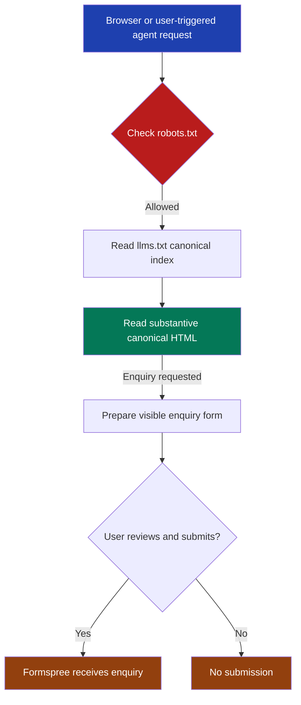

# Agent readiness

FinTrace Root exposes a static, human-first site that browsers and user-triggered agents can read and operate from the same public HTML. This guide owns the discovery files, structured identity, WebMCP form contract, deterministic agent checks and static performance budgets.

## Hosting profile

GitHub Pages receives only the Next.js static export in `out/`. The supported agent surfaces are:

- substantive canonical HTML for every public route;
- `/llms.txt` as a concise index of canonical pages;
- `/robots.txt` with wildcard access and a sitemap pointer;
- `/sitemap.xml` with every indexable HTML route;
- declarative WebMCP annotations on the visible enquiry form.

GitHub Pages cannot run middleware or vary a response by `Accept`. Do not add same-URL Markdown, hidden Markdown mirrors, `Vary: Accept`, API routes or server-only agent endpoints. GitHub Pages also owns production cache headers, so repository code cannot set immutable asset caching.

The test-only static host mirrors GitHub Pages browser-facing semantics. A slashless public route returns `301` to its trailing-slash canonical URL, while the canonical URL serves the exported `index.html` with `200`. Declared browser identity assets retain their production media types: `image/vnd.microsoft.icon` for `/favicon.ico`, `image/svg+xml` for `/icon.svg` and `image/png` for `/apple-icon.png`.

## Ownership

| Contract | Owner |
| --- | --- |
| Site identity, canonical route registry, titles, descriptions and share metadata | `src/lib/metadata.ts::createPageMetadata` and `metadata.ts::indexablePageKeys` |
| Per-page WebSite, Organization, WebPage and Service JSON-LD | `src/app/StructuredData.tsx::StructuredData` |
| llms.txt wording and canonical links | `src/lib/llms.ts::renderLlmsTxt` and `src/app/llms.txt/route.ts::GET` |
| Robots and sitemap output | `src/app/robots.ts` and `src/app/sitemap.ts` |
| Generic public privacy notice | `src/app/privacy/page.tsx::PrivacyPage` |
| WebMCP form name, description and manual-submit boundary | `src/app/contact/ContactForm.tsx::ContactForm` |
| Test-only static host | `scripts/serve-static-export.mjs` |
| Desktop and mobile agent checks | `test/agent/` and `playwright.config.ts` |
| Deployment gate | `.github/workflows/deploy.yml` |

`metadata.ts::indexablePageKeys` is the source of truth for sitemap and llms.txt order. A new public route must add its reviewed metadata there, render one visible H1 inside one `main`, appear in shared discovery navigation and add a content marker to `test/agent/agent.routes.ts`.

## Permanent structure

```text
src/
├── app/
│   ├── StructuredData.tsx  # Per-page JSON-LD graph
│   ├── contact/
│   │   └── ContactForm.tsx # Human-reviewed WebMCP form
│   ├── llms.txt/route.ts   # Static text response
│   ├── privacy/page.tsx    # Public privacy notice
│   ├── layout.tsx          # llms.txt discovery link
│   ├── robots.ts           # Wildcard crawler policy
│   └── sitemap.ts          # Canonical route inventory
└── lib/
    ├── llms.ts             # llms.txt renderer
    └── metadata.ts         # Identity and route source of truth
```

## Request flow



## Identity and trust

Every public page has one direct production canonical, route-specific Open Graph and Twitter values, one `rel="describedby"` link to `/llms.txt`, and one JSON-LD graph. The Organization node deliberately contains only the verified name, URL and service description. Do not invent a public address, phone number or email address to make the node look more complete.

The trust baseline covers `/about/`, `/contact/` and `/privacy/`. Each must retain at least 500 page-specific visible characters after shared wording is excluded. Each must remain discoverable from the homepage, sitemap and llms.txt. The privacy notice must stay aligned with the actual GitHub Pages, Mixpanel and Formspree behaviour.

## WebMCP boundary

The contact form publishes `toolname="sendFinTraceEnquiry"` and a plain-language `tooldescription`. Native labels and stable `name` attributes define its parameters. `toolautosubmit` is forbidden: an agent can prepare the visible form, but the user reviews and submits it. Tests replace `window.fetch` for sending, success and failure states, so validation never sends a live Formspree enquiry.

## Accessibility and interaction proof

The Playwright suite runs at 1440x900 and 390x900. It verifies:

- the exact 33 axe rules used by Lighthouse’s agent accessibility-tree audit;
- initial, sending, success and failure states;
- maximum cumulative layout shift of 0.1;
- one visible H1 and one `main`, named controls and links, skip-link focus, no horizontal overflow and no unexpected browser errors;
- substantive JavaScript-off HTML and exact response parity for `ChatGPT-User`, `Claude-User` and `Perplexity-User`;
- declared favicon, SVG icon and Apple icon response media types;
- a branded real 404 with a named internal recovery link;
- manual-submit WebMCP rules and the absence of unauthorised autosubmit;
- cold fragment landing for deferred homepage sections.

## Static performance budgets

Budgets use gzip sizes of the resources referenced by each exported page, not the whole build directory.

| Surface | Budget | 31 August 2026 largest observed sample |
| --- | ---: | ---: |
| HTML per route | 30,000 bytes | 15,387 bytes |
| Referenced CSS per route | 30,000 bytes | 16,737 bytes |
| Initial JavaScript per route | 250,000 bytes | 196,797 bytes |
| Testimonial portrait | 45,000 bytes, maximum 252x252 | 28,959 bytes, 252x252 |

Compressed HTML and CSS totals moved by fewer than 25 bytes across identical-source Turbopack validation builds. The budgets are the durable release gate; the dated samples are evidence from this implementation run, not exact future-build expectations.

The portrait stays a lazy, asynchronously decoded image with explicit rendered dimensions. Homepage sections keep `content-visibility: auto`; only a cold fragment target and deferred siblings above it switch to visible so anchor accuracy does not discard normal scrolling deferral.

## Validation

Run from the repository root:

```bash
npm test
npm run lint
npm run build
npm run test:agent
rg -n "mixpanel-recorder|@mixpanel/rrweb|rrweb-record" out/_next/static .next/static
```

All commands must pass. The recorder search must return no shipped recorder implementation. Use `npm run test:agent:headed` when debugging the Chromium surface, then complete the headed real-GPU checks required by `AGENTS.md` for user-facing changes.
