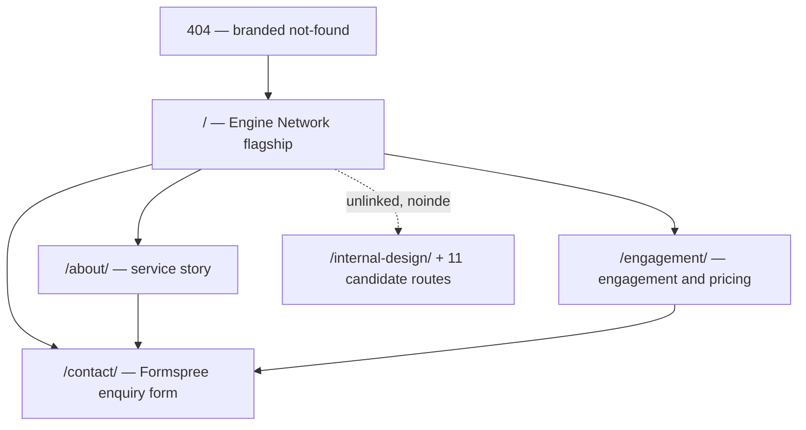

# ~~FinTrace Site Pages Plan — Contact, About, Engagement & Pricing, 404~~ ✅ **COMPLETED**

<critical_warning>
> **CRITICAL WARNING:** This plan executes ONLY AFTER two other plans have fully landed: `documents/learnings/engine_network_audit_fix_plan.md` (the canonical-home audit fixes) and `documents/learnings/fintrace_github_pages_deployment_plan.md` (Engine Network promoted to `/`, gallery moved to `/internal-design/`, production metadata, sitemap and GitHub Pages live at `https://fintrace.com.au/`). This plan's steps assume the post-deployment file layout — a shared `EngineNetworkPage.tsx`, a production `src/app/page.tsx` wrapper, `src/app/sitemap.ts` with one URL, and no `.eng-lab-chip` on the flagship. If those files do not exist in that shape, STOP and execute the prerequisite plans first.
</critical_warning>

<critical_warning>
> **CRITICAL WARNING:** Step 1 retargets the hero's gold CTA `href` inside `Hero.tsx`. Per the binding round-5 rule in `AGENTS.md` and `documents/plans/fintrace_design_plan.md`, ANY `/engine-network` hero change — even an attribute-only change — requires headed real-GPU re-verification at the full seven-viewport matrix (1440x900, 1998x750, 2560x1080, 3425x1245, 1024x768, 900x1080, 390x900) plus fallback and lifecycle checks. The change is `href`-only (no text, geometry or style change), so the matrix will pass trivially, but it must still be run. Do not skip it.
</critical_warning>

<important_note>
> **IMPORTANT NOTE:** The user supplied real public Formspree form ID `xwvgoenw`. The user deliberately skipped a live HTTP 200 submission and dashboard-receipt check, so the production success path remains unproven until the first real enquiry.
</important_note>

## 1. Goal

`/engine-network/` (serving at `/` post-deployment) was the canonical FinTrace home page but the only production page. A legal buyer who wanted to check who was behind the service, how engagement and pricing worked, or how to make contact had only a direct-email action, and a mistyped URL landed on an unbranded default 404. Build the four remaining production pages so the site works end to end for its buyers (family law firms, public trustees and government legal, forensic accountants, insolvency practitioners, estate/financial-abuse teams):

1. **`/about/`** — the service story: proven origin, service-not-software positioning, the verifiability standard. No people, no invented history.
2. **`/engagement/`** — how an engagement runs, the two deliverables, and the pricing shape (flat engagement fee plus per-page pricing — no dollar figures).
3. **`/contact/`** — a Formspree-backed enquiry form (modelled on the proven embeddings and bulma-root implementations) plus a structured "what happens next" panel and retry-safe error handling.
4. **Branded 404** (`src/app/not-found.tsx`) — an on-brand dead-end that routes back to `/`.

All four render in the flagship's obsidian-and-gold Evidence Engine system — same palette, Bricolage Grotesque + Fragment Mono, kicker/gold-span/lede/plate/button components — with copy at the Harry Dry "Marketing Examples" standard (short, concrete, punchy) already applied to the home page. The home page gains a footer page-nav and three CTA `href` retargets, and nothing else.

Done means: `npm run lint` zero errors; `npm run build` exports all routes; every new page passes headed dev-browser checks at 1440x900 and 390x900 with zero console/page errors and zero horizontal overflow; the hero href change passes the seven-viewport matrix; the sitemap lists exactly four URLs; every copy string matches the copy decks in this plan verbatim; and `AGENTS.md`, `documents/plans/fintrace_design_plan.md` and `README.md` record the new architecture.

---

## 2. Current State Analysis

### 2.1 Current Implementation Overview (post-prerequisite-plans)

| Piece | State after the two prerequisite plans |
| --- | --- |
| `/` | Renders the shared Engine Network Server Component (`src/app/engine-network/EngineNetworkPage.tsx` or equivalent) via a thin `src/app/page.tsx` wrapper. Indexable, canonical `https://fintrace.com.au/`. |
| `/engine-network/` | Internal comparison wrapper rendering the same shared component, `noindex`, canonical `/`. |
| `/internal-design/` | The unlinked, `noindex` design gallery; 11 candidate routes hang off it. |
| Header (flagship, before Step 9) | Wordmark (→ `/`) + section anchors Process/Ledger/Tracing/Proof + gold `eng-btn-sm` button "Request assessment" → the former direct-email destination. Mobile (≤767 px) hid the text links and kept the wordmark + button. Step 9 replaces this duplicate header with `SiteHeader`. |
| Hero CTAs | Gold "Request a matter assessment" originally used the former direct-email destination and now routes to `/contact/`; ghost "See how the engine works" → `#process`. |
| `#engage` CTA plate | Gold "Request a matter assessment" and the secondary enquiry action now both route to `/contact/`. |
| Footer | Two blocks in `.eng-footer-inner`: brand (wordmark + "Forensic financial analysis for the legal profession.") and `.eng-footer-meta` (mailto link + "Engaged per matter · Australia-wide"), then `.eng-footer-small` © line. No page navigation exists. |
| 404 | **No `src/app/not-found.tsx` exists.** `out/404.html` is Next's unstyled default — off-brand white page. |
| Sitemap | `src/app/sitemap.ts` returns exactly one URL (`https://fintrace.com.au/`) per deployment REQ-28. |
| Fonts | `src/app/engine-network/fonts.ts` exports `bricolage` (`--font-eng-display`) and `fragmentMono` (`--font-eng-mono`), self-hosted via `next/font/google`. |
| Analytics | None configured anywhere; the deployment plan explicitly added none. |
| Contact destination | The original drafts displayed a mailbox address throughout the copy. Step 9 removes it and makes `/contact/` the only public contact destination. |

### 2.2 The Design System Being Extended (measured from `src/app/engine-network/engine-network.css`)

**Palette (CSS custom properties on `.dsn-engine-network`):**

| Token | Value | Role |
| --- | --- | --- |
| `--obsidian` | `#0d0b09` | Page ground (warm black) |
| `--obsidian-2` | `#171310` | Raised panels/plates |
| `--paper` | `#f3ecdd` | Headline ivory |
| `--gold` | `#d4a94e` | Primary champagne gold |
| `--gold-bright` | `#f0d491` | Highlights, light on metal |
| `--gold-deep` | `#8a6a2b` | Engraved/recessed gold |
| `--grey-warm` | `#a39a8d` | Supporting copy |
| `--hairline` | `rgba(212, 169, 78, 0.22)` | Gold hairline borders |
| `--hairline-dim` | `rgba(212, 169, 78, 0.12)` | Dim hairlines |
| Crimson (not a var) | `#b3231f` | The single "flagged" accent, used sparingly |

Page-wide gold-dust film grain via a fixed `::after` SVG turbulence tile; gold `::selection`; `focus-visible` = 1 px `--gold-bright` outline, 3 px offset.

**Type system:** kickers are Fragment Mono 0.72 rem, 0.34 em letter-spacing, uppercase, gold, with a 2 rem engraved leading dash (`.eng-kicker::before`). Headings are Bricolage Grotesque: `.eng-display` (clamp 2.9–6.2 rem, weight 760) and `.eng-h2` (clamp 2–3.3 rem, weight 700), each with one clause wrapped in `.eng-gold-text` (four-stop metal gradient clipped to glyphs). Ledes are `--grey-warm`, clamp 1.02–1.2 rem, line-height 1.65, `max-width: 34rem`.

**Components to reuse verbatim:** `.eng-container` (74 rem measure), `.eng-section`, `.eng-plate` (gradient panel + engraved inner frame + gold corner registration ticks), `.eng-card` (hover-lift audience card), `.eng-btn-gold` / `.eng-btn-sm` / `.eng-btn-loop` (metal button with light sweep, press `scale: 0.96`), `.eng-btn-ghost` (mono hairline button), `.eng-kicker`, `.eng-h2`, `.eng-gold-text`, `.eng-lede`, header (`.eng-header`, `.eng-wordmark` with luminous gate bar, `.eng-header-nav`), footer (`.eng-footer*`), `Reveal.tsx` (IntersectionObserver entrance wrapper), `Stat.tsx` (count-up/count-down), the mono stat strip pattern (`.eng-hero-strip`).

**Voice (established across five design rounds and the audit-fix copy pass):** British English; curly apostrophe `’`; no emoji; NO Oxford comma in running copy; headline pattern is two short declaratives with the payoff clause in gold ("Four stages. One chain of evidence." / "Every line entered. Every line sourced."); ledes are concrete and rhythmic, heavy on colons and em-dashes; mono voice for labels, numerals, buttons and strips; claims are never invented — everything grounds in `/Users/sacino/fintrace/documents/reference/brand_naming_background.md`. Exact-phrase duplication between visible copy blocks is treated as a defect (audit finding C5); avoid reusing home-page sentences on the new pages.

### 2.3 The Core Problem

The original site converted through a single direct-email action and answered none of the pre-engagement questions a legal buyer asks (who are you, how do you charge, how do we start, what do we receive). Government procurement in particular expects an engagement/pricing explanation before anyone makes contact. A default-styled 404 breaks the premium illusion the flagship builds. A bare email action also leaks enquiries: it fails on machines without a configured mail client and gives no structure to what the enquirer should include.

### 2.4 Reference Implementations for the Contact Form

Two working Formspree integrations exist in this workspace and are the required model (user decision):

- **`/Users/sacino/bulma-root/demo/src/app/contact/contact-form.tsx`** — the preferred structural model (TypeScript, no framer-motion): `'use client'` component; `FORMSPREE_FORM_ID` constant building `https://formspree.io/f/<id>`; `fetch` POST of `FormData` with `Accept: application/json` header; hidden `form_source` field; `isSubmitting` / `submitStatus` state; error panel with a mailto fallback link and a "your typed details are still saved above" note; success resets the form; `onChange` clears stale feedback; `aria-busy`, `role="alert"` / `role="status"`; disabled submit while sending.
- **`/Users/sacino/embeddings/src/app/contact/ContactForm.jsx`** — source of the anti-spam and deliverability details to carry over: hidden `_subject` field (custom email subject line) and hidden `_gotcha` honeypot text input (`tabIndex={-1}`, `autoComplete="off"`, visually hidden); status-code-aware error messages (400 invalid / 429 rate-limited / generic), each ending in the direct-email fallback. Its framer-motion animation and Mixpanel analytics are NOT carried over — FinTrace has neither dependency, and the deployment plan added no analytics.

Formspree works on static hosting because the POST happens from the browser at runtime; no server, key or secret is needed in the repo. The form ID is public by design. Both existing forms (`xrbgdgwq` embeddings, `xojvwybl` bulma) live in the user's existing Formspree account.

### 2.5 Technical Constraints (binding, from `AGENTS.md` and the design plan)

- British English, curly apostrophe `’`, no emoji in UI copy. Claims ground in `/Users/sacino/fintrace/documents/reference/brand_naming_background.md`; service-not-software positioning; do not invent capabilities, proof, clients, people, dates or credentials.
- Static export (`output: 'export'`, `trailingSlash: true`, `images.unoptimized: true`): no server actions, API routes, middleware or runtime image optimisation. The Formspree browser-side POST is the sole runtime network call and is a user-approved exception to the "no network assets" discipline (that rule targets visual assets; this is a data submission).
- Server Components by default; only `ContactForm.tsx` is a Client Component in this plan.
- Route CSS scoping: this plan extends the `.dsn-engine-network` scope to all production pages (home, about, engagement, contact, 404) with per-page class prefixes — `AGENTS.md` must be amended to record this (Step 7). Candidate lab routes keep strict isolation.
- `@keyframes` names are document-global: any new keyframe uses a route-unique prefix (`engab-`, `engeg-`, `engct-`, `engnf-`).
- Transform/opacity animation, IntersectionObserver reveals, passive listeners; NEVER add `prefers-reduced-motion` gates (workspace rule).
- better-ui interaction standards: press `scale: 0.96`, explicit transition-property lists, ≥44 px hit areas (in-flow padding or `::after` extension — but `::after` extensions must not overlap between stacked links), visible focus states.
- No font additions: reuse the exported `bricolage` and `fragmentMono` instances from `src/app/engine-network/fonts.ts` (same `next/font` instances = no duplicate font payload).
- Validation: `npm run lint` zero errors; `npm run build` completes the export; headed dev-browser checks (reuse `http://localhost:3004` if running); non-hero UI matrix is 1440x900 + 390x900; hero changes require the seven-viewport matrix.
- Record every design decision in `documents/plans/fintrace_design_plan.md` in the same task (binding documentation-synchronisation rule).
- Multiple collaborators may touch the repo concurrently; leave unrelated changes alone. Do not edit `.next/` or `out/`.
- Apply the `vercel-react-best-practices` skill before writing the React/Next.js changes.

### 2.6 Existing Infrastructure That Can Be Reused

- The entire `engine-network.css` component library (§2.2) — new pages import it and add only page-specific rules.
- `Reveal.tsx` (entrance choreography), `Stat.tsx` (if numerals are animated on `/about/`), `fonts.ts`.
- The shared `EngineNetworkPage.tsx` extraction from the deployment plan proves the pattern of thin route wrappers over shared colocated components; `SiteHeader`/`SiteFooter` (Step 1) follow it.
- The two Formspree reference implementations (§2.4).
- The dev-browser CLI with the Playwright Page API is the established verification harness.

### 2.7 Future Site Map



---

## 3. Desired State

### 3.1 Desired State Requirements

- **REQ-1 (MUST):** Three new public routes exist and export statically: `/about/`, `/engagement/`, `/contact/`, plus a branded `src/app/not-found.tsx` that renders into `out/404.html`. All render in the Evidence Engine system: `.dsn-engine-network` scope class, palette variables, Bricolage/Fragment Mono via the shared `fonts.ts`, kicker/gold-span/lede/plate/button components, gold-dust grain, shared header and footer chrome.
- **REQ-2 (MUST):** Every user-facing string on the new pages matches the copy decks in Step 2–5 exactly: British English, curly apostrophes, no Oxford commas in running copy, no emoji, no exact-phrase duplication of home-page sentences.
- **REQ-3 (MUST):** No claim appears anywhere that is not grounded in the brand brief. The allowed claim set: the proven live matter (≈50 hours estimated → ≈10 delivered; ≈50 accounts; 15 years; thousands of pages; findings closely matched the instructing lawyer's independent analysis); universal intake (any bank, any order, scanned or born-digital, no pre-sorting); the Excel ledger schema (file name, person, date, financial year, description, debit and credit, amount, category); auto-categorisation; anomaly detection (cash-withdrawal patterns, gambling and crypto activity, out-of-rhythm transactions); cross-account and cross-currency tracing (AUD↔INR via Wise); source-page-cited findings, human-verifiable, court-ready; service-not-software, engaged per matter, flat engagement fee plus per-page pricing; suits government procurement; Australia-wide. NOTHING else — no founders, no year founded, no team size, no office, no client names, no turnaround promises, no security/data-residency claims.
- **REQ-4 (MUST):** `/contact/` submits through Formspree exactly per the Step 4 contract: client-side `fetch` POST to `https://formspree.io/f/xwvgoenw` with `Accept: application/json`; hidden `_subject` and `form_source` fields and a `_gotcha` honeypot; loading/success/error states with `role`/`aria` semantics; error state preserves typed values and offers a retry instruction; success resets the form.
- **REQ-5 (MUST):** The footer on all production pages gains a page-nav block with exactly four links — Home `/`, About `/about/`, Engagement & pricing `/engagement/`, Contact `/contact/` — and no public page links to `/internal-design/` or any candidate route (deployment REQ-25 preserved).
- **REQ-6 (MUST):** Sub-pages share a header: wordmark → `/`; nav links About `/about/`, Engagement `/engagement/`, Contact `/contact/`; gold `eng-btn-sm` "Request assessment" → `/contact/` (on `/contact/` itself → `#enquire`). The existing ≤767 px rule (text links hidden, wordmark + button kept) applies unchanged.
- **REQ-7 (SUPERSEDED BY STEP 9):** The initial home-page scope limited changes to the footer and contact-action destinations while retaining the section-anchor header and a direct-email escape hatch. The user’s post-launch review explicitly replaces that decision: the homepage now uses `SiteHeader`, every contact action routes to `/contact/` and the shared footer uses the corrected grid layout.
- **REQ-8 (MUST):** `src/app/sitemap.ts` returns exactly four URLs (`/`, `/about/`, `/engagement/`, `/contact/`, all on `https://fintrace.com.au` with trailing slashes). Each new page is indexable with a self-referencing canonical via `alternates.canonical`. The 404 is not in the sitemap. This formally supersedes deployment-plan REQ-28 ("exactly one URL"), by user decision.
- **REQ-9 (MUST):** Static-export contracts preserved: no server actions, API routes, middleware or runtime redirects; only `ContactForm.tsx` is `'use client'`; the Formspree POST is the only runtime network request on the site.
- **REQ-10 (MUST):** All new CSS is scoped under `.dsn-engine-network` with page prefixes `eng-ab-` (about), `eng-eg-` (engagement), `eng-ct-` (contact), `eng-nf-` (404), plus the shared `eng-page-` prefix; any new keyframes use `engab-`/`engeg-`/`engct-`/`engnf-` prefixes; zero un-prefixed keyframes.
- **REQ-11 (MUST):** Interactive elements meet better-ui: press `scale: 0.96` on buttons, explicit transition-property lists, ≥44 px hit targets (footer-nav links use in-flow `min-height: 44px` padding, NOT `::after` extensions, because stacked/wrapped links would otherwise overlap targets), `:focus-visible` gold outline on links, buttons AND form fields.
- **REQ-12 (MUST):** `npm run lint` zero errors; `npm run build` exports every route; headed dev-browser verification passes at 1440x900 and 390x900 for `/about/`, `/engagement/`, `/contact/`, the 404 and the home footer, with zero console errors, zero page errors and zero horizontal overflow; the hero href retarget passes the full seven-viewport hero matrix.
- **REQ-13 (MUST NOT):** No changes to `Scene.tsx` geometry/timing, the three set-piece components, any candidate lab route, the gallery, `next.config.ts` behaviour, or fonts.
- **REQ-14 (MUST):** `AGENTS.md`, `documents/plans/fintrace_design_plan.md` and `README.md` updated in the same task (Step 7): shared production scope, new routes, Formspree exception, sitemap policy.
- **REQ-15 (SHOULD):** The 404 carries a faint static inline-SVG constellation echo (reusing the hero-fallback aesthetic: thin gold circles/lines at 0.1–0.3 opacity, one crimson hop) so even the dead end is on-brand.
- **REQ-16 (MUST):** A central `src/lib/metadata.ts` exports `siteMetadata` (site name, default SEO title, site description, site URL, og-image path, locale) and `pageMetadata` (title + description per page: `home`, `about`, `engagement`, `contact`), mirroring the `src/lib/metadata.js` pattern in mineseek-root/propva-root/embeddings. `src/app/layout.tsx`, `src/app/page.tsx` and the three sub-page files consume it; no literal title/description string remains in any page or layout file. Scope is titles + descriptions only — `alternates.canonical` entries and `src/app/sitemap.ts` intentionally stay hardcoded (blindspot-pass decision 7).
- **REQ-17 (MUST):** The root title template is `` `%s | ${siteMetadata.name}` `` (rendering `About | FinTrace`, `Engagement & pricing | FinTrace`, `Contact | FinTrace`). This supersedes both the shipped `%s — FinTrace` template and the interim `%s / FinTrace` decision. The home page keeps its full SEO title unchanged via `title: { absolute: pageMetadata.home.title }` (the mineseek home-escape pattern); the 404 renders the default site title (it exports no metadata — §4.2).
- **REQ-18 (MUST):** A single 1200×630 og:image exists at `public/images/og/fintrace-og.png` and is referenced site-wide through `openGraph`/`twitter` blocks in the root layout fed from `siteMetadata` (`metadataBase` resolves the path to an absolute `https://fintrace.com.au/…` URL on every page). Copy rendered inside the asset is restricted to the REQ-3-grounded set (wordmark, the home-title clause, the domain). No per-page social images, no other social assets.

### 3.2 Defaults and Fallbacks

- **Route naming default:** `/engagement/` (not `/pricing/`) — matches the page's service voice ("Engage the service", "Engaged per matter") and avoids implying a public price list exists.
- **Form fallback order:** Formspree fetch → on any failure, preserve typed values and show a retry instruction without exposing a mailbox address.
- **Formspree failure fallback:** if the activated endpoint rejects a request or the browser cannot reach it, submission takes the retry-safe error path and preserves every typed value.
- **Metadata default:** page `title` strings rely on the root layout's production title template from the deployment plan; if the executor finds no template configured, set absolute titles (`About — FinTrace` etc.) instead.
- **Copy fallback:** if any copy-deck string is found to collide verbatim with a home-page sentence at build time (home copy may have shifted during the audit-fix execution), reword the NEW page's sentence (never the home page's) preserving meaning and voice, and record the final string in the design plan.

### 3.3 Verification Checklist

**Functional:**
- [x] `/about/`, `/engagement/`, `/contact/` render with shared header/footer chrome at both viewports
- [x] Contact form: local fetch stub → success state; forced endpoint/network failure → retry-safe error panel with preserved values; honeypot field invisible and excluded from tab order
- [x] Real public Formspree ID `xwvgoenw` ships; live HTTP 200 submission and dashboard receipt deliberately not run by user decision, with residual production-success risk recorded
- [x] 404: any unknown route (e.g. `/nope/`) serves the branded page; button returns to `/`
- [x] Header button targets: `/contact/` everywhere except on `/contact/` where it is `#enquire`

**Copy/claims:**
- [x] Every rendered string equals its copy-deck entry (`textContent` assertions)
- [x] Grep of new page sources finds no straight apostrophes in UI strings, no ` , and ` three-item lists, no claim outside the REQ-3 set

**SEO:**
- [x] `out/sitemap.xml` has exactly 4 `<loc>` entries; `out/about/index.html`, `out/engagement/index.html`, `out/contact/index.html` each carry a self canonical and no `noindex`
- [x] `out/404.html` exists and contains the branded markup
- [x] No public page contains an `/internal-design/` href
- [x] Built titles read `About | FinTrace`, `Engagement &amp; pricing | FinTrace` (HTML-entity ampersand), `Contact | FinTrace`; `out/index.html` keeps `FinTrace — Forensic financial analysis for legal matters`; `out/404.html` carries the default site title
- [x] Every built page carries `og:image` = `https://fintrace.com.au/images/og/fintrace-og.png` with width/height/alt and `twitter:card` `summary_large_image`; the asset measures exactly 1200×630
- [x] Grep of `src/app/{page.tsx,layout.tsx,about,engagement,contact}` finds no literal title/description strings — only `siteMetadata`/`pageMetadata` references resolve them

**Compatibility:**
- [x] The task-owned diff touches only the production `src/app/` files, `src/lib/metadata.ts`, `public/images/og/fintrace-og.png`, audit/plan documents and the binding root documentation named in this expanded plan
- [x] Candidate lab routes byte-identical (`git diff` empty for `src/app/{ledger,trace,clarity,engine,exhibit,chambers,engine-refined,engine-trace,engine-ledger,engine-flow}/`)
- [x] No new un-prefixed keyframes (grep)

**Ops/Docs:**
- [x] Lint zero errors; build exports; hero matrix screenshots saved with prefix `r7-`
- [x] `AGENTS.md`, design plan and README updated per Step 7

---

## 4. Additional Context

### 4.1 User-Provided Context (verbatim decisions from the blindspot pass)

1. **Page set:** "Core four" — Contact, About, Engagement & pricing, branded 404. Security/data-handling page, FAQ and Privacy/Terms were offered and NOT selected; do not build them.
2. **About grounding:** "Service story, no people" — about the method and service only; no founders, bios or invented history; ships without waiting on user input.
3. **Contact:** "Check embeddings + bulma root projects. we want to set up a similar contact form using FormSpree" — a Formspree form modelled on those two implementations (§2.4). This overrides the recommended mailto-only option; the third-party POST is user-approved.
4. **Nav & SEO:** "Footer nav + sitemap amend" — home header keeps its section anchors untouched; new pages linked from an expanded footer plus contextual CTA links; the sitemap gains the new URLs, formally amending the deployment plan's single-URL requirement; built AFTER both existing plans land.
5. The original task (verbatim intent): outline "the contact, about us, and any other key pages" with "the precise language, branding, style, and layout that we will have that is conducive with the site's existing color scheme/branding/voice" so "someone can build this out e2e".

Decisions 6–8 come from the second blindspot pass (2026-07-18) for the centralised-metadata addition (Step 8):

6. **Title separator:** `| FinTrace` — selected on 18 July 2026 and superseding the interim `/ FinTrace` choice. Sub-pages render `<page-name> | FinTrace`; the home page keeps its own full SEO title.
7. **Central file scope and location:** "Titles + descriptions" at `src/lib/metadata.ts` — exact mineseek/propva parity (`siteMetadata` + `pageMetadata`); canonicals and `sitemap.ts` intentionally stay hardcoded. This creates the repo's first `src/lib/` directory.
8. **Social metadata (verbatim):** "Update the plan to include creating a single og:image that meets the requirements and use the same reference site-wide" — one 1200×630 asset, referenced by every page through the central file's layout blocks.

### 4.2 Background and Decisions

- **Why CTA hrefs retarget to `/contact/`:** a form converts better than a bare email action because it works without a configured mail client and structures the enquiry. Step 9 removes the remaining split experience so every public contact action uses the Contact route.
- **Why footer-nav links use in-flow 44 px boxes, not `::after` extensions:** the existing footer `::after` hit-area pattern is safe only because "the metadata line below is not interactive" (comment in `engine-network.css`). Four stacked/wrapping nav links with ±22 px vertical extensions would overlap targets — a better-ui regression.
- **Why the pages share `.dsn-engine-network` instead of new `.dsn-<route>` scopes:** the route-isolation rule exists so competing lab concepts never bleed into each other; the production pages are ONE system by definition, and duplicating an ~1,800-line stylesheet per page would guarantee drift. `AGENTS.md` is amended (Step 7) to state: production routes share the flagship scope with per-page class prefixes; lab candidate routes keep strict isolation.
- **Rejected: `/pricing/` route name** — implies a price list; the service quotes per matter. `/engagement/` matches the established voice.
- **Rejected: response-time promises** ("we reply within X days") — a service commitment the user never made; nothing in the brand brief grounds it.
- **Rejected: framer-motion and analytics in the form** — embeddings uses both; FinTrace has neither dependency and the deployment plan deliberately added no analytics. `Reveal` + CSS transitions cover all animation needs.
- **Rejected: re-embedding the animated proof-stat grid on `/about/`** — duplicating the home set-piece would dilute it; `/about/` uses a static mono strip of the same numbers instead.
- **Formspree account context:** the user’s existing Formspree account (the one holding `xrbgdgwq` and `xojvwybl`; account email believed to be `hello@webpop.com.au`) owns the FinTrace form. Public pages expose no notification mailbox; submissions remain readable in the Formspree dashboard.
- **`out/404.html` on GitHub Pages:** GitHub Pages automatically serves `404.html` for unknown paths, so `not-found.tsx` is production-effective with zero configuration.
- **`not-found.tsx` metadata:** Next.js does not reliably support metadata exports on `not-found`; the root layout's production defaults cover its `<title>`. Do not fight this.
- **Curly-apostrophe discipline in code:** JSX string literals must contain `’` directly (e.g. `We’ll`). Escape where needed for lint (`react/no-unescaped-entities` accepts `’` directly; only `'` would need escaping, and it must not appear in copy anyway).
- **Gold-span notation used in the copy decks below:** `<gold>…</gold>` marks the clause to wrap in `<span className="eng-gold-text">`. Em dashes in copy are true em dashes (—) with spaces, matching the home page. `·` separators in mono strips are middle dots, matching the hero strip.
- **Why `| FinTrace` is current:** the em-dash template was an implementation default, and `/ FinTrace` was selected during the second blindspot pass. The user subsequently changed the delimiter decision to `|` on 18 July 2026. This latest decision supersedes the slash throughout implementation and validation expectations. The change alters every sub-page's rendered `<title>`, so the built-output title assertions in §6.4 re-run; it is metadata-only (no body markup), so no viewport matrix is triggered.
- **Why `src/lib/metadata.ts` despite fintrace's colocate-under-`src/app/` discipline:** cross-repo mental-model parity with mineseek-root/propva-root/embeddings (all use `src/lib/metadata.js`) outweighs strict colocation for site-wide, route-agnostic configuration. The `@/*` → `./src/*` tsconfig alias already exists, so pages import `@/lib/metadata`. `AGENTS.md` records the new directory's role (Step 8.6).
- **Why no `NEXT_PUBLIC_SITE_URL` env fallback in `siteMetadata.siteUrl`:** the sibling repos read the env var for multi-environment URL handling; fintrace is a single-domain static export that already hardcodes `https://fintrace.com.au` in `layout.tsx` and `sitemap.ts`. Keep the literal; introducing env plumbing would add a moving part with no consumer.
- **Why the og:image complies with the no-network-visual-assets rule:** it is a static file in `public/` copied into `out/` at build time; production pages never fetch it — social crawlers do, from the `<meta>` reference. It is a build artefact, not a runtime visual asset. `AGENTS.md` records this reading (Step 8.6).
- **Why the home page uses `title.absolute`:** mineseek's home (`src/app/page.jsx:22–27`) escapes its template the same way; `absolute` guarantees no `| FinTrace` suffix regardless of Next.js same-segment templating nuances, instead of relying on the current plain-string behaviour.

---

## 5. Implementation Plan

### ~~Step 1: Shared chrome — SiteHeader, SiteFooter, page-hero styles, home integration~~ ✅ **COMPLETED**

**Objective:** One header and one footer serve every production page (eliminating drift), the footer gains the page nav, the home CTAs retarget, and the shared sub-page styles land.

#### 1.1 High-Level Approach

Files: `src/app/engine-network/SiteChrome.tsx` (new), `src/app/engine-network/site-pages.css` (new), `src/app/engine-network/EngineNetworkPage.tsx` (or wherever the deployment plan placed the shared page + its `Header`), `src/app/engine-network/Hero.tsx`, `src/app/engine-network/engine-network.css`.

1. **`SiteChrome.tsx`** (Server Component, colocated with the system that styles it) exports:
   - `SiteHeader({ contactHref = '/contact/' })`: the existing header markup with wordmark → `/` and nav links `About` → `/about/`, `Engagement` → `/engagement/`, `Contact` → `/contact/`, plus the gold `eng-btn-sm` button `Request assessment` → `contactHref`. Reuses `.eng-header`/`.eng-header-nav` classes untouched; the ≤767 px collapse rule applies as-is. Step 9 extends this shared header to the homepage.
   - `SiteFooter()`: the existing footer markup plus a new middle block inside `.eng-footer-inner`:
     ```
     <nav className="eng-footer-nav" aria-label="Site pages">
       Home → /   About → /about/   Engagement & pricing → /engagement/   Contact → /contact/
     </nav>
     ```
     The home/shared page component replaces its inline footer with `<SiteFooter />` so all pages render the identical footer.
2. **Footer-nav CSS** (append to the footer section of `engine-network.css`): `.eng-footer-nav` — `display: flex; flex-wrap: wrap; column-gap: 1.6rem;` links in the mono voice (`var(--font-eng-mono)`, 0.72 rem, 0.14 em tracking, uppercase, `--grey-warm`), each link `display: inline-flex; align-items: center; min-height: 44px;` (in-flow hit target — see §4.2), `transition: color 0.3s ease`, hover `--gold-bright`. At ≤700 px the footer blocks stack; the nav wraps to two columns naturally via flex-wrap.
3. **Hero CTA retarget** in `Hero.tsx`: gold button destination → `/contact/`. Attribute-only; no text/geometry/style change. (Triggers the seven-viewport matrix — see Testing Plan.)
4. **`#engage` CTA retarget** in the shared page component: gold button `href` → `/contact/`; Step 9 retargets the ghost action to `/contact/#enquire`.
5. **`site-pages.css`** (imported by the three new pages and `not-found.tsx`), all rules scoped `.dsn-engine-network`:
   - `.eng-page-hero` — sub-page hero band: `padding: clamp(10rem, 20vh, 13rem) 0 clamp(3rem, 7vh, 5rem)` (clears the absolute header), bottom `1px solid var(--hairline-dim)`.
   - `.eng-page-h1` — Bricolage, weight 750, `clamp(2.6rem, 5.4vw, 4.6rem)`, line-height 1.02, letter-spacing −0.015 em (between `.eng-display` and `.eng-h2`: sub-pages are quieter than the flagship hero).
   - `.eng-page-strip` — static mono strip (font/tracking/colour identical to `.eng-hero-strip` items) with `·` dividers, `border-block: 1px solid var(--hairline-dim); padding: 1.1rem 0;`.
   - `.eng-page-section` — vertical rhythm `padding-block: clamp(4rem, 9vh, 6.5rem)`.
   Add imperative comments explaining each block's role.

**Success Criteria:**
- `grep -c "eng-footer" src/app/engine-network/SiteChrome.tsx` ≥ 1 and the shared page component contains no inline `<footer>` markup (footer defined exactly once in the codebase).
- Rendered `/` footer contains exactly 4 nav anchors with hrefs `/`, `/about/`, `/engagement/`, `/contact/` and zero `/internal-design/` anchors (DOM assertion).
- Each footer-nav link's bounding-box height ≥ 44 px at 1440x900 and 390x900 (script measurement).
- `Hero.tsx` and the shared page contain zero direct-email destinations; every assessment and enquiry action resolves to `/contact/`.
- Home renders visually identical to pre-change except the footer nav row: screenshot diff of hero and `#engage` sections shows no layout shift; the © line remains fully visible at both viewports.
- Seven-viewport hero matrix passes: zero console/page errors, zero horizontal overflow, one canvas, unchanged label rendering (screenshots prefixed `r7-hero-*`).

### ~~Step 2: `/about/` — the service story~~ ✅ **COMPLETED**

**Objective:** Answer "who/what is FinTrace and why should a legal team trust it" using only grounded facts — no people, no invented history.

#### 2.1 High-Level Approach

Files: `src/app/about/page.tsx` (new, Server Component), `src/app/about/about.css` (new, prefix `eng-ab-`).

`page.tsx` imports `../engine-network/engine-network.css`, `../engine-network/site-pages.css`, `./about.css`, `{ bricolage, fragmentMono }` from `../engine-network/fonts`, `Reveal` from `../engine-network/Reveal`, and `SiteHeader`/`SiteFooter`. Root element: `<div className={clsx('dsn-engine-network', bricolage.variable, fragmentMono.variable)}>`.

**Metadata:** title `About`; description `FinTrace is a specialist forensic bank-statement analysis service for legal teams — proven on a live matter, engaged per matter, Australia-wide.`; `alternates: { canonical: '/about/' }`.

**Layout:** `.eng-page-hero` (kicker + h1 + lede) → mono strip → three `.eng-page-section` blocks (each `Reveal`-wrapped head, `max-width` prose column ~42 rem matching `.eng-proof-note`) → CTA plate (`.eng-plate .eng-cta` reuse) → footer.

**Copy deck (exact strings):**

| Element | Copy |
| --- | --- |
| Hero kicker | `About FinTrace` |
| Hero h1 | `Forensic rigour, <gold>run as a service.</gold>` |
| Hero lede | `FinTrace exists to do one job at a forensic standard: turn thousands of pages of bank statements into evidence a legal team can rely on — and hand back the hours that work used to take.` |
| Mono strip | `Specialist forensic service · Engaged per matter · Australia-wide` |
| S1 kicker | `The origin` |
| S1 h2 | `Built on a real matter, <gold>not a demo.</gold>` |
| S1 body ¶1 | `FinTrace was proven inside a live property matter: thousands of pages of statements, about fifty accounts and fifteen years of history. The manual review was estimated at fifty hours of lawyer time. The engine delivered the ledger and the findings in about ten.` |
| S1 body ¶2 | `Those findings closely matched the analysis the instructing lawyer prepared independently, at a fifth of the time. That matter set the standard for the service.` |
| S1 mono sub-strip | `≈50 hrs estimated · ≈10 delivered · ≈50 accounts · 15 yrs of statements` |
| S2 kicker | `Service, not software` |
| S2 h2 | `Nothing to license. <gold>Nothing to learn.</gold>` |
| S2 body ¶1 | `FinTrace is engaged the way you’d brief a forensic accountant, not the way you’d buy software. There’s no platform to procure, no seats to license and no training to roll out — you send the statements and the engine does the work.` |
| S2 body ¶2 | `Per-matter engagement suits government procurement and private practice alike: one flat engagement fee, one per-page rate, scoped in writing before the work begins.` |
| S3 kicker | `The standard` |
| S3 h2 | `If it can’t be checked, <gold>it isn’t a finding.</gold>` |
| S3 body ¶1 | `Every line in the ledger and every finding in the report cites the exact page of the source PDF it came from. Anything the engine asserts, a human can verify in seconds — which makes the output human-verifiable and court-ready.` |
| CTA kicker | `Engage the service` |
| CTA h2 | `See it against <gold>your matter.</gold>` |
| CTA lede | `The fastest way to judge FinTrace is to put a real matter in front of it.` |
| CTA gold button | `Request a matter assessment` → `/contact/` |
| CTA ghost button | `Engagement & pricing` → `/engagement/` |

`about.css` needs only: `.eng-ab-prose` (prose column: `max-width: 42rem`, `color: var(--grey-warm)`, `font-size: 1.02rem`, `line-height: 1.65`, paragraph spacing `1.1rem`), `.eng-ab-strip` margins for the S1 sub-strip. No keyframes expected.

**Success Criteria:**
- `out/about/index.html` exists after build; its `<title>` contains `About` and `FinTrace`; canonical link ends `/about/`; no `noindex`.
- Every string above renders exactly (dev-browser `textContent` assertions on kicker/h1/h2s/ledes/buttons/strips).
- Grep of `src/app/about/` finds zero `'` characters inside JSX text strings, zero `, and ` three-item lists, and none of these ungrounded-claim markers: `founded`, `our team`, `years of experience`, `ISO`, `certified`.
- Both CTA buttons navigate correctly (click-through in dev-browser).
- 1440x900 + 390x900: zero console/page errors, zero horizontal overflow, header/footer chrome present, `Reveal` entrances fire on scroll.

### ~~Step 3: `/engagement/` — engagement & pricing~~ ✅ **COMPLETED**

**Objective:** Explain how an engagement runs, exactly what is delivered, and the pricing shape — with no dollar figures (none are approved) and no procurement-hostile ambiguity.

#### 3.1 High-Level Approach

Files: `src/app/engagement/page.tsx` (new, Server Component), `src/app/engagement/engagement.css` (new, prefix `eng-eg-`).

Same import/shell pattern as Step 2. **Metadata:** title `Engagement & pricing`; description `FinTrace is engaged per matter: a flat engagement fee plus per-page pricing, quoted after an initial assessment — no licences, no subscriptions.`; canonical `/engagement/`.

**Layout:** `.eng-page-hero` → mono strip → S1 four-step engagement sequence (reuse the home `#process` visual grammar: mono numerals `01–04`, name, copy; a 4-across grid desktop / stacked mobile via a new `.eng-eg-steps` grid — do NOT reuse `.eng-stages`' drawn progress line, keeping the home set-piece unique) → S2 deliverables as two `.eng-card` articles in a 2-col grid → S3 pricing prose + mono strip → CTA plate → footer.

**Copy deck (exact strings):**

| Element | Copy |
| --- | --- |
| Hero kicker | `Engagement & pricing` |
| Hero h1 | `A flat fee to engage. <gold>Per-page from there.</gold>` |
| Hero lede | `No subscriptions, no licences, no minimum term. FinTrace is engaged per matter: a flat engagement fee plus per-page pricing, quoted in writing once the matter is scoped.` |
| Mono strip | `No software licence · No subscription · Engaged per matter · Australia-wide` |
| S1 kicker | `The engagement` |
| S1 h2 | `From enquiry <gold>to evidence.</gold>` |
| Step 01 name | `Enquiry` |
| Step 01 copy | `Outline the matter — the dispute, roughly how many pages and accounts, the timeframe you’re working to. No statements yet.` |
| Step 02 name | `Assessment` |
| Step 02 copy | `We confirm the engine fits the matter and quote the engagement in writing: the flat fee and the per-page rate.` |
| Step 03 name | `Handover` |
| Step 03 copy | `You send the statements as they are — no sorting, no renaming, no cover sheet. Scanned paper is fine.` |
| Step 04 name | `Delivery` |
| Step 04 copy | `You receive the Excel ledger and the written findings report, every finding cited to its source page.` |
| S2 kicker | `The deliverables` |
| S2 h2 | `A ledger you can filter. <gold>Findings you can file.</gold>` |
| Card 1 name | `The ledger` |
| Card 1 copy | `One Excel workbook holding every transaction — file name, person, date, financial year, description, debit and credit, amount, category — with every line categorised and ready to interrogate.` |
| Card 2 name | `The findings report` |
| Card 2 copy | `A written account of what the analysis surfaced: cash-withdrawal patterns, gambling and crypto activity, transfers between related accounts, cross-currency matches. Each finding cites the exact source page.` |
| S3 kicker | `Pricing` |
| S3 h2 | `Quoted before <gold>the work begins.</gold>` |
| S3 body ¶1 | `Two numbers, agreed in writing before any work starts: a flat engagement fee and a per-page rate for the statements processed. Both follow the initial assessment, so procurement sees the full shape of the cost before committing.` |
| CTA kicker | `Start a matter` |
| CTA h2 | `Two numbers. <gold>One enquiry away.</gold>` |
| CTA gold button | `Request a matter assessment` → `/contact/` |
| CTA ghost button | `Start an enquiry` → `/contact/#enquire` |

`engagement.css`: `.eng-eg-steps` (grid `repeat(4, 1fr)` desktop, `1fr` ≤767 px, gap 2rem; numeral styling mirrors `.eng-stage-numeral`'s mono-gold voice with a distinct class), `.eng-eg-cards` (grid `repeat(2, 1fr)` desktop, `1fr` ≤767 px), `.eng-eg-prose` (as `.eng-ab-prose`). No keyframes expected.

**Success Criteria:**
- `out/engagement/index.html` exists; `<title>` contains `Engagement`; canonical ends `/engagement/`; no `noindex`.
- All strings render exactly (`textContent` assertions); grep finds zero `$` or digit-adjacent `AUD` price figures anywhere in `src/app/engagement/`.
- Deliverables cards use `.eng-card` and show the hover lift at desktop (computed `transform` changes on hover).
- Step grid is 4 columns at 1440x900 and 1 column at 390x900 (bounding-box assertion).
- 1440x900 + 390x900: zero console/page errors, zero horizontal overflow.

### ~~Step 4: `/contact/` — enquiry form on Formspree~~ ✅ **COMPLETED**

**Objective:** Convert enquiries through a structured, on-brand form with retry-safe error handling, modelled on the proven bulma-root/embeddings implementations. Step 9 supersedes the original direct-email fallback.

#### 4.1 High-Level Approach

Files: `src/app/contact/page.tsx` (new, Server Component), `src/app/contact/ContactForm.tsx` (new, Client Component), `src/app/contact/contact.css` (new, prefix `eng-ct-`).

**Metadata:** title `Contact`; description `Start a matter assessment: outline the dispute, page volume and timeframe, and FinTrace will come back with fit and a quote.`; canonical `/contact/`. Page passes `contactHref="#enquire"` to `SiteHeader`.

**Layout:** `.eng-page-hero` (kicker/h1/lede) → a two-column `.eng-page-section` (`.eng-ct-grid`: desktop `minmax(0, 5fr) minmax(0, 7fr)`, gap 3rem; ≤900 px single column, form first) → footer. Left column: "What happens next" (kicker + three mono-numbered rows) then a direct-contact block. Right column: the form inside an `.eng-plate` with `id="enquire"` and `scroll-margin-top: 6rem`.

**Copy deck (exact strings):**

| Element | Copy |
| --- | --- |
| Hero kicker | `Start a matter` |
| Hero h1 | `Tell us about <gold>the matter.</gold>` |
| Hero lede | `A few lines are enough for an initial assessment: the type of dispute, roughly how many pages and accounts, the timeframe you’re working to. We’ll come back with whether the engine fits and what the engagement would cost.` |
| Left kicker | `What happens next` |
| Next 01 name | `Assessment` |
| Next 01 copy | `We review the outline and confirm the engine fits the matter.` |
| Next 02 name | `Quote` |
| Next 02 copy | `You receive the engagement shape in writing — flat fee plus per-page rate.` |
| Next 03 name | `Handover` |
| Next 03 copy | `Only then do statements change hands, in whatever form you hold them.` |
| Direct kicker | `Prefer email?` |
| Direct link | Removed in Step 9; the Formspree form is the only public contact path. |
| Direct sub-line (mono) | `Engaged per matter · Australia-wide` |
| Form heading (h2, plain — no gold span at this size) | `Request a matter assessment` |
| Form sub-line | `No confidential detail is needed at this stage — please don’t attach or paste statement data.` |
| Submit button | `Send enquiry` (while sending: `Sending`; after success the button region is replaced by the success panel) |
| Loading status | `Sending your enquiry…` |
| Success panel | `Enquiry received. We’ll respond using the work email you provided.` |
| Error panel heading | `Enquiry not sent` |
| Error panel body | `Your details are still filled in above. Please check your connection and retry.` |

**Field contract (labels are mono uppercase via CSS; order fixed):**

| # | Label | Control | `name` | Required | Notes |
| --- | --- | --- | --- | --- | --- |
| 1 | `Name` | text | `name` | yes | `autoComplete="name"` |
| 2 | `Work email` | email | `email` | yes | `autoComplete="email"` |
| 3 | `Firm or organisation` | text | `organisation` | yes | `autoComplete="organization"` |
| 4 | `Matter type` | select | `matter_type` | yes | Options: `Family law property matter`, `Estate or financial-abuse matter`, `Insolvency or asset tracing`, `Forensic investigation`, `Other` (grounded in the home AUDIENCES) |
| 5 | `Approximate volume` | select | `volume` | no | Options: `Under 500 pages`, `500–2,000 pages`, `2,000–10,000 pages`, `More than 10,000 pages`, `Not sure yet` |
| 6 | `The matter` | textarea rows=5 | `message` | yes | Placeholder: `The dispute, the account footprint, the timeframe — a few lines is plenty.` |

**Hidden fields:** `_subject` = `New matter enquiry — fintrace.com.au`; `form_source` = `contact_page`; `_gotcha` honeypot (text input, `tabIndex={-1}`, `autoComplete="off"`, class hides it with `position: absolute; left: -9999px`, `aria-hidden="true"`).

**`ContactForm.tsx` behaviour contract (bulma-root pattern, TypeScript):**
- Module-scope constants keep the public endpoint isolated: `FORMSPREE_FORM_ID = 'xwvgoenw'`, and `FORMSPREE_ACTION` is built from it via a template literal as `https://formspree.io/f/<FORMSPREE_FORM_ID>` (mirrors bulma-root's two-constant pattern).
- `handleSubmit`: `preventDefault`; guard re-entry while submitting; `fetch(FORMSPREE_ACTION, { method: 'POST', body: new FormData(form), headers: { Accept: 'application/json' } })`; non-OK → throw with the Formspree JSON `error` when parseable; success → success state + `form.reset()`; failure → error state, NO reset (values preserved).
- Status-aware error copy is NOT needed (embeddings' 400/429 variants collapse into the single error panel above — one message, one fallback).
- `onChange` on the form clears a stale success/error panel (bulma pattern).
- A11y: `aria-busy` on the form while sending; success panel `role="status"`; error panel `role="alert"`; `disabled` submit while sending; every input labelled via `htmlFor`/`id`.
- No analytics calls, no framer-motion, no `_next` redirect field (fetch intercepts the response).

**Form styling (`contact.css`, all `.eng-ct-*`):** labels — Fragment Mono 0.66 rem, 0.18 em tracking, uppercase, `--grey-warm`, margin-bottom 0.5 rem. Inputs/selects/textarea — `background: rgba(243, 236, 221, 0.04); border: 1px solid var(--hairline-dim); color: var(--paper); border-radius: 2px; padding: 0.9rem 1rem; font-size: 1rem; min-height: 48px; width: 100%; transition: border-color 0.3s ease, background-color 0.3s ease;` focus — `border-color: var(--gold)`, background alpha 0.06; `:focus-visible` — 1 px `--gold-bright` outline, offset 3 px (matches the route rule). Select gets a gold chevron via an inline `data:` SVG `background-image` and `appearance: none`. Placeholder colour `rgba(163, 154, 141, 0.6)`. Success panel — `border: 1px solid var(--hairline); background: rgba(212, 169, 78, 0.08); color: var(--gold-bright)`. Error panel — `border: 1px solid rgba(179, 35, 31, 0.45); background: rgba(179, 35, 31, 0.1); color: #f0b9b5` (legible crimson-family tint on obsidian; verify ≥4.5:1 contrast). Submit is `.eng-btn-gold` full-pattern (sweep, press scale). Field vertical rhythm 1.4 rem.

**User action:** completed. Real public Formspree form ID `xwvgoenw` is installed. A live HTTP 200 submission and dashboard receipt were deliberately not run by user decision, so the production success path remains unproven until the first real enquiry.

**Success Criteria:**
- `out/contact/index.html` exists; `<title>` contains `Contact`; canonical ends `/contact/`; no `noindex`.
- All copy-deck strings and all six field labels render exactly; field `name` attributes match the contract (DOM assertions).
- Honeypot: an input named `_gotcha` exists, is absent from the tab order (tabIndex −1) and has zero visible bounding box.
- With a forced endpoint/network failure: submitting a filled form shows the error panel (`role="alert"`, heading `Enquiry not sent`) and every typed value survives in the fields (assert `input.value` post-failure).
- With a local success stub: the form shows the success panel (`role="status"`) and resets. Live endpoint and dashboard validation are deliberately out of scope by user decision.
- Keyboard pass: Tab order is fields 1→6 → submit; every focused control shows the gold `:focus-visible` treatment (screenshots).
- `grep -rn "framer-motion\|mixpanel\|analytics" src/app/contact/` returns zero hits; `ContactForm.tsx` is the only file in the plan's diff containing `'use client'`.
- 1440x900: two-column layout, form plate right; 390x900: single column, form first, no horizontal overflow, zero console/page errors.

### ~~Step 5: Branded 404~~ ✅ **COMPLETED**

**Objective:** Replace Next's default white 404 with an on-brand dead-end that returns visitors to `/`.

#### 5.1 High-Level Approach

Files: `src/app/not-found.tsx` (new, Server Component), `src/app/not-found.css` (new, prefix `eng-nf-`; colocated at app root beside the route file).

Since the root layout is font-neutral, `not-found.tsx` applies the full shell itself: imports `engine-network.css`, `site-pages.css`, `not-found.css`, fonts and `SiteFooter`; root `<div className={clsx('dsn-engine-network', bricolage.variable, fragmentMono.variable)}>`; renders `SiteHeader` (standard props), a single full-height centred band and the footer.

**Layout:** `.eng-nf-band` — `min-height: 78vh; display: grid; place-content: center; text-align: center; position: relative;` with a faint decorative inline SVG behind the text (REQ-15): 4–5 thin gold circles/edges at 0.1–0.3 stroke-opacity echoing the hero-fallback constellation (`Hero.tsx` lines 31–50 are the aesthetic reference), one crimson (`#b3231f`) hop, `aria-hidden`, `pointer-events: none`, absolutely positioned and centred, max-width 560 px. No animation; no keyframes.

**Copy deck (exact strings):**

| Element | Copy |
| --- | --- |
| Kicker | `Error 404` |
| H1 (`.eng-page-h1`) | `No trace <gold>of this page.</gold>` |
| Lede | `The address doesn’t lead anywhere — and unlike the money, it left no trail.` |
| Gold button | `Back to the home page` → `/` |
| Mono sub-line | `404 · Route not found` |

**Success Criteria:**
- `out/404.html` exists after build and contains `No trace`, the `.dsn-engine-network` class and the gold button markup (grep of the built file).
- Dev-browser visit to an unknown route (e.g. `http://localhost:3004/nope/`) renders the branded page; the button navigates to `/`.
- The decorative SVG has `aria-hidden="true"` and zero pointer events; page has zero console/page errors and zero horizontal overflow at 1440x900 and 390x900.
- No new keyframes introduced (grep `@keyframes` in `not-found.css` returns nothing).

### ~~Step 6: SEO — sitemap amendment and metadata verification~~ ✅ **COMPLETED**

**Objective:** Make the three new pages discoverable and canonical while keeping the 404 and all internal routes out.

#### 6.1 High-Level Approach

File: `src/app/sitemap.ts`.

Replace the single-entry return with exactly four entries, in this order, all `https://fintrace.com.au` + trailing slash: `/`, `/about/`, `/engagement/`, `/contact/`. Keep the existing entry shape (url + `lastModified` if present — match whatever field set the deployment plan used). Update the file's comment to record that the four-page production sitemap intentionally supersedes the deployment plan's single-URL requirement (user decision, blindspot pass). `robots.ts` needs no change. Per-page canonicals/titles were set in Steps 2–4; this step verifies them collectively.

**Success Criteria:**
- `out/sitemap.xml` contains exactly four `<url>` entries whose `<loc>` values are `https://fintrace.com.au/`, `https://fintrace.com.au/about/`, `https://fintrace.com.au/engagement/`, `https://fintrace.com.au/contact/` — and contains none of: `404`, `internal-design`, `engine-network`, `ledger`, `trace`, `clarity`, `exhibit`, `chambers`, `engine-flow` (string search).
- Each of the three new built HTML files carries its self canonical and no robots `noindex` (grep).
- `out/robots.txt` unchanged from its pre-plan content (`git diff` shows no `robots.ts` change).

### ~~Step 7: Documentation synchronisation~~ ✅ **COMPLETED**

**Objective:** Keep the binding docs truthful about the new architecture.

#### 7.1 High-Level Approach

1. **`AGENTS.md`:** amend the route-isolation rule: production routes (`/`, `/about/`, `/engagement/`, `/contact/`, the root `not-found`) share the `.dsn-engine-network` visual system with per-page class prefixes (`eng-ab-`, `eng-eg-`, `eng-ct-`, `eng-nf-`, shared `eng-page-`); lab candidate routes keep strict `.dsn-<route>` isolation. Record the Formspree contact form as the approved runtime network exception (browser-side POST to `https://formspree.io/f/<id>`; no secrets in the repo). Update the route register/description to include the three pages and branded 404.
2. **`documents/plans/fintrace_design_plan.md`:** append a completed-round section ("Round seven: production site pages" — continue whatever numbering exists after the prerequisite plans' entries) recording: the four user decisions (§4.1), the full page set with routes, the copy-deck location (this plan), the shared-chrome extraction (`SiteChrome.tsx`, `site-pages.css`), the footer nav, the three CTA retargets and their hero-matrix verification result, the Formspree contract and form-ID status, the sitemap amendment superseding deployment REQ-28, and validation results (viewport matrix, screenshot prefix `r7-*`). Update the current-inventory section with the new routes.
3. **`README.md`:** add the three pages and branded 404 to the route roles table/summary.
4. Track execution against this plan file with the `track-implementation-plan-file` skill, marking steps only after their validations pass.

**Success Criteria:**
- `AGENTS.md` contains the shared-scope amendment, the Formspree exception and the updated route register (manual read-through against the three items).
- The design plan contains the new round section covering every item in the list above; no earlier section still claims the site has no contact form or that the sitemap has one URL (search `sitemap`, `mailto`, `contact` and reconcile statements describing CURRENT state; historical round descriptions stay as written).
- `README.md` lists all four production routes.
- `git diff --check` clean.

### ~~Step 8: Centralised page-vs-site title metadata and site-wide og:image~~ ✅ **COMPLETED**

**Objective:** One file — `src/lib/metadata.ts` — owns the site name, default SEO title, per-page titles and descriptions and the social-share image reference, mirroring the `src/lib/metadata.js` pattern in mineseek-root/propva-root/embeddings, so sub-page titles render as `<page-name> | FinTrace` while the home page keeps its own full SEO title. Implements REQ-16, REQ-17 and REQ-18, including the later delimiter revision recorded in §4.1.

#### 8.1 Current State (measured 2026-07-18)

- `src/app/layout.tsx` hardcodes `metadataBase` (`https://fintrace.com.au`), `title.default` (`FinTrace — Forensic financial analysis for legal matters`), `title.template` (`%s — FinTrace`) and the site description. No `openGraph` or `twitter` blocks exist anywhere in the repo.
- `src/app/page.tsx` hardcodes the home title (plain string, identical to the layout default) and description; `about`/`engagement`/`contact` each hardcode `title` + `description` inline (the strings recorded in Steps 2–4); `not-found.tsx` exports no metadata and falls back to the root defaults (known Next.js `not-found` limitation, §4.2).
- No `src/lib/` directory and no `public/` assets exist. The `@/*` → `./src/*` tsconfig path alias exists.
- **Reference pattern (verified in the sibling repos):** central `siteMetadata` + `pageMetadata` exports in `src/lib/metadata.js`; root layout sets `title: { template: '%s / Embeddings' /* or '%s | Mine Seek' */, default: siteMetadata.title }` plus `openGraph`/`twitter` blocks fed from `siteMetadata`; the home page escapes the template with `title: { absolute: pageMetadata.home.title }` (mineseek `src/app/page.jsx:22–27`); sub-pages import their `pageMetadata` entry (mineseek `src/app/contact/page.jsx:10–13`). Built proof: `mineseek-root/out/index.html` title has no suffix; `out/contact/index.html` reads `Contact Us | Mine Seek`.

#### 8.2 High-Level Approach

Files: `src/lib/metadata.ts` (new), `public/images/og/fintrace-og.png` (new asset; creates `public/`), `src/app/layout.tsx`, `src/app/page.tsx`, `src/app/about/page.tsx`, `src/app/engagement/page.tsx`, `src/app/contact/page.tsx`, plus the Step 8.6 doc updates.

1. **`src/lib/metadata.ts`** — the single source of truth. Every string below moves verbatim from its current inline location (do not reword):

   ```ts
   /** Site-wide identity: the ONLY place the site name, default SEO title,
    *  site description, canonical origin and social image are defined. */
   export const siteMetadata = {
     name: 'FinTrace',
     title: 'FinTrace — Forensic financial analysis for legal matters',
     description:
       'FinTrace turns bulk bank statements into a structured transaction ledger and source-linked findings for legal matters.',
     siteUrl: 'https://fintrace.com.au',
     ogImage: '/images/og/fintrace-og.png',
     locale: 'en-AU',
   } as const

   /** Per-page titles and descriptions. Sub-page titles are the bare page
    *  name; the root layout template renders them as `<name> | FinTrace`. */
   export const pageMetadata = {
     home: { title: siteMetadata.title, description: siteMetadata.description },
     about: { title: 'About', description: '<current about description, moved verbatim>' },
     engagement: { title: 'Engagement & pricing', description: '<current engagement description, moved verbatim>' },
     contact: { title: 'Contact', description: '<current contact description, moved verbatim>' },
   } as const
   ```

   No `NEXT_PUBLIC_SITE_URL` fallback (§4.2). Comment style per `AGENTS.md` (imperative, explains role).

2. **`src/app/layout.tsx`** — import `siteMetadata`; replace the hardcoded values: `metadataBase: new URL(siteMetadata.siteUrl)`; ``title: { default: siteMetadata.title, template: `%s | ${siteMetadata.name}` }`` (REQ-17: the pipe separator supersedes the em dash and interim slash); `description: siteMetadata.description`. Add the site-wide social blocks (REQ-18):
   - `openGraph`: `siteName: siteMetadata.name`, `url: siteMetadata.siteUrl`, `locale: siteMetadata.locale`, `type: 'website'`, `title: siteMetadata.title`, `description: siteMetadata.description`, `images: [{ url: siteMetadata.ogImage, width: 1200, height: 630, alt: 'FinTrace — forensic financial analysis for legal matters' }]`.
   - `twitter`: `card: 'summary_large_image'`, `title: siteMetadata.title`, `description: siteMetadata.description`, `images: [siteMetadata.ogImage]`.
   - `metadataBase` resolves `ogImage` to the absolute `https://fintrace.com.au/images/og/fintrace-og.png` on every page; sub-pages inherit the blocks unchanged (no per-page og titles — one site-wide reference, per decision 8).

3. **`src/app/page.tsx`** — `title: { absolute: pageMetadata.home.title }` (the mineseek escape; guarantees no `| FinTrace` suffix), `description: pageMetadata.home.description`. `alternates` and `robots` unchanged.

4. **Sub-pages** — in `about`/`engagement`/`contact` `page.tsx`, replace the literal `title`/`description` strings with `pageMetadata.about.title` etc. (import via `@/lib/metadata`). `alternates.canonical` stays inline and hardcoded (decision 7). Copy-deck tables in Steps 2–4 remain the string source of truth; the strings simply relocate to `metadata.ts`.

5. **`not-found.tsx`** — untouched. It renders the default site title, which is correct: like the home page, the dead end carries the full site identity, not a `<page> | FinTrace` pairing.

6. **og:image asset** — one 1200×630 PNG at `public/images/og/fintrace-og.png`:
   - **Production method:** build a scratchpad HTML template on the engine tokens — `--obsidian` `#0d0b09` ground, gold wordmark treatment echoing `.eng-wordmark` (Bricolage weight, luminous gate bar), the headline clause `Forensic financial analysis for legal matters` with one gold-gradient span, a Fragment Mono `fintrace.com.au` line — screenshot it with dev-browser at exactly 1200×630, DPR 1, and save the capture as the asset. Target < 300 KB.
   - **Copy restriction (REQ-3 applies to the asset):** wordmark `FinTrace`, the headline clause above, `fintrace.com.au`. Nothing else — no taglines that are not already approved copy, no claims, no emoji, curly apostrophes if any apostrophe appears.
   - **Static-export compliance:** the file is copied into `out/images/og/` at build; production pages never fetch it (crawlers do, via the `<meta>` reference) — see §4.2 for why this satisfies the no-network-visual-assets rule.

#### 8.3 Sub-step: documentation synchronisation (same task)

- **`AGENTS.md`:** record `src/lib/metadata.ts` as the single source of truth for site/page names, descriptions and social metadata (new `src/lib/` directory's role); record the `public/images/og/` asset as a static build artefact fetched only by social crawlers, not a runtime visual asset.
- **`documents/plans/fintrace_design_plan.md`:** append a round entry recording decisions 6–8, the title-template history (`— FinTrace` → `/ FinTrace` → `| FinTrace`), the current pipe delimiter, the central file, the og:image asset and validation results.
- **`DESIGN.md`:** add the og:image to the brand-asset inventory (dimensions, location, copy set, production method).
- **`README.md`:** mention the central metadata file if the architecture summary enumerates `src/` structure.

**Success Criteria:**
- `out/about/index.html` title reads `About | FinTrace`; `out/engagement/index.html` reads `Engagement &amp; pricing | FinTrace` (HTML-entity ampersand); `out/contact/index.html` reads `Contact | FinTrace`; `out/index.html` keeps `FinTrace — Forensic financial analysis for legal matters` exactly; `out/404.html` carries the default site title (grep each built file).
- Every built page (including `404.html`) carries `og:image` = `https://fintrace.com.au/images/og/fintrace-og.png` (absolute), `og:image:width` 1200, `og:image:height` 630, `og:site_name` FinTrace, and `twitter:card` `summary_large_image` (grep).
- `sips -g pixelWidth -g pixelHeight public/images/og/fintrace-og.png` → 1200 × 630; file size < 300 KB.
- Single-source guard: grepping `src/app/layout.tsx`, `src/app/page.tsx` and the three sub-page files finds zero literal title/description strings — only `siteMetadata`/`pageMetadata` references (the strings exist exactly once, in `src/lib/metadata.ts`).
- No scope creep: `git diff` empty for `src/app/sitemap.ts`, `src/app/robots.ts`, `src/app/not-found.tsx` and every `alternates.canonical` line; `out/sitemap.xml` unchanged.
- `npm run lint` zero errors; `npm run build` exports; dev-browser tab-title check on `/`, `/about/`, `/engagement/`, `/contact/` confirms the rendered titles with zero console/page errors. Metadata-only change: no body markup diff, so no viewport matrix is triggered.

### ~~Step 9: Production navigation, footer and Contact layout follow-up~~ ✅ **COMPLETED**

**Objective:** Apply the user’s post-launch visual review: make the homepage use the same production-page navigation as every sub-page, stabilise the shared footer layout, route every public contact action to `/contact/`, remove the former mailbox address everywhere and give the Contact form a wider, less cramped desktop composition based on the measured Embeddings contact-page proportions.

**Implementation scope:**

- Replace the homepage’s separate section-anchor header with `SiteHeader` so Home, About, Engagement and Contact share one navigation contract.
- Replace footer flex wrapping with an explicit responsive grid, keep the four page links together and use a Contact-page action instead of an email address.
- Remove the direct-email panel and email wording from `/contact/`; keep Formspree retry behaviour while preserving typed values after an error.
- Retarget any remaining public `mailto:` contact action to `/contact/` and replace visible mailbox text with route-oriented action copy.
- Widen the Contact page’s desktop container and form column using the Embeddings contact page as the measured reference; stack before the form becomes compressed.
- Synchronise `DESIGN.md`, `documents/plans/fintrace_design_plan.md` and this implementation record.

**Required validation:** `npm run lint`, `npm run build`, zero source references to the removed mailbox, desktop and mobile browser checks on every changed production route, Contact layout measurements, form state checks, footer link/geometry checks and the required post-change multi-agent audit.

---

## 6. Testing Plan

No automated test suite exists (per `AGENTS.md`); validation is lint + build + static-artefact assertions + headed dev-browser evidence. Check `http://localhost:3004` first and reuse a running server.

### 6.1 Source-of-Truth Artefacts

No bug-regression inputs exist (this is new-page work). The following artefacts are the parity and grounding sources of truth:

| Artefact | Why it matters | Expected behaviour against it |
| --- | --- | --- |
| `/Users/sacino/fintrace/documents/reference/brand_naming_background.md` | The ONLY approved claim source | Every factual statement on the new pages maps to a line in this brief; a claims read-through of all four pages against it finds zero unsupported claims |
| `/Users/sacino/bulma-root/demo/src/app/contact/contact-form.tsx` | Required structural model for the form (user decision) | `ContactForm.tsx` reproduces its fetch/POST contract, state machine, error-preserves-values behaviour and a11y roles — restyled to the engine system, minus its analytics |
| `/Users/sacino/embeddings/src/app/contact/ContactForm.jsx` | Source of `_subject` + `_gotcha` anti-spam/deliverability details | Both hidden fields present with the exact FinTrace values from Step 4; framer-motion and Mixpanel NOT copied |
| `src/app/engine-network/engine-network.css` + `page.tsx` + `Hero.tsx` | The design-system and voice source | New pages reuse its classes/tokens verbatim; copy voice matches; no home sentence duplicated verbatim on a new page |
| `documents/learnings/fintrace_github_pages_deployment_plan.md` | The superseded sitemap requirement (REQ-28) and internal-route policy | Sitemap becomes four URLs; internal routes stay unlinked/noindex; everything else in that plan remains true |

<critical_warning>
> **CRITICAL WARNING:** The claims read-through against `brand_naming_background.md` and the copy-deck `textContent` assertions must be performed against the RENDERED pages, not by reasoning about the source. The audit round proved copy defects (contradictions, duplications) survive source review and are caught only by reading the live page as a buyer would.
</critical_warning>

### 6.2 Static Validation

| Check | Command | Expected Result |
| --- | --- | --- |
| Lint | `npm run lint` | Exit 0, zero errors |
| Static export | `npm run build` | Exports all routes including `out/about/`, `out/engagement/`, `out/contact/`, `out/404.html` |
| Scope guard | `git diff --stat` | Only task-owned changes in: `src/app/{about,engagement,contact}/`, `src/app/{layout,page,sitemap,not-found}.tsx`, `src/app/not-found.css`, `src/app/engine-network/{SiteChrome.tsx,site-pages.css,engine-network.css,Hero.tsx,EngineNetworkPage.tsx}`, `src/lib/metadata.ts`, `public/images/og/fintrace-og.png`, `AGENTS.md`, `DESIGN.md`, `README.md`, `documents/plans/fintrace_design_plan.md`, this plan and retained audit XMLs |
| Lab isolation | `git diff --quiet -- src/app/ledger src/app/trace src/app/clarity src/app/engine src/app/exhibit src/app/chambers src/app/engine-refined src/app/engine-trace src/app/engine-ledger src/app/engine-flow` | Exit 0 (untouched) |
| Keyframe prefixes | `grep -rn "@keyframes" src/app/{about,engagement,contact}/ src/app/not-found.css` | Every hit prefixed `engab-`/`engeg-`/`engct-`/`engnf-` (or zero hits) |
| Apostrophes | `grep -rn "'" src/app/{about,engagement,contact}/page.tsx src/app/not-found.tsx` in JSX text | Zero straight apostrophes in user-facing strings |
| Sitemap | `grep -c "<loc>" out/sitemap.xml` | Exactly 4 |
| Internal leak | `grep -rn "internal-design" out/index.html out/about/index.html out/engagement/index.html out/contact/index.html out/404.html` | Zero hits |
| Client-boundary guard | `grep -rln "use client" src/app/{about,engagement,contact}/ src/app/not-found.tsx` | Exactly one file: `src/app/contact/ContactForm.tsx` |
| Whitespace | `git diff --check` | Clean |

### 6.3 Browser Verification (dev-browser, headed, real GPU; screenshots prefixed `r7-`)

1. **`/about/`, `/engagement/`, `/contact/`, `/nope/` (404) at 1440x900 and 390x900**
   - Action: load each route; scroll full page letting `Reveal` entrances settle; collect console/page errors and `scrollWidth - clientWidth`.
   - Expected: per-step success criteria; zero errors; zero overflow; header/footer chrome identical across pages.
   - Verify: screenshots + scripted DOM/`textContent` assertions per the Step 2–5 criteria.
2. **Contact form state machine (1440x900 and 390x900)**
   - Action: submit empty (native `required` blocks); force an endpoint/network failure after filling every field (error path); stub a successful response without contacting Formspree; keyboard-only pass through all fields.
   - Expected: Step 4 success criteria, including value preservation on failure and `role` semantics.
   - Verify: scripted assertions + screenshots of each state (idle, invalid, sending, error, success).
3. **Home integration (1440x900 and 390x900)**
   - Action: full-page sweep of `/`; click-test the shared header links and button, hero gold CTA and both `#engage` actions; inspect footer nav.
   - Expected: REQ-7's four changes present and nothing else changed; © line fully visible; footer-nav hit boxes ≥44 px.
   - Verify: screenshots diffed against pre-change captures + DOM assertions.
4. **Hero matrix (mandatory, `Hero.tsx` changed): 1440x900, 1998x750, 2560x1080, 3425x1245, 1024x768, 900x1080, 390x900**
   - Action: fresh load per viewport; wait ≥14 s for the full constellation; capture hero; live-resize 1300x900 → 3425x1245; offscreen-scroll rAF check; forced-WebGL-failure fallback check.
   - Expected: identical rendering to the pre-change baseline (the diff is one `href`); zero errors; one canvas; fallback intact.
   - Verify: screenshots at every viewport (`r7-hero-*`) compared against the audit round's post-fix captures.
5. **Cross-page voice and claims read-through (1440x900)**
   - Action: read all four new pages plus the home page end to end in one session against `brand_naming_background.md` and the copy decks.
   - Expected: zero unsupported claims, zero verbatim sentence duplication across pages, consistent mono/kicker/gold-span usage.
   - Verify: annotated screenshot set + the claims checklist in REQ-3.

### 6.4 Step 8 Validation (centralised metadata + og:image)

| Check | Command / method | Expected Result |
| --- | --- | --- |
| Sub-page titles | `grep -o "<title>[^<]*</title>" out/{about,engagement,contact}/index.html` | `About | FinTrace`, `Engagement &amp; pricing | FinTrace`, `Contact | FinTrace` |
| Home + 404 titles | Same grep on `out/index.html`, `out/404.html` | Both read `FinTrace — Forensic financial analysis for legal matters` (no `| FinTrace` suffix) |
| Social tags | `grep -c "og:image\|twitter:card\|og:site_name" out/*/index.html out/index.html out/404.html` | Every page carries the absolute og:image URL, width/height/alt, `og:site_name` and `summary_large_image` |
| Asset dimensions | `sips -g pixelWidth -g pixelHeight public/images/og/fintrace-og.png` | Exactly 1200 × 630; file < 300 KB |
| Single source | `grep -rn "title\|description" src/app/layout.tsx src/app/page.tsx src/app/{about,engagement,contact}/page.tsx` | Zero literal title/description strings; only `siteMetadata`/`pageMetadata` references |
| No drift | `git diff -- src/app/sitemap.ts src/app/robots.ts src/app/not-found.tsx` | Empty; canonicals and sitemap byte-identical |
| Browser | dev-browser visit `/`, `/about/`, `/engagement/`, `/contact/` | Rendered tab titles match; zero console/page errors; body markup unchanged (metadata-only change — no viewport matrix) |

---

## Implemented Solution

- **Production architecture:** added `/about/`, `/engagement/`, `/contact/` and the branded root 404 as static Engine Network pages. `src/app/engine-network/SiteChrome.tsx` owns the shared sub-page header and production footer; `site-pages.css` owns the shared hero, heading, mono-strip and section primitives.
- **Homepage integration:** `EngineNetworkPage.tsx` now renders `SiteHeader`, so the homepage exposes the same About, Engagement and Contact navigation as every production sub-page. `Hero.tsx` and both engage actions route to `/contact/`; `SiteFooter` adds Home, About, Engagement & pricing, Contact and a matter-assessment action with no displayed mailbox address.
- **About route:** `src/app/about/page.tsx` and `about.css` render the grounded service origin, service-not-software model, source-verifiability standard and contextual CTAs. The rendered claims pass removed two unsupported draft implications and the copy deck above records the final grounded strings.
- **Engagement route:** `src/app/engagement/page.tsx` and `engagement.css` render the four-stage engagement, two deliverables, pricing shape and matter-assessment CTA without public price figures. Desktop uses four step columns and two deliverable columns; mobile stacks both grids.
- **Contact route:** `src/app/contact/page.tsx`, `ContactForm.tsx` and `contact.css` render the six-field matter form and next-step panel. Form `xwvgoenw` receives `FormData` with JSON acceptance; the UI preserves values on failure, resets on success and exposes busy/status/alert semantics. The `#enquire` selector now outranks the shared anchor rule and computes to the required 6rem offset. Step 9 widens the desktop control measure from 461 px to 612 px at 1440 px and removes all public mailbox copy.
- **404 and SEO:** `src/app/not-found.tsx` and `not-found.css` render the static constellation 404 with a home return action. `src/app/sitemap.ts` exports exactly the four production URLs and leaves `robots.ts` untouched.
- **Responsive audit fix:** the shared fact strips now group every decorative middle dot with the fact it introduces, preventing punctuation-only rows at 390px while preserving the horizontal desktop strip.
- **Documentation:** updated `AGENTS.md`, `DESIGN.md` and `documents/learnings/fintrace_design_plan.md` with production routes, shared scope, the Formspree runtime exception, responsive strip and anchor contracts, CTA targets, sitemap policy and the user’s decision to skip live Formspree validation. The former README was removed during documentation consolidation.
- **Audit artefacts:** retained the Round 7 worker/consolidated reports and the Step 8 worker/consolidated reports under `documents/todo/bugs/codex/`. The Round 7 audit found two real CSS defects, and the Step 8 audit found one real current-state documentation defect; all three were independently reproduced, fixed and revalidated.
- **Validation passed:** `npm run lint` exited 0; `npm run build` compiled, type-checked and exported 21 static artefacts; static assertions confirmed four sitemap entries, self canonicals, indexability, branded `404.html`, the sole new-page client boundary, zero internal-route leaks, no forbidden contact dependencies, no new page keyframes, protected lab/scene isolation and clean whitespace.
- **Browser validation passed:** headed Chromium verified `/`, `/about/`, `/engagement/`, `/contact/` and `/nope/` at 1440x900 and 390x900 with zero application console/page errors and zero horizontal overflow. Rendered copy, claims, CTA targets, footer links/heights, reveal entrances, card hover, step-grid geometry, native validation, keyboard order, focus outlines, hidden honeypot, forced-failure value preservation, 6rem contact anchor and responsive fact strips passed scripted assertions. The expected browser resource diagnostic for the deliberately 404-status `/nope/` document was excluded from application-error counts.
- **Hero validation passed:** the href-only change passed 1440x900, 1998x750, 2560x1080, 3425x1245, 1024x768, 900x1080 and 390x900 after a 14-second settle at each viewport. Every normal load retained one ready canvas and zero overflow; live resize kept the same canvas; offscreen and controlled-hidden callback counts fell to zero and resumed; a controlled renderer failure left the static fallback at full opacity with no canvas or page error. Evidence is stored under `/Users/sacino/.dev-browser/tmp/r7-*`.
- **Formspree validation boundary:** real public form ID `xwvgoenw` ships. Local stubs verified success reset/status behaviour and forced failure verified retry-safe value preservation. A live HTTP 200 submission and dashboard receipt were deliberately not run by user decision, so the production success path remains unproven until the first real enquiry.
- **Step 8 implementation:** `src/lib/metadata.ts` centralises site identity and all four production title/description pairs. The root layout renders sub-pages with the current `%s | FinTrace` template, which supersedes the interim slash template. The home page escapes it with its absolute SEO title, and every built page inherits the site-wide Open Graph/Twitter image at `public/images/og/fintrace-og.png`. Lint, build, built-output assertions and desktop/mobile browser checks passed with the pipe titles.
- **Step 9 shared navigation and footer:** `EngineNetworkPage.tsx` now consumes `SiteHeader`, giving `/` and every production sub-page the same About / Engagement / Contact navigation. `SiteFooter` replaces the mailbox with a Contact-page action, and `engine-network.css` uses an explicit three-column desktop, two-column intermediate and one-column mobile grid that keeps the footer blocks aligned without wrapping collisions.
- **Step 9 Contact layout and states:** the Contact container now caps at 80 rem, uses a 4.5/7.5 desktop grid and caps the form plate at 48 px padding. Controls measure 612 px at 1440 px versus 461 px before, closely matching the 592 px Embeddings reference; mobile controls measure 285 px versus 253 px before. Direct-email copy is removed from the aside, success and error states; failure preserves values and instructs a retry, while success resets fields and refers to the submitted work email.
- **Step 9 route cleanup:** every former mailbox action in production and the retained lab candidates now targets `/contact/`; source and built-output searches contain zero removed mailbox strings and zero `mailto:` destinations.
- **Step 9 validation and audit:** final lint and build passed, exporting 21 artefacts. Headed static-output checks covered 15 routes at 1440×900 and 390×900 with zero application errors or overflow; footer breakpoint geometry and form sending/success/error/retry semantics passed. The fresh two-worker audit found zero implementation defects and two real documentation defects, which separate bug-fixer workers verified and fixed in `DESIGN.md` and `documents/plans/fintrace_design_plan.md`. Reports are retained as `subagent_bug_sweep_20260718_h7n2c5q9.xml`, `subagent_bug_sweep_20260718_p4v8m1r6.xml` and `combined_bug_sweep_20260718_z3k6d9w2.xml`.
