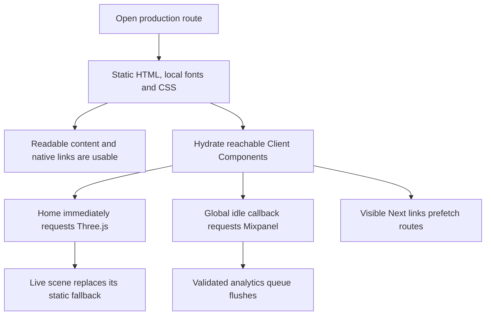

# FinTrace Critical-Load Performance Plan

> **Implemented status (verified 2026-08-31):** Implemented and ready to archive from documents/todo. Evidence: `src/app/globals.css`, `src/app/engine-network/Hero.tsx`, `src/instrumentation-client.ts`, `test/analytics.test.ts`, `test/agent/`, `DESIGN.md`, and the accepted after-state Lighthouse evidence at `/Users/sacino/Documents/codex/web-performance/fintrace-root/after-final.UuEW0r/`.

**Status:** Complete on 31 August 2026. The accepted after-state evidence is `/Users/sacino/Documents/codex/web-performance/fintrace-root/after-final.UuEW0r/`.

<critical_warning>
> **CRITICAL WARNING:** A higher Lighthouse score must not come from removing, simplifying or permanently suppressing any WebGL, evidence, reveal, hover or typography effect. Delayed JavaScript effects are permitted only when the current static result remains usable and every effect still activates automatically or on earlier user interaction.
</critical_warning>

<important_note>
> **IMPORTANT NOTE:** Only stages labelled **Implement now** are implementation-ready. A Conditional stage would have to pass its stated gate before production changes began; this portfolio has none. Deferred stages are recorded but not scheduled. Remove items must not be implemented from this plan.
</important_note>

## 1. Goal

Reduce controllable cold-load work between opening a FinTrace route and receiving its usable result, then verify the result with matching five-run mobile and desktop Lighthouse medians.

A usable result is:

- Home: readable static hero, header, primary actions and native link destinations, followed by the unchanged live scene and later evidence effects.
- About, Engagement and Privacy: readable static route content, shared navigation and controls, followed by unchanged reveal effects.
- Contact: readable static content plus a hydrated form that reaches success or a retryable error without analytics changing the result.
- Unknown route: branded static not-found content and a usable home action.
- Navigation and scroll: current pointer, touch and keyboard destinations, fragment landing, focus treatment and effect choreography.

The portfolio succeeds when all of the following are true:

1. The Three.js and Mixpanel vendor chunks do not enter the critical no-interaction visual window in the local production export.
2. Every JavaScript-capable user still receives the complete scene and analytics activation automatically; an earlier interaction can activate them sooner.
3. Production global CSS retains the existing reset and three global rules without shipping utilities generated only by unrouted design-lab source.
4. Every corresponding after-state Lighthouse performance median is at least its exact baseline median in `/Users/sacino/Documents/codex/web-performance/fintrace-root/baseline-final.p7HAK9/summary.json`, and at least one affected mobile route gains one whole performance point.
5. Accessibility and Best Practices remain 100 for all 12 route-mode groups. SEO remains 100 for the five canonical routes and retains the known exported-artefact limitation for `/404.html`.
6. `npm test`, `npm run lint`, `npm run build` and `npm run test:agent` finish with zero failures.
7. Headed real-GPU checks pass at every project-required viewport with no console error, page error, horizontal overflow, clipped control, hidden focus indicator or missing post-load effect.
8. A final portfolio review finds no unimplemented high-confidence, bounded-risk source change that can raise the controlled lab score without breaking an invariant. Deferred and Remove records do not qualify as unfinished work.

---

## 2. Before State Analysis

### 2.1 Before implementation overview

FinTrace is a Next.js static export deployed to GitHub Pages. Server Components render the route content and shared chrome. Small Client Components own the contact form, reveal triggers and visual evidence. Home also mounts an async Three.js scene. Global instrumentation queues anonymous analytics events and imports the core-only Mixpanel browser adapter.

The current source fingerprint for the accepted baseline is `0b92919c55a1b4cbc16241139f48a3c06803cc6c25ed8ce83c09943fa8d01147`, calculated over `src/`, `package.json` and `package-lock.json`. The build exports 13 static pages.

### 2.2 Current flow

### 2.3 Core problems

- `src/app/engine-network/Hero.tsx::Hero` renders its dynamic scene on the first client render. Code splitting keeps Three.js out of the initial route graph but still requests a 531,370 raw byte, 133,596 gzip byte chunk during cold loading.
- `src/instrumentation-client.ts::scheduleInitialisation` asks for an idle callback immediately after hydration. An idle callback can run before the critical visual window settles, importing a 128,132 raw byte, 35,430 gzip byte vendor chunk on every route.
- `src/app/globals.css` imports all of Tailwind. Production uses no utility token, but archived `_design-lab` class strings cause a 26,433 raw byte, 5,606 gzip byte global stylesheet containing theme variables, utilities and registered properties.
- Every production route imports the 50,417 raw byte Engine Network stylesheet. Splitting it is a real theoretical opportunity, but its shared 3,003-line cascade and responsive rules make it a separate high-risk refactor.

### 2.4 Accepted Lighthouse baseline

The accepted before-state is `/Users/sacino/Documents/codex/web-performance/fintrace-root/baseline-final.p7HAK9/`. It contains 60 raw reports, five per route and mode, with no runtime error or warning and a matching source fingerprint before and after collection.

| Route | Mobile performance | Desktop performance | Accessibility | Best Practices | SEO |
| --- | --- | --- | --- | --- | --- |
| `/` | 67 (53-70) | 92 (91-92) | 100 | 100 median | 100 |
| `/about/` | 81 (80-81) | 99 | 100 | 100 | 100 |
| `/engagement/` | 81 (80-82) | 99 (98-99) | 100 | 100 | 100 |
| `/contact/` | 81 (80-81) | 98 (98-99) | 100 | 100 | 100 |
| `/privacy/` | 81 | 99 | 100 | 100 | 100 |
| `/404.html` | 79 (69-80) | 99 (95-99) | 100 | 100 | 63 |

### 2.5 Affected scenarios

| Scenario | Current controllable work | Required result |
| --- | --- | --- |
| Open Home without interacting | Immediate Three.js and early Mixpanel imports compete with critical route work | Static hero is usable first; full scene and analytics still activate after the critical window |
| Open any sub-page without interacting | Early Mixpanel import and archived-design Tailwind output ship before any analytics value is needed | Static content and controls remain unchanged; analytics activates later |
| Interact before delayed activation | Queued analytics or a static hero could otherwise remain pending | Interaction starts the relevant deferred work once without delaying the interaction |
| Browse with JavaScript disabled or a vendor failure | Client effects or analytics cannot run | Static content, native links and not-found recovery remain usable |
| Scroll to an effect | Existing reveals and diagrams arm near visibility | Every current effect runs with the same geometry and timing after it becomes available |

### 2.6 Technical constraints

- Preserve `output: 'export'`, unoptimised images, trailing slashes and GitHub Pages deployment.
- Use British English and preserve all approved copy and service positioning.
- Do not add server actions, API routes, runtime image processing, network visual assets or runtime origins.
- Do not add `prefers-reduced-motion`, animation timing gates based on accessibility settings or `requestAnimationFrame` setup wrappers.
- Keep non-obvious animation, WebGL, resource and design-isolation logic commented.
- Use Client Components only for hooks and browser APIs.
- Do not edit generated `.next/` or `out/` files.
- Do not change a branch, rewrite history or include unrelated collaborator changes. Stage only task-owned files under the mixed-file majority rule.

### 2.7 Existing infrastructure to reuse

- `Hero` already has a complete static SVG fallback and a first-frame `onReady` cross-fade.
- `Scene` already pauses on hidden or off-screen state and disposes resources.
- `createAnalyticsCore` already validates, bounds and flushes a 50-event queue in order and fails open.
- `Reveal`, content visibility and native `href` fallbacks already protect usable static results.
- The Lighthouse skill runner provides matching sequential five-run mobile and desktop evidence.
- The agent-readiness Playwright suite covers static budgets, no-JavaScript content, CLS, overflow, metadata, accessibility and real 404 semantics.

### 2.8 Audit method and safety boundary

The audit traced every production route, form terminal, navigation mode and effect path. It read every reachable source file in full, swept repeated work, scaling work, unbounded input, cold-path transfer and broken terminals twice, then combined source facts with local static-build byte sizes and Lighthouse diagnostics.

No production or staging service, Mixpanel ingestion, Formspree submission, customer data, shared cache, shared queue or database was accessed. The isolated Chrome wrapper blocks `api-js.mixpanel.com`. Local server cache and compression warnings are excluded because application source cannot control GitHub Pages headers.

### 2.9 Evidence-backed findings

| ID | Source evidence | Derived conclusion | Path |
| --- | --- | --- | --- |
| E-1 | `Hero.tsx::Hero` unconditionally renders the dynamic scene | Three.js is split but not deferred past critical content | Home |
| E-2 | Scene chunk is 531,370 raw / 133,596 gzip bytes | Scene activation is the largest safe cold-load lever because the fallback is already usable | Home |
| E-3 | `instrumentation-client.ts::scheduleInitialisation` schedules idle work immediately; Mixpanel is 128,132 raw / 35,430 gzip bytes | The existing queue permits vendor activation after critical rendering | All routes |
| E-4 | Full Tailwind import compiles 26,433 raw / 5,606 gzip bytes; production uses no utility class | A preflight-only import removes unreachable archived-design output | All routes |
| E-5 | All routes import 50,417 raw / 9,644 gzip bytes of Engine Network CSS | Sub-pages receive unreachable homepage rules, but safe extraction needs cascade parity proof | Sub-pages |
| E-6 | Default Next links prefetch route payloads and the contact client chunk | Prefetch is a deliberate activation-latency trade and cannot simply be removed | Navigation |
| E-7 | Initial referenced JS is 636,613 to 656,493 raw bytes before async vendors | Remaining client boundaries are already localised; further work needs named chunk evidence | All routes |
| E-8 | Reveal observers are fixed-count and disconnect after one class change | A shared registry fails the absolute-savings test | Scroll |
| E-9 | First-viewport fonts total 57,128 bytes and use `display: swap` | Removal or optional loading risks visible font and layout drift | All routes |
| E-10 | Testimonial PNG is 28,959 bytes, dimensioned and lazy | No image-delivery change is justified | Home and About |
| E-11 | Scene and canvas lifecycle guards plus content visibility already prevent hidden work | Removing guards or reducing fidelity would add work or change the result | Home and scroll |
| E-12 | Static GitHub Pages deployment owns response headers | Cache or host changes are an architecture migration, not an application fix | All routes |
| E-13 | Analytics queue is bounded, ordered and fail-open | Delayed activation is safe only with guaranteed fallback and interaction wake-up | All routes |

### 2.10 Ranked portfolio

Scores are ordinal from 1 to 5. Rank is value order, not execution order.

| Rank | Opportunity | Benefit / Reach / Scale / Confidence | Effort / Risk | Decision | Reason |
| --- | --- | --- | --- | --- | --- |
| 1 | Activate WebGL after the critical visual window | 5 / 3 / 4 / 5 | 2 / 2 | Implement now | E-1, E-2, E-11; full scene remains guaranteed |
| 2 | Compile only Tailwind preflight | 4 / 5 / 4 / 5 | 1 / 1 | Implement now | E-4; production uses no utility token |
| 3 | Activate Mixpanel after settling or interaction | 4 / 5 / 4 / 5 | 2 / 2 | Implement now | E-3, E-13; queue already preserves caller results |
| 4 | Split shared and homepage-only Engine Network CSS | 3 / 5 / 4 / 5 | 5 / 4 | Deferred | Requires selector ownership and computed-style parity fixtures |
| 5 | Defer below-fold client boundaries | 2 / 3 / 3 / 4 | 4 / 3 | Deferred | Requires a named remaining chunk and pre-viewport activation proof |
| 6 | Use intent-only route prefetch | 2 / 5 / 3 / 4 | 3 / 4 | Deferred | Requires current framework evidence and pointer, touch and keyboard parity |
| 7 | Subset local fonts | 2 / 5 / 4 / 4 | 4 / 4 | Deferred | Requires repeatable glyph coverage, licence and screenshot parity |
| 8 | Inline route-specific critical CSS | 2 / 5 / 3 / 3 | 5 / 4 | Deferred | Requires stylesheet ownership split first |
| 9 | Share one reveal observer | 1 / 4 / 2 / 5 | 2 / 2 | Remove | Fixed, short-lived observers have no material absolute saving |
| 10 | Remove or reduce visual effects | 5 / 3 / 4 / 5 | 1 / 5 | Remove | Violates the required frontend result |
| 11 | Replace Next links with plain anchors | 2 / 5 / 3 / 5 | 1 / 5 | Remove | Violates client-navigation and prefetch behaviour |
| 12 | Change cache headers or hosting | 5 / 5 / 5 / 5 | 5 / 5 | Remove | Outside application control and authorised architecture |
| 13 | Add selective Three.js imports | 1 / 3 / 3 / 5 | 3 / 4 | Remove | Current named imports are already tree-shaken; renderer core dominates |
| 14 | Remove font preloads or use optional fonts | 2 / 5 / 4 / 4 | 1 / 5 | Remove | Risks replacement-font and layout drift |

---

## 3. Desired State

### 3.1 Requirements

- **REQ-1 (MUST):** Replace the full Tailwind global import with its preflight-only entry while retaining the exact global reset behaviours used by production.
- **REQ-2 (MUST):** Do not render the dynamic homepage scene until three seconds after `window.load`, unless an earlier pointer, touch or keyboard interaction activates it once.
- **REQ-3 (MUST):** Keep the static fallback visible and usable until `Scene` reports its first frame; keep every current scene resource, animation, lifecycle guard and cleanup.
- **REQ-4 (MUST):** Do not initialise the Mixpanel adapter until three seconds after `window.load`, unless an earlier pointer, touch or keyboard interaction activates it once.
- **REQ-5 (MUST):** Keep analytics page views and interaction events queued, validated, bounded and flushed in their existing order.
- **REQ-6 (MUST):** Cancel deferred timers and one-shot listeners when their owning React component unmounts. Global analytics activation may persist for the document lifetime.
- **REQ-7 (MUST):** Keep scene and analytics activation independent so a vendor failure cannot suppress the scene and a WebGL failure cannot suppress analytics.
- **REQ-8 (MUST):** Preserve all routes, copy, layout, focus, native link fallback, Formspree states, static-export settings and permitted runtime origins.
- **REQ-9 (MUST NOT):** Implement any Deferred or Remove candidate without the prerequisite evidence recorded in this plan.
- **REQ-10 (MUST NOT):** Use reduced-motion checks, visibility-based permanent suppression or user-agent gating to avoid loading an effect.
- **REQ-11 (SHOULD):** Keep scheduling logic small, commented and local to the browser boundary that owns it.

### 3.2 Defaults and fallbacks

- **Scene default:** static SVG and DOM hero render first; interaction activation has priority; otherwise a one-shot three-second post-load timer mounts the scene; the fallback cross-fades only after `onReady`.
- **Analytics default:** events queue immediately; interaction activation has priority; otherwise a one-shot three-second post-load timer imports the adapter; load or delivery failure remains fail-open.
- **Timer fallback:** if the component hydrates after `load`, start the delay from the observed `document.readyState === 'complete'`; otherwise register one `load` listener.
- **Compatibility:** use `setTimeout` and standard event listeners. Do not depend on `requestIdleCallback`, `scheduler.postTask` or a browser-specific API.

### 3.3 Verification checklist

**Functional:**

- [ ] Static content and links work before scene and analytics activation.
- [ ] Scene activates once automatically and once at most under early interaction.
- [ ] Analytics adapter activates once automatically and queued events flush once in order.
- [ ] Every existing effect remains present after activation.

**Fallbacks:**

- [ ] Hydration before and after `window.load` both schedule automatic activation.
- [ ] Scene import or WebGL failure leaves the fallback and links usable.
- [ ] Analytics load, initialisation or delivery failure never blocks navigation or form feedback.

**Compatibility:**

- [ ] Desktop, phone and required hero aspect-ratio viewports retain layout and effect behaviour.
- [ ] Keyboard, pointer and touch activation paths remain usable.

**Operations and documentation:**

- [ ] `DESIGN.md` records the scene's deferred activation without describing it as conditional or removable.
- [ ] `documents/guides/mixpanel_analytics.md` records the delayed and interaction-triggered adapter lifecycle.
- [ ] Audit and plan record exact accepted before and after Lighthouse evidence paths and the final decision boundary.

---

## 4. Additional Context

### 4.1 User-provided constraint

The user requires iteration until the Lighthouse speed score cannot be raised further without degrading frontend use. Delaying JavaScript effects on load is acceptable. Removing effects after the page loads is not acceptable.

This means a score plateau is complete only when the remaining ideas are Deferred because they lack parity evidence, or Removed because they violate the current result, have the wrong premise or require an architecture migration.

### 4.2 Decisions

- Preserve default Next link prefetch. Removing it could make conversion navigation slower even if cold-page transfer falls.
- Preserve both local fonts and their preload. Typography is part of the accepted first viewport.
- Preserve the complete Three.js scene and evidence animations. Delay their competing load work instead of reducing fidelity.
- Do not split the monolithic stylesheet in this workstream. The opportunity is real, but exact cascade ownership and computed-style fixtures do not yet exist.
- Ignore local cache-lifetime and compression warnings as source tasks. The audit server is intentionally uncompressed and GitHub Pages headers are outside application control.
- Audit the exported not-found design through `/404.html`; Lighthouse rejects an intentional 404 response. Use `npm run test:agent` for real unknown-route status and recovery.

---

## 5. Implementation Plan

Execution order differs from portfolio rank. Start with the lowest-blast-radius CSS removal, then change the homepage-only visual boundary, then change global analytics. Complete focused validation and owning documentation after each stage before starting the next.

### Stage 1 - Implement now: Remove unreachable Tailwind output

**Objective:** Keep the production reset and global rules while excluding theme, utility and registered-property output generated from unrouted design-lab classes.

#### Approach

- Change `src/app/globals.css` from the full Tailwind entry to `tailwindcss/preflight.css`.
- Do not change the three FinTrace global rule groups.
- Build and inspect the emitted global CSS before any other production change.

#### Success criteria

- `src/app/globals.css` imports `tailwindcss/preflight.css` and contains the unchanged smooth-scroll, font-smoothing, text-rendering and horizontal-overflow declarations.
- `npm run build` exits zero and all 13 static pages remain in the route output.
- The emitted global CSS retains reset rules for `box-sizing`, heading inheritance, media block display, form-control font inheritance and hidden elements.
- The emitted global CSS contains no `.flex`, `.grid`, `.bg-white`, responsive utility selector or Tailwind `@property --tw-` registration.
- The emitted global stylesheet is below 12,000 raw bytes, verified by a read-only byte count in `out/_next/static/chunks/`.
- A 1440x900 and 390x900 headed check of every production route reports zero horizontal overflow, console error and page error before Stage 2 begins.

### Stage 2 - Implement now: Defer the homepage scene

**Objective:** Keep Three.js outside the no-interaction critical visual window while preserving automatic and interaction-triggered activation of the complete scene.

#### Approach

- Update `src/app/engine-network/Hero.tsx` with a browser-only one-shot activation state and cleanup.
- Mount `EvidenceScene` after an early pointer, touch or keyboard interaction, or after a three-second timer that begins at `window.load`.
- Leave `Scene.tsx`, SVG fallback markup, scene-ready cross-fade and animation CSS unchanged.
- Update `DESIGN.md` with the activation sequence and verification contract.

#### Success criteria

- The initial React render contains the existing static fallback, copy and links but no `EvidenceScene` element.
- Before interaction, a local production browser has no Three.js chunk resource entry during the first two seconds after `load`.
- Without interaction, the same browser requests the Three.js chunk after the three-second post-load activation and renders exactly one `.eng-scene-mount canvas`.
- An interaction dispatched before the timer requests the chunk once and still renders exactly one canvas; later timer expiry does not create a second request or canvas.
- The seven hero viewports verify one canvas after activation, intact forced fallback, same-canvas live resize, lifecycle pause and resume, zero console/page errors and zero horizontal overflow.
- `npm run lint` and `npm run build` exit zero before Stage 3 begins.

### Stage 3 - Implement now: Defer the Mixpanel adapter

**Objective:** Keep the anonymous analytics vendor outside the no-interaction critical visual window while preserving ordered eventual delivery and fail-open caller behaviour.

#### Approach

- Replace `requestIdleCallback` scheduling in `src/instrumentation-client.ts` with one-shot activation after early pointer, touch or keyboard interaction, or a three-second timer beginning at `window.load`.
- Keep initial page-view queueing before scheduling and keep the capture-phase marked-CTA listener.
- Keep `src/lib/analytics/core.ts` and the core-only Mixpanel loader contract unless a focused test exposes a real scheduling defect.
- Update `documents/guides/mixpanel_analytics.md` with the exact lifecycle and validation evidence.

#### Success criteria

- Initial page-view tracking still executes before adapter activation and the adapter initialises at most once.
- A local production browser has no 128,132-byte Mixpanel vendor chunk resource entry during the first two seconds after `load` without interaction.
- Without interaction, the browser requests the vendor chunk after the three-second post-load activation.
- Early pointer, touch and keyboard checks each activate initialisation once; subsequent timer expiry does not trigger a second adapter load.
- `npm test` proves queued events flush once in order, the 50-event bound remains, development never loads the adapter and all loader, initialisation and delivery failures remain fail-open.
- The analytics guide names the three-second post-load fallback, the interaction triggers, the queue ordering and the production-only boundary.
- `npm test`, `npm run lint` and `npm run build` exit zero before Stage 4 begins.

### Stage 4 - Implement now: Verify and exhaust safe score gains

**Objective:** Prove the complete observable result and stop only at the portfolio's invariant boundary.

#### Approach

- Run all project validations and headed browser matrices against a stable source fingerprint.
- Run a fresh 60-report Lighthouse batch with the same Chrome, Lighthouse version, categories, modes, routes, run count, blocked Mixpanel host and static server used for the accepted baseline.
- Compare every individual value, median, spread, runtime error, warning and discovered request against the baseline summary.
- If an Implement now activation still enters the critical Lighthouse window, adjust only its bounded activation delay, rerun its focused browser checks, then repeat the full Lighthouse batch.
- Do not implement a Deferred or Remove candidate to chase another point.
- Record final evidence and final solution notes in this plan and the audit.

#### Success criteria

- `npm test`, `npm run lint`, `npm run build` and `npm run test:agent` each exit zero.
- Headed checks pass every route at 1440x900 and 390x900 and the homepage at all seven hero viewports, with the complete post-load effects visible.
- The after batch contains exactly 60 valid JSON reports, no `runtimeError`, numeric scores for all requested categories and five runs in each route-mode group.
- No after-state performance median is lower than its exact corresponding baseline median in `baseline-final.p7HAK9/summary.json`.
- Accessibility and Best Practices medians remain 100 in all 12 groups; canonical-route SEO medians remain 100.
- The after homepage requests Three.js only after deferred activation, and every route requests Mixpanel only after deferred activation or interaction.
- The final source fingerprint is stable before and after the accepted after batch.
- The final review records each remaining idea as Deferred or Remove with its prerequisite or invariant reason; no safe Implement now item remains.

---

## 6. Testing Plan

### 6.1 Source-of-truth artefacts

- `/Users/sacino/Documents/codex/web-performance/fintrace-root/baseline-final.p7HAK9/summary.json` and its 60 `*.lhr.json` reports are the exact accepted before-state performance evidence. They must be compared directly, not replaced by one clean synthetic run.
- `/Users/sacino/fintrace-root/out/_next/static/chunks/3ol9lguf65sdr.js` identifies the accepted 531,370-byte Three.js build artefact. Chunk names may change after build, so the after artefact must be rediscovered by content rather than assumed by filename.
- `/Users/sacino/fintrace-root/out/_next/static/chunks/3bt5zoj87-j_a.js` identifies the accepted 128,132-byte Mixpanel vendor artefact. Rediscover it by content after build.
- `/Users/sacino/fintrace-root/out/_next/static/chunks/3xell99os4dk1.css` identifies the accepted 26,433-byte full Tailwind output. Rediscover the global stylesheet by its FinTrace global rules after build.
- `/Users/sacino/fintrace-root/documents/todo/performance_opportunities_audit.md` is the decision record for Implement now, Deferred and Remove boundaries.

<critical_warning>
> **CRITICAL WARNING:** The full 60-report baseline and every individual value are the regression source of truth. A single high after-run score cannot replace the medians or hide a route-mode regression.
</critical_warning>

### 6.2 Focused automated checks

| Test | Location and framework | Expected result | Command |
| --- | --- | --- | --- |
| Analytics queue and failure lifecycle | `test/analytics.test.ts`, Node test runner | One ordered flush, 50-event bound, no development load, fail-open failures | `npm test` |
| Static export and types | Next.js production builder | 13 pages, no TypeScript or export error | `npm run build` |
| Static route, accessibility and budget contracts | `test/agent/`, Playwright and axe-core | Desktop/mobile suite passes real 404, no-JS, CLS, overflow and byte budgets | `npm run test:agent` |
| Source and style rules | ESLint | Zero errors | `npm run lint` |

### 6.3 Browser integration checks

1. Scene scheduling on the local production export
   - Open Home without interaction.
   - Verify fallback, headline and both actions are usable before a scene request.
   - Verify one canvas appears after automatic activation.
   - Reload and dispatch each interaction class before the timer; verify one request and one canvas.

2. Scene visual matrix with headed real-GPU Chromium
   - Verify 3425x1245, 2560x1080, 1998x750, 1440x900, 1024x768, 900x1080 and 390x900.
   - Scroll away and back, resize live and force the existing fallback state.
   - Expect the current composition, one-canvas identity, pause/resume and zero overflow or browser errors.

3. Production routes at 1440x900 and 390x900
   - Verify Home, About, Engagement, Contact, Privacy and not-found content.
   - Scroll lazy, reveal, sticky and fixed targets into view and settle layout.
   - Check focus, forms, fragments, navigation, effects, overflow, console and page errors.

4. Matching Lighthouse comparison
   - Use Lighthouse 13.4.1, Chrome 151.0.7922.174, Node.js 22.23.1, default throttling, fresh isolated profiles, five sequential mobile and five sequential desktop runs per route.
   - Audit `performance`, `accessibility`, `best-practices` and `seo` for `/`, `/about/`, `/engagement/`, `/contact/`, `/privacy/` and `/404.html`.
   - Expect 60 valid reports and compare all medians and spreads to the source-of-truth summary.

## Deferred candidates

| Candidate | Revival prerequisite |
| --- | --- |
| Split Engine Network CSS | Complete selector ownership plus computed-style and screenshot parity fixtures at required viewports |
| Defer below-fold client boundaries | Named remaining chunk with material absolute weight plus pre-viewport activation proof |
| Intent-only route prefetch | Current Next.js contract evidence plus pointer, touch and keyboard activation parity |
| Subset fonts | Repeatable glyph source, licence confirmation, full production-copy coverage and screenshots |
| Inline critical CSS | Completed stylesheet ownership split with bounded critical rules |

## Removed candidates

| Candidate | Removal reason |
| --- | --- |
| Shared reveal observer | Fixed short-lived work fails the absolute-savings test |
| Remove or reduce effects | Violates the accepted frontend result |
| Replace Next links | Violates navigation behaviour |
| Change cache headers or host | Unauthorised architecture migration outside source control |
| Selective Three.js imports | Wrong premise because current named imports are tree-shaken |
| Remove font preloads or use optional fonts | Risks typography and layout drift |

## Evidence limits

- Lighthouse measures a controlled Chromium lab, not production user latency.
- The local server does not model GitHub Pages compression, cache headers or edge behaviour.
- Mixpanel ingestion is deliberately blocked and Formspree is not submitted.
- `/404.html` covers exported visual payload only; real HTTP 404 semantics remain in the agent suite.
- Safari and Firefox performance are not measured. Functional compatibility relies on standards-based scheduling plus existing static and browser checks.

---

## 7. Final solution and evidence

### 7.1 Implemented solution

- `src/app/globals.css` now imports only Tailwind preflight. The emitted global stylesheet fell from 26,433 to 3,506 raw bytes and from 5,606 to 1,263 gzip bytes, while the required reset and global FinTrace rules remain present.
- `src/app/engine-network/Hero.tsx::Hero` leaves the complete static fallback usable, then activates the unchanged Three.js scene on pointer, touch or keyboard intent, or automatically three seconds after `window.load`. The hero entrance effect remains complete, with its stagger compressed so the LCP headline starts at 80 ms instead of 220 ms.
- `src/instrumentation-client.ts::scheduleInitialisation` continues to queue the initial page view and CTA events, but imports the recorder-free Mixpanel adapter only after the same interaction classes or the bounded post-load delay.
- The final source fingerprint over `src/`, `package.json` and `package-lock.json` is `2e9d0276a74383c02ab70183627477bc4f3e6d6bcc13b08be293cbb3a289df20`. It matched before and after the accepted after-state Lighthouse batch.

### 7.2 Matched Lighthouse result

The accepted after-state contains 60 raw reports: five sequential mobile and desktop runs for all six exported routes, using Lighthouse 13.4.1, Chrome 151.0.7922.174 and Node.js 22.23.1. No run has a runtime error or warning.

| Route | Mobile performance | Desktop performance | Accessibility | Best Practices | SEO |
| --- | --- | --- | --- | --- | --- |
| `/` | 67 → 76 (75-79 after) | 92 → 98 (97-98 after) | 100 | 100 | 100 |
| `/about/` | 81 → 81 (74-81 after) | 99 → 99 | 100 | 100 | 100 |
| `/engagement/` | 81 → 82 (76-82 after) | 99 → 99 | 100 | 100 | 100 |
| `/contact/` | 81 → 81 (78-81 after) | 98 → 99 | 100 | 100 | 100 |
| `/privacy/` | 81 → 81 (81-82 after) | 99 → 99 | 100 | 100 | 100 |
| `/404.html` | 79 → 79 (69-79 after) | 99 → 99 (97-99 after) | 100 | 100 | 63 |

Home mobile LCP fell from 9,936.2 ms to 6,063.1 ms and TBT fell from 292 ms to 87 ms. Home desktop LCP fell from 1,874.4 ms to 1,181 ms. Every route-mode performance median held or improved, and the known `/404.html` SEO limitation is unchanged.

### 7.3 Verification result

- `npm test`: 11 tests passed.
- `npm run lint`: zero errors.
- `npm run build`: 13 static pages exported.
- `npm run test:agent`: 124 desktop and mobile checks passed.
- Headed production-route checks passed at 1440x900 and 390x900 with visible focus, zero overflow and zero console/page errors.
- The seven-viewport hero matrix passed at 3425x1245, 2560x1080, 1998x750, 1440x900, 1024x768, 900x1080 and 390x900. It retained the approved wide/compact compositions and one live canvas.
- Automatic, pointer, touch and keyboard activation each produced one Three.js request, one analytics-vendor request and one hero canvas. Neither chunk entered the first two seconds of a no-interaction load.
- Forced WebGL failure retained the full static fallback and usable controls. Live resizing retained the same canvas; the render loop recorded zero offscreen draw calls and resumed after scrolling back.

### 7.4 Stop boundary

No unimplemented high-confidence source change remains that can raise the matched score without crossing a documented invariant or starting a separate high-risk refactor. The remaining Lighthouse findings are the required Next.js navigation/hydration runtime, the production visual stylesheet, and document compression that the GitHub Pages application source does not control. The stylesheet split, below-fold client boundaries, route-prefetch redesign, font subsetting and critical-CSS work remain Deferred behind their recorded parity prerequisites; effects, Next links, fonts and hosting changes remain Remove.
