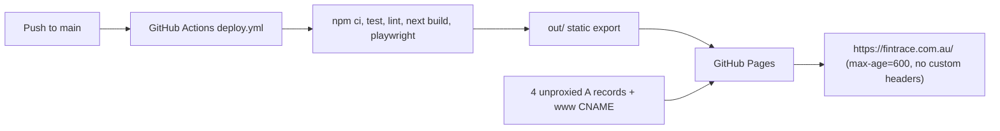

# Astro on Cloudflare Workers Migration Plan 🔄 **IN PROGRESS**

<critical_warning>
> **CRITICAL WARNING:** Production cutover changes DNS and one zone setting for `fintrace.com.au` only. Immediately before that write, record the complete live state of every record in zone `9f79f842598f32ede2fb86d93325260c`, every Workers custom domain, every zone ruleset, the `always_use_https` setting, and the GitHub Pages site state in `documents/guides/cloudflare_workers_hosting.md`, then commit it. Only the four apex `A` records, the one `www` `CNAME` record, and the `always_use_https` setting may change. The Microsoft 365 `MX`, `SPF`, `MS=`, `autodiscover`, `enterpriseenrollment`, and `enterpriseregistration` records, the Google Search Console `TXT`, and the `_github-pages-challenge-culpable` `TXT` must remain byte-identical. GitHub Pages stays live and undisabled until the Worker passes every production check so the recorded records can restore the previous host within minutes.
</critical_warning>

<important_note>
> **IMPORTANT NOTE:** Every Cloudflare and GitHub action in this plan is agent-run through the macOS Keychain credential, the Cloudflare API, Wrangler, and `gh`. One precondition is user-owned and must be true before Step 7: the Cloudflare Workers and Pages GitHub App must have access to `Culpable/fintrace-root` (the user committed to granting it at `https://github.com/settings/installations` before execution; see D-4). Exactly one action needs the user during execution: the explicit approval to cut over after reviewing `https://staging.fintrace.com.au/`. The sibling migration `/Users/sacino/bulma-root/documents/todo/astro_workers_migration_plan.md` and its evidence file `/Users/sacino/bulma-root/documents/guides/_hosting.md` are the proven procedure for every Cloudflare control-plane call in Steps 7 to 10; copy request shapes from there rather than from memory.
</important_note>

<autonomy>
> **AUTONOMY (Steps 1-8):** Execute Steps 1 through 8 end to end without asking for permission (D-9). This is standing authorisation for every action those steps describe, including: creating, editing, moving, and deleting files under `site/` and `documents/`; installing dependencies with pnpm; writing `documents/guides/cloudflare_workers_hosting.md`; creating the Cloudflare API token and storing it in Keychain; deploying `fintrace-root` and `fintrace-root-preview` with Wrangler; uploading preview versions; attaching the `staging.fintrace.com.au` custom domain; running Playwright, axe, and Lighthouse; and committing **and pushing** the `site/` work to `main` under `<git_rules>`. Do not pause for confirmation, do not present intermediate options, and do not stop to report progress at step boundaries.
>
> Stop and ask the user in exactly three cases:
> 1. **Step 7 GitHub App access** - only if the Builds repository-connection call fails because the Cloudflare GitHub App cannot see `Culpable/fintrace-root`. Ask the user with the native question tool to add the repository under the Cloudflare Workers and Pages app at `https://github.com/settings/installations`, wait, retry, then continue autonomously.
> 2. **Step 8 cutover approval** - the mandatory gate. Present both URLs, the parity numbers, the Lighthouse medians, the header result, and the rollback packet, then stop. Never begin Step 9 without a recorded explicit approval.
> 3. **A documented fallback chain is exhausted** - the font, prefetch, Worker-name, or custom-domain fallbacks in Section 3.2 all fail. Report the exact failure and the residual risk; do not improvise a substitute architecture.
>
> Nothing in Steps 1-8 changes production. `fintrace.com.au` stays on GitHub Pages, `.github/workflows/deploy.yml` keeps building only the root Next.js app, and the only DNS write before Step 9 is the record Cloudflare creates for `staging`.
</autonomy>

## 1. Goal

Rebuild the FinTrace public site as a static-first, agent-ready Astro site per the `build-astro-websites` skill with no client framework, host it on Cloudflare Workers Static Assets in account `213ab3604485056376263d22fa242742`, prove it on `https://staging.fintrace.com.au/` with full visual and functional parity against the live Next.js site, and only then move `fintrace.com.au` and `www.fintrace.com.au` to the Worker and decommission GitHub Pages and the Next.js app.

Why: GitHub Pages fixes `Cache-Control: max-age=600`, cannot set response headers, cannot negotiate `Accept: text/markdown`, cannot mark previews `noindex`, and the Next.js runtime ships about 197 KiB gzip of JavaScript on the homepage (about 110 KiB of it framework) for a site whose only browser behaviour is six small scripts. Astro removes the framework entirely, keeps every page prerendered, and Cloudflare Workers Static Assets supplies immutable asset caching, a Content Security Policy, custom headers, and the negotiated Markdown selector that the sibling `bulma-root` and `taxgenie-root` sites already run in this account.

The migration is complete when:

- `site/` contains an Astro `7.x` static site (pnpm, strict TypeScript, `output: 'static'`, `trailingSlash: 'always'`, `site: 'https://fintrace.com.au'`) that renders the five public routes, the 404 page, `robots.txt`, `sitemap.xml`, and `llms.txt` with zero client framework code (D-2).
- Every visible surface, animation, interaction, colour, font, copy string, link target, and structured-data node matches the current production site at `https://fintrace.com.au/` within the parity gates in Section 6, at `1440x900` and `390x900`, except the deliberate changes recorded in D-8, D-12, and D-13.
- The Worker serves prerendered HTML, negotiated Markdown at the same URL (D-6), the skill's security-header baseline with a hash-free CSP, immutable `/_astro/*` caching, and a real `404.html`.
- Cloudflare Workers Builds deploys `fintrace-root` from `main` and uploads non-promoted versions of every other branch to `fintrace-root-preview` (D-3).
- The user reviewed `https://staging.fintrace.com.au/` with the parity and Lighthouse report and explicitly approved cutover.
- `https://fintrace.com.au/` is served by the Worker, `http://fintrace.com.au/<path>` returns `301` to HTTPS (D-10), `https://www.fintrace.com.au/<path>?<query>` returns one `308` to the matching apex URL, and every discovery file still names only `https://fintrace.com.au`.
- GitHub Pages is disabled, the root Next.js app (including `src/app/_design-lab/`, D-7), the Pages workflow, and the root npm toolchain are removed, and `AGENTS.md`, `DESIGN.md`, and the guides under `documents/guides/` describe the Astro site as the only runnable app.

---

## 2. Current State Analysis

### 2.1 Current Implementation Overview

- Repository `Culpable/fintrace-root` (repository ID `1302542539`, owner ID `31677655`), default branch `main`, clean working tree at planning time. Commits go directly to `main`.
- Runnable app: the repository root. Next.js `^16.1.5`, React `^19.2.4`, Tailwind CSS `^4.1.18` through `@tailwindcss/postcss` (only `tailwindcss/preflight.css` is imported; no utilities are generated), `three` resolved to `0.182.0`, `mixpanel-browser` resolved to `2.81.0`, `clsx` `2.1.1`, npm lockfile v3, Node `22.23.1` pinned in `.nvmrc` and `package.json` (`engines.node` exact), enforced by `scripts/check-node-version.mjs` before `dev`, `test`, and `build`.
- Build: `next build` with `output: 'export'`, `trailingSlash: true`, unoptimised images; emits `out/` (about 2.6 MiB). Homepage JavaScript referenced by `out/index.html` totals about 197 KiB gzip; the largest chunks are the React/Next runtime (71.5 KiB gzip) and two route chunks of about 40 KiB gzip each. The Three.js chunk (531 KiB raw) is a separate async chunk.
- Routes: `/`, `/about/`, `/engagement/`, `/contact/`, `/privacy/`, plus `not-found.tsx` rendered to `out/404.html`.
- Shell: `src/app/layout.tsx` sets `<html lang="en-AU">`, `<link rel="describedby" href="/llms.txt" type="text/plain">`, and site-level `Metadata` (title template `%s | FinTrace`, Open Graph and Twitter defaults). Fonts are loaded per route tree, not in the layout: `src/app/engine-network/fonts.ts` loads Bricolage Grotesque (variable, latin, `display: swap`, CSS variable `--font-eng-display`), Fragment Mono 400 (latin, swap, `--font-eng-mono`), and a self-hosted 716-byte single-glyph subset `src/assets/fonts/fragment-mono-approx.woff2` for U+2248 (`--font-eng-mono-approx`, `adjustFontFallback: false`). Next preloads all three font files on every route.
- Production shell components: `src/app/engine-network/SiteChrome.tsx` (`SiteHeader` with skip link, wordmark, three nav links, and the `Request assessment` CTA that is a hash anchor `#enquire` on the contact page; `SiteFooter` with five links, the footer CTA, and the copyright line). Every page wraps content in `
` and `<main id="main-content" tabindex="-1">`.
- Homepage `src/app/page.tsx` renders `StructuredData` then `EngineNetworkPage` (`src/app/engine-network/EngineNetworkPage.tsx`, 379 lines): hero, process stages, ledger set-piece, trace set-piece, currency match, specifications, outcome plate with one animated `Stat`, framed client voice, audiences, CTA plate. Static content arrays `STAGES`, `SPECS`, `AUDIENCES` live in that file.
- Sub-pages: `src/app/about/page.tsx`, `engagement/page.tsx`, `contact/page.tsx`, `privacy/page.tsx`, `not-found.tsx`, each with a colocated CSS file and the shared `engine-network.css` (3,003 lines, all tokens and rules scoped under `.dsn-engine-network`) plus `site-pages.css` (75 lines, sub-page primitives). `globals.css` (26 lines) holds preflight, smooth scroll, font smoothing, and `overflow-x: clip`.
- Client components in production (`'use client'`): `Hero.tsx` (intent-or-3-second-post-load activation of the Three.js scene through `next/dynamic` with `ssr: false`; `is-ready` cross-fade), `Scene.tsx` (1,054 lines; all Three.js code inside one `useEffect` with IntersectionObserver and `visibilitychange` pause, `ResizeObserver`, DPR cap, full disposal on cleanup, `onReady` callback), `Reveal.tsx` (polymorphic wrapper adding `is-visible` once at `threshold: 0.18, rootMargin: '0px 0px -8% 0px'`), `Stat.tsx` (count from `from` to `to` over `duration` with ease-out quartic at `threshold: 0.6`), `LedgerPlate.tsx` (adds `is-run` once at `threshold: 0.3`), `TraceDiagram.tsx` (512 lines; canvas draw loop inside `useEffect` with `ResizeObserver`, IntersectionObserver `threshold: 0`, `visibilitychange`; a `hops` React state toggles `is-hot`, `is-flagged`, and `is-on` classes on absolutely positioned label and note spans), and `contact/ContactForm.tsx` (four-state submit machine posting `FormData` to `https://formspree.io/f/xwvgoenw` with `Accept: application/json`; hidden `_subject`, `form_source=contact_page`, honeypot `_gotcha`; fields `name`, `email`, `organisation`, `message`; WebMCP attributes `toolname="sendFinTraceEnquiry"`, `tooldescription`, and `toolparamdescription` on the honeypot; `role="alert"` error panel that preserves typed values; `role="status"` sending and success panels; `aria-busy` on the form; analytics events `Enquiry Started`, `Enquiry Submitted`, `Enquiry Submission Failed`). `CurrencyMatch.tsx`, `ClientVoice.tsx`, and `FramedClientVoice.tsx` are server components (pure markup, SVG, and CSS animation).
- Metadata: `src/lib/metadata.ts` (`siteMetadata`, `pageMetadata` with `llmsLabel` and `llmsDescription`, `indexablePageKeys` order home, about, engagement, contact, privacy, `absoluteUrl`, `documentTitle`, `createPageMetadata`). Production head per route: `<title>`, description, `robots index, follow`, self-referencing canonical, `og:title`, `og:description`, `og:url`, `og:site_name FinTrace`, `og:locale en-AU`, absolute `og:image` `/images/og/fintrace-og.png` `1200x630` with alt, `og:type website`, `twitter:card summary_large_image`, `twitter:title`, `twitter:description`, `twitter:image`, `twitter:image:alt`, `viewport width=device-width, initial-scale=1`, three font preloads, `rel="describedby"` llms link, and icon links `/favicon.ico` (`sizes="48x48" type="image/x-icon"`), `/icon.svg` (`sizes="any" type="image/svg+xml"`), `/apple-icon.png` (`rel="apple-touch-icon" sizes="180x180" type="image/png"`), each with a Next cache-busting query string.
- Structured data: `src/app/StructuredData.tsx` emits one `application/ld+json` graph per route with `Organization` (`#organisation`, name, URL, description only), `WebSite` (`#website`, `inLanguage en-AU`), `WebPage` (`<url>#webpage`), and on the homepage `Service` (`#service`, `areaServed` Australia, `audience` Legal teams); serialised with `<`, U+2028, U+2029 escaping.
- Discovery: `src/app/robots.ts` (allow all, sitemap URL), `src/app/sitemap.ts` (five canonical URLs in `indexablePageKeys` order, no `lastmod`), `src/app/llms.txt/route.ts` rendering `src/lib/llms.ts::renderLlmsTxt` (agent-operating block with subject, promotional-term, minimum-length, service-name, action-URL, and route-coverage guards, then three curated sections).
- Analytics: `src/lib/analytics/core.ts` (closed five-event taxonomy, page normalisation, common properties `site: fintrace-root`, `environment: production`, `schema_version: 1`, in-memory queue of 50, `Page Viewed` dedupe by page, fail-open), `src/lib/analytics/client.ts` (public token `eb76617a49248a0cd7e6958ec234d01b`, US host `https://api-js.mixpanel.com`, `mixpanel-browser/src/loaders/loader-module-core`, every autocapture, marketing, recorder, IP, and referrer option disabled, full property blacklist, `localStorage` persistence), `src/instrumentation-client.ts` (tracks `Page Viewed` at boot, installs a capture-phase click listener for `[data-analytics-cta]`, initialises the vendor on `pointerdown`, `touchstart`, or `keydown` intent or 3 seconds after `window` `load`, and exports `onRouterTransitionStart` for client-side route changes).
- Contact form: see the client-component inventory above. Formspree form ID `xwvgoenw`.
- Assets: `public/images/og/fintrace-og.png` (238,433 bytes), `public/images/testimonial/nick-brookes.png` (28,959 bytes, 252x252), `src/app/favicon.ico` (2,043 bytes), `src/app/icon.svg` (1,932 bytes), `src/app/apple-icon.png` (4,940 bytes), `src/assets/fonts/fragment-mono-approx.woff2` (716 bytes), `src/assets/browser-identity/*` (previous icon set kept for rollback).
- Retired design lab: `src/app/_design-lab/` holds 11 unrouted Next.js candidates (74 files) with their own `next/font` instances and CSS systems. `AGENTS.md` and `DESIGN.md` call them archived Lab systems that never ship.
- Tests: `test/analytics.test.ts` and `test/node-runtime-contract.test.mjs` under `node --test`; Playwright agent suite under `test/agent/` (`agent-accessibility.spec.ts` with the 33 Lighthouse agent rules from `agent-accessibility.rules.ts`, `agent-readiness.spec.ts`, `discovery-and-trust.spec.ts`, `interface.spec.ts`, `performance.spec.ts`, `webmcp-contract.spec.ts`, routes and interaction states in `agent.routes.ts`), desktop `1440x900` and mobile `390x900` projects, served by `scripts/serve-static-export.mjs` on port `3011` (slashless route `301` to the trailing-slash URL, declared icon media types). Budgets in `documents/guides/agent_readiness.md`: HTML 30,000 bytes gzip, CSS 30,000 bytes gzip, initial JavaScript 250,000 bytes gzip per route, portrait 45,000 bytes.
- Deployment: `.github/workflows/deploy.yml` on push to `main` runs `npm ci`, `npm test`, `npm run lint`, `npm run build`, installs Chromium, runs `npx playwright test`, and publishes `out/` through `actions/deploy-pages@v4`. GitHub Pages reports `build_type: workflow`, `cname: fintrace.com.au`, `protected_domain_state: verified`, HTTPS enforced, certificate covering apex and `www`. No repository secrets or variables exist.
- Live HTTP: `https://fintrace.com.au/` returns `200` with `server: GitHub.com`, `cache-control: max-age=600`, no security headers; `http://fintrace.com.au/` returns `301` to HTTPS; `https://www.fintrace.com.au/about/?x=1` returns `301` to the apex.
- Documentation contracts: `AGENTS.md` (British English with curly apostrophes, no emoji, claims grounded in `/Users/sacino/fintrace/documents/reference/brand_naming_background.md`, service-not-software positioning, static export rules, allowed runtime requests, metadata and asset locations, design-lab rule, validation commands, dev server on port `3004`, `dev-browser` verification matrix), `DESIGN.md` (visual contract, source map, foundations, verification record), `documents/guides/mixpanel_analytics.md`, `documents/guides/agent_readiness.md`, `.vscode/launch.json` (Next dev on `3004`).

### 2.2 Current Flow

### 2.3 The Core Problem

- The host cannot express the site's delivery contract: no immutable caching for hashed assets, no security headers or CSP, no charset control for `llms.txt`, no `Accept` negotiation, no `X-Robots-Tag` for previews. `documents/guides/agent_readiness.md` records these as permanent host limits.
- Every route ships the React and Next.js runtime plus route chunks (about 197 KiB gzip on the homepage, about 180 KiB on sub-pages) to run six small scripts: three IntersectionObserver class toggles, one canvas loop, one lazily activated WebGL scene, and one form state machine. React holds refs and calls cleanup; the browser behaviour is already imperative code inside `useEffect` bodies.
- The workspace already has the target architecture running twice in this account: `bulma-root` (Astro 7.3.1 in `site/`, Workers Builds, negotiated Markdown, hash-based CSP, Playwright plus axe, cut over with mobile Lighthouse medians 96 to 100) and `taxgenie-root` (Astro at the root, same Worker pattern).

### 2.4 Affected User Scenarios

| Scenario | Today | After |
| --- | --- | --- |
| Legal buyer opens any route on a cold cache | HTML from GitHub Pages plus about 180-197 KiB gzip of JavaScript | Prerendered HTML from the Cloudflare edge; about 5 KiB gzip of first-party scripts on sub-pages, about 10 KiB on the homepage before the lazy Three.js chunk |
| Repeat navigation | Next router prefetch and client-side transition | Real page load with Astro hover prefetch (D-17), edge-cached HTML, immutable assets |
| Agent requests `Accept: text/markdown` at a canonical URL | HTML only | Generated Markdown from the same URL with `Vary: Accept`; HTML byte-identical when HTML is selected |
| Crawler reads `/llms.txt` | `text/plain` without a guaranteed charset | `text/plain; charset=utf-8` |
| Pre-cutover review | None (production only) | `https://staging.fintrace.com.au/` on the production Worker, noindexed by a host-scoped header rule |
| Contact enquiry | Formspree POST from a React form | Identical form, endpoint, fields, states, and events from a native form with one processed script (D-2, D-16) |
| CTA click followed by navigation | Event queued in memory; delivered because the page persists under client routing | Event persisted in `sessionStorage` and flushed on the next page, or sent by `sendBeacon` when the vendor is ready (D-8) |
| Plain-HTTP request | `301` to HTTPS from GitHub | `301` to HTTPS from the Cloudflare edge (D-10) |
| Cutover failure | Restore four `A` records and the `www` CNAME | Same restore, plus delete the Worker custom domains, disable the redirect rule, and turn `always_use_https` back off |

### 2.5 Technical Constraints

- **Binding project contracts (`AGENTS.md`, `DESIGN.md`):** British English with curly apostrophes and no emoji; every claim grounded in `/Users/sacino/fintrace/documents/reference/brand_naming_background.md` with no invented capability, proof, client, or feature; comment non-obvious animation, WebGL, resource, and design-isolation logic; only Formspree and production-only anonymous Mixpanel runtime requests; no `prefers-reduced-motion` or `prefers-color-scheme` conditionals (workspace `<animation_standards>`); transform/opacity-only motion with IntersectionObserver arming and passive listeners; route-prefixed keyframes; canvas DPR cap 2; rAF and WebGL loops pause when hidden or offscreen; the contact form's fixed field order and hidden fields; the testimonial paragraph split (homepage carries the weeks-saved paragraph, About the source-page paragraph). This plan rewrites the Next-specific rules in `AGENTS.md` and `DESIGN.md` in Step 11; until then they describe the root app only.
- **Skill authority order:** user instructions, then `AGENTS.md`, then `build-astro-websites` and `deploy-cloudflare-workers-sites` references, then `wrangler` and `workers-best-practices`.
- **Astro facts (verified during the Bulma migration on the same Astro release; re-verify before version-sensitive work):** `astro@7.3.1` requires Node `>=22.12.0`; the Fonts API is stable (`fonts` config, `fontProviders.google()` and `fontProviders.local()`, ``, `display` defaults to `swap`, `optimizedFallbacks: true`); `build.format` defaults to `directory`; `src/pages/404.astro` emits `/404.html`; hashed assets go to `/_astro/*`; prerendered endpoints persist only their body, never headers; processed `<script>` tags are emitted as external module files when `vite.build.assetsInlineLimit` is `0`; a custom `src/pages/sitemap.xml.ts` is required for a single `/sitemap.xml`; `@astrojs/cloudflare` is needed only for on-demand routes and is not used.
- **Cloudflare facts (verified during the Bulma migration; re-verify before version-sensitive work):** `_headers` is supported in the assets directory, `*` spans `/`, host-scoped rules such as `https://staging.fintrace.com.au/*` and `https://:version.:subdomain.workers.dev/*` are valid; default asset `Cache-Control` is `public, max-age=0, must-revalidate` with an `ETag`; a slashless document path returns `307` to its trailing-slash URL; Workers add no `X-Robots-Tag` to previews; custom domains attach through `routes: [{ pattern, custom_domain: true }]` or `PUT /accounts/{account_id}/workers/domains`, Cloudflare creates the proxied record and certificate, and an existing conflicting record is overridden only through the changeset path (`override_existing_dns_record: true`); `workers_dev` and `preview_urls` control `*.workers.dev` exposure; Workers Builds needs the Cloudflare GitHub App installed for the repository before `PUT /accounts/{account_id}/builds/repos/connections` (provider account ID and repository ID) and `POST /accounts/{account_id}/builds/triggers` (fields `external_script_id`, `repo_connection_uuid`, `build_token_uuid`, `trigger_name`, `build_command`, `deploy_command`, `root_directory`, `branch_includes`, `branch_excludes`, `path_includes`, `path_excludes`) and `PATCH .../triggers/{uuid}/environment_variables`; the account-level connection and trigger list routes return `12000 Not found` to the Global API Key while the per-build route `builds/builds/{uuid}` resolves; `wrangler versions upload` returns a `workers.dev` preview URL and never promotes traffic; zone redirect rules require a proxied record on the source hostname; the zone setting `always_use_https` applies at the edge before any Worker runs and only to proxied hostnames.
- **Cloudflare account state (read during planning; re-query before every write):** account `213ab3604485056376263d22fa242742`, member `jake.sacino@gmail.com`; workers.dev subdomain `webpop`; existing Workers `bulma-root`, `bulma-root-preview`, `hfmlegal`, `musclehacking-astro-preview`, `taxgenie-root`, `taxgenie-root-preview`; Workers custom domains `taxgenie.com.au` and `bulma.com.au`; no Pages projects; Builds token registry holds `bulma-root-cloudflare-build-api-token` and `TaxGenie Root Workers Builds deploy`; zone `fintrace.com.au` (`9f79f842598f32ede2fb86d93325260c`, status active, nameservers `vita.ns.cloudflare.com` and `will.ns.cloudflare.com`) has no Worker routes, no custom rulesets (only the managed Normalization, Managed Free, and DDoS L7 rulesets), `browser_cache_ttl 14400`, `always_use_https off`, `automatic_https_rewrites on`, `ssl full`, `min_tls_version 1.0`, Brotli, HTTP/3, TLS 1.3, and IPv6 on, Early Hints, 0-RTT, and Rocket Loader off. The full DNS inventory is in Section 4.3.
- **Credential rules:** the Global API Key lives only in Keychain service `cloudflare-global-api-key` (account `jake.sacino@gmail.com`) and is loaded per command as `CLOUDFLARE_API_KEY` with `CLOUDFLARE_EMAIL=jake.sacino@gmail.com`; never print, log, or persist it. New tokens follow the sibling convention: Keychain services `fintrace-root-cloudflare-build-api-token`, `-id`, and `-uuid`.
- **Git rules:** no push outside the standing authorisation in the `<autonomy>` block, no `git add -A`, no branch changes without consent (the one throwaway preview branch in Step 7 is authorised), `trash` instead of `rm`, absolute paths for every write, and the mixed-file majority rule for dirty files.
- **Root toolchain isolation until Step 10:** the Pages workflow runs root `npm test`, `npm run lint`, `npm run build`, and Playwright on every push. Root `tsconfig.json` includes `**/*.ts`, so `site/` must be excluded from the root `tsconfig.json`, `eslint.config.mjs`, and Playwright config in Step 2 or the Pages build fails. `test/node-runtime-contract.test.mjs` asserts that `.github/workflows/deploy.yml` and `AGENTS.md` still state Node `22.23.1`; any `AGENTS.md` edit before Step 10 must keep that string. Do not run root `npm run build` while the root dev server on port `3004` runs.
- **Dev server rules:** the root Next app keeps port `3004` and its test server keeps `3011`; the Astro site uses port `4332` for `astro dev` and its static preview server (ports `4321`-`4326`, `4330`, `4331`, and `4399` belong to other checkouts); `wrangler dev` uses `8787`.

### 2.6 Existing Infrastructure That Can Be Reused

- `/Users/sacino/bulma-root/site`: `astro.config.mjs` (Fonts API, coupled `assetsInlineLimit: 0` and `inlineStylesheets: 'never'`, `trailingSlash`, port pin), `wrangler.jsonc` (`run_worker_first` exclusions, `not_found_handling: '404-page'`, `preview` environment), `public/_headers` (baseline directives, `/llms.txt` and `/robots.txt` charset, `/_astro/*` immutable, preview noindex), `src/worker.ts`, `src/lib/agent-readable-http/`, `scripts/generate-agent-markdown.mjs` (parse5-based), `scripts/validate-build.mjs`, `scripts/preview-server.mjs`, `scripts/run-http-contract.mjs`, `scripts/verify-http-contract.mjs`, `scripts/verify-negotiated-content.mjs`, `scripts/verify-hosted-browser.mjs`, `scripts/verify-hosted-analytics.mjs`, `scripts/run-lighthouse-matrix.mjs` with `lighthouse-report-cache.mjs`, `scripts/capture-production-parity.mjs`, `scripts/report-performance-budgets.mjs`, `scripts/verify-trust-pages.mjs`, `playwright.config.ts`, `test/parity.spec.ts`, `test/production-parity.test.ts`, `test/http-contract.json`, `test/negotiated-document.test.ts`, `test/agent-markdown-generation.test.ts`. Copy and adapt; drop everything React-, pricing-, or Bulma-specific.
- `/Users/sacino/bulma-root/documents/guides/_hosting.md`: the exact API request shapes and responses for token creation, Worker bootstrap, Builds connection and triggers, staging attach, cutover with the DNS-conflict override, the `www` placeholder and redirect rule, staging removal, and GitHub Pages disable. `/Users/sacino/bulma-root/documents/todo/astro_workers_migration_plan.md` Section 4.3 records the Next-to-Astro replacement table and the post-implementation defects (trailing-slash hrefs, `og:site_name`, `og:locale`, viewport, discovery bytes) that the parity tests here must catch from the start.
- `build-astro-websites` skill assets: `assets/metadata/src/*` (site config, metadata resolver, `PageMetadata.astro`, `StructuredData.astro`, `BaseLayout.astro`), `assets/llms-txt/src/*`, `assets/sitemap/sitemap.ts` and `sitemap.xml.ts`, `assets/agent-readable-http/*` (Workers `worker.ts` and `wrangler.jsonc` templates, `generate-agent-markdown.mjs`, `accept.ts`, `document-response.ts`, `headers.ts`, `internal-path.ts`), `assets/agent-accessibility/*`, `assets/agent-readiness/*`, `assets/third-party-scripts/*`, `assets/project-instructions/*`.
- `deploy-cloudflare-workers-sites/scripts/verify-http-contract.mjs` for repeatable local, staging, and production HTTP contract runs.
- Every component, style, image, script, copy string, and test under `src/`, `public/`, `scripts/`, and `test/` is the port source. `engine-network.css`, `site-pages.css`, `globals.css`, the five route CSS files, `not-found.css`, `metadata.ts`, `llms.ts`, `analytics/core.ts`, `analytics/client.ts`, `testimonial.ts`, `StructuredData.tsx`, `robots.txt`, `sitemap.xml`, the images, icons, and the approx font carry over verbatim or as pure-TypeScript ports. `test/agent/*` and `test/analytics.test.ts` are the contract source for the ported suites; `documents/guides/agent_readiness.md` supplies the performance budgets.
- Lighthouse `13.4.1`, Chrome, curl, `dev-browser`, `gh`, `jq`, `security`, pnpm `11.24.0` (through corepack), and `npx wrangler` are available on the execution machine.

---

## 3. Desired State

### 3.1 Desired State Requirements

- **REQ-1 (MUST):** Create the Astro site at `/Users/sacino/fintrace-root/site` (D-1) with pnpm (D-11), Node `22.23.1`, `astro@7.3.x`, `three@0.182.0` exact, `mixpanel-browser@2.81.0` exact, `wrangler@4.129.x` exact, `@astrojs/check`, `typescript`, `@playwright/test@1.62.x`, `@axe-core/playwright@4.13.x`, `pixelmatch`, `sharp`, `parse5`, and no `react`, `react-dom`, `@astrojs/react`, `next`, `clsx`, `tailwindcss`, `@tailwindcss/vite`, `@astrojs/cloudflare`, or `@astrojs/sitemap`. Tailwind preflight is obtained by importing `tailwindcss/preflight.css` from the `tailwindcss` package pinned as a plain dependency only if the import cannot be vendored; otherwise vendor the preflight file into `site/src/styles/preflight.css` with its licence header and drop the package (executor's choice; record which).
- **REQ-2 (MUST):** `astro.config.mjs` sets `site: 'https://fintrace.com.au'`, `output: 'static'`, `trailingSlash: 'always'`, no integrations, `vite.build.assetsInlineLimit: 0` and `build.inlineStylesheets: 'never'` (commented as a coupled pair that keeps every script and stylesheet external so the CSP needs no hashes, D-15), `prefetch: { prefetchAll: true, defaultStrategy: 'hover' }` subject to the D-17 measurement, `server.port: 4332`, and the Fonts API entries in D-22.
- **REQ-3 (MUST):** Every public route is prerendered. The only request-time code is the negotiated Markdown selector Worker (`site/src/worker.ts`, D-6) with the `ASSETS` binding and the skill's `run_worker_first` patterns. No adapter, no Astro endpoint runs on demand, no other binding, no `nodejs_compat`.
- **REQ-4 (MUST):** No client framework (D-2). Interactive and animated behaviour is ported as Astro components plus processed `<script>` modules under `site/src/scripts/`, each exporting a `mount(element)` function whose body is the corresponding `useEffect` body with identical thresholds, root margins, timings, easings, class names, ARIA, cleanup, and fallbacks: `reveal.ts` (one IntersectionObserver over every `.eng-reveal`, `threshold: 0.18`, `rootMargin: '0px 0px -8% 0px'`, adds `is-visible` once and unobserves), `stat.ts` (data attributes `data-stat-from`, `data-stat-to`, `data-stat-duration`, `data-stat-prefix`, `data-stat-suffix`; `threshold: 0.6`; ease-out quartic; `requestAnimationFrame`), `ledger-plate.ts` (`is-run` once at `threshold: 0.3`), `trace-diagram.ts` (the canvas loop with `ResizeObserver`, IntersectionObserver `threshold: 0`, `visibilitychange`; the `hops` state becomes direct class toggling of `is-hot`, `is-flagged`, and `is-on` on the prerendered `.tnet-label` and `.tnet-note` spans, which carry `data-path-index` and `data-hop-index` attributes so the script needs no node table), `hero-scene.ts` (the `Hero.tsx` activation logic: `pointermove`, `pointerdown`, `touchstart`, `keydown` intent or a 3,000 ms timer after `load`; on activation `import('./evidence-scene')` and mount into `.eng-scene-layer`; add `is-ready` on first frame), `evidence-scene.ts` (the `Scene.tsx` effect body as `mountEvidenceScene(container, onReady): () => void` importing `three`; Vite emits it as a separate chunk), `contact-form.ts` (the four-state machine; state panels prerendered and toggled with `hidden`; button label `Send enquiry` to `Sending`; `aria-busy`; `form.reset()` on success; the three analytics events), and `analytics-boot.ts` (D-8).
- **REQ-5 (MUST):** Page markup and copy are ported into `.astro` files without change: `site/src/pages/index.astro`, `about/index.astro`, `engagement/index.astro`, `contact/index.astro`, `privacy/index.astro`, `404.astro`; shared `site/src/layouts/BaseLayout.astro`; components `SiteHeader.astro`, `SiteFooter.astro`, `Hero.astro`, `Reveal.astro` (polymorphic `as` prop, `delay` to `--reveal-delay`, `class`, `id`), `Stat.astro`, `LedgerPlate.astro`, `TraceDiagram.astro`, `CurrencyMatch.astro`, `ClientVoice.astro`, `FramedClientVoice.astro`, `ContactForm.astro`; data `site/src/data/home.ts` (`STAGES`, `SPECS`, `AUDIENCES`), `engagement.ts` (`STEPS`), `contact.ts` (`NEXT_STEPS`), `testimonial.ts`. Every internal `href` is written with its trailing slash (`/about/`, `/contact/`, `/contact/#enquire`, `/about/#recent-matter`, `/engagement/`, `/privacy/`, `/`) and a build-output test rejects any root-relative document link without one.
- **REQ-6 (MUST):** Metadata parity per route through `PageMetadata.astro` from `site/src/config/site.ts` and `site/src/lib/metadata.ts`: identical `<title>` strings, descriptions, `robots`, self-referencing canonicals, every Open Graph and Twitter value, `og:image` dimensions and alt, `viewport`, `<html lang="en-AU">`, the `rel="describedby"` llms link, and the three icon links with the same `rel`, `sizes`, and `type` attributes (without Next's query strings), with two recorded exceptions: `og:locale` becomes `en_AU` (D-12) and Next's `next-size-adjust` meta is dropped. Additive standard tags (`og:image:type`) are permitted only if they change no existing value.
- **REQ-7 (MUST):** Structured data parity: the same `Organization`, `WebSite`, `WebPage`, and homepage `Service` nodes with identical `@id`s, values (including `inLanguage: 'en-AU'`), and escaping, rendered once through `StructuredData.astro`; parsed JSON must deep-equal the production graph per route after key-order normalisation.
- **REQ-8 (MUST):** Discovery parity: `/robots.txt` and `/llms.txt` byte-identical to production, `/llms.txt` generated from a verbatim port of `src/lib/llms.ts` by `site/src/pages/llms.txt.ts` with its guards kept as a Node test; `/sitemap.xml` byte-identical to production (D-24) from `site/src/pages/sitemap.xml.ts` iterating `indexablePageKeys`.
- **REQ-9 (MUST):** Assets parity: `public/images/**`, `favicon.ico`, `icon.svg`, `apple-icon.png`, and `fragment-mono-approx.woff2` are copied byte-identical into `site/public/` (icons at the root, the font under `site/src/assets/fonts/` for the local font provider); `` markup keeps `src`, `width`, `height`, `alt`, `loading`, and `decoding`.
- **REQ-10 (MUST):** Fonts per D-22: Bricolage Grotesque and Fragment Mono through `fontProviders.google()` (latin, `display: 'swap'`), the approx subset through `fontProviders.local()` with `adjustFontFallback` equivalent disabled (`optimizedFallbacks: false` for that entry), CSS variables `--font-eng-display`, `--font-eng-mono`, `--font-eng-mono-approx` unchanged so `engine-network.css` needs no edit; the display and mono faces preloaded, the approx subset not; homepage H1 and About H2 text-block widths match production within 2 px at `1440x900`.
- **REQ-11 (MUST):** Analytics contract per `documents/guides/mixpanel_analytics.md` with the D-8 amendment: same token, host, loader entry, every `init` option, property blacklist, five events, closed properties, page normalisation, `Page Viewed` dedupe, capture-phase CTA listener, intent-or-3,000 ms-post-load initialisation, production gating through `import.meta.env.PROD`, fail-open behaviour; plus the pre-adapter queue persisted to `sessionStorage` key `fintrace-analytics-queue` (capped at 50, cleared on read at boot), and `Assessment CTA Clicked` delivered with Mixpanel's `sendBeacon` transport when the adapter is ready. Tests never complete a request to Mixpanel.
- **REQ-12 (MUST):** Contact form parity per D-16: native `<form>` posting `FormData` to `https://formspree.io/f/xwvgoenw` with `Accept: application/json`; hidden `_subject`, `form_source`, honeypot `_gotcha`; fields `name`, `email`, `organisation`, `message` with the same labels, `autocomplete`, `required`, `rows`, and placeholder; WebMCP `toolname`, `tooldescription`, and `toolparamdescription` attributes verbatim; the same states, roles, copy, and events. Tests replace `window.fetch`; no real enquiry is sent.
- **REQ-13 (MUST):** `site/public/_headers` is a static file (no generator, D-15) providing: `/*` `Content-Security-Policy: default-src 'self'; base-uri 'self'; connect-src 'self' https://api-js.mixpanel.com https://formspree.io; font-src 'self'; form-action 'self' https://formspree.io; frame-ancestors 'none'; img-src 'self' data:; object-src 'none'; script-src 'self'; style-src 'self' 'unsafe-inline'`, `Permissions-Policy`, `Referrer-Policy: strict-origin-when-cross-origin`, `X-Content-Type-Options: nosniff`, `X-Frame-Options: DENY`; `/llms.txt` and `/robots.txt` `Content-Type: text/plain; charset=utf-8`; `/_astro/*` `Cache-Control: public, max-age=31536000, immutable`; `https://staging.fintrace.com.au/*` and `https://:version.:subdomain.workers.dev/*` `X-Robots-Tag: noindex` (D-14). No HSTS. Exact third-party origins are confirmed from intercepted network traffic during Step 3, not from memory; if Mixpanel's core loader fetches a further origin, add it to `connect-src` only.
- **REQ-14 (MUST):** The Worker's document responses carry every `_headers` value, `Vary: Accept`, the source status, and a byte-identical HTML body when HTML is selected; Markdown responses use `text/markdown; charset=utf-8`; direct `/_agent-markdown/` requests are blocked; unknown paths return the real `404.html` for HTML and the Markdown recovery document for Markdown; `406` when neither is acceptable; conditional requests across representations do not crash (the Bulma `negotiated-document.test.ts` cases). Generated Markdown carries the page's authored copy, including the ledger rows, trace annotations, currency-match labels, stat values, and testimonial text, with HTML entities decoded.
- **REQ-15 (MUST):** `site/wrangler.jsonc`: `name: 'fintrace-root'` (D-20), `account_id`, `compatibility_date` set to the execution date, `main: 'src/worker.ts'`, `assets: { binding: 'ASSETS', directory: './dist', not_found_handling: '404-page', run_worker_first: the Bulma patterns }`, `workers_dev: false`, `preview_urls: false`, `routes` holding the staging custom domain before cutover and the apex after; environment `preview` with `name: 'fintrace-root-preview'`, `workers_dev: true`, `preview_urls: true`, `routes: []`.
- **REQ-16 (MUST):** Cloudflare Workers Builds is the sole release controller (D-3): repository `Culpable/fintrace-root`, root directory `site`, build `pnpm build`, production trigger `main` with deploy `pnpm deploy`, preview trigger every other branch with deploy `pnpm deploy:preview`, `path_includes: ['site/*']`, build variables `NODE_VERSION=22.23.1` and `PNPM_VERSION=11.24.0`, and a dedicated account API token (`Workers CI Write`, `Workers Scripts Write`, `Account Settings Read`; zone `Workers Routes Write` scoped to `fintrace.com.au`) stored only in Keychain and the Builds token registry. No GitHub Actions deployment for the Astro site.
- **REQ-17 (MUST):** Before any custom domain, both Workers are bootstrapped from the local machine with `wrangler deploy` (production, `routes` temporarily empty) and `wrangler deploy --env preview`, then verified through a `wrangler versions upload --env preview` preview URL.
- **REQ-18 (MUST):** `staging.fintrace.com.au` (D-5) is attached as a Workers custom domain on `fintrace-root` only after the local gate passes. Cloudflare creates its DNS record. The hostname returns `X-Robots-Tag: noindex` on every response and appears in no canonical, sitemap, llms, JSON-LD, or Open Graph value.
- **REQ-19 (MUST):** Parity gates against production before requesting approval: identical visible text per route (except D-13), identical link targets compared as route targets, identical structured data, byte-identical discovery files, byte-identical images and icons, both-viewport screenshot comparison with the hero WebGL canvas and the trace canvas masked at or below `1.0%` differing pixels (pixelmatch threshold `0.1`) per route and state after animations settle, zero console errors, zero page errors, zero CSP violations, zero failed first-party requests, zero horizontal overflow, CLS at most `0.1` (the existing suite's limit), and every interaction scenario in Section 6.3 passing on `https://staging.fintrace.com.au/`.
- **REQ-20 (MUST):** Performance is reported, not gated (D-18): 10 alternating mobile and 5 alternating desktop Lighthouse runs per route for `https://fintrace.com.au/` and `https://staging.fintrace.com.au/`, medians, ranges, and deltas recorded in `documents/guides/cloudflare_workers_hosting.md`; per-route gzip totals for HTML, CSS, and initial JavaScript against the `agent_readiness.md` budgets with the Next samples as the comparison column; the Three.js chunk and the Mixpanel chunk both absent two seconds after `load` and each loaded once afterwards.
- **REQ-21 (MUST):** Cutover happens only after the user views `https://staging.fintrace.com.au/` and the report and explicitly approves. The apex attaches as a Workers custom domain (Cloudflare replaces the four GitHub `A` records with its proxied record), `www` becomes a proxied placeholder `A 192.0.2.0` with a zone redirect rule `308` to `concat("https://fintrace.com.au", http.request.uri.path)` preserving the query string (D-21), `always_use_https` is set to `on` (D-10), GitHub Pages stays live, and the rollback restores the four `A` records and the `www` `CNAME`, deletes the custom domains, disables the redirect rule, and sets `always_use_https` back to `off`.
- **REQ-22 (MUST):** After production checks pass (D-19): the staging custom domain, its DNS record, and its certificate pack are removed; the staging `_headers` rule is removed; GitHub Pages is disabled through `gh api`; the root Next.js app (`src/`, `public/`, `scripts/`, `test/`, `package.json`, `package-lock.json`, `next.config.ts`, `next-env.d.ts`, `tsconfig.json`, `tsconfig.tsbuildinfo`, `eslint.config.mjs`, `postcss.config.mjs`, `playwright.config.ts`, `node_modules/`, `.next/`, `out/`) and `.github/workflows/deploy.yml` are moved to Trash (D-7); the `_github-pages-challenge-culpable` TXT record is left in place.
- **REQ-23 (MUST):** Documentation is synchronised in the same work: `AGENTS.md`, `DESIGN.md`, `documents/guides/agent_readiness.md`, `documents/guides/mixpanel_analytics.md`, `documents/guides/cloudflare_workers_hosting.md`, `.vscode/launch.json`, `.gitignore`, and new `documents/AGENTS/*` guides describe the Astro site, Workers hosting, pnpm commands, port `4332`, the Playwright gate, the negotiated profile, and the header policy; no active file claims Next.js, React, GitHub Pages, or client-side routing is current. `DESIGN.md` records the last commit SHA that contains `src/app/_design-lab/` (D-7).
- **REQ-24 (MUST):** The privacy notice is updated per D-13 and is otherwise unchanged.
- **REQ-25 (MUST NOT):** Do not add `prefers-reduced-motion` or `prefers-color-scheme` conditionals, remove or retime any animation, change any copy outside D-13, change the contact form fields, add HSTS, add Cloudflare Access, change any zone setting other than `always_use_https` at cutover, add Cache Rules, create branches other than the Step 7 throwaway, or change DNS before the approval in REQ-21.
- **REQ-26 (SHOULD):** Keep every ported component's file name and class strings so `DESIGN.md` needs path changes only; keep the existing Playwright assertions where the output structure still applies and replace source-structure assertions with output assertions.

### 3.2 Defaults and Fallbacks

- **Defaults:** Astro site directory `site/`; Worker `fintrace-root`, preview Worker `fintrace-root-preview`; staging hostname `staging.fintrace.com.au`; production custom domain `fintrace.com.au`; `www` redirect via zone Single Redirect rule named `Redirect www to the FinTrace apex`; canonical origin `https://fintrace.com.au`; dev and preview-server port `4332`; pnpm; Node `22.23.1`; Workers Builds; negotiated Markdown profile; static hash-free CSP; Formspree contact form; plain anchors with Astro hover prefetch; Playwright plus axe plus Node tests; no client framework.
- **Worker name fallback:** `fintrace-root` -> `fintrace-site` / `fintrace-site-preview` if the name is rejected.
- **Font fallback order:** `fontProviders.google()` for Bricolage Grotesque (variable weight, latin) and Fragment Mono (400, latin) -> `fontProviders.local()` with the woff2 files extracted from `out/_next/static/media/` (the production font binaries) if the provider fetch fails or the H1 width gate fails -> stop and report if neither reproduces the widths within 2 px.
- **Prefetch fallback (D-17):** keep `prefetch` only if a hover-prefetched document is reused by the following navigation under `Vary: Accept` (measured in Step 5); otherwise remove the `prefetch` config and record the measurement.
- **Script fallback:** if a ported script's behaviour cannot be matched (timing, class, or state) the executor fixes the port; converting the component to a client framework is not a fallback.
- **Custom-domain conflict fallback:** if the apex attach reports conflicting records and offers no override, delete only the four snapshotted apex `A` records by ID, re-attach, and verify within the same minute; if attach still fails, restore the records from the recorded payloads and stop.
- **Compatibility:** the root Next.js app keeps working unchanged until Step 10; its port `3004` dev server, port `3011` test server, and GitHub Pages workflow are untouched; `.github/workflows/deploy.yml` builds only the root, so adding `site/` cannot break production once the Step 2 root exclusions are in place.

### 3.3 Verification Checklist

**Functional:**
- [ ] All five routes, `/404.html`, `/robots.txt`, `/sitemap.xml`, `/llms.txt` exist in `site/dist` and match the parity gates.
- [ ] Every Section 6.3 interaction passes locally and on staging at `1440x900` and `390x900`.
- [ ] Contact form intercepted POST targets Formspree with exactly the seven named fields; sending, success, and error states render.
- [ ] Analytics: one `Page Viewed` per load, CTA click persisted across navigation and delivered, `sendBeacon` used once initialised, development produces no request.
- [ ] Hero scene activates on intent and after 3 s; forced WebGL failure leaves the fallback usable; canvas disposed on navigation away.

**Defaults/Fallbacks:**
- [ ] Worker names, staging hostname, ports, and package manager match Section 3.2 or the recorded fallback.
- [ ] Font width gate passes with the primary option or the recorded fallback.
- [ ] Prefetch reuse measured and the config kept or removed accordingly.

**Compatibility:**
- [ ] Root `npm test`, `npm run lint`, `npm run build`, and `npm run test:agent` still pass until Step 10 removes them.
- [ ] `https://fintrace.com.au/` stays on GitHub Pages until the approved cutover.
- [ ] Microsoft 365, Google Search Console, and GitHub challenge records are unchanged after cutover (byte comparison with the snapshot).

**Ops/Docs:**
- [ ] `documents/guides/cloudflare_workers_hosting.md` holds the Workers inventory, token map, DNS before-state, cutover packet, rollback payloads, Lighthouse tables, and release evidence.
- [ ] `AGENTS.md`, `DESIGN.md`, both guides, `launch.json`, and `documents/AGENTS/*` describe the Astro site only.

---

## 4. Additional Context

### 4.1 User-Provided Context

- "Outline an e2e plan as per /create-implementation-plan to move this site from GH pages + current stack to Cloudflare Workers + Astro."
- "See `/Users/sacino/bulma-root/documents/todo/astro_workers_migration_plan.md` for a similar migration performed for context; default to similar decisions made there as recommendations." Every Bulma decision was offered as the recommendation unless FinTrace's context materially differed; the two departures (D-2 and D-10) are recorded with their reasons.
- "Do as BSP after you understand the task." A blindspot pass ran before this plan; D-1 to D-10 were answered by the user, D-11 onward are plan-writer decisions inherited from Bulma or forced by FinTrace facts.
- On D-2 the user asked: "Which of these is faster and why? Will both result in the same end outcome? Why Astro components + processed scripts here, but react islands on bulma? Note doesn't mean it's wrong; just want to understand why and if I should update bulma." The answer is recorded in D-2, and the Bulma question is answered there: do not update Bulma now.

### 4.2 Decision record

#### D-1: Location of the Astro site
- **Context:** Next.js sits at the repository root and the Pages workflow builds the root on every push.
- **Options:** (a) new `site/` directory beside the root app; (b) replace Next at the root; (c) `site/` now, hoist to root after decommission.
- **Decision:** (a). User accepted the recommendation.
- **Why:** Bulma D-1 precedent; Pages keeps deploying the untouched root until cutover; rollback is a DNS restore; Workers Builds supports `root_directory: site`.
- **Why not (b), (c):** (b) exposes production during the port and makes rollback a git revert; (c) moves every path, doc, and trigger twice for no runtime benefit.
- **Assumptions:** `site/` is the permanent location after the root app is removed; no hoist.
- **Reconsider when:** the user asks to align with the taxgenie-root root layout after decommissioning.

#### D-2: Interactive layer
- **Context:** Six production client components; no project rule forbids rewriting them; the skill default is no client framework.
- **Options:** (a) Astro components plus processed scripts, no React; (b) React islands via `@astrojs/react` (Bulma D-2 precedent); (c) hybrid with React only for Scene and ContactForm.
- **Decision:** (a). User accepted the recommendation after asking for the comparison below. This departs from Bulma D-2.
- **Why:** Zero framework runtime (react-dom plus the island runtime is about 48 KiB gzip per route under (b)); no inline hydration stubs, so the CSP is `script-src 'self'` with no hash generator; the same prerendered HTML and behaviour, verified by the existing Playwright suite. React is about 5 percent of the six files: three are 40-line IntersectionObserver wrappers, `Scene.tsx` and `TraceDiagram.tsx` are imperative code inside one `useEffect` with React only holding refs and calling cleanup, and `ContactForm` is a four-state form with no controlled inputs. Bulma chose islands because it had 57 client files, about 30 documented animation primitives with shared React state, and a binding no-rewrite rule; that cost outweighed 45 KiB there and does not exist here.
- **Why not (b), (c):** (b) ships react-dom on every route and hydrates every section holding a `Reveal` for a class toggle; (c) keeps two interaction models and still loads React on `/` and `/contact/`.
- **Assumptions:** the Bulma site is not converted now; it is live, verified, and scoring 96-100 mobile Lighthouse, and its D-2 already defers vanilla conversion to separate work triggered by a measured regression.
- **Reconsider when:** a ported script cannot reproduce a documented behaviour after the Section 3.2 script fallback.

#### D-3: Release controller
- **Options:** (a) Cloudflare Workers Builds from GitHub; (b) GitHub Actions plus `wrangler` with a new token.
- **Decision:** (a). User accepted the recommendation.
- **Why:** Bulma D-3 precedent, proven twice in this account, automatic branch previews to an isolated Worker, the skill's default stack.
- **Why not (b):** second deploy path to maintain and no automatic previews.
- **Reconsider when:** Cloudflare removes the public Workers Builds API.

#### D-4: GitHub App access for `Culpable/fintrace-root`
- **Context:** Workers Builds requires the Cloudflare Workers and Pages GitHub App to see the repository; the GitHub API refuses to list installations (`403`) and Cloudflare exposes no listing endpoint.
- **Options:** (a) user grants access before execution and the plan verifies by API; (b) plan a check step with one pause; (c) already granted.
- **Decision:** (a). User chose it over the recommended (b); no further reason given.
- **Why:** Removes the only pre-cutover pause; Step 7 verifies the grant by attempting the connection call.
- **Assumptions:** the user adds the repository under the Cloudflare Workers and Pages app at `https://github.com/settings/installations` before the executor starts. If the connection call still fails for that reason, the `<autonomy>` block's first stop applies.
- **Reconsider when:** the connection call reports the repository is not accessible.

#### D-5: Staging hostname
- **Options:** (a) `staging.fintrace.com.au`; (b) `workers.dev` preview URL only; (c) another subdomain.
- **Decision:** (a). User accepted the recommendation.
- **Why:** Bulma D-4 precedent; real zone hostname and certificate on the production Worker, so cutover adds a domain without a new build.
- **Why not (b), (c):** (b) gives no zone-level proof and reviews a different Worker; (c) no reason to differ from the convention.
- **Assumptions:** the hostname, its DNS record, and its certificate are removed after cutover.

#### D-6: Agent-readable HTTP profile
- **Context:** `agent_readiness.md` forbids same-URL Markdown only because GitHub Pages cannot vary by `Accept`.
- **Options:** (a) negotiated Markdown selector (Worker entry plus `ASSETS`); (b) assets-only file-only profile.
- **Decision:** (a). User accepted the recommendation.
- **Why:** Bulma D-6 and taxgenie precedent; agents can request Markdown at the canonical URL; pages stay prerendered; one Worker invocation per document request.
- **Why not (b):** agents get only `llms.txt`, the sitemap, and HTML.
- **Assumptions:** `agent_readiness.md` is rewritten in Step 11; the Bulma Markdown generator (parse5, entity decoding, authored-content inclusion) is the copy source so the FinTrace Markdown carries the ledger rows, trace notes, and stat values correctly from the first hosted proof.

#### D-7: Retired design lab
- **Context:** `src/app/_design-lab/` holds 11 unrouted Next-only candidates (74 files) that `DESIGN.md` cites as archived Lab systems.
- **Options:** (a) trash with the Next app and record the last commit SHA in `DESIGN.md`; (b) move to `archive/design-lab/` as uncompiled reference; (c) port to Astro.
- **Decision:** (a). User accepted the recommendation.
- **Why:** Git history keeps every file; `DESIGN.md` points at `git show <sha>:src/app/_design-lab/...`; no dead Next code remains.
- **Why not (b), (c):** (b) leaves unrunnable files that every lint, check, and test must exclude; (c) is 74 files and 11 visual systems nothing routes to.

#### D-8: Analytics under full-page navigation
- **Context:** Events are queued in memory until Mixpanel initialises on intent or 3 s after load; client-side routing kept the page alive so the queue always flushed. Under Astro every link is a full page load.
- **Options:** (a) persist the pre-adapter queue in `sessionStorage` and use `sendBeacon` for CTA clicks once initialised; (b) initialise Mixpanel eagerly on every load; (c) accept the loss.
- **Decision:** (a). User accepted the recommendation.
- **Why:** Keeps the lazy initialisation that protects the critical window; a CTA click or short visit is flushed by the next page; the five events and their anonymous properties are unchanged; the privacy notice already discloses browser storage.
- **Why not (b), (c):** (b) puts about 40 KiB gzip of vendor code into every page's critical window; (c) under-reports CTA clicks and short visits relative to today.
- **Assumptions:** `sessionStorage` key `fintrace-analytics-queue`, cap 50, cleared on read at boot; re-queued events bypass validation because they were validated on the originating page; a reload before initialisation can produce two `Page Viewed` events for the same page, which matches today's reload behaviour. Whether `mixpanel-browser`'s batcher flushes on `pagehide` is verified by interception in Step 6, not assumed.
- **Reconsider when:** interception shows the vendor still drops the CTA event on navigation after initialisation.

#### D-9: Standing authorisation before cutover
- **Options:** (a) Steps 1-8 autonomous including pushes to `main`, stop only for cutover approval; (b) autonomous but ask before every push; (c) ask at each step boundary.
- **Decision:** (a). User accepted the recommendation.
- **Why:** Bulma precedent; pushes are safe pre-cutover because the Pages workflow builds the untouched root and the Builds trigger only serves staging.
- **Assumptions:** the `<autonomy>` block at the top of this plan is the authorisation text; Steps 9-11 need the later explicit approval.

#### D-10: HTTP to HTTPS redirect
- **Context:** GitHub Pages returns `301` to HTTPS; `bulma.com.au` and `taxgenie.com.au` serve `200` over plain HTTP because `always_use_https` is off and the Worker does not redirect. A like-for-like migration would regress FinTrace.
- **Options:** (a) turn on the zone setting `always_use_https` at cutover; (b) redirect inside the Worker only; (c) both.
- **Decision:** (a). User accepted the recommendation. This departs from Bulma REQ-27, which forbade zone-setting changes there.
- **Why:** One edge setting applied before the Worker runs, covering every path including assets that bypass the Worker; affects only proxied hostnames (the apex and the `www` placeholder); recorded with a rollback payload.
- **Why not (b), (c):** (b) misses asset requests excluded by `run_worker_first`; (c) adds dead code while the setting is on.
- **Assumptions:** the unproxied Microsoft 365 records are unaffected; no HSTS. The Bulma and TaxGenie regression is reported to the user for separate action and is out of this plan's scope.

#### D-11: Package manager
- **Options:** (a) pnpm; (b) npm (current root toolchain).
- **Decision:** (a). Plan writer, inherited from Bulma D-13.
- **Why:** Matches both sibling Astro repos and their proven Workers Builds triggers.
- **Assumptions:** `packageManager: pnpm@11.24.0` (the installed version); the root app keeps npm until removed.

#### D-12: Open Graph locale
- **Context:** Production emits `og:locale en-AU`; the Open Graph protocol requires `language_TERRITORY`. Bulma's user approved changing it to `en_AU` as a deliberate correction.
- **Options:** (a) emit `en_AU` for `og:locale` only, keep `lang="en-AU"` and JSON-LD `inLanguage: 'en-AU'`; (b) preserve the production defect.
- **Decision:** (a). Plan writer, inherited from the Bulma approved exception.
- **Why:** Preserving the hyphen would republish a protocol defect; every other language value is BCP 47 and unchanged.
- **Reconsider when:** the user rejects the exception on plan review.

#### D-13: Privacy notice copy
- **Context:** `/privacy/` states the site is statically hosted by GitHub Pages and links GitHub's privacy statement; after cutover that is false. D-8 adds a session-storage queue.
- **Options:** (a) replace the hosting sentences and extend the storage sentence, bump the date; (b) leave the notice stale.
- **Decision:** (a). Plan writer.
- **Why:** `AGENTS.md` and both guides require the notice to match the actual providers.
- **Assumptions:** the hosting paragraph becomes: `The site is served by Cloudflare. Cloudflare may handle standard request, device and security information when it serves the site under its` followed by a link with text `privacy policy` to `https://www.cloudflare.com/privacypolicy/`, then the unchanged sentence beginning `The site has no user accounts`. The analytics sentence `The analytics setup uses a browser identifier stored in local storage.` becomes `The analytics setup uses a browser identifier stored in local storage and a short queue of pending event names in session storage.` The `Last updated` value becomes the execution date in the same `D Month YYYY` form. The `Sharing and retention` paragraph already names hosting providers generically and is unchanged. The production baseline for `/privacy/` visible text is compared with these two edits applied to the expected side.

#### D-14: Staging index guard
- **Options:** (a) host-scoped `_headers` `X-Robots-Tag: noindex` rules; (b) Cloudflare Access; (c) none.
- **Decision:** (a). Plan writer, inherited from Bulma D-5.
- **Why:** Repository-owned, cannot affect the apex, needs no account feature.

#### D-15: Security headers and CSP implementation
- **Context:** With no islands and `assetsInlineLimit: 0`, the built HTML contains no executable inline script; the Fonts API and `style` attributes need `'unsafe-inline'` for styles.
- **Options:** (a) static `public/_headers` with `script-src 'self'` and no hash generation; (b) Bulma's build-time hash generator; (c) cache and charset headers only.
- **Decision:** (a). Plan writer.
- **Why:** One static owner, verifiable from `dist` (a build-output test asserts no `<script>` without `src` other than `application/ld+json`), no generator to keep deterministic.
- **Why not (b), (c):** (b) exists only for inline hydration stubs that this site does not emit; (c) omits the skill's baseline.
- **Assumptions:** no HSTS until the user approves it separately; a future `is:inline` script would require reopening this decision.

#### D-16: Contact form backend
- **Options:** (a) keep the Formspree browser POST; (b) Worker endpoint with a mail provider and Turnstile.
- **Decision:** (a). Plan writer, inherited from Bulma D-8.
- **Why:** Exact behavioural parity, no adapter, no secrets, no new provider.

#### D-17: Navigation
- **Context:** Production uses `next/link` prefetch and client-side transitions with no view-transition CSS. Astro prefetch fetches with a different `Accept` than a navigation, and the Worker sends `Vary: Accept`.
- **Options:** (a) plain anchors with Astro `prefetch` on hover, kept only if the measurement in Step 5 shows the prefetched document is reused; (b) plain anchors with no prefetch; (c) Astro `<ClientRouter />`.
- **Decision:** (a). Plan writer.
- **Why:** Fastest first load, every navigation is a real page load for Core Web Vitals and crawlers, CSP-compatible; prefetch recovers repeat-navigation latency only when the cache reuses it.
- **Why not (b), (c):** (b) is the fallback if reuse fails; (c) adds a router runtime, re-initialisation rules for every script, and the largest class of after-navigation bugs.
- **Assumptions:** the scripts under `site/src/scripts/` run once per document and need no `astro:page-load` handling.
- **Reconsider when:** the reuse measurement fails (then apply (b)).

#### D-18: Cutover gate
- **Options:** (a) parity evidence plus user review and explicit approval, performance reported; (b) hard performance non-inferiority gate.
- **Decision:** (a). Plan writer, inherited from Bulma D-10.
- **Why:** A fixed gate blocks on measurement noise; the user's review of staging with numbers is the decision.

#### D-19: Decommissioning timing
- **Options:** (a) in this plan right after production checks pass; (b) defer.
- **Decision:** (a). Plan writer, inherited from Bulma D-11.
- **Why:** Avoids two build systems and stale contracts; GitHub Pages and the records stay recorded for rollback until the final step.

#### D-20: Worker naming
- **Decision:** Plan writer. `fintrace-root` and `fintrace-root-preview`, sibling convention, with the Section 3.2 fallback.

#### D-21: `www` redirect mechanism
- **Options:** (a) proxied placeholder `A 192.0.2.0` plus zone Single Redirect rule `308`; (b) `www` as a second Worker custom domain; (c) keep the `CNAME` to `culpable.github.io`.
- **Decision:** (a). Plan writer, inherited from Bulma D-15.
- **Why:** Exactly what `bulma.com.au` and `taxgenie.com.au` run; zone-scoped; path and query preserved.
- **Why not (b), (c):** (b) serves duplicate content; (c) keeps depending on GitHub after Pages is disabled.

#### D-22: Fonts and preload
- **Context:** Production preloads all three font files; the skill preloads only faces whose fallback swap is jarring above the fold.
- **Options:** (a) Google provider for Bricolage Grotesque and Fragment Mono, local provider for the 716-byte approx subset; preload the display and mono faces, not the subset; (b) preload all three as production does; (c) preload none.
- **Decision:** (a). Plan writer.
- **Why:** The kicker (mono) and H1 (display) are above the fold on every route; the subset is 716 bytes, listed first in the mono stack so it is discovered at CSS parse, and used visibly only on About.
- **Why not (b), (c):** (b) adds a third highest-priority request for 716 bytes; (c) risks a visible kicker and headline swap on a cold load.
- **Assumptions:** Bricolage weights `200 800` variable, Fragment Mono `400`, latin subsets, `display: 'swap'`; the approx entry uses `optimizedFallbacks: false` to mirror `adjustFontFallback: false`.
- **Reconsider when:** the H1 width gate or a CLS measurement on staging fails.

#### D-23: Zone Browser Cache TTL
- **Decision:** Plan writer, inherited from Bulma D-19. Leave `browser_cache_ttl` at `14400` unless Step 8 shows HTML on staging returning a `max-age` above `0`.

#### D-24: Sitemap byte identity
- **Context:** Bulma's shared renderer alphabetised URLs and the user withdrew byte identity there.
- **Options:** (a) write `sitemap.xml.ts` to emit production's exact document (no indentation, `indexablePageKeys` order, no `lastmod`); (b) reuse the Bulma renderer and accept order drift.
- **Decision:** (a). Plan writer.
- **Why:** The five-URL document is trivial to reproduce exactly and the existing discovery test can keep a byte hash.

#### D-25: Test stack
- **Decision:** Plan writer. Keep the existing Node test runner and Playwright plus axe agent suite, add the Bulma parity spec (pixelmatch and sharp), the production-baseline Node test, the HTTP contract runner, and the negotiated-document tests. No new framework.

#### D-26: Branch strategy
- **Decision:** Plan writer, inherited from Bulma D-18. Develop `site/` on `main`; the production trigger deploys every `main` push to `fintrace-root` (serving only staging until cutover) while GitHub Pages keeps deploying the root; non-`main` branches upload to `fintrace-root-preview`.

### 4.3 Background

**Next-specific API replacement table (every `next/*` import in production files):**

| Next API | Files | Replacement |
| --- | --- | --- |
| `next/link` | `SiteChrome.tsx`, `Hero.tsx`, `EngineNetworkPage.tsx`, `about/page.tsx`, `engagement/page.tsx`, `privacy/page.tsx`, `not-found.tsx` | Plain `<a>` with identical class strings and `data-analytics-*` attributes; every internal `href` written with its trailing slash (Next rewrote them at build time; Astro emits them verbatim, the root cause of Bulma's Step 4 defect) |
| `next/dynamic` with `ssr: false` (`Hero.tsx`) | Dynamic `import('./evidence-scene')` inside `hero-scene.ts` after activation; Vite code-splits the Three.js chunk |
| `next/font/google` and `next/font/local` (`engine-network/fonts.ts`) | Astro Fonts API per D-22 with ``, ``, `` in `BaseLayout.astro` |
| `process.env.NODE_ENV` (`analytics/client.ts`) | `import.meta.env.PROD` |
| Next `Metadata` exports and `createPageMetadata` | Page metadata inputs (`pageKey`) passed to `BaseLayout`, resolved by `site/src/lib/metadata.ts` (ported `siteMetadata`, `pageMetadata`, `indexablePageKeys`, `absoluteUrl`, `documentTitle`) and rendered by `PageMetadata.astro` |
| `src/app/robots.ts`, `sitemap.ts`, `llms.txt/route.ts` | `site/src/pages/robots.txt.ts`, `sitemap.xml.ts`, `llms.txt.ts` prerendered endpoints |
| `src/app/StructuredData.tsx` | `site/src/lib/structured-data.ts` (graph builder and serialiser) rendered by `StructuredData.astro` |
| `src/instrumentation-client.ts` including `onRouterTransitionStart` | `site/src/scripts/analytics-boot.ts` imported by `BaseLayout.astro`; the router hook is deleted |
| `clsx` | Astro `class:list` |
| `dangerouslySetInnerHTML` (JSON-LD) | `set:html` on the `<script type="application/ld+json">` element |
| Root `globals.css` with `@import 'tailwindcss/preflight.css'` | `site/src/styles/global.css` importing the preflight per REQ-1, then the same three rules |

**Route to component map:**

| Route | Astro page | Components and scripts |
| --- | --- | --- |
| `/` | `index.astro` | `BaseLayout` (`pageKey="home"`, header `hero` variant), `Hero.astro` with `hero-scene.ts` and lazy `evidence-scene.ts`, `Reveal.astro` sections from `data/home.ts`, `LedgerPlate.astro` with `ledger-plate.ts`, `TraceDiagram.astro` with `trace-diagram.ts`, `CurrencyMatch.astro`, `Stat.astro` with `stat.ts`, `FramedClientVoice.astro` |
| `/about/` | `about/index.astro` | `BaseLayout`, page hero and strip markup, `Reveal.astro`, `ClientVoice.astro` (`solo`), CTA plate |
| `/engagement/` | `engagement/index.astro` | `BaseLayout`, `Reveal.astro` steps from `data/engagement.ts`, cards, pricing prose, CTA plate |
| `/contact/` | `contact/index.astro` | `BaseLayout` (header `contactHref="#enquire"`), aside from `data/contact.ts`, `ContactForm.astro` with `contact-form.ts` |
| `/privacy/` | `privacy/index.astro` | `BaseLayout`, notice article with the D-13 edits |
| 404 | `404.astro` | `BaseLayout` (title `Page not found`, no structured data, `noindex` not required because Workers returns a real `404`), constellation SVG, recovery link |
| Shell | `BaseLayout.astro` | `<html lang="en-AU">`, `PageMetadata.astro`, `StructuredData.astro`, `` tags, `global.css`, `engine-network.css`, `site-pages.css`, per-page CSS through a `styles` slot or page-level import, `SiteHeader.astro`, `<main id="main-content" tabindex="-1">`, `SiteFooter.astro`, `reveal.ts` and `analytics-boot.ts` processed scripts |

**Full current DNS inventory for zone `fintrace.com.au` (read during planning; refresh before every write):** `A fintrace.com.au 185.199.111.153` (`cf861b013e474f150bd6a5b82f5fbaba`), `185.199.110.153` (`8590cc3bfbccea4a1005e2f1e9a0fe4d`), `185.199.109.153` (`fbe83d678853fb3636188c02e9433c21`), `185.199.108.153` (`7347f879e73b415667097ab727258e95`), all TTL auto, unproxied; `CNAME www.fintrace.com.au culpable.github.io` (`cad18186776390d58893578cd8679ab1`, TTL auto, unproxied); `CNAME autodiscover autodiscover.outlook.com` (`3afb03b228774331d2736424a8b4c2f2`, TTL 3600); `CNAME enterpriseenrollment enterpriseenrollment-s.manage.microsoft.com` (`3e80715dde3221864994107b457abce6`, TTL 3600); `CNAME enterpriseregistration enterpriseregistration.windows.net` (`c2c96887389b1f7c95370a73394f995c`, TTL 3600); `MX fintrace.com.au fintrace-com-au.mail.protection.outlook.com` (`4726503070dcaa1c5d22ad3efa2a54bb`, TTL 3600); `TXT` Google site verification (`a4b5d9d31fd04b8f4bf6aefbecca9213`, comment `GSC site verification`); `TXT` SPF `v=spf1 include:spf.protection.outlook.com ~all` (`2690c22fc3b9038baab65f4dc6f08715`, TTL 3600); `TXT` `MS=ms27983875` (`7941323d42fde27a5b219f0f2d3bf27e`, TTL 3600); `TXT _github-pages-challenge-culpable` (`267f779f5b689011c906a3713a7c16d2`). Thirteen records; only the four apex `A` records and the `www` `CNAME` are migration targets.

**Skill references the executor must read in full before the step that needs them:** `build-astro-websites/SKILL.md`, `references/cloudflare-workers-builds-github.md`, `project-structure.md`, `site-configuration.md`, `structured-data-and-trust.md`, `metadata.md`, `accessibility-for-agents.md`, `agent-readiness.md`, `agent-readable-http.md`, `sitemap.md`, `robots-txt.md`, `llms-txt.md`, `fonts.md`, `third-party-scripts.md`, `components-and-styles.md`, `images.md`, `security-headers.md`, `performance-and-caching.md`; `deploy-cloudflare-workers-sites/SKILL.md` and all nine references; `wrangler/SKILL.md`; `workers-best-practices/SKILL.md`; `DESIGN.md`; `documents/guides/agent_readiness.md`; `documents/guides/mixpanel_analytics.md`; `/Users/sacino/fintrace/documents/reference/brand_naming_background.md` before any copy edit (D-13).

---

## 5. Implementation Plan

### ~~Step 1: Revalidate authority, snapshot the baseline, and stage the hosting guide~~ ✅ **COMPLETED**
**Objective:** Fix the exact inputs before any write and give later steps a single evidence document.

#### 1.1 High-Level Approach
- Read `AGENTS.md`, `DESIGN.md`, both guides, this plan, the Bulma plan and hosting guide, and every skill file listed in Section 4.3.
- Run read-only Git checks with `git -C /Users/sacino/fintrace-root`; record `HEAD` and confirm a clean tree.
- Query, without changing anything: Cloudflare account, membership, zone, all DNS records with every field, zone settings, rulesets, Workers scripts, `workers.dev` subdomain, Workers domains, account tokens, Builds token registry; GitHub Pages state, secrets, variables, repository and owner IDs.
- Capture the production baseline: for each route, `/404.html` via an unknown path, `/robots.txt`, `/sitemap.xml`, `/llms.txt`, every image, icon, and font URL referenced by the pages, record status, content type, headers, and SHA-256 of the decoded body from `https://fintrace.com.au/`; save extracted visible text, link hrefs, and parsed JSON-LD per route into a committed manifest `documents/guides/parity/production-baseline.json` (hashes, text digests, link lists; no full bodies). Adapt `bulma-root/site/scripts/capture-production-parity.mjs`.
- Take full-page reference screenshots of every route and interaction state at `1440x900` and `390x900` with `dev-browser`, after scrolling through the page and returning to top; store under `documents/guides/parity/screenshots/production/` as WebP.
- Run the root validation once (`npm test`, `npm run lint`, `npm run build` only if no dev server is on port `3004`, `npm run test:agent`) and record per-route gzip HTML, CSS, and JavaScript from `out/`.
- Create `documents/guides/cloudflare_workers_hosting.md` with the inventory above, the token naming convention, and the parity manifest location.

#### 1.2 Success Criteria
- `documents/guides/parity/production-baseline.json` contains one entry per route and discovery file with status, content type, body SHA-256, visible-text SHA-256, sorted link list, and normalised JSON-LD; `jq` confirms 5 routes, the 404, 3 discovery files, 2 images, 3 icons, and 3 fonts.
- 12 production reference screenshots exist (6 routes at 2 viewports) plus contact sending, success, and error states at both viewports.
- `documents/guides/cloudflare_workers_hosting.md` records the Cloudflare inventory with account, zone, every DNS record ID and field, Workers list, `workers.dev` subdomain `webpop`, tokens, and the Builds token registry response.
- Root `npm test`, `npm run lint`, and `npm run test:agent` exit 0; the recorded gzip sizes are within the `agent_readiness.md` budgets.
- No Cloudflare resource, GitHub setting, branch, DNS record, or source file changes.

### ~~Step 2: Scaffold the Astro project in `site/` and isolate the root toolchain~~ ✅ **COMPLETED**
**Objective:** Create the static-first project skeleton with the skill's mandatory structure and the pinned toolchain without breaking the Pages workflow.

#### 2.1 High-Level Approach
- Create `site/` with pnpm: `package.json` (`"packageManager": "pnpm@11.24.0"`, `"engines": { "node": ">=22.23.1 <23" }`, scripts `dev`, `check`, `build` (`astro check && astro build && node scripts/generate-agent-markdown.mjs dist https://fintrace.com.au`), `preview:static`, `test` (`pnpm test:unit && pnpm test:build-output && playwright test`), `test:unit` (`node --experimental-strip-types --test test/*.test.ts`), `test:build-output`, `test:e2e`, `test:agent-a11y`, `test:http`, `worker:dev`, `worker:types`, `deploy` (`wrangler deploy --env=""`), `deploy:preview` (`wrangler versions upload --env preview`)), `pnpm-lock.yaml`, `tsconfig.json` extending `astro/tsconfigs/strict` with the `@/*` alias to `src/*`.
- Install exact dependencies per REQ-1.
- Write `astro.config.mjs` per REQ-2 and D-22 with comments explaining the coupled inlining settings and the prefetch choice.
- Copy the skill's `assets/metadata/src/*`, `assets/llms-txt/src/*`, `assets/sitemap/sitemap.ts` and `sitemap.xml.ts`, `assets/third-party-scripts/*` into `site/src` and replace every template token with FinTrace values; create `site/src/config/site.ts` from `siteMetadata` (name `FinTrace`, `titleSeparator: ' | '`, language `en-AU`, `openGraphLocale: 'en_AU'`, origin, default social image `/images/og/fintrace-og.png` marked verified with its alt text, no address, phone, or email).
- Copy `assets/project-instructions/documents/AGENTS/*` to `documents/AGENTS/`, adapt tokens, and leave root `AGENTS.md` for Step 11.
- Create `site/public/` with byte-identical copies of `public/images/**`, `src/app/favicon.ico`, `src/app/icon.svg`, `src/app/apple-icon.png`, `robots.txt` (production bytes), and `_headers` per REQ-13; copy `src/assets/fonts/fragment-mono-approx.woff2` to `site/src/assets/fonts/`.
- Isolate the root toolchain: add `site` to root `tsconfig.json` `exclude`, `site/**` to root `eslint.config.mjs` `globalIgnores`, and `site/node_modules`, `site/dist`, `site/.astro`, `site/.wrangler`, `site/test-results`, `site/playwright-report`, `site/worker-configuration.d.ts` to root `.gitignore`.

#### 2.2 Success Criteria
- `corepack pnpm --dir /Users/sacino/fintrace-root/site install --frozen-lockfile` exits 0 and `pnpm list --depth 0` shows `astro 7.3.x`, `three 0.182.0`, `mixpanel-browser 2.81.0`, `wrangler 4.129.x`, and none of `react`, `react-dom`, `@astrojs/react`, `next`, `clsx`, `@astrojs/cloudflare`, `@astrojs/sitemap`.
- `pnpm --dir site check` and `pnpm --dir site build` exit 0 on the scaffold with a placeholder `index.astro`, producing `site/dist/index.html`, `site/dist/404.html`, `site/dist/robots.txt`, `site/dist/sitemap.xml`, `site/dist/llms.txt`, and `site/dist/_headers`.
- `shasum -a 256` of every file under `site/public/images`, the three icons, and the approx font equals the source file hash.
- `documents/AGENTS/` contains the six guides with zero `{{` tokens (`rg -n "\{\{" documents/AGENTS` returns nothing).
- Root `npm test`, `npm run lint`, and `npm run build` still exit 0 with `site/` present.
- `git -C /Users/sacino/fintrace-root status --short` shows only `site/`, `documents/`, `.gitignore`, `tsconfig.json`, `eslint.config.mjs`, and files this plan owns.

### ~~Step 3: Port the design system, shell, fonts, metadata, structured data, analytics, and discovery files~~ ✅ **COMPLETED**
**Objective:** Make every page share one head, one layout, one stylesheet set, and one analytics boot with production-identical output.

#### 3.1 High-Level Approach
- Copy `src/app/globals.css` to `site/src/styles/global.css` (preflight import per REQ-1), `src/app/engine-network/engine-network.css` and `site-pages.css` to `site/src/styles/` unchanged, and the five route CSS files plus `not-found.css` to `site/src/styles/pages/`.
- Configure fonts per D-22 in `astro.config.mjs`; render the three `` tags in `BaseLayout.astro` with `preload` on the display and mono faces only.
- Build `site/src/layouts/BaseLayout.astro`: `<html lang="en-AU">`, `<meta charset="utf-8">`, the production viewport, `PageMetadata.astro` once, `StructuredData.astro` once (omitted for the 404), the `rel="describedby"` link, the three icon links, `SitewideHead`, then `<body>` with `
`, `SiteHeader.astro` (props `currentPage`, `contactHref`, `hero`), `<main id="main-content" tabindex="-1">` slot, `SiteFooter.astro`, `SitewideBodyEnd`, and the processed `reveal.ts` and `analytics-boot.ts` scripts. Because the font CSS variables are now defined on `:root` by the Fonts API instead of on the wrapper class, confirm `engine-network.css` resolves `var(--font-eng-display)` identically (it references the variables only inside `.dsn-engine-network` rules).
- Port `src/lib/metadata.ts` to `site/src/lib/metadata.ts` keeping `siteMetadata`, `pageMetadata` (with `llmsLabel` and `llmsDescription`), `indexablePageKeys`, `absoluteUrl`, and `documentTitle`; the resolver composes `X | FinTrace` and the absolute homepage title exactly as Next did.
- Port `StructuredData.tsx` into `site/src/lib/structured-data.ts` keeping every node, `@id`, field, and the serialiser's escaping; `StructuredData.astro` renders the graph once per page with `set:html`.
- Port `SiteChrome.tsx` to `SiteHeader.astro` and `SiteFooter.astro` with identical markup, class strings, `aria-current`, `aria-label`, and `data-analytics-*` attributes; the contact page header CTA stays a hash anchor.
- Analytics: copy `analytics/core.ts` and `analytics/client.ts` to `site/src/lib/analytics/` with the D-8 persistence (`core.ts` accepts an optional `persistence` adapter with `load()` and `save(queue)`; `client.ts` supplies a `sessionStorage` adapter guarded by try/catch; `client.ts` passes `{ transport: 'sendBeacon' }` for `Assessment CTA Clicked`; `process.env.NODE_ENV` becomes `import.meta.env.PROD`); write `site/src/scripts/analytics-boot.ts` from `instrumentation-client.ts` without the router hook.
- Discovery: `site/src/pages/robots.txt.ts` returning the production text verbatim; `site/src/pages/sitemap.xml.ts` producing the exact production document (D-24); `site/src/pages/llms.txt.ts` rendering `site/src/lib/llms.ts` (verbatim port) with the guards kept as `site/test/discovery.test.ts`.

#### 3.2 Success Criteria
- `pnpm --dir site build` emits `dist/robots.txt`, `dist/sitemap.xml`, and `dist/llms.txt` whose SHA-256 equal the production hashes in `documents/guides/parity/production-baseline.json`.
- For every route, the built `<head>` contains exactly one `<title>`, one canonical, one `og:image`, one `application/ld+json` script; the title strings, descriptions, and every Open Graph and Twitter value equal the production values except `og:locale` `en_AU`; parsed JSON-LD deep-equals the production graph after sorting keys; the icon links carry the production `rel`, `sizes`, and `type`.
- The built HTML contains `<html lang="en-AU"`, the production viewport, `rel="describedby"` pointing at `/llms.txt`, exactly two `<link rel="preload" as="font">` elements, and no `prefers-color-scheme` or `prefers-reduced-motion` string (`rg -n "prefers-" site/src site/dist` returns nothing).
- `dist/_astro/fonts/` contains only latin woff2 files for Bricolage Grotesque and Fragment Mono plus the approx subset; with `dev-browser` at `1440x900`, the homepage H1 and the About first H2 bounding-box widths match the production screenshots' element widths within 2 px.
- With Mixpanel and Formspree hosts intercepted, one page load produces exactly one `Page Viewed` with `page` equal to the route key; a CTA click before initialisation writes one entry to `sessionStorage['fintrace-analytics-queue']`, the next page load delivers it with the originating `page` and clears the key; a CTA click after initialisation is sent with `sendBeacon` (request type `ping` or `fetch` with `keepalive`); development mode produces no request and writes nothing.
- The `connect-src` origins in `_headers` equal the set of intercepted third-party hosts (`api-js.mixpanel.com`, `formspree.io`, plus any loader host observed).

### ~~Step 4: Port the pages and the interactive scripts~~ ✅ **COMPLETED**
**Objective:** Reproduce every route and interaction without a client framework (D-2).

#### 4.1 High-Level Approach
- Create the components in the REQ-5 list under `site/src/components/`, moving markup and class strings verbatim from the `.tsx` sources, replacing `clsx` with `class:list`, `Link` with `<a>`, and inline `style` objects with equivalent `style` attribute strings (`--load-delay`, `--reveal-delay`, `--i`, the trace label and note position variables).
- `TraceDiagram.astro` prerenders the `.tnet-label` and `.tnet-note` spans from the `NODES`, `PATH_IDS`, and `ANNOTATIONS` tables (moved to `site/src/data/trace.ts`, also imported by `trace-diagram.ts`) with `data-path-index` and `data-hop-index` attributes; `trace-diagram.ts` replaces `setHops` with a function that toggles `is-hot`, `is-flagged`, and `is-on` on those spans exactly as the JSX conditions did.
- `Hero.astro` prerenders the fallback SVGs, the empty `.eng-scene-layer`, scrim, headline block, scroll cue, and strip; `hero-scene.ts` implements the activation logic and mounts `evidence-scene.ts`; `evidence-scene.ts` is the `Scene.tsx` effect body with `onReadyRef.current?.()` replaced by the `onReady` argument and the cleanup returned.
- `ContactForm.astro` prerenders the form with all three state panels present and `hidden`; `contact-form.ts` implements `handleFormInteraction`, `handleFormChange`, and `handleSubmit` with the same fetch call, error parsing, `form.reset()`, button label and `disabled` toggling, `aria-busy`, and analytics calls.
- Write the six page files per the route map, importing their page CSS, passing `pageKey` and header props to `BaseLayout`, and applying the D-13 privacy edits.
- Verify each page in `dev-browser` against the production screenshots and the interaction list in Section 6.3; fix any timing or layout difference before moving on.

#### 4.2 Success Criteria
- `pnpm --dir site check` reports 0 errors and 0 warnings; `pnpm --dir site build` exits 0.
- `rg -n "react|next/|'use client'|process.env|clsx" site/src` returns nothing.
- For every route, extracted visible text (whitespace-normalised) and the sorted list of `href` values equal the production manifest, with the D-13 edits applied to the expected `/privacy/` text; no built document links to a route path without its trailing slash.
- `dist/**/*.html` contains no `<astro-island>` and no `<script>` element without a `src` attribute other than `type="application/ld+json"`; every `<script src>` points into `/_astro/`.
- The Three.js chunk is a separate `dist/_astro/*.js` file not referenced by any `<script>` or `modulepreload` in `index.html`; in `dev-browser` it is absent two seconds after `load` without intent and present once after either intent or the 3,000 ms timer; forced WebGL failure leaves the fallback at full opacity with no canvas and no error.
- Every scenario in Section 6.3 passes locally at `1440x900` and `390x900`: zero console errors, zero page errors, `document.documentElement.scrollWidth <= clientWidth`.
- Full-page screenshots of every route at both viewports differ from the production references by at most 1.0% of pixels with the hero and trace canvases masked; the diff images are stored under `documents/guides/parity/screenshots/diff/`.

### ~~Step 5: Add the Worker, negotiated Markdown, headers, and Wrangler configuration~~ ✅ **COMPLETED**
**Objective:** Deliver the Workers runtime contract locally before any hosted resource exists.

#### 5.1 High-Level Approach
- Copy `bulma-root/site/src/worker.ts`, `src/lib/agent-readable-http/*` (including the conditional-request fix in `shared.ts`), and `scripts/generate-agent-markdown.mjs` into `site/`; add the FinTrace-specific extraction markers the generator needs (stat final values, ledger rows, trace annotations, currency-match labels) as `data-agent-*` attributes on the prerendered markup, following the Bulma `animated-counter`, `faq-disclosure-controller`, and `plan-comparison-table` markers; run the generator after `astro build`.
- Write `site/wrangler.jsonc` per REQ-15 with `routes: []` until Step 8.
- Confirm the Worker copies every `_headers` value onto document responses (Bulma verified this path).
- Run `wrangler types`, `wrangler deploy --dry-run --outdir /tmp/fintrace-dry`, and `wrangler dev` against `dist`; run the HTTP contract with a project-owned `site/test/http-contract.json` covering canonical pages, `/about` (no slash) redirect, unknown path, `/robots.txt`, `/sitemap.xml`, `/llms.txt` (curly apostrophe intact), a `/_astro/*` asset, `Accept: text/markdown` on every route, `HEAD`, `406`, direct `/_agent-markdown/` block, both cache orders, and conditional requests across representations; run `verify-negotiated-content.mjs` adapted to FinTrace's copy (ledger closing balance `−9,701.95`, the `100%` stat, the `≈50 hrs` strip).
- Measure prefetch reuse (D-17): in `dev-browser` against `wrangler dev`, hover a nav link, wait for the prefetch, click, and read the navigation's `PerformanceNavigationTiming` `transferSize` and `deliveryType`; keep `prefetch` only if the document came from cache.
- Read `workers-best-practices` and review `worker.ts` against it.

#### 5.2 Success Criteria
- `wrangler deploy --dry-run` exits 0 with `main` `src/worker.ts`, one `ASSETS` binding, no other binding, `compatibility_date` equal to the execution date, `workers_dev: false`, `preview_urls: false`; `--env preview` dry-run shows name `fintrace-root-preview`, `workers_dev: true`, `preview_urls: true`, no routes.
- Under `wrangler dev`, every case in `site/test/http-contract.json` passes: `GET /` returns `200 text/html; charset=utf-8` with `Vary: Accept`, the REQ-13 CSP, `X-Content-Type-Options: nosniff`, `X-Frame-Options: DENY`, `Referrer-Policy: strict-origin-when-cross-origin`, `Permissions-Policy`, and a body byte-identical to `dist/index.html`; `GET / Accept: text/markdown` returns `200 text/markdown; charset=utf-8` with `Vary: Accept`; `GET /about` returns `307` to `/about/`; `GET /__missing/` returns `404` with `dist/404.html` bytes for HTML and the Markdown recovery document for Markdown; `Accept: image/png` on a document returns `406`; `GET /_agent-markdown/index.md` returns `404`; `/llms.txt` returns `text/plain; charset=utf-8` with `’` intact; `/_astro/<hash>.css` returns `public, max-age=31536000, immutable`; `/favicon.ico` returns an `image/x-icon` or `image/vnd.microsoft.icon` content type.
- Generated Markdown for `/` contains the seven ledger rows, the four trace annotations, the `100%` stat final value, and the testimonial paragraph; for `/about/` it contains the `≈50 hrs` strip with the glyph intact.
- In `dev-browser` against `wrangler dev`, every route and interaction runs with zero `securitypolicyviolation` events and zero console errors.
- The prefetch reuse measurement is recorded in `cloudflare_workers_hosting.md` and `astro.config.mjs` reflects the D-17 outcome.
- No production credential is used; `.dev.vars` is absent because the Worker needs no secret.

### ~~Step 6: Port the tests, add parity and contract coverage, and pass the local gate~~ ✅ **COMPLETED**
**Objective:** Make the parity, readiness, accessibility, and runtime contracts repeatable before anything is hosted.

#### 6.1 High-Level Approach
- Copy `test/agent/*` to `site/test/` and adapt: `agent.routes.ts` (same markers and contact states), `agent-accessibility.spec.ts` and `.rules.ts`, `agent-readiness.spec.ts`, `discovery-and-trust.spec.ts`, `interface.spec.ts`, `performance.spec.ts` (read `dist` instead of `out`, `/_astro/` instead of `/_next/`, budgets from `agent_readiness.md`), `webmcp-contract.spec.ts`.
- Port `test/analytics.test.ts` to `site/test/analytics.test.ts` adding the D-8 cases (persisted queue write, load, cap, clear, storage failure fail-open, `sendBeacon` option on CTA events); port the node-runtime contract to assert `site/package.json`, `pnpm-lock.yaml`, `.nvmrc`, and `wrangler.jsonc` pins.
- Add `site/test/production-parity.test.ts` (dist against `production-baseline.json`: discovery bytes, head metadata, icon links, JSON-LD, visible text with the D-13 expectation, trailing-slash hrefs, image and icon hashes), `site/test/build-output.test.ts` (no islands, no inline scripts, external stylesheets, Three.js chunk not initially referenced, `_headers` rules present, gzip budgets), `site/test/parity.spec.ts` (Bulma pattern with the two canvas masks and the contact states), `site/test/negotiated-document.test.ts`, `site/test/agent-markdown-generation.test.ts`, `site/scripts/preview-server.mjs` (port `4332`, `301` for slashless routes, production icon media types), `site/scripts/validate-build.mjs`, `site/playwright.config.ts` (desktop and mobile projects from the root config, SwiftShader WebGL flags, `reuseExistingServer: false`).
- Run the full local gate: `pnpm --dir site check`, `pnpm --dir site build`, `pnpm --dir site test`, plus the `wrangler dev` HTTP contract from Step 5.
- Verify in `dev-browser` per `AGENTS.md` `<ui_verification>` with headed real-GPU WebGL at `1440x900` and `390x900`, including the hero matrix rows in `DESIGN.md` that apply to a hero port (one canvas per load, live resize retains the canvas, forced WebGL failure, offscreen pause).

#### 6.2 Success Criteria
- `pnpm --dir site test` exits 0; the Node suite reports every ported analytics assertion plus the D-8 cases passing; the Playwright run reports the agent-accessibility spec passing the 33 rules on every route and state in both projects with zero violations and no `exclude()` or `disableRules()`.
- `agent-readiness.spec.ts` passes for every route including JavaScript-off content and `ChatGPT-User`, `Claude-User`, `Perplexity-User` parity; `verify-trust-pages.mjs` reports About, Contact, and Privacy each above 500 page-specific characters.
- `parity.spec.ts` passes for all 6 routes at both viewports and the three contact states; the maximum recorded pixel difference is written to `cloudflare_workers_hosting.md`.
- CLS measured by Playwright on every route is at most `0.1`, and the recorded value for each route is at or below the root suite's recorded value for the same route.
- The per-route gzip report shows HTML at most 30,000 bytes, CSS at most 30,000 bytes, and initial JavaScript at most 250,000 bytes, with each JavaScript value below the Next sample recorded in Step 1.
- Root `npm test`, `npm run lint`, and `npm run test:agent` still pass.

### ~~Step 7: Provision the Workers, the build token, and Workers Builds~~ ✅ **COMPLETED**
**Objective:** Create the minimum Cloudflare resources and the Git-connected release path without any custom domain.

#### 7.1 High-Level Approach
- Load the Global API Key per command from Keychain. Verify account `213ab3604485056376263d22fa242742` and the membership again.
- Create account API token `fintrace-root-cloudflare-build-api-token` with the REQ-16 permission groups scoped to the account and zone `fintrace.com.au`; store the value, token ID, and Builds token UUID only in Keychain services `fintrace-root-cloudflare-build-api-token`, `-id`, `-uuid`; register it with the Builds token endpoint in the same process; verify with the token verify endpoint; record names only.
- Bootstrap: from `site/`, `pnpm build`, then `wrangler deploy --env preview`, then `wrangler deploy` with `routes: []`. Apply the D-20 fallback only if the name is rejected.
- Upload a version: `wrangler versions upload --env preview --preview-alias migration` and run the HTTP contract, the negotiated-content check, and the hosted browser matrix against the returned `workers.dev` preview URL.
- Create the repository connection (`PUT /accounts/{account_id}/builds/repos/connections` with provider account ID `31677655` and repository ID `1302542539`) and two triggers per REQ-16 with environment variables `NODE_VERSION=22.23.1` and `PNPM_VERSION=11.24.0`, copying the exact request shapes and the preview-trigger script-tag correction from the Bulma hosting guide. If the connection call fails because the App cannot see the repository, this is the one authorised pause (D-4): ask the user to add `Culpable/fintrace-root` at `https://github.com/settings/installations`, wait, retry, continue.
- Trigger a production build for the current `main`. Create and push one throwaway branch to verify the preview trigger uploads to `fintrace-root-preview`, then delete the branch locally and remotely and record it.
- Write the deployment section of `cloudflare_workers_hosting.md`: Worker IDs, script tags, connection UUID, trigger UUIDs, token names, first build ID, version IDs, preview URL.

#### 7.2 Success Criteria
- Token verify returns `success: true`, `status: active`; the token policy lists only the recorded permission groups and only the target account and zone; `security find-generic-password -s fintrace-root-cloudflare-build-api-token -a jake.sacino@gmail.com` succeeds without printing the value in any log.
- `GET /accounts/{account_id}/workers/scripts` lists `fintrace-root` (`has_assets: true`, `handlers: [fetch]`) and `fintrace-root-preview`; `GET .../workers/scripts/fintrace-root/subdomain` returns `enabled: false, previews_enabled: false`; the preview Worker returns `enabled: true, previews_enabled: true`.
- `GET /accounts/{account_id}/workers/domains` contains no `fintrace.com.au` hostname.
- The `workers.dev` preview URL returns `X-Robots-Tag: noindex` on `/`, passes every `site/test/http-contract.json` case, and passes the Section 6.3 browser matrix at both viewports.
- The first production build reports `success` and its deployment version equals the version served by `fintrace-root`; the throwaway-branch build uploads a version to `fintrace-root-preview` and promotes nothing.
- No DNS record, GitHub Pages setting, or custom domain changed.

### ~~Step 8: Attach `staging.fintrace.com.au`, run the hosted proof, and request approval~~ ✅ **COMPLETED**
**Objective:** Put the production Worker on a real zone hostname and give the user everything needed to decide.

#### 8.1 High-Level Approach
- Commit the `site/` work and documentation changes on `main` under `<git_rules>` and push (authorised by D-9). Wait for the Workers Builds production build to succeed and confirm the deployed version.
- Refresh the DNS inventory, then set `routes: [{ "pattern": "staging.fintrace.com.au", "custom_domain": true }]` in `wrangler.jsonc` and deploy through Builds; record the returned domain ID, certificate ID, and the DNS record Cloudflare created.
- Wait for certificate activation; verify authoritative NS answers and two public resolvers.
- Run the hosted proof against `https://staging.fintrace.com.au/`: HTTP contract (all cases plus `X-Robots-Tag: noindex` on every document, asset, and discovery response), body parity (decoded bodies equal `dist`), IPv4 and IPv6, Brotli, HTTP/2 or HTTP/3, `cf-cache-status` warm and cold, HTML `cache-control` (`max-age=0, must-revalidate`; if a higher `max-age` appears, apply D-23), the Section 6.3 browser matrix, analytics interception including the D-8 cross-navigation case, CSP violation count, parity screenshots against the production references, and `PLAYWRIGHT_BASE_URL=https://staging.fintrace.com.au pnpm test`.
- Run the Lighthouse matrix per REQ-20 for production and staging; add one Accessibility, Best Practices, and SEO run per route on staging; summarise medians, ranges, deltas, and the per-route gzip table in `cloudflare_workers_hosting.md`.
- Present the user with `https://fintrace.com.au/`, `https://staging.fintrace.com.au/`, the parity result, the Lighthouse table, the CSP and header result, and the cutover packet (Section 6.3 item 9), then request explicit approval with the native question tool. Stop if approval is withheld; leave staging live.

#### 8.2 Success Criteria
- `GET /accounts/{account_id}/workers/domains` lists `staging.fintrace.com.au` with `service: fintrace-root`, `environment: production`, `zone_id 9f79f842598f32ede2fb86d93325260c`, and an active certificate; the only new DNS record is the one Cloudflare created for `staging`, and all thirteen pre-existing records match the refreshed snapshot.
- `curl -I https://staging.fintrace.com.au/` returns `200`, `server: cloudflare`, `X-Robots-Tag: noindex`, the CSP and security headers, `Vary: Accept`, `cache-control: public, max-age=0, must-revalidate`; `/_astro/*` returns the immutable policy; `/llms.txt` returns `text/plain; charset=utf-8`; `Accept: text/markdown` returns Markdown; an unknown path returns `404`.
- No response body, canonical, sitemap, llms, JSON-LD, or Open Graph value contains `staging.fintrace.com.au` or `workers.dev`.
- All 6 routes pass the parity gate on staging at both viewports (pixel diff at most 1.0%, identical text and hrefs), zero console errors, zero page errors, zero CSP violations, zero failed first-party requests, zero horizontal overflow.
- Lighthouse: 150 standard reports complete (2 hosts x 5 routes x 10 mobile plus 2 hosts x 5 routes x 5 desktop); staging SEO scores are excluded from comparison because of the intentional noindex; every table row has median, min, max, delta, and delta %.
- Analytics interception on staging: one `Page Viewed` per route load, a pre-initialisation CTA click delivered on the next page, a post-initialisation CTA click sent with `sendBeacon`, no request completes to Mixpanel or Formspree.
- The approval request names both URLs, the parity numbers, the Lighthouse medians, and the rollback packet; the recorded answer is explicit before Step 9 starts.

### ~~Step 9: Cut over `fintrace.com.au` and `www.fintrace.com.au`~~ ✅ **COMPLETED**
**Objective:** Move production to the verified Worker version with an exact, tested rollback.

#### 9.1 High-Level Approach
- Begin only with the recorded approval. Re-query and commit the complete pre-cutover snapshot: every DNS record (all fields), every zone setting including `always_use_https`, every ruleset phase entrypoint, Workers domains, the `fintrace-root` active deployment and version ID, and the GitHub Pages state; write the cutover packet to `cloudflare_workers_hosting.md` and commit it.
- Prepare rollback payloads: the four `A` record create bodies, the `www` `CNAME` restore body, the `always_use_https` off call, the redirect-rule disable call, and the custom-domain delete calls.
- Apex: add `{ "pattern": "fintrace.com.au", "custom_domain": true }` to `routes` and deploy the already-verified version (or call the domains API); accept the override through the changeset path so the four apex `A` records are replaced by Cloudflare's proxied record in one operation; if no override path is offered, apply the Section 3.2 conflict fallback.
- `www`: update record `cad18186776390d58893578cd8679ab1` from `CNAME culpable.github.io` to `A 192.0.2.0`, `proxied: true`, comment `Proxied placeholder for canonical www redirect`; create the zone `http_request_dynamic_redirect` rule `Redirect www to the FinTrace apex` with expression `(http.host eq "www.fintrace.com.au")`, `308`, `preserve_query_string: true`, target `concat("https://fintrace.com.au", http.request.uri.path)`.
- Set `always_use_https` to `on` (`PATCH /zones/9f79f842598f32ede2fb86d93325260c/settings/always_use_https` with `{"value":"on"}`) and record the previous value (D-10).
- Verify production per Section 6.3 item 10, including `http://fintrace.com.au/about/` returning `301` to `https://fintrace.com.au/about/`, the Google verification `TXT` unchanged, IPv4 and IPv6, TLS certificate coverage for the apex, and a three-run mobile Lighthouse sanity pass per route.
- If any gate fails: delete the apex custom domain and its auto-created record, recreate the four apex `A` records, restore the `www` `CNAME`, disable the redirect rule, set `always_use_https` back to `off`, verify `https://fintrace.com.au/` reports `server: GitHub.com`, and stop.
- After success: remove the staging custom domain, its DNS record, and its certificate pack; remove the `staging` `_headers` rule and the staging route from `wrangler.jsonc`; commit, push, and confirm the Builds deployment.

#### 9.2 Success Criteria
- The committed pre-cutover snapshot contains every record ID and field needed to recreate the four `A` records and the `www` `CNAME` exactly, the previous `always_use_https` value, and the redirect-rule and custom-domain rollback calls.
- `GET /accounts/{account_id}/workers/domains` lists `fintrace.com.au` on `fintrace-root` with an active certificate; DNS shows exactly one Cloudflare-created proxied apex record and no `185.199.*` apex record; `www` is `A 192.0.2.0` proxied; the other eight records are byte-identical to the snapshot.
- `curl -I https://fintrace.com.au/` returns `200`, `server: cloudflare`, no `X-Robots-Tag`, the CSP and security headers, `Vary: Accept`, `cache-control: public, max-age=0, must-revalidate`; `curl -I http://fintrace.com.au/about/` returns `301` with `location: https://fintrace.com.au/about/`; `curl -I "https://www.fintrace.com.au/engagement/?source=host-check"` returns one `308` with `location: https://fintrace.com.au/engagement/?source=host-check`; unknown path `404`; `/_astro/*` immutable; `/llms.txt` charset; Markdown negotiation works on the apex.
- IPv4 and IPv6 both return `200` with identical decoded bodies; Brotli is negotiated for HTML, CSS, and JavaScript; HTTP/3 is available on a repeated request.
- The full browser matrix passes on the apex at both viewports; three mobile Lighthouse runs per route complete and are recorded.
- After staging removal, `GET .../workers/domains` no longer lists `staging.fintrace.com.au`, `https://staging.fintrace.com.au/` no longer resolves to the Worker, and `dist/_headers` on the deployed version has no staging rule.
- GitHub Pages is still enabled at the end of this step and the rollback payloads remain valid.

### ~~Step 10: Decommission GitHub Pages and the root Next.js app~~ ✅ **COMPLETED**
**Objective:** Leave one runnable app, one host, and one release path.

#### 10.1 High-Level Approach
- Disable GitHub Pages: `gh api -X DELETE repos/Culpable/fintrace-root/pages`.
- Move to Trash with `trash`, by absolute path: `src/`, `public/`, `scripts/`, `test/`, `package.json`, `package-lock.json`, `next.config.ts`, `next-env.d.ts`, `tsconfig.json`, `tsconfig.tsbuildinfo`, `eslint.config.mjs`, `postcss.config.mjs`, `playwright.config.ts`, `node_modules/`, `.next/`, `out/`, `.github/workflows/deploy.yml` and the empty `.github/` directory. Keep `documents/`, `AGENTS.md`, `DESIGN.md`, `.gitignore`, `.nvmrc`, `.vscode/`, `site/`.
- Record the last commit SHA containing `src/app/_design-lab/` for `DESIGN.md` (D-7).
- Update `.vscode/launch.json` to `corepack pnpm --dir site dev` on port `4332`; update root `.gitignore` to drop the Next entries and keep the `site/` and documents entries; keep `.nvmrc`.
- Run the full `site/` gate again and commit under `<git_rules>`; push (authorised by the cutover approval); use the manual Builds trigger if the `site/*` path filter skips the commit, and verify the apex serves that commit.

#### 10.2 Success Criteria
- `gh api repos/Culpable/fintrace-root/pages` returns `404`; `https://fintrace.com.au/` still returns `200` from Cloudflare.
- `ls /Users/sacino/fintrace-root` shows only `AGENTS.md`, `DESIGN.md`, `documents`, `site`, and the dotfiles `.git`, `.gitignore`, `.nvmrc`, `.vscode`; `.github/` does not exist.
- `rg -n "GitHub Pages|github-pages|next build|npm run|3004|3011|_next" --glob '!documents/learnings/**' --glob '!documents/guides/cloudflare_workers_hosting.md' --glob '!documents/todo/**'` returns nothing.
- The final Builds deployment SHA equals `git -C /Users/sacino/fintrace-root rev-parse origin/main`.

### Step 11: Synchronise project documentation and rules 🔄 **IN PROGRESS**
**Objective:** Make every binding document describe the Astro site, the Workers host, and the new commands.

#### 11.1 High-Level Approach
- `AGENTS.md`: rewrite `<code_architecture>` (Astro static output, no client framework, processed scripts under `site/src/scripts/`, no adapter, no on-demand routes, Workers Static Assets with `_headers`, CSP, negotiated Markdown, immutable `/_astro/*`, no HSTS until approved; metadata in `site/src/lib/metadata.ts` and `site/src/config/site.ts`; social image and icons in `site/public/`; design-lab rule replaced by the D-7 history pointer), `<system_architecture_documentation>` (add `cloudflare_workers_hosting.md` and `documents/AGENTS/*`), `<environments>` (`corepack pnpm --dir site dev` on `http://localhost:4332`, Workers Builds, `fintrace-root`, `fintrace-root-preview`, `webpop.workers.dev`), `<technology_stack>`, `<validation_commands>` (`pnpm check`, `pnpm build`, `pnpm test`, `pnpm test:http` under `wrangler dev`), `<dev_server_policy>` (port `4332`, never `astro preview` for the suite), `<ui_verification>` (unchanged matrix), and add the `<worker_architecture>` and `<code_standards>` routes from the skill's `AGENTS.template.md`.
- `DESIGN.md`: Foundations (Astro 7 static, processed scripts, Fonts API, Workers), Source map paths under `site/`, Navigation (plain anchors, hover prefetch or none per D-17), the `next/link` sentence in Components, the Lab status line with the D-7 SHA, Design Verification commands.
- `documents/guides/agent_readiness.md`: hosting profile (Workers Static Assets, negotiated Markdown, `_headers`, previews noindexed), ownership table paths, permanent structure, static host description (`preview-server.mjs`, `307` on Workers versus `301` locally), budgets with the new samples.
- `documents/guides/mixpanel_analytics.md`: ownership table paths, the D-8 persistence and `sendBeacon` behaviour, `import.meta.env.PROD` gating, the removed router hook, validation commands.
- `documents/guides/cloudflare_workers_hosting.md`: final topology, release evidence, accepted deferrals, rollback records.
- Run `post-change-documentation-sync` and reconcile any drift it reports; mark this plan complete per the repository's plan conventions.

#### 11.2 Success Criteria
- `rg -n "Next.js|React|next/|npm run|3004|GitHub Pages|Server Components|Client Components|instrumentation-client" AGENTS.md DESIGN.md documents/guides/agent_readiness.md documents/guides/mixpanel_analytics.md .vscode/launch.json` returns only explicit historical notes.
- `AGENTS.md` names `site/` as the only runnable app, `pnpm check && pnpm build && pnpm test` as the gate, port `4332`, Workers Builds as the deploy authority, the negotiated profile, the header policy, and links `documents/AGENTS/*` and `documents/guides/cloudflare_workers_hosting.md`.
- `DESIGN.md` references only paths that exist (`rg -o "site/src/[A-Za-z0-9_./-]+" DESIGN.md | sort -u | xargs -I{} test -e {}` reports no missing file) and names the design-lab SHA.
- `post-change-documentation-sync` reports no unresolved drift.
- The final commit contains only files this plan owns.

---

## 6. Testing Plan

### 6.1 Source-of-Truth Regression Artefacts

| Artefact | Why it matters | Expected behaviour | Scope |
| --- | --- | --- | --- |
| `https://fintrace.com.au/` at the production revision recorded in Step 1 (five routes, 404, `robots.txt`, `sitemap.xml`, `llms.txt`, images, icons, fonts) | The visual and content parity target | Staging and later the apex match its text (except D-13), hrefs, JSON-LD, discovery bytes, image bytes, and screenshots within the Section 3 gates | Full artefact, captured into `documents/guides/parity/production-baseline.json` and `screenshots/production/` |
| `src/**`, `public/**`, `scripts/**`, `test/**` at `HEAD` | Port source for every component, style, script, copy string, asset, and test | Ported files keep class strings, timings, thresholds, and behaviour | Full tree until Step 10 removes it |
| `test/analytics.test.ts` and `test/agent/*.spec.ts` | Existing behavioural contracts | Each assertion is ported or replaced by an equivalent output assertion; none is silently dropped | Full files |
| `documents/guides/agent_readiness.md` budgets and `mixpanel_analytics.md` event contract | Performance and analytics contracts | `site` routes stay within budget; the five events keep their properties | Route-level and event-level assertions |
| `DESIGN.md` verification table | Hero and set-piece behaviour contract | Every applicable row is observed on the ported site | Full document |
| Cloudflare zone `9f79f842598f32ede2fb86d93325260c` live records, settings, rulesets, Workers domains | Cutover safety boundary | Only the four apex `A` records, the `www` `CNAME`, and `always_use_https` change; all other records byte-identical | Full inventory |
| `/Users/sacino/bulma-root/site` and `/Users/sacino/bulma-root/documents/guides/_hosting.md` | Proven pattern and control-plane procedure in the same account | Configuration shape, scripts, tests, and API calls are reproduced; Bulma's recorded defects are asserted from the start | Pattern reference only |
| `src/app/contact/ContactForm.tsx` | Contact contract | Same endpoint, seven named fields, WebMCP attributes, states, and events; tests never send a real request | Full contract |
| `src/lib/analytics/*.ts` and `src/instrumentation-client.ts` | Analytics contract | Same options, timing, events, and gating, plus the D-8 persistence | Full runtime contract |

<critical_warning>
> **CRITICAL WARNING:** The production site, the root source tree, the live DNS records, and the recorded rollback payloads are the parity and rollback sources of truth. Do not replace them with a rebuilt Next export, a redesigned reference, hand-typed DNS values, or assumptions from this plan. The screenshot references must be captured from `https://fintrace.com.au/` in Step 1 and never regenerated from the Astro site.
</critical_warning>

### 6.2 Unit Tests

| Test Case | Component | Expected Result |
| --- | --- | --- |
| `site/test/discovery.test.ts` (Node) | `llms.txt`, `robots.txt`, `sitemap.xml` endpoints | Bytes equal the production hashes; llms guards (subject, promotional terms, minimum lengths, service name, action URLs, route coverage) pass and fail on a violating fixture |
| `site/test/metadata.test.ts` (Node) | `metadata.ts`, `structured-data.ts` | Titles, descriptions, canonicals, `og:locale en_AU`, and JSON-LD per route equal production; serialiser escapes `<`, U+2028, U+2029 |
| `site/test/analytics.test.ts` (Node, fake `window` and `sessionStorage`) | `core.ts`, `client.ts`, `analytics-boot.ts` | Every existing assertion; queue persisted on track before adapter, loaded and cleared at boot, capped at 50, storage failure fail-open, CTA event carries the `sendBeacon` transport option, development sends nothing |
| `site/test/build-output.test.ts` (Node, after build) | `dist` | Route files, `404.html`, no `<astro-island>`, no inline executable script, all stylesheets external, Three.js chunk not initially referenced, `_headers` rules present, gzip per route within budget and below the Next sample, no `staging`/`workers.dev` strings in discovery output |
| `site/test/production-parity.test.ts` (Node, after build) | `dist` against `production-baseline.json` | Discovery bytes, head metadata, icon links, JSON-LD, visible text with the D-13 expectation, trailing-slash hrefs, image and icon hashes |
| `site/test/negotiated-document.test.ts` and `agent-markdown-generation.test.ts` (Node) | Worker library and Markdown generator | Cross-representation conditional requests do not throw; generated Markdown contains the ledger rows, trace notes, stat value, and decoded entities |
| `site/test/http-contract.json` via `run-http-contract.mjs` | Worker under `wrangler dev`, staging, apex | Every case in Step 5 passes at each environment |
| `site/test/agent-accessibility.spec.ts` (Playwright + axe) | Every built route and contact state, desktop and mobile | Zero violations across the 33 rules |
| `site/test/agent-readiness.spec.ts`, `discovery-and-trust.spec.ts`, `interface.spec.ts`, `performance.spec.ts`, `webmcp-contract.spec.ts` (Playwright) | Every route | The ported root assertions pass against `dist` |
| `site/test/parity.spec.ts` (Playwright) | Every route and state at both viewports | Text and href equality, screenshot diff at most 1.0% with both canvases masked, CLS at most 0.1 |

### 6.3 Integration Tests

1. **Local Worker contract**
   - Action: `pnpm build`, `wrangler dev`, run `run-http-contract.mjs` with `site/test/http-contract.json` and `verify-negotiated-content.mjs`.
   - Expected: All cases in Step 5 pass, including Markdown negotiation, `406`, `HEAD`, both 404 forms, internal-prefix block, `Vary: Accept`, CSP on documents, conditional requests.
   - Verify: Runner output stored in `cloudflare_workers_hosting.md`.

2. **Responsive rendering**
   - Action: Open every route at `1440x900` and `390x900` locally, on the `workers.dev` preview, on staging, and on the apex.
   - Expected: No overflow, no console or page errors, no CSP violations, no failed first-party requests; mobile hero copy and full-width actions visible; homepage header action absent on mobile.
   - Verify: `dev-browser` DOM checks and Playwright assertions; screenshots with absolute paths.

3. **Navigation and fragment contracts**
   - Action: Click header, footer, hero, and CTA-plate links; load `/about/#recent-matter` cold; load `/#proof`, `/#testimony`, `/#engage` cold; click the contact page's `#enquire` header button.
   - Expected: Every navigation is a full page load to the trailing-slash URL with no redirect hop; `aria-current="page"` on the active link; cold fragment targets land within 2 px of their 4 rem scroll margin under `content-visibility`; the `#enquire` button jumps in-page.
   - Verify: URL, `PerformanceNavigationTiming`, bounding boxes.

4. **Homepage animations**
   - Action: Load `/`, wait for `load`, observe the hero fallback then the scene cross-fade after intent or 3 s, the stage line draw, ledger run choreography and flag rule, trace canvas hops with label and note states, currency match loop and verdict, `Stat` count to `100%`, reveals with stagger, CTA sheen.
   - Expected: Behaviour matches `DESIGN.md`; Three.js chunk requested only after activation; WebGL-blocked run keeps the hero usable; rAF loops pause when hidden or offscreen; canvas disposed on navigation away.
   - Verify: Performance entries, computed styles, draw-call probe, screenshots after settle.

5. **Contact form**
   - Action: Intercept `https://formspree.io/f/xwvgoenw`; submit valid data with a pending promise, a mocked `500`, then a mocked `200`.
   - Expected: POST with exactly `_subject`, `form_source`, `_gotcha`, `name`, `email`, `organisation`, `message`; sending status with `Sending` button label and `aria-busy`; error panel (`role="alert"`) with typed values preserved; success status (`role="status"`) with the form reset; `Enquiry Started`, `Enquiry Submission Failed`, and `Enquiry Submitted` events observed; WebMCP attributes present and no `toolautosubmit`; no request completes.
   - Verify: Intercepted request metadata and DOM state.

6. **Analytics**
   - Action: Intercept Mixpanel and Formspree hosts; load each route; click a CTA before initialisation and navigate; click a CTA after initialisation and navigate; load in development mode.
   - Expected: One `Page Viewed` per load; the pre-initialisation click appears on the destination page with the originating `page`; the post-initialisation click leaves as `sendBeacon`; no vendor request in development; the vendor chunk absent for two seconds after load then loaded once.
   - Verify: Intercepted payloads, `sessionStorage`, request types.

7. **Hosted preview and staging**
   - Action: Repeat items 1 through 6 on the `workers.dev` preview URL and on `https://staging.fintrace.com.au/`; run the Lighthouse matrix; run hosted agent-readiness parity.
   - Expected: `X-Robots-Tag: noindex` on every staging and preview response; no preview host in discovery output; parity gates pass; Lighthouse tables complete.
   - Verify: `curl`, Playwright with the hosted base URL, Lighthouse JSON.

8. **Prefetch reuse (D-17)**
   - Action: Against `wrangler dev` and staging, hover a nav link, wait for the prefetch request, click, and read the navigation timing.
   - Expected: The document navigation reports cache delivery when prefetch is kept; otherwise `prefetch` is removed from the config and the measurement recorded.
   - Verify: `PerformanceNavigationTiming.deliveryType` and `transferSize`.

9. **Cutover packet and rollback rehearsal**
   - Action: Before DNS changes, validate the recorded `A` and `CNAME` payloads against the live snapshot, dry-run the custom-domain attach, and confirm the redirect-rule, domain-delete, and `always_use_https` rollback calls resolve to existing IDs and the recorded previous value.
   - Expected: Payloads match field for field; every rollback call has a concrete target.
   - Verify: JSON comparison; command help output recorded.

10. **Production verification**
    - Action: After cutover, request apex over HTTP and HTTPS, `www` with path and query, unknown path, discovery files, an `/_astro/*` asset, Markdown negotiation, IPv4 and IPv6, Brotli, HTTP/3; run the browser matrix and three mobile Lighthouse runs per route.
    - Expected: Every Step 9 criterion holds; GitHub Pages still enabled until Step 10.
    - Verify: `curl`, Cloudflare APIs, Playwright, Lighthouse.

11. **Decommission verification**
    - Action: After Step 10, query GitHub Pages and the repository tree; run the full `site/` gate.
    - Expected: All removals confirmed; apex unaffected; final Builds deployment equals `origin/main`.
    - Verify: `gh api`, `ls`, `rg`, and the Builds API.
