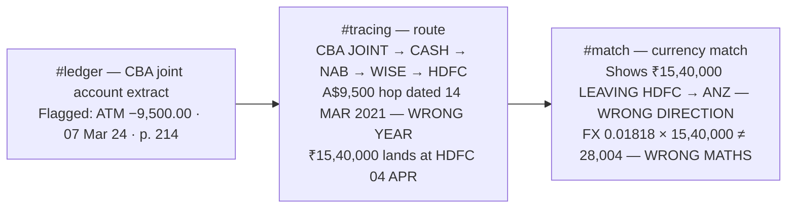

# /engine-network/ Canonical Home Page Audit-Fix Plan

<critical_warning>
> **CRITICAL WARNING:** Step 6 edits baked label strings inside the hero WebGL scene (`Scene.tsx`). Per the binding project rule in `AGENTS.md` and `documents/plans/fintrace_design_plan.md`, ANY `/engine-network` hero change — even text-only — requires headed real-GPU re-verification at the full seven-viewport matrix (1440x900, 1998x750, 2560x1080, 3425x1245, 1024x768, 900x1080, 390x900) plus fallback and lifecycle checks. Do not skip this because the change "is only text". Replacement strings were chosen with identical character counts so plate-fit geometry is untouched, but only the browser proves it.
</critical_warning>

<important_note>
> **IMPORTANT NOTE:** The story-unification steps (2, 3, 4) are interdependent: the ledger caption, trace annotation dates/amounts and the rebuilt currency-match diagram must all land together, otherwise the page contradicts itself in a new way (e.g. trace showing ₹15,38,040 while the match still shows ₹15,40,000). Implement steps 2–4 in one pass and verify the cross-section numbers as a set before moving on.
</important_note>

## 1. Goal

`/engine-network/` is the flagship Evidence Engine variant and is being adopted as the **canonical FinTrace home page**. The user requested an exhaustive audit-and-fix pass over the page's animations, diagrams and copy so the page is premium, professional and bug-free, with marketing copy at the standard of Harry Dry's Marketing Examples (short, concrete, punchy — no stilted or self-contradicting language). Everything must flow as ONE story: pages → ledger → network → finding.

A full source-level and headed-browser audit (desktop 1440x900 and mobile 390x900, all sections, all animation phases, with element-level geometry measurement) found **zero console/page errors and zero horizontal overflow**, but a set of concrete defects in the three diagram set-pieces, the hero, mobile layout and copy. This plan fixes every finding.

Done means:

- The crimson flag rule in the ledger set-piece no longer touches the `07 Mar 24` date or the `flagged — see source, p. 214` note (user-reported defect, confirmed at both viewports).
- The three evidence set-pieces (ledger table, trace diagram, cross-currency match) tell one internally consistent story: same matter, same accounts, same dates, same amounts, exact FX arithmetic.
- No diagram annotation or label overlaps, occludes another element, or overflows its plate at 1440x900, 1024x768 or 390x900.
- All animation choreography defects fixed (ledger status caption wrap + mistimed status, currency-chip mid-swap garble, MATCHED stamp landing after the chip has faded, proof stat values wrapping on mobile).
- The hero kicker stays legible at every animation phase; hero account labels match the diagrams below the fold.
- The fixed "Design lab" chip is removed from this page (user decision — it is dev chrome and the page is now the home page).
- Copy is free of typos, internal contradictions, false claims and style inconsistencies (Oxford commas), in British English with curly apostrophes.
- `npm run lint` passes with zero errors, `npm run build` completes the static export, and headed dev-browser verification passes at the required viewport matrices.
- `documents/plans/fintrace_design_plan.md` records every design decision made here (binding documentation-synchronisation rule).

---

## 2. Current State Analysis

### 2.1 Current Implementation Overview

The page lives entirely in `src/app/engine-network/` (route isolation, all CSS scoped under `.dsn-engine-network`):

| File | Role |
| --- | --- |
| `page.tsx` | Server component; metadata, all section copy (STAGES/SPECS/AUDIENCES constants), section markup, header/footer, fixed lab chip |
| `Hero.tsx` | Client hero: static SVG fallbacks, dynamic `Scene` import, kicker/h1/lede/CTAs, scroll cue, stat strip |
| `Scene.tsx` | Three.js hero: document stream → gate → 8-node (5 compact) account constellation with baked label plates |
| `LedgerPlate.tsx` | `#ledger` set-piece: 7-row reconciling statement table; IO adds `.is-run`; CSS keyframes drive rows → chips → crimson flag rule → note → double-gold total |
| `TraceDiagram.tsx` | `#tracing` set-piece: 2D-canvas account graph (10 nodes, 14 ambient edges), golden route thread CBA JOINT → CASH → NAB → WISE → HDFC drawn over a 15 s cycle; HTML labels + 4 per-hop annotations positioned on the canvas's normalised grid |
| `CurrencyMatch.tsx` | `#match` set-piece: server-component SVG, viewBox `0 0 560 200`; travelling amount chip on a CSS motion path; MATCHED stamp; 9 s loop |
| `Reveal.tsx`, `Stat.tsx`, `fonts.ts` | IO reveal wrapper, count-up/count-down stat, Bricolage Grotesque + Fragment Mono |
| `engine-network.css` | ~1,838 lines; palette, typography, buttons, hero, sections, all set-piece styling; keyframes prefixed `engnet-*` / `ecmnet-*` |

Page section order: hero → `#process` → `#ledger` → `#tracing` → `#match` → `#capabilities` → `#proof` → `#for` → `#engage` → footer. Header nav: Process / Ledger / Tracing / Proof.

### 2.2 Audit Findings (all confirmed in a headed browser; geometry numbers are measured values)

**A. LedgerPlate (`#ledger`)**

- **A1 — Flag rule hugs the row content (user-reported).** The crimson rule is an SVG `rect` at `x: 1px` inside `.eng-lt-wrap`; the row grid has no horizontal padding. Measured: date text left edge sits **−1 px** relative to the rule stroke (the "0" of `07 Mar 24` is visibly bisected), the note's "F" is clipped the same way, and the note's bottom edge sits **−1 px** below the rule. Meanwhile the rule's right side has 92.7 px of slack to the CASH chip. Same on mobile.
- **A2 — Status caption wraps at every width.** `.eng-lt-status` is a fixed `height: 1rem; min-width: 20ch` box whose spans are `position: absolute; inset: 0`. Because all spans are absolute, the flex item's width collapses to its 20ch min-width at EVERY viewport, and the 29-character final status "Reconciled — one line flagged" (letter-spacing 0.2em) wraps into two ragged lines that spill below the 1rem box toward the masthead border. Measured span box 197.75x16 px with two rendered text lines.
- **A3 — Status text mistimed.** "Reconciled — one line flagged" fades in at 4.2 s, but the flag rule draws 4.1–5.2 s and the closing total lands at 5.8 s — the caption announces reconciliation ~1.6 s before the ledger visually reconciles.
- **A4 — Caption contains factual contradictions.** `Extract 04 · rendered from westpac_2019_q3.pdf and 41 companion statements · column order follows the delivered spreadsheet`: (a) a 2019 source file cannot contain the table's March 2024 rows; (b) row 2 is "TRANSFER TO J HARPER — NETBANK" and NetBank is CBA's platform, not Westpac's; (c) "column order follows the delivered spreadsheet" is false on the page's own terms — the demo table shows Date/Description/Amount/Balance/Category while Spec 02 states the delivered schema (file, person, date, financial year, description, debit/credit, amount, category), which has no Balance column.
- **A5 — Ledger lede is stilted:** "…entered, categorised and reconciled, and the one that warrants attention, flagged with its source page attached." The double-comma chain around "flagged" reads broken.
- The table arithmetic is **correct** (23,965.59 → 13,098.05 verified row by row) — do not change any row data.

**B. TraceDiagram (`#tracing`)**

- **B1 — Flagged annotation occludes the CASH label.** Desktop measured: note box (122–342, 80–102) fully covers the CASH label (272–301, 77–92); the flagged node's name is invisible exactly when it lights up. Same on mobile.
- **B2 — Bright route thread crosses labels.** The NAB→WISE thread passes through the right half of the "NAB ****1130" label (label 426–514 x 173–188; thread crosses x≈483–503 in that band). The WISE→HDFC thread clips the left edge of "HDFC ****3321 · INR" (label 820–958 x 221–236; thread crosses x≈819–861). Ambient (0.10-alpha) edges also cross CBA JOINT and WISE labels — acceptable at that opacity; only bright route-thread crossings must be fixed.
- **B3 — Mobile layout breaks (390x900, root 301x340).** The "₹15,40,000 · 04 APR 2021 · FX MATCH" note spans x 177.8–398.8 → ~81 px past the plate border and clipped at the viewport edge (text visibly cut). The "A$28,000 · 02 APR 2021" note (180–323 x 159–179) fully covers the HDFC label (200–324 x 160–173). The flagged note starts at x −14.8 (outside the root, ~2 px from the plate frame). The CBA JOINT label starts at x −28.9 (12 px past the plate border). The FX note touches the WISE AUD label. (Page-level `scrollWidth` stays clean only because the `content-visibility: auto` section paints-clips the overflow.)
- **B4 — Dates contradict the ledger.** Annotations say 2021 (`14 MAR 2021`, `16 MAR 2021`, `02 APR 2021`, `04 APR 2021`) while the ledger above is dated March 2024, and the trace's flagged hop (A$9,500) is obviously the ledger's flagged `07 Mar 24` ATM withdrawal of −9,500.00. The lede explicitly claims continuity: "From that ledger the engine maps every account…".
- **B5 — Lede wording:** "onwards through Wise to an overseas ledger" misuses "ledger" (everywhere else on the page "ledger" = the delivered Excel ledger); "dated, valued, and cited" uses an Oxford comma against page style. Caption "Reconstructed route on a live matter" duplicates the proof section's "Proven on a live matter" kicker.

**C. CurrencyMatch (`#match`)**

- **C1 — Direction contradicts the trace (story-breaking).** Trace: A$28,000 leaves NAB via Wise on 02 APR, lands at HDFC as ₹15,40,000 on 04 APR (AUD→INR). Match diagram: the same ₹15,40,000 leaves HDFC on 04 APR and lands at ANZ ****4417 as A$28,004 (INR→AUD) — the same funds moving in both directions on the same date.
- **C2 — FX arithmetic doesn't reconcile.** Displayed `FX 0.01818`: 15,40,000 × 0.01818 = A$27,997.20, not the displayed A$28,004 — on a page whose whole promise is reconciliation.
- **C3 — Mid-swap garble.** `ecmnet-inr` fades out over 43→47% while `ecmnet-aud` fades in over the same 43→47% window: both amounts render superimposed for ~0.36 s producing an illegible mash (screenshot shows "₹A$2809004₀").
- **C4 — Verdict and amount never coexist.** Chip opacity drops over 82→88% of the cycle; the MATCHED stamp lands 84→94%. At full stamp opacity the amount chip has already vanished, so the diagram's key frame (amount + MATCHED together) never exists.
- **C5 — Exact-phrase duplication in one viewport:** the section lede and the diagram caption both end "…with source pages cited for both sides."
- **C6 — Mobile legibility:** at 390 px the SVG scales to ~0.56x, rendering station names at ~6 px and subs at ~5 px (known open item in the design plan; now that this is the home page it must be fixed).
- **C7 — Minor:** the `#match` plate `Reveal` has no `delay` while the `#ledger`/`#tracing` plates use `delay={120}`; `ecm-st2`/`ecm-st3` classes exist in TSX with no CSS rules.

**D. Hero**

- **D1 — Kicker washout.** "Forensic infrastructure for legal teams" is gold (`#d4a94e`) and becomes near-illegible whenever a bright paper document passes behind it (confirmed at 1440x900 and 390x900 across several phases; the round-five scrim pocket does not protect the kicker band).
- **D2 — Account-cast mismatch.** Hero labels `CBA ··0092`, `NAB ··7793`, `AMEX ··3010` contradict the below-fold diagrams (`CBA JOINT ****8802`, `NAB ****1130`, `AMEX ****9010`), and "0092" doubles as the ledger's Sportsbet reference. Hero `ANZ ··4417`, `HDFC ··3321`, `WISE`, `CASH ATM` already match.

**E. Proof plate (`#proof`)**

- **E1 — Stat values wrap on mobile.** At 390x900 the 2-column grid gives ~111 px columns; "10 hrs" and "15 yrs" (font clamp resolves to 40 px) wrap onto two lines (measured span height 120 px = 2 lines). "≈50" and "1,000s" fit at 127.75 px width.

**F. Lab chip**

- **F1 — The fixed chip covers content.** Desktop: chip (17.6–285 x 853.7–882.4) covers the © line start (168.5+ x 847–862). Mobile: it also covers the second line of the wrapped © text and the hero stat strip's left half. **User decision: remove the chip from this page entirely.**

**G. Copy (page.tsx)**

- **G1 — Oxford commas against page style** (page style elsewhere: "entered, categorised and reconciled"): Stage 03 "…related accounts, and cross-currency matches"; trace lede "dated, valued, and cited"; CTA lede "the ledger, the findings, and the sources".
- **G2 — Schema list stated two ways:** Stage 02 "file name, person, date, financial year, description, debit, credit, amount, category" vs Spec 02 "file, person, date, financial year, description, debit and credit, amount, category".
- **G3 — "dozens of accounts"** in the featured audience card contradicts "Fifty accounts" (h2) and "≈50" (stat, hero strip). Brand brief says ~50 accounts.
- **G4 — Awkward comma** in audience 2: "suited to procurement, and to overloaded teams…".
- **G5 — Spec 05 direction** "rupees to Australian dollars through Wise" will contradict the unified AUD→INR diagrams after C1 is fixed.

### 2.3 The Evidence-Story Arc (current contradictions marked)

### 2.4 Technical Constraints (binding, from `AGENTS.md` and the design plan)

- British English, curly apostrophe `’`, no emoji in UI copy. Product claims must stay grounded in `/Users/sacino/fintrace/documents/reference/brand_naming_background.md`; service-not-software positioning; do not invent capabilities, proof or clients.
- Static export (`output: 'export'`, `trailingSlash`, unoptimised images): no server runtime, no network assets. All visuals CSS/inline-SVG/canvas/generated WebGL.
- All route CSS stays scoped under `.dsn-engine-network`. `@keyframes` names are document-global — this route's prefixes are `engnet-*`, `engnet-lt-*` and `ecmnet-*`; any NEW or RENAMED keyframe must keep a route-unique prefix.
- Transform/opacity animation only; IntersectionObserver triggers; rAF/WebGL pause offscreen/hidden; DPR ≤ 2; rAF deltas clamped [0, 0.05]; full three.js disposal; **never** add `prefers-reduced-motion` gates (workspace rule).
- Server Components by default; `CurrencyMatch.tsx` must stay a server component (pure SVG + CSS animation); `TraceDiagram.tsx`/`LedgerPlate.tsx`/`Hero.tsx`/`Scene.tsx` stay client.
- Thorough imperative-mood comments for non-obvious logic (animation lifecycles especially).
- better-ui: press scale 0.96, explicit transition-property lists, ≥44 px hit areas, interruptible hover/press, visible focus states — existing patterns must not regress.
- Validation: `npm run lint` (zero errors), `npm run build` (export completes), dev-browser (headed Chromium, real GPU) checks per matrix; dev server: reuse `http://localhost:3004` if already running (it currently is), never start a duplicate.
- Hero-change verification matrix (round-5 rule): 1440x900, 1998x750, 2560x1080, 3425x1245, 1024x768, 900x1080, 390x900 + live-resize, fallback and lifecycle checks. Non-hero UI verification matrix: 1440x900 + 390x900 (this plan adds 1024x768 for the trace diagram because label placement is width-sensitive).
- Record every design decision in `documents/plans/fintrace_design_plan.md` in the same task.
- Multiple collaborators may touch the repo concurrently; leave unrelated changes alone.

### 2.5 Existing Infrastructure That Can Be Reused

- `Scene.tsx` already implements per-node `labelOffset` on its 3D constellation — the same "label on the thread-free side" principle now needed in `TraceDiagram.tsx`.
- `TraceDiagram.tsx` already has `hideOnMobile` on nodes/annotations and a `tnet-md-only` CSS hook; the mobile fixes extend this pattern rather than inventing a new one.
- CSS geometry properties (`x`, `width`) on SVG rects are already used by `.eng-lt-flag rect` — the same mechanism carries the flag-rule bleed and the mobile chip-rect widening in `CurrencyMatch`.
- `dev-browser` CLI with the Playwright Page API is the established verification harness; audit scripts from this round (element-geometry measurement snippets) can be re-run as-is.

---

## 3. Desired State

### 3.1 Desired State Requirements

- **REQ-1 (MUST):** The ledger flag rule clears its content: ≥10 px between the rule's left stroke and the `07 Mar 24` date / note text; ≥4 px between the note's bottom and the rule's bottom stroke; the rule stays ≥4 px inside the ledger figure's border at 390 px width.
- **REQ-2 (MUST):** Every ledger status caption renders on one line at 1440x900, 700x900 and 390x900; the final status fades in only after the closing total has begun rising (≥5.6 s).
- **REQ-3 (MUST):** Ledger caption names a source file consistent with the rows (CBA, 2024) and makes no claim the page itself contradicts.
- **REQ-4 (MUST):** One consistent story across the three set-pieces: the ledger's flagged −9,500.00 / 07 Mar 24 IS the trace's flagged hop; trace dates are 2024; the trace's Wise hop (A$28,000 · 02 APR → ₹15,38,040 · 04 APR) IS the match diagram's transfer; FX arithmetic is exact (28,000 × 54.93 = 15,38,040).
- **REQ-5 (MUST):** No trace annotation or label overlaps another visible label/annotation; no annotation extends beyond the `tnet-root` box; the bright route thread does not pass through any label's text box — at 1440x900, 1024x768 and 390x900, verified across a full 15 s cycle.
- **REQ-6 (MUST):** The currency chip never shows two amounts superimposed; the landed amount chip and the MATCHED stamp are simultaneously at full opacity for ≥0.8 s per cycle.
- **REQ-7 (MUST):** Hero kicker text is legible at every animation phase (dark text-shadow separates it from passing documents); hero labels read `CBA ··8802`, `NAB ··1130`, `AMEX ··9010` (desktop) and `CBA ··8802` (compact), with all other labels unchanged.
- **REQ-8 (MUST):** All four proof stat values render on one line at 390x900.
- **REQ-9 (MUST):** The `.eng-lab-chip` element and its CSS are removed from this route; no fixed element overlaps the footer © line or the hero stat strip.
- **REQ-10 (MUST):** Copy fixes applied exactly as specified in the Step-5 table; no Oxford commas remain in page.tsx running copy; no exact-phrase duplication between the match lede and the match caption.
- **REQ-11 (MUST NOT):** No change to ledger row data, balances, cycle lengths (ledger run choreography, trace 15 s, match 9 s, hero 28 s), node/slot geometry in `Scene.tsx`, scrim geometry, container/headline offset formulas, fonts, palette, or any other route's files.
- **REQ-12 (MUST):** `npm run lint` zero errors; `npm run build` static export completes; zero console errors, zero page errors, zero horizontal overflow at every verified viewport.
- **REQ-13 (MUST):** `documents/plans/fintrace_design_plan.md` updated in the same task with this round's decisions and outcomes.
- **REQ-14 (SHOULD):** Mobile match-diagram station names ≥8 px effective size at 390 px; travelling chip text fits its widened rect without clipping.
- **REQ-15 (SHOULD):** `#match` plate `Reveal` uses `delay={120}` matching the sibling plates; unused `ecm-st2`/`ecm-st3` class names removed.

### 3.2 Defaults and Fallbacks

- **Defaults:** trace labels keep their current below-node placement unless a `labelSide`/`labelDx` override is specified for that node; annotations keep desktop `dx`/`dy` unless a mobile override is specified.
- **Fallback order (trace label placement):** if a specified initial offset still collides during browser verification, nudge along the same axis in 5–10 px steps until the REQ-5 invariants pass, preferring (1) staying on the thread-free side, (2) staying inside `tnet-root`, (3) minimising distance from the node. Record final values in the design plan doc.
- **Compatibility:** the canonical `CurrencyMatch` geometry (viewBox, path, station x-positions, chip/plate rects and bands) is shared language across the other engine variants — this plan changes /engine-network's COPY of the text content, class names scoped to this route, and its `ecmnet-*` keyframes only. Other routes keep the old INR→AUD version (consistent with round-two scope where fixes were applied per-route).

### 3.3 Verification Checklist

**Functional:**
- [ ] Flag-rule clearances measured ≥10 px left, ≥4 px bottom (script-measured at 1440 and 390)
- [ ] All three ledger statuses single-line; final status ≥5.6 s
- [ ] Trace invariants (REQ-5) pass at 1440x900, 1024x768, 390x900 over a full cycle
- [ ] Match chip swap clean; stamp+chip coexist ≥0.8 s; FX maths exact on-screen
- [ ] Hero kicker legible over passing documents at 1440 and 390 (screenshot evidence at ≥2 phases)
- [ ] Proof stats single-line at 390
- [ ] No `.eng-lab-chip` in DOM; © line fully visible at both viewports

**Story consistency:**
- [ ] A$9,500 / 07 MAR 2024 appears in both ledger (row + p. 214 note) and trace (flagged hop annotation)
- [ ] A$28,000 · 02 APR and ₹15,38,040 · 04 APR appear identically in trace hop annotations and match stations
- [ ] 28,000 × 54.93 = 15,38,040 exactly; the displayed rate is 54.93
- [ ] Account cast identical across hero, trace, match: ANZ ··4417 / CBA (JOINT) ··8802 / NAB ··1130 / AMEX ··9010 / HDFC ··3321 / WISE / CASH

**Compatibility:**
- [ ] `git diff --stat` shows changes ONLY under `src/app/engine-network/` and `documents/`
- [ ] Grep confirms no new un-prefixed `@keyframes` names; `ecmnet-inr`/`ecmnet-aud` fully renamed with no dangling references

**Ops/Docs:**
- [ ] `documents/plans/fintrace_design_plan.md` records this round (decisions, final trace offsets, validation results)
- [ ] Lint zero errors; build exports; screenshots saved under `~/.dev-browser/tmp/` with a round-unique prefix (`r6-*`)

---

## 4. Additional Context

### 4.1 User-Provided Context

- The user supplied a screenshot of the ledger set-piece (`/Users/sacino/Library/Application Support/CleanShot/media/media_HpkMC20iIC/CleanShot 2026-07-16 at 21.58.33.png`) showing the crimson rule hugging "07 Mar 24" — verbatim: "the red outline is hugging the 07 Mar 24 too closely, and we need to give it more room so it's not overlapping." All diagrams were to be checked for issues "like this".
- "We want to keep all the diagrams, including the ledger" — no set-piece may be removed or replaced; fixes are in-place refinements.
- Quality bar (verbatim intent): "go in depth, be exhaustive, be fastidious. Have a high bar; ensure the site is premium, professional — but still alluring with outstanding marketing copy. Akin to Harry Dry's Marketing Examples."
- Decisions taken via clarification round:
  1. **Match diagram direction:** unify with the trace (AUD→INR; the match becomes a zoom-in on the trace's FX hop) — chosen over keeping the INR→AUD "money coming home" framing with separate dates.
  2. **Hero labels:** unify the account cast (··8802 / ··1130 / ··9010) accepting the mandatory hero re-verification matrix — chosen over leaving the hero untouched.
  3. **Kicker legibility:** CSS text-shadow on the hero kicker only — chosen over deepening the validated round-5 scrim or leaving as-is.
  4. **Lab chip:** REMOVE it from `/engine-network/` entirely (gallery navigation via URL only) — chosen over keeping it and clearing collisions.

### 4.2 Background and Decisions

- **Why AUD→INR (not the brand brief's literal "rupee-to-AUD" example):** the brief grounds the CAPABILITY (cross-currency matching between INR and AUD via Wise, proven on a real matter); direction is presentational. The page's centre-of-gravity narrative — assets dissipating OUT of the joint account (flagged cash → related account → Wise → overseas) — requires AUD→INR, and the trace's final hop already carries an "FX MATCH" tag pointing at the match section. Spec 05's copy flips direction accordingly (Step 5) so the page never contradicts itself.
- **Why ₹15,38,040 and FX 54.93 (not the old round ₹15,40,000):** 28,000 × 54.93 = 15,38,040 exactly. In real remittances the SENT amount is round and the received amount is odd; an exactly-reconciling, non-round INR figure is more forensically credible and kills the "0.01818 doesn't multiply out" defect. Indian digit grouping (15,38,040) is correct for INR and already used on the page.
- **Why hop-2 is "09 MAR 2024":** the ledger's flagged withdrawal is 07 Mar 24; cash re-deposited two days later as A$9,400 (sub-A$10,000 amounts and a short gap read as classic structuring — the same 2-day cadence the old 14→16 Mar annotations used).
- **Trace flagged annotation gains "SEE P. 214":** the ledger note reads "flagged — see source, p. 214"; the trace note `A$9,500 · 07 MAR 2024 · SEE P. 214` cross-references the same source page, binding the two set-pieces. Crimson styling already communicates "flagged", so the word FLAGGED is dropped from the note.
- **Tracing h2 stays "Fifty accounts. One thread of evidence."** A shorter "One thread." was considered (punchier) but the "chain of evidence" (process) / "thread of evidence" (tracing) parallelism is deliberate page rhetoric and user-era approved through five rounds; not changed without user direction.
- **Hero topology stays impressionistic:** the hero's edge structure (ANZ as hub) intentionally does NOT mirror the trace's route topology; only the account CAST (bank + last-4) is unified. Hero "BTC WALLET" vs trace "CRYPTO EXCH" are plausibly distinct entities in one matter and are left as-is.
- **Ambient-edge label crossings in the trace are accepted:** ambient edges render at 0.10 alpha and read as atmosphere; only the bright route thread (0.92–0.95 alpha) crossing label text is a defect. Occasional pulse dots crossing labels are accepted noise.
- **Annotations may sit ON the route thread** (plate pinned to the thread is established evidence-board language); they must never cover a LABEL.
- **`content-visibility: auto` masked the mobile overflow:** the section's paint containment clips the FX-note overflow at the viewport, so `scrollWidth` stayed clean while text was visibly cut — do not rely on the page-overflow number alone when verifying the trace fixes; measure the note boxes.
- **Why the status caption fix uses an in-flow width-setter:** any `min-width` guess re-breaks at some letter-spacing/viewport combination; making the LONGEST span (`.eng-lt-s3`) position-static with `white-space: nowrap` makes the flex item size itself to the true longest line at every width, while the other two spans overlay it absolutely. Its `opacity: 0` initial state already reserves the space invisibly.
- **Chip-rect and SVG text sizes on mobile are changed via CSS geometry properties** (`x`, `width` on `rect`; `font-size` on `text`) inside a `max-width: 767px` media query — SVG attributes cannot be media-queried, but CSS geometry properties can, and the codebase already uses this technique on `.eng-lt-flag rect`.
- **Audit evidence** (screenshots + measured geometry) from this round is in `~/.dev-browser/tmp/audit-*.png`; key measurements are quoted in §2.2 so the executor does not depend on those transient files.
- The dev server on port 3004 was already running during the audit; reuse it (dev-server policy).
- `/engine-network/` metadata `title`/`description` mention the lab variant naming ("The Evidence Engine — Network") — intentionally NOT changed here; productionisation naming is a separate, future decision per the design plan's "Next steps".

---

## 5. Implementation Plan

### Step 1: LedgerPlate — flag-rule breathing room, status caption, timing, caption copy

**Objective:** Fix the user-reported rule-hugging defect plus the three other ledger findings (A1–A5) without touching row data or the run choreography's overall shape.

#### 1.1 High-Level Approach

Files: `src/app/engine-network/engine-network.css`, `src/app/engine-network/LedgerPlate.tsx`.

1. **Flag-rule bleed (A1).** In `engine-network.css`:
   - `.dsn-engine-network .eng-lt-flag rect`: change `x: 1px` → `x: -0.75rem`; `width: calc(100% - 2px)` → `width: calc(100% + 1.5rem)`. Keep `y`, `height`, `rx`, dash draw and `vector-effect: non-scaling-stroke` unchanged (`.eng-lt-flag` already has `overflow: visible`).
   - `.dsn-engine-network .eng-lt-wrap.is-flagged::before` (the crimson wash): change `inset: 0` → `inset: 0 -0.75rem` so the wash fills the enlarged rule.
   - Add a `@media (max-width: 700px)` override inside the existing ledger mobile block: rect `x: -0.5rem; width: calc(100% + 1rem)`; wash `inset: 0 -0.5rem` (the figure's padding-inline floors at 1.1rem ≈ 17.6 px on phones; a 0.75rem bleed would leave only ~5.6 px to the plate border).
   - `.dsn-engine-network .eng-lt-note`: `padding: 0.2rem 0 0.55rem` → `padding: 0.2rem 0 0.8rem` (cures the −1 px note-bottom overlap; grows the wrap so the rule's bottom edge moves down with it).
2. **Status caption layout (A2).** Restructure `.eng-lt-status`: remove `height: 1rem` and `min-width: 20ch`; add `position: relative`. Make all three spans `white-space: nowrap`. `.eng-lt-s1`/`.eng-lt-s2`: `position: absolute; right: 0; top: 0` (no `inset`). `.eng-lt-s3`: `position: static; display: inline-block` — the in-flow, invisible width-setter. In the existing ≤700 px masthead block (status is left-aligned there) add `.eng-lt-s1, .eng-lt-s2 { right: auto; left: 0; }`. Add an imperative comment explaining the width-setter pattern.
3. **Status timing (A3).** `.eng-lt.is-run .eng-lt-s2`: animation `engnet-lt-status-hold 1.9s ease 2.3s` → `engnet-lt-status-hold 3.3s ease 2.3s` (covers categorising + flag draw, 2.3–5.6 s). `.eng-lt.is-run .eng-lt-s3`: delay `4.2s` → `5.6s` (fades in as the total rises at 5.8 s). No keyframe changes.
4. **Caption copy (A4).** In `LedgerPlate.tsx`, figcaption becomes exactly: `Extract 04 · rendered from cba_joint_8802_mar24.pdf and 41 companion statements` (drops the false column-order claim; CBA matches the NETBANK row and the trace's CBA JOINT ****8802 origin; mar24 matches the row dates). Update the component's doc comment if it references the old caption.
5. Do not change: row data, chip/animation delays for rows and chips, total timing (5.8 s), `pathLength` draw mechanics.

**Success Criteria:**
- Script-measured at 1440x900 and 390x900 (dev-browser, after `.is-run` completes): `date.left - rect.left ≥ 10`, `note.left - rect.left ≥ 10`, `rect.bottom - note.bottom ≥ 4`, and `rect.left - figure.left ≥ 4`.
- Each of the three status spans has a single-line box (measured height < 20 px) at 1440x900, 700x900 and 390x900; no status text crosses the masthead's bottom border.
- With the run started, "Reconciled — one line flagged" is not visible before 5.6 s and is visible at 6.2 s (verify with timed screenshots or `getComputedStyle` opacity samples).
- Rendered figcaption text equals the exact string above (assert via `textContent`).
- Rows still enter at 0.12 s + i×0.24 s, chips at 2.2 s + i×0.18 s, flag rule at 4.1 s, note at 5.1 s, total at 5.8 s (unchanged delays in CSS).

### Step 2: TraceDiagram — label sides, mobile placement, dates and amounts

**Objective:** Make the trace diagram collision-free at all three widths (B1–B3) and rewrite its annotations so it is the same matter as the ledger (B4), keeping the 15 s cycle and canvas rendering untouched.

#### 2.1 High-Level Approach

Files: `src/app/engine-network/TraceDiagram.tsx`, `src/app/engine-network/engine-network.css`.

1. **Extend the node/annotation data model** (mirroring the hero's `labelOffset` pattern):
   - `GraphNode` gains `labelSide?: 'above'` (default below) and `labelDx?: number` (px, desktop) and `mobileLabelDx?: number` (px, ≤767 px).
   - Annotations gain `mobileDx?: number` / `mobileDy?: number`.
   - Implement via CSS custom properties so the switch is pure CSS: each label/note span sets `left: calc(<x>% + var(--tnx, 0px))`, `top: calc(<y>% + var(--tny, 0px))` with `--tnx`/`--tny` set inline from desktop values and `--tnx-m`/`--tny-m` from mobile values; the existing ≤767 px media block adds `.tnet-label, .tnet-note { --tnx: var(--tnx-m); --tny: var(--tny-m); }`. `labelSide: 'above'` maps to a `tnet-label-above` class with `transform: translate(-50%, calc(-100% - 10px))`.
2. **Desktop placements (initial values, from measured 1022x480 geometry):**
   - `CASH` → `labelSide: 'above'` (both route threads meet it from below; fixes B1's occlusion by moving the label out of the note's band).
   - `NAB ****1130` → `labelDx: -60` (below-left; route thread to WISE then passes ≥20 px right of the label box).
   - `HDFC ****3321 · INR` → `labelSide: 'above'` (swaps the bright WISE-thread crossing for a faint ambient CRYPTO-edge crossing, which is accepted).
   - `WISE AUD` → `labelDx: +20` (clears the ambient WBC edge's crossing band).
   - Flagged annotation keeps `dx: -72, dy: -26` (with CASH's label above, the previous occlusion cannot recur).
3. **Mobile placements (initial values, root ≈301x340; verify and nudge per §3.2 fallback order):**
   - Notes wrap on mobile: add to the existing ≤767 px block `.tnet-note { white-space: normal; max-width: 140px; line-height: 1.5; }`.
   - `CBA JOINT ****8802` → `mobileLabelDx: +30` (pulls it fully inside the plate).
   - `HDFC` (above per desktop) → `mobileLabelDx: -25` (keeps the box inside the root's right edge).
   - `WISE AUD` → mobile: label to the right of its node (`mobileLabelDx: +30`).
   - `ANZ ****4417` → `hideOnMobile: true` (ambient, non-route; frees the lower-left band the FX note needs).
   - Annotation overrides: flagged note `mobileDx: -30, mobileDy: -34`; "A$28,000" note `mobileDx: -20, mobileDy: +14`; FX-match note `mobileDx: -140, mobileDy: +40`.
4. **Annotation text (B4 + cross-reference):** replace the `ANNOTATIONS` texts exactly:
   - `A$9,500 · 07 MAR 2024 · SEE P. 214` (flagged: true — same event as the ledger's flagged row and its p. 214 source note)
   - `A$9,400 · 09 MAR 2024`
   - `A$28,000 · 02 APR 2024`
   - `₹15,38,040 · 04 APR 2024 · FX MATCH`
5. **Comments:** update the component doc comment (route/date narrative) and add imperative comments explaining the label-side rules ("label goes on whichever side carries no route thread") and the CSS-variable mobile override mechanism.
6. Do not change: node normalised positions, `PATH_IDS`, `AMBIENT_EDGES`, cycle timings (`DELAY`/`DRAW`/`HOLD_END`/`CYCLE`), canvas drawing, pulse system, IO/RO lifecycle.

**Success Criteria:**
- At 1440x900, 1024x768 and 390x900, with the thread fully drawn (capture at ~10 s into the cycle), a dev-browser script asserts for every visible `.tnet-note` and `.tnet-label` pair: zero bounding-box intersection; every `.tnet-note` box lies fully within the `.tnet-root` box (0 ≤ left, right ≤ root width, 0 ≤ top, bottom ≤ root height).
- Screenshot review at the same three widths confirms the bright route thread does not pass through any label's glyphs (CASH and HDFC labels sit above their nodes; NAB's label sits below-left with the outgoing thread visibly clear of it).
- The four annotation strings render exactly as specified (assert via `textContent`); no `2021` substring remains anywhere in `src/app/engine-network/` (grep).
- The flagged note and CASH label are BOTH fully legible simultaneously when hop 1 completes (screenshot).
- Cycle behaviour unchanged: notes retract and labels cool at cycle reset (observe one full 15 s loop without console errors).

### Step 3: CurrencyMatch — direction flip, exact FX, swap and stamp choreography, mobile legibility

**Objective:** Rebuild the match diagram's content as the trace's FX hop (C1–C2), fix the two choreography defects (C3–C4), and make it legible on phones (C6), preserving the canonical geometry (viewBox, path, stations at x 76/280/484, chip band y 78–102, MATCHED band y 40–64).

#### 3.1 High-Level Approach

Files: `src/app/engine-network/CurrencyMatch.tsx`, `src/app/engine-network/engine-network.css`, `src/app/engine-network/page.tsx` (Reveal delay only).

1. **Station content (TSX):**
   - Station 1: name `NAB ****1130`, sub `OUT A$28,000 · 02 APR`.
   - Station 2: name `WISE`, sub `FX 54.93`.
   - Station 3: name `HDFC ****3321`, sub `IN ₹15,38,040 · 04 APR`.
   - Chip texts: departing `A$28,000` (class `ecm-amt-out`), arriving `₹15,38,040` (class `ecm-amt-in`). Remove the unused `ecm-st2`/`ecm-st3` class names (C7).
   - `aria-label`: `An Australian dollar transfer matched to a rupee deposit via Wise`.
   - Update the component doc comment (direction, the zoom-in-on-the-trace-hop intent, exact-FX rationale).
2. **CSS class/keyframe renames:** `.ecm-amt-inr` → `.ecm-amt-out`; `.ecm-amt-aud` → `.ecm-amt-in`; `@keyframes ecmnet-inr` → `ecmnet-out`; `@keyframes ecmnet-aud` → `ecmnet-in` (route-prefixed, no cross-route collision; grep for dangling old names).
3. **Swap choreography (C3)** — replace the two amount keyframes so the fades no longer overlap (a ~0.14 s empty chip reads as a flip):
   - `ecmnet-out`: `0%, 43.5% { opacity: 1; } 45%, 100% { opacity: 0; }`
   - `ecmnet-in`: `0%, 45.5% { opacity: 0; } 47%, 100% { opacity: 1; }` (the chip GROUP's own fade hides it at cycle end, so ending at 1 is safe).
4. **Landing hold (C4)** — retime `ecmnet-travel` and `ecmnet-stamp`:
   - `ecmnet-travel`: `0% { offset-distance: 0%; opacity: 0; } 6% { opacity: 1; } 38% { offset-distance: 50%; } 50% { offset-distance: 50%; } 82% { offset-distance: 100%; } 95% { offset-distance: 100%; opacity: 1; } 100% { offset-distance: 100%; opacity: 0; }`
   - `ecmnet-stamp`: `0%, 78% { opacity: 0; transform: scale(1.35); } 84%, 96% { opacity: 1; transform: scale(1); } 100% { opacity: 0; transform: scale(1); }`
   - Result: chip and stamp are both fully opaque from 84% to 95% of the 9 s cycle (~0.99 s ≥ the 0.8 s requirement).
5. **Mobile legibility (C6)** — in the ≤767 px media block, using CSS geometry/text properties on the scoped selectors: `.ecm-name { font-size: 16px; }`, `.ecm-sub { font-size: 12px; }`, `.ecm-amt { font-size: 16px; }`, `.ecm-match text { font-size: 13px; }`, `.ecm-chip rect { x: -54px; width: 108px; }` (keeps `₹15,38,040` inside the chip at the larger size). The match plate's padding absorbs the subs' few-unit sideways growth (SVG `overflow: visible` already set).
6. **Section polish:** in `page.tsx`, the `#match` plate `Reveal` gains `delay={120}` (C7).

**Success Criteria:**
- Rendered SVG text nodes equal exactly the strings in item 1 (assert via `textContent`); on-screen arithmetic is exact: 28,000 × 54.93 = 15,38,040.
- Timed captures across one 9 s cycle at 1440x900 show: (a) no frame where both amount texts are simultaneously visible (capture at the 44–47% window, ~4.0–4.2 s after loop start); (b) a frame where the landed `₹15,38,040` chip AND the MATCHED plate are both at full opacity; (c) the 14-unit clear band between plate and chip is preserved (no overlap at landing).
- At 390x900: station names measure ≥8 px rendered height; chip text does not overflow its rect (screenshot); no element clips at the plate edges.
- Grep finds zero occurrences of `ecm-amt-inr`, `ecm-amt-aud`, `ecmnet-inr`, `ecmnet-aud`, `ecm-st2`, `ecm-st3` under `src/app/engine-network/`.
- `#match` renders after scroll with the same 120 ms reveal delay as `#ledger`/`#tracing` (code inspection).

### Step 4: Hero — kicker legibility and account-cast unification

**Objective:** Keep the kicker readable at every phase (D1) and align the hero's account cast with the diagrams (D2) with zero geometry change.

#### 4.1 High-Level Approach

Files: `src/app/engine-network/engine-network.css`, `src/app/engine-network/Scene.tsx`.

1. **Kicker text-shadow (CSS only):** add a scoped rule
   `.dsn-engine-network .eng-hero .eng-kicker { text-shadow: 0 0 6px rgba(13, 11, 9, 0.95), 0 0 16px rgba(13, 11, 9, 0.85), 0 0 32px rgba(13, 11, 9, 0.7); }`
   with an imperative comment (documents pass directly behind the kicker's band on their way into the gate; the scrim pocket alone cannot protect gold-on-gold). Do not touch `.eng-hero-scrim`.
2. **Label strings in `Scene.tsx`** (baked textures; identical character counts, so plate fit is unchanged):
   - `NODES_DESKTOP`: `'CBA ··0092'` → `'CBA ··8802'`; `'NAB ··7793'` → `'NAB ··1130'`; `'AMEX ··3010'` → `'AMEX ··9010'`.
   - `NODES_MOBILE`: `'CBA ··0092'` → `'CBA ··8802'`.
   - Update the adjacent comments that name these accounts. NO change to slots, `labelOffset`, edges, timings, fit formulas, `cashCompact`, or any other scene code.

**Success Criteria:**
- At 1440x900 and 390x900, screenshots at ≥2 distinct phases with a bright document behind the kicker show every glyph of "Forensic infrastructure for legal teams" distinguishable from the paper behind it (compare against the audit captures `audit-kicker-crop.png` / `audit-m-hero2.png`, where "LEGAL TEAMS" disappears).
- Hero labels read `CBA ··8802`, `NAB ··1130`, `AMEX ··9010` (desktop) and `CBA ··8802` (compact) in rendered screenshots; grep finds zero occurrences of `0092`, `7793`, `3010` in `Scene.tsx`.
- Full hero matrix passes (see Testing Plan): seven viewports, zero console/page errors, zero horizontal overflow, one canvas per page, no label plate clipping or new crowding at the 1.3 fit cap (3425x1245), compact fallback/WebGL alignment unchanged at 390x900 and 900x1080.
- Lifecycle spot-checks pass: scene rAF stops when scrolled offscreen and when the tab is hidden, resumes on return; a forced renderer failure still leaves the static fallback (unchanged behaviour, re-confirmed because Scene.tsx was edited).

### Step 5: page.tsx copy pass

**Objective:** Apply every copy fix (A5, B5, C5, G1–G5) exactly, in British English with the page's established no-Oxford-comma style.

#### 5.1 High-Level Approach

File: `src/app/engine-network/page.tsx`. Exact replacements (old → new):

| # | Location | Current | Replacement |
| --- | --- | --- | --- |
| 1 | Stage 02 copy | `…one structured Excel ledger: file name, person, date, financial year, description, debit, credit, amount, category.` | `…one structured Excel ledger: file name, person, date, financial year, description, debit and credit, amount, category.` |
| 2 | Stage 03 copy | `…transfers between related accounts, and cross-currency matches.` | `…transfers between related accounts and cross-currency matches.` |
| 3 | Spec 02 copy | `One Excel workbook holding every transaction: file, person, date, financial year, description, debit and credit, amount, category.` | `One Excel workbook holding every transaction: file name, person, date, financial year, description, debit and credit, amount, category.` |
| 4 | Spec 05 copy | `…including cross-currency matches — rupees to Australian dollars through Wise, reconciled line to line.` | `…including cross-currency matches — Australian dollars to rupees through Wise, reconciled line to line.` |
| 5 | `#ledger` lede | `…Watch the engine work — statement lines entered, categorised and reconciled, and the one that warrants attention, flagged with its source page attached.` | `…Watch the engine work: statement lines entered, categorised and reconciled — and the one that warrants attention flagged, with its source page attached.` |
| 6 | `#tracing` lede | `…joint account to cash, cash to a related account, onwards through Wise to an overseas ledger. Each hop is dated, valued, and cited to its source page.` | `…joint account to cash, cash to a related account, onwards through Wise to an overseas account. Each hop is dated, valued and cited to its source page.` |
| 7 | `#tracing` caption (`eng-diagram-caption`) | `Reconstructed route on a live matter — the flagged cash withdrawal is the single crimson hop.` | `The route, reconstructed from the extract above — the flagged withdrawal is the single crimson hop.` |
| 8 | `#match` lede | `And the thread holds even where the trail changes currency: rupees leaving an overseas account are matched to the dollars that landed here — with source pages cited for both sides.` | `And the thread holds even where the trail changes currency: the dollars that left through Wise are matched to the rupees that landed overseas two days later — down to the exchange rate.` |
| 9 | Audience 1 copy | `…thousands of pages, dozens of accounts, fifteen years of history.` | `…thousands of pages, fifty accounts, fifteen years of history.` |
| 10 | Audience 2 copy | `Engaged per matter as a specialist provider — suited to procurement, and to overloaded teams with every reason to save time.` | `Engaged per matter as a specialist provider — suited to procurement and to overloaded teams with every reason to save time.` |
| 11 | CTA lede | `Send the statements; receive the ledger, the findings, and the sources to back them.` | `Send the statements; receive the ledger, the findings and the sources to back them.` |

Unchanged by explicit decision: all h2s/kickers, hero kicker/h1/lede, hero stat strip, proof stats/note, footer lines, metadata, CurrencyMatch caption (`Same funds, two currencies — matched automatically, with source pages cited for both sides.` — the lede rewrite in row 8 removes the duplication from the other side).

**Success Criteria:**
- Each of the 11 strings matches the Replacement column exactly (grep for each new string returns exactly one hit in `page.tsx`; grep for each Current string returns zero hits).
- Grep for `, and ` within `page.tsx` copy constants/JSX text returns zero list-context hits (the only permitted `, and` constructions are none — verify each remaining hit, if any, is not a three-item list).
- All copy remains British English; no straight apostrophes `'` in any user-facing string (grep JSX text for `'` used as apostrophe returns zero).
- Section flow reads: structured → connected → matched with the match lede referencing "two days later" consistent with 02→04 APR (cross-check against Step 3 strings).

### Step 6: Remove the lab chip

**Objective:** Execute the user's decision to drop the design-lab chip from the canonical home page (F1); this also removes the © line and hero-strip occlusions outright.

#### 6.1 High-Level Approach

Files: `src/app/engine-network/page.tsx`, `src/app/engine-network/engine-network.css`.

1. Delete the entire fixed-chip block from `page.tsx` (the `<Link href="/" className="eng-lab-chip">` element including its inline SVG and the preceding comment). Keep the `Link` import (still used by the header wordmark).
2. Delete the `.eng-lab-chip` CSS rules (base, `::after` hit-area, `:hover`, `:active`) and the "Lab chip" section comment from `engine-network.css`.

**Success Criteria:**
- `document.querySelector('.eng-lab-chip')` returns null on the rendered page; grep for `eng-lab-chip` under `src/` returns zero hits.
- At full scroll on 1440x900 and 390x900, the © line (`© 2026 FinTrace. Every finding traceable to its source.`) is fully visible with no overlay; on 390x900 the hero stat strip's full text is visible.
- `npm run build` still exports the gallery `/` route unchanged (chip removal touches only this route's files).

### Step 7: Proof stats — mobile wrap fix

**Objective:** Stop "10 hrs" / "15 yrs" wrapping onto two lines on phones (E1).

#### 7.1 High-Level Approach

File: `src/app/engine-network/engine-network.css`. Add to a `@media (max-width: 480px)` block (new; the existing breakpoints are 900/767/700):

- `.dsn-engine-network .eng-stat-value { font-size: 1.9rem; white-space: nowrap; }`
- `.dsn-engine-network .eng-proof-stats { gap: 1.6rem 1rem; }`

Rationale: at 390 px the 2-column grid yields ~111 px columns; 1.9 rem (30.4 px) sets "1,000s" (the widest value) at ~100 px and "10 hrs"/"15 yrs" comfortably under the column width; `nowrap` guards the countdown's widest intermediate ("50 hrs").

**Success Criteria:**
- At 390x900, each `.eng-stat-value` bounding box height equals a single line (< 45 px measured) both DURING the 50→10 countdown and after settling; no value's box exceeds its grid column (no horizontal overflow measured on the plate).
- At 1440x900 and 768x900 the stat sizes are unchanged (the new rule applies only ≤480 px).

### Step 8: Documentation synchronisation

**Objective:** Keep `documents/plans/fintrace_design_plan.md` the accurate source of truth (binding rule).

#### 8.1 High-Level Approach

Append a new completed-round section (continue the numbering: "Round six: canonical-page audit fixes") and update affected inventory text:

- Record: the audit findings (brief), the four user decisions (§4.1), the unified story numbers (07 MAR 2024 / A$9,400 · 09 MAR 2024 / A$28,000 · 02 APR / ₹15,38,040 · 04 APR / FX 54.93), the ledger caption's new filename, the hero cast change (··8802/··1130/··9010), the kicker text-shadow, the lab-chip removal from `/engine-network/` (note the gallery remains reachable by URL only from this page), the TraceDiagram `labelSide`/mobile-override system with FINAL verified offset values, the CurrencyMatch direction flip with retimed `ecmnet-*` keyframes and the note that /engine-network's match content now intentionally diverges from the other variants' copies, and the new ≤480 px stat rule.
- Update the "Current page inventory" V4 subsection and the shared cross-currency set-piece paragraph (mark the network's divergence).
- Update the "Known open items" list: remove the "match diagram SVG text is small at 390 px" item (fixed here); add that other engine variants still carry the pre-flip INR→AUD match content and 2021 trace dates (only `/engine-trace`'s diagram) if ever promoted.
- Record validation results (viewports, screenshot prefix `r6-*`).

**Success Criteria:**
- The design plan contains the new round section with all items above; the V4 inventory paragraph and open-items list reflect the changes (manual read-through against this checklist).
- No other plan sections contradict the new state (search for `15,40,000`, `westpac_2019`, `0.01818`, `lab chip` references tied to /engine-network and update where they describe current state rather than history; historical round descriptions stay as written).

---

## 6. Testing Plan

No automated test suite exists (per `AGENTS.md`); validation is lint + build + headed dev-browser evidence. The dev server on port 3004 may already be running — check `http://localhost:3004` first and reuse it.

### 6.1 Source-of-Truth Regression Artefacts

- **User screenshot** `/Users/sacino/Library/Application Support/CleanShot/media/media_HpkMC20iIC/CleanShot 2026-07-16 at 21.58.33.png` — the reported defect: the crimson flag rule bisecting the "0" of `07 Mar 24` and clipping the note's "F", with the two-line "RECONCILED — ONE LINE / FLAGGED" status also visible top-right. Post-fix, a matching screenshot of the same plate state must show ≥10 px clearance rule-to-date and rule-to-note, and a single-line status.
- **Audit captures** under `~/.dev-browser/tmp/` (this round): `audit-ledger-complete.png`/`audit-ledger-bottom.png` (rule hugging, status wrap, caption text), `audit-trace-hold.png` (flagged note covering CASH; thread through NAB/HDFC labels; 2021 dates), `audit-m-trace.png` (mobile FX-note viewport clipping, HDFC label occlusion, CBA label past the plate border), `audit-match-dwell.png` (garbled superimposed chip amounts), `audit-match-stamp.png` (stamp without chip), `audit-kicker-crop.png`/`audit-m-hero2.png` (kicker washout), `audit-m-proof.png` (wrapped "10 hrs"/"15 yrs"), `audit-footer.png`/`audit-m-footer.png` (chip covering © line). These are transient files; §2.2 quotes the load-bearing measurements so the executor can re-derive each check even if the files are gone. Post-fix, re-capture the SAME states with an `r6-` prefix and compare side by side.

<critical_warning>
> **CRITICAL WARNING:** The regression checks for the ledger rule, the trace overlaps and the match choreography MUST be performed against the live page states shown in the artefacts above (same sections, same animation phases, same viewports) — not against reasoning about the CSS. Paint-clipping from `content-visibility: auto` hid the mobile trace overflow from `scrollWidth`; only element-box measurement and screenshots prove these fixes.
</critical_warning>

### 6.2 Static Validation

| Check | Command | Expected Result |
| --- | --- | --- |
| Lint | `npm run lint` (repo root) | Exit 0, zero errors |
| Static export | `npm run build` | Compiles, typechecks, exports all routes into `out/` |
| Scope guard | `git diff --stat` | Only `src/app/engine-network/*` and `documents/*` changed |
| Dangling names | `grep -rn "ecmnet-inr\|ecmnet-aud\|ecm-amt-inr\|ecm-amt-aud\|ecm-st2\|ecm-st3\|eng-lab-chip\|westpac_2019\|15,40,000\|0.01818\|2021" src/app/engine-network/` | Zero hits |
| Hero cast | `grep -rn "0092\|7793\|3010" src/app/engine-network/Scene.tsx` | Zero hits |
| Whitespace | `git diff --check` | Clean |

### 6.3 Browser Verification (dev-browser, headed, real GPU)

Use a task-scoped browser name; save screenshots with prefix `r6-`. Close the browser when done.

1. **Ledger plate (1440x900, 700x900, 390x900)**
   - Action: scroll `#ledger` into view; wait for the full run (≥7 s); run the geometry script (rule vs date/note/figure boxes; status span heights); capture at ~2 s (entering), ~3.5 s (categorising), ~5 s (flag drawing), ~6.5 s (complete).
   - Expected: Step-1 success criteria numbers; statuses single-line; final status appears only after 5.6 s; caption shows the new filename.
   - Verify: script assertions + screenshot comparison against the user's CleanShot artefact.
2. **Trace diagram (1440x900, 1024x768, 390x900)**
   - Action: scroll `#tracing` into view; wait ~10 s (thread complete, all notes on); run the overlap/containment script for every visible label+note pair; watch one full 15 s cycle.
   - Expected: REQ-5 invariants pass; new 2024 texts render; CASH + flagged note both legible; on failure of any initial offset, apply the §3.2 nudge loop and re-run until pass, recording final values.
   - Verify: script output (zero intersections, zero out-of-bounds) + phase screenshots.
3. **Currency match (1440x900, 390x900)**
   - Action: scroll `#match` into view; capture at ~2 s (depart, `A$28,000` chip), ~4.1 s (swap window), ~7.9 s (landed chip + MATCHED), ~8.6 s (fade).
   - Expected: no superimposed amounts in the swap window; chip+stamp coexist; stations read NAB → WISE (FX 54.93) → HDFC; mobile text sizes per Step 3.
   - Verify: screenshots + `textContent` assertions.
4. **Hero matrix (Scene.tsx + kicker changed): 1440x900, 1998x750, 2560x1080, 3425x1245, 1024x768, 900x1080, 390x900**
   - Action: load the page fresh at each viewport; wait ≥14 s (full constellation); capture full-page hero; at 1440 and 390 additionally capture a phase with a document behind the kicker.
   - Expected: labels `CBA ··8802` / `NAB ··1130` / `AMEX ··9010` legible with unchanged placement; kicker legible over paper; zero console/page errors; zero horizontal overflow; exactly one canvas.
   - Verify: screenshots at every viewport; live resize 1300x900 → 3425x1245 keeps one canvas and no overflow; offscreen scroll drops scene rAF to zero and it resumes on return (count frames via rAF probe); with WebGL construction temporarily forced to fail (dev-tools override or temporary flag), the static fallback remains with no errors — then remove the override.
5. **Proof stats (390x900, 480x900)**
   - Action: scroll `#proof` into view; measure `.eng-stat-value` boxes during the countdown (~1 s in) and after settling.
   - Expected: single-line boxes (< 45 px height) throughout; unchanged at ≥481 px.
   - Verify: script measurement.
6. **Chip removal + full-page sweep (1440x900, 390x900)**
   - Action: full-page scroll top → footer; at the bottom verify the © line; check `querySelector('.eng-lab-chip') === null`; collect console/page errors and `scrollWidth - clientWidth` for the whole session.
   - Expected: © line fully visible; hero strip fully visible on mobile; zero errors; zero overflow.
   - Verify: script + screenshots.
7. **Cross-section story read-through (1440x900)**
   - Action: capture ledger caption, trace annotations and match stations in one session.
   - Expected: the §3.3 story-consistency checklist passes verbatim (same amounts/dates/accounts across set-pieces).
   - Verify: screenshot set + `textContent` assertions.
