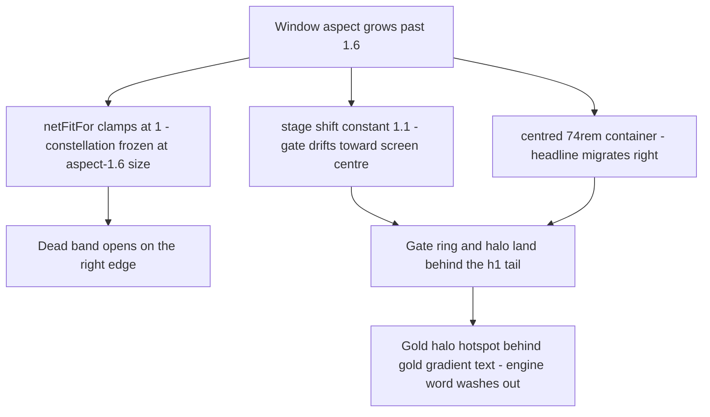

# Engine-Network Hero Wide-Aspect Rebalance & Delight Pass Plan

<critical_warning>
> **CRITICAL WARNING:** Every WebGL layout change in this plan MUST be proven by headed-browser screenshots at the full viewport matrix in section 6.3 — frustum maths sets the budget, only the browser proves it. Round three shipped three of five heroes off-frame on first pass, and round 4.1 found label crowding that a clean 2D slot-space check missed (depth foreshortening pulls deeper nodes toward the vanishing centre — check crowding in PROJECTED space). Additionally: all new `@keyframes` names MUST carry a route-unique prefix (`engnet-*`) because keyframe names are document-global during client navigation, and `prefers-reduced-motion` gates MUST NOT be added (workspace rule).
</critical_warning>

<important_note>
> **IMPORTANT NOTE:** The user explicitly chose whole-constellation aspect scaling (their option 1 A) over "scaling + deep-fog ghost network + longer exit drift" (option 1 D), and chose geometric separation (option 2 A) over a gate redesign with yaw/scan-plane (option 2 C). Do NOT add ghost nodes, extra background structures, exit-drift changes, a persistent scan-plane, or a gate yaw. Do NOT execute anything beyond the scope in section 4.2's "Approved scope" list.
</important_note>

## 1. Goal

Rebalance the `/engine-network/` above-the-fold hero (the flagship page of the FinTrace design lab, route `src/app/engine-network/`) so it composes correctly on wide/short browser windows, and add five approved "delight" upgrades to make the animation more impressive.

The user reviewed the hero in a ~1998×750 logical browser window (aspect ≈ 2.66) and reported two problems:

1. "There's a lot of visual space on the right-hand side which isn't used" — the account constellation ends at ~73% of viewport width on their window, leaving a ~450 px dead band, because the scene's layout maths only ever shrinks for narrow windows and never expands for wide ones.
2. "The circle in the middle of the page overrides the engine a little bit" — the golden gate ring and its bloom halo visually collide with the tail of the DOM headline "The evidence engine." (specifically the gold word "engine."), because the headline lives in a centred container that migrates right as the window widens while the gate is camera-anchored.

**Done means:** at 1998×750 the constellation's rightmost element reaches ≥ 85% of viewport width, the gate ring holds a constant ~61% horizontal screen position at every wide aspect, no part of the ring stroke or halo hotspot intersects the h1 glyphs at that viewport, the kicker stays legible over passing documents, all five delight upgrades are visible and smooth, the canonical 1440×900 composition is preserved (headline position pixel-identical; only the deliberate gate lift/shrink, glow re-balance, and delight effects differ), and the full validation gate passes (lint zero errors, static build green, dev-browser matrix in 6.3 with zero console/page errors and zero horizontal overflow, WebGL verified on a real GPU).

---

## 2. Current State Analysis

### 2.1 Current Implementation Overview

`/engine-network/` is the flagship of five dark "Evidence Engine" variations in the FinTrace design lab (`/Users/sacino/fintrace`, Next.js 16 App Router, React 19, Tailwind v4, static export, dev port 3004). Its hero is a three.js scene (`src/app/engine-network/Scene.tsx`, dynamically imported client-side by `src/app/engine-network/Hero.tsx`): paper bank-statement documents stream in from the left, pass through a luminous golden gate at the stage origin, and re-emerge on the right as an account-network constellation — eight labelled nodes (wide layout) joined by gold threads, with one flagged CASH ATM hop in restrained crimson. The DOM headline block (kicker, h1 "The evidence engine.", lede, two CTAs) sits lower-left over the canvas; a scrim guarantees contrast; a mono stat strip pins the hero's bottom edge.

Key scene constants (all in `Scene.tsx`):

- Camera: fov 34°, position (0, 0.9, 10.5) on wide / (0, 0.9, 14) on compact, `lookAt(0, 0.1, 0)`, drift `sin(t·0.07)·0.35` in x plus pointer parallax ±0.6, drift `·0.12` in y plus pointer ±0.35. tan(17°) ≈ 0.3057, so the visible half-height at the z = 0 plane is 10.5 × 0.3057 ≈ **3.21 world units** (wide), and half-width is **3.21 × aspect**.
- `compact = width < 768 || width / height < 1.2` (line ~249) selects the 5-node tall layout; wide layout is designed for aspect 1.6 (1440×900).
- `stage.position.x = compact ? -0.7 : 1.1` (line ~281) — a **constant**, so the gate's screen fraction is `0.5 + 1.1 / (2 × 3.21 × aspect)`: 60.7% at aspect 1.6 but only 56.2% at aspect 2.66.
- `netFitFor(a) = Math.min(1, (3.21a − 1.45) / 3.686)` (line ~350) scales the whole constellation group (`net.scale`) for aspects between 1.2 and 1.6 — **clamped at 1, it never expands** for aspects above 1.6. (1.45 = 1.1 stage shift + 0.35 camera drift; 3.686 is the designed usable width at aspect 1.6.)
- Node slots (wide): hub ANZ ··4417 (2.35, 0.05, −0.2); WISE (1.7, 1.5, −0.55); CBA ··0092 (3.3, 1.15, −0.9); CASH ATM (2.6, −1.6, 0) flagged crimson; AMEX ··3010 (1.45, −1.3, −0.35); HDFC ··3321 (2.35, 2.55, −0.9); NAB ··7793 (3.4, 2, −1.5); BTC WALLET (3.45, −0.55, −1.1). Rightmost extent ≈ 3.9 world units incl. label margin. Each node has a per-node `labelOffset` placing its plate on its thread-free side (round-four fix).
- Gate: outer torus radius 1.75/tube 0.018 (#f0d491) and inner torus 1.58/0.008 (#d4a94e, opacity 0.45), both rotated `y = π/2` (edge-on), at gate-group local origin — i.e. stage (0, 0, 0). Halo sprite scale **7**, opacity breathing `0.44 + sin(t·1.6)·0.08` (period 2π/1.6 ≈ **3.93 s**); hot core sprite scale **2.4**, opacity 0.85. Both centred on the gate.
- Documents: 26 instanced planes (wide), lanes `laneY ∈ [−1.3, 1.5]`, `laneZ ∈ [−2.6, 0.6]`, funnel toward y 0 / z 0 via `smoothstep(0.85, 1, progress)`, swallow-shrink via `smoothstep(0.93, 1, progress)`. Paper texture is a 128×168 canvas: gradient `#f7f1e3 → #e3dac4` with dark ruled lines — it reads grey/cold through the fog.
- Constellation cycle: CYCLE 28 s, births every 1.4 s (hub first), glide 1.6 s with back-out overshoot, threads draw 0.9 s rim-to-rim (RIM_OFFSET 0.27 × NODE_SCALE) once both endpoints settle, dwell with 3 pulse motes on hub spokes, exit drift +3.4 from t = 24 s, edges collapse when `exitFade < 0.15`. NODE_SCALE 0.9 wide / 0.62 compact.
- Label plates: baked 256×64 canvas textures (`makeLabelTexture`), 24 px Menlo, on 0.9 × 0.225 planes.
- Flag treatment: crimson ring/core materials pulse once the flagged hop draws (`flagLit` smoothstep at `edgeStart + EDGE_DRAW`).

DOM side (`src/app/engine-network/engine-network.css`):

- `.eng-container` (line ~63): `max-width: 74rem; margin-inline: auto; padding-inline: clamp(1.25rem, 4vw, 3rem)` — the hero copy block `.eng-hero-inner` carries BOTH classes (`Hero.tsx` line 62), so it centres.
- `.eng-hero-scrim` (line ~358): two gradients only — bottom-up (for the strip) and left-in (fades to zero at 62% horizontally).
- `.eng-gold-text` (line ~114): 4-stop metal gradient (`#f0d491 0% → #d4a94e 40% → #9c7a33 70% → #e7c87f 100%`) clipped to the glyphs — static, used by the h1's "engine." span.
- `.eng-hero-inner` (line ~367): `padding-bottom: 9.5rem; padding-top: 7rem`.
- Hero fallback SVG (`Hero.tsx` lines 30–51): echoes the gate at cx 905, cy 430, r 150/132 in a 1440×900 viewBox, plus a constellation echo; the fallback CSS layer has a gold radial at `63% 48%`.

### 2.2 Current Flow

### 2.3 The Core Problem

All the reported symptoms are aspect-driven. The composition was designed and verified at aspect 1.6 (1440×900), where the constellation reaches ~90% of screen width and the gate sits at 60.7%. On the user's ~1998×750 window (aspect 2.66):

- Half-width grows from 5.14 to 8.55 world units, but node slots are fixed and `netFitFor` caps at 1 → rightmost node projects at ~73% of width → ~450 px unused black band on the right.
- The constant 1.1 stage shift is a smaller fraction of the wider frustum → gate slides from 60.7% to 56.2% (toward centre).
- The centred container's left margin grows from 128 px (at 1440) to ~407 px → the h1 tail slides right, meeting the gate. The gate ring (vertical span ±1.75 world units ≈ 20%–79% of screen height) crosses the h1 band, and the halo (scale 7, the brightest pixels on the page) sits directly behind the gold "engine." — gold-on-gold washout.
- Secondary: mid/low-lane documents cross behind the kicker "FORENSIC INFRASTRUCTURE FOR LEGAL TEAMS" and the h1 top (funnel starts only at 85% of travel; the left-in scrim has faded before the convergence zone), visibly degrading kicker legibility in the user's screenshots.

Residual accepted at 1440×900: even after the gate lift/shrink in this plan, the ring's vertical line at x ≈ 874 px still crosses the h1 band (h1 spans ~176–1010 px there). This is the currently-approved round-four composition and is NOT a regression to fix by moving the headline or gate at aspect 1.6 — it is mitigated by the dimmer, upward-biased halo and the new scrim pocket. Full geometric separation is required only at aspects ≥ ~2.0 where the user actually reported the problem.

### 2.4 Affected User Scenarios

- Wide/short desktop windows (aspect ≥ ~2.0, e.g. the user's 1998×750, ultrawide monitors, short maximised laptop windows): dead right band + gate/headline collision. Primary scenario; source-of-truth screenshots exist (section 6.1).
- Canonical 1440×900: composition approved; must remain visually unchanged except the deliberate gate lift/shrink, glow re-balance, warmer paper, and delight effects.
- 1024×768 / 900×1080 / 390×900 (aspect-fit wide band and compact layouts, verified in round 4.1): must not regress — CASH ATM label must stay clear of the gold CTA button on compact; no clipping at max camera sway.

### 2.5 Technical Constraints

All binding, from `/Users/sacino/fintrace/AGENTS.md` and `documents/plans/fintrace_design_plan.md` (Technical rules):

- Static export (`output: 'export'`, `images.unoptimized`, `trailingSlash`): no server runtime, no network assets; visuals are CSS/inline SVG/canvas/generated WebGL textures only. `three` imported only from `src/app/engine*/Scene.tsx` via the colocated client hero's dynamic import.
- Route isolation: all CSS scoped under `.dsn-engine-network`; `@keyframes` names document-global → new keyframes must use an `engnet-` prefix (route already uses `engnet-lt-*`, `ecmnet-*`).
- Animation rules: transform/opacity preferred; rAF/WebGL pause when hidden/offscreen (IntersectionObserver + visibilitychange — already wired); DPR ≤ 2; delta clamped [0, 0.05]; renderer construction in try/catch with the designed static fallback surviving; exhaustive disposal on unmount; NEVER add `prefers-reduced-motion` gates; render loop must allocate nothing per frame (existing scratch-object pattern).
- WebGL framing budget (updated by this plan — see Step 1): designed structures must fit the frustum at MAX camera sway (drift 0.35 + pointer 0.6 = 0.95 margin in x on wide).
- better-ui compliance for DOM changes: explicit transition-property lists (never `transition: all`), no hit-area or radius regressions. (This plan touches no buttons; the rule still governs any CSS edits.)
- Server Components by default; interactivity in colocated `'use client'` components (`Scene.tsx`, `Hero.tsx` already are). Apply the `vercel-react-best-practices` skill to changed React code.
- British English with curly apostrophes (’) in any user-facing copy; no emoji in UI copy. (This plan adds no copy; node label strings are unchanged.)
- Thorough imperative-mood comments for animation lifecycles, WebGL resources, and responsive scenes.
- Documentation synchronisation: record every design decision and implementation update in `documents/plans/fintrace_design_plan.md` in the same task (Step 11).
- Dev server: check `http://localhost:3004` before starting one; reuse a matching server; stop only servers this task started.
- Validation gate: `npm run lint` zero errors, `npm run build` completes the static export, dev-browser verification per section 6.3 with a headed real-GPU browser for WebGL. No automated test suite exists in this repo.

### 2.6 Existing Infrastructure That Can Be Reused

- `netFitFor` + ResizeObserver live re-fit plumbing (`Scene.tsx` ~350, ~742–750) — Step 1 generalises it.
- `setEdge` rim-inset endpoint maths and the `nodeWorld` scratch buffer — Step 7's sliding dashes reuse the same vA/vB/vDir vectors and rim-offset logic.
- The pulse-sprite pattern (pooled sprites + shared `dotTexture` + per-sprite `SpriteMaterial`) — Step 5's birth motes follow it exactly.
- `makeLabelTexture` — Step 1 re-bakes at 2× resolution with the same plate design.
- The dwell/exit envelope scalars (`dwellAlpha`, `exitFade`, `edgesVisible`) — Steps 7 and 8 gate their new effects on these so nothing outlives the constellation.
- `dev-browser` skill (headed Chromium, real GPU, screenshots to `~/.dev-browser/tmp/`) for all visual verification.

---

## 3. Desired State

### 3.1 Desired State Requirements

- **REQ-1 (MUST)**: On the wide layout, `stage.position.x` scales with aspect — `1.1 × (aspect / 1.6)` = `0.6875 × aspect` — so the gate's horizontal screen position is a constant 60.7% ± 1.5% at every wide aspect, applied at mount AND live in the ResizeObserver. Compact stays −0.7.
- **REQ-2 (MUST)**: `netFitFor` expands above 1 for aspects > 1.6, scaling the whole constellation (nodes, labels, threads together via `net.scale`): `fit(a) = clamp((2.5225a − 0.35) / 3.686, 0, 1.3)` (identity 1.0 at a = 1.6; reaches the 1.3 cap at a ≈ 2.04). At 1998×750 the rightmost constellation element reaches ≥ 85% of viewport width.
- **REQ-3 (MUST)**: The hero copy block stops migrating right on wide windows: its centring drift is capped at the 1440 px value (8rem) so at ≥ 1440 px width the text's left edge is fixed at 176 px, while every viewport ≤ 1440 px renders pixel-identical to today.
- **REQ-4 (MUST)**: The gate lifts to y +0.4 and shrinks (outer torus radius 1.75 → 1.45, inner 1.58 → 1.31); documents funnel toward the new gate centre y and nodes are born from it, so the flow stays coherent.
- **REQ-5 (MUST)**: The halo re-balances: scale 7 → 5.5, biased upward (+0.55 local y), breathing baseline 0.44 → 0.36; hot core 2.4 → 2.0 at +0.15 local y. At 1998×750, no part of the ring stroke or visible halo hotspot intersects the h1 glyph bounding box; at 1440×900 the "engine." gradient stays discernible (no white-out behind it).
- **REQ-6 (MUST)**: A scrim pocket (third gradient layer in `.eng-hero-scrim`) sits behind the headline block so the kicker and h1 remain legible over passing documents and any residual gate glow at 1440×900 and 1998×750.
- **REQ-7 (MUST)**: Documents funnel earlier — `smoothstep(0.72, 1, progress)` — so pages converge onto the gate line before the h1-tail/gate zone.
- **REQ-8 (MUST)**: All five delight upgrades ship: D1 swallow flash + birth motes; D2 warm paper + proximity gold tint; D3 sliding thread dashes (crimson hop brighter/faster, outbound hub→CASH); D4 flag beat (ring flare + crimson underline scaling in under the CASH ATM label); D5 headline sheen on "engine." with period 3.9 s (echoing the gate's 3.93 s breathing), keyframes named `engnet-sheen`.
- **REQ-9 (MUST NOT)**: No regression to: compact layouts (390×900, 900×1080 — CASH ATM label clear of the gold CTA), the 1024×768 in-between fit, thread/label clear-air guarantees, edge collapse at `exitFade < 0.15`, rAF pause when hidden/offscreen, full disposal on unmount, static-fallback survival without WebGL, zero per-frame allocations.
- **REQ-10 (MUST NOT)**: No ghost/background network, no exit-drift change, no gate yaw or persistent scan-plane, no changes to node slots/edges/cycle timings, no changes to any other route, no `prefers-reduced-motion` gates.
- **REQ-11 (MUST)**: `documents/plans/fintrace_design_plan.md` is updated in the same task: new round section, revised framing-budget formulas in Technical rules, revised V4 route description, revised Next steps / Known open items.

### 3.2 Defaults and Fallbacks

- **Defaults**: All numeric values in section 5 (shift/fit formulas, GATE_Y 0.4, radii 1.45/1.31, halo 5.5 @ +0.55 & 0.36 baseline, core 2.0 @ +0.15, funnel edge 0.72, fit cap 1.3, dash length 12% of edge span, sheen period 3.9 s) are the starting spec. They may be tuned ±15% during browser verification if a matrix viewport fails its criterion, and every deviation from spec must be recorded in the Step 11 documentation update.
- **Fallback order** for visual-busyness problems found at verification (in order, stop at the first sufficient one): (1) reduce dash opacity 0.3 → 0.2; (2) reduce pulse motes 3 → 2; (3) reduce mote-trail sprites 2 → 1.
- **Compatibility**: WebGL-unavailable environments keep the designed static SVG fallback (Step 10 nudges it to match the new gate position). The other engine routes (`/engine-refined`, `/engine-trace`, `/engine-flow`) intentionally keep their fixed 1.1 shift — divergence is recorded as a known open item, not fixed here.

### 3.3 Verification Checklist

**Functional:**
- [ ] Gate at 60.7% ± 1.5% of viewport width at 1440×900, 1998×750, and 2560×1080 (screenshot measurement)
- [ ] Rightmost constellation element ≥ 85% of viewport width at 1998×750
- [ ] Ring stroke and halo hotspot clear of h1 glyphs at 1998×750; "engine." gradient discernible at 1440×900
- [ ] Kicker legible over documents at both wide viewports
- [ ] All five delight effects observed in a headed browser (swallow flash, birth motes, paper warm/tint, thread dashes, flag beat + underline, h1 sheen)

**Defaults/Fallbacks:**
- [ ] Static fallback SVG shows the gate echo at the lifted position (kill WebGL via `about:config`-less check: run once with `renderer` construction forced to throw, or verify the fallback frame before the canvas cross-fades in)
- [ ] Live resize across aspects 1.2–3.0 re-applies shift + fit continuously without a reload (wide layout only; the wide↔compact threshold still requires a remount — pre-existing, unchanged)

**Compatibility:**
- [ ] 390×900 and 900×1080 compact screenshots match round-4.1 behaviour (CASH ATM label clear of the CTA button)
- [ ] 1024×768 wide-band fit shows no clipping or label crowding at rest
- [ ] Zero console errors, zero page errors, zero horizontal overflow at every matrix viewport

**Ops/Docs:**
- [ ] `documents/plans/fintrace_design_plan.md` updated per Step 11 (round section + Technical rules formulas + V4 description + open items)
- [ ] `npm run lint` zero errors; `npm run build` static export completes

---

## 4. Additional Context

### 4.1 User-Provided Context

- Verbatim complaint: "We've got this /engine-network/ page which looks really good, but I feel like it could still be better spaced out. There's a lot of visual space on the right-hand side which isn't used. Also, the circle in the middle of the page overrides the engine a little bit." The request was to make "this above-the-fold hero animation more delightful and impressive aesthetically".
- The user supplied two screenshots of their browser window (section 6.1) whose measured geometry confirms a ~1998×750 logical viewport (aspect ≈ 2.66): the gate ellipse sits at ~1128 px (56.4%), matching `0.5 + 1.1/(2×3.21×2.66)`.
- Decision round (user's answers, authoritative for scope):
  - Q1 "How should the right side be filled at wide aspects?" → **A: Scale the whole constellation up with aspect (nodes and labels grow with the display).** Explicitly NOT chosen: B (spread spacing only), C (deep-fog ghost network + longer exit drift), D (A + C together).
  - Q2 "For the circle-vs-engine collision?" → **A: Full separation — left-anchor the headline, aspect-anchor the gate, lift/shrink the ring, re-balance the glow.** Explicitly NOT chosen: B (glow/scrim only), C (A plus gate yaw + scan-plane redesign).
  - Q3 "Which delight upgrades?" → **B: All of D1–D5.**
- The user then instructed: write the plan, "do not execute it".
- Historical user feedback that still binds this page: `/engine-network` is the favourite and THE FLAGSHIP/default page; dark mode only; Bricolage Grotesque + Fragment Mono are user-locked (no font changes); "way too busy" was a round-two rejection reason — busyness fallbacks in 3.2 exist because of it.

### 4.2 Background and Decisions

- **Approved scope (the only in-scope changes):** A1 aspect-proportional stage shift; A2 whole-net expandable fit capped ~1.3 (plus 2× label bake for crispness); B1 headline centring cap; B2 gate lift + shrink; B3 glow re-balance; B4 scrim pocket; C1 earlier funnel; D1–D5 delight upgrades; fallback-SVG nudge; plan-doc update. B4 and C1 were not separate question options but were part of the recommended bundle the user endorsed by selecting the "(recommended)" answers; they directly fix the diagnosed kicker-legibility collision.
- **Rejected alternatives and why:** spread-spacing-only (loses the "grows with the display" confidence and changes projected clear-air between labels and threads, which was hand-verified per-slot in round four); ghost network/exit-drift (user chose against extra elements); gate yaw + scan-plane (user chose against redesigning the gate object — therefore D1's "flash" is implemented on the EXISTING core sprite, not a new plane); hard left-pin of the headline via `margin-inline: 0` alone (would shift the approved 1440×900 composition 128 px left; the min/max cap preserves it exactly).
- **Why the whole-net scale is safe for label/thread clear-air:** uniform group scaling multiplies node positions, plate sizes, and rim insets together, so 2D slot-space relationships are preserved; the residual risk is PROJECTED crowding of deep nodes (NAB z −1.5 scales to −1.95 at fit 1.3, pulling it toward the vanishing centre) — hence the explicit NAB/HDFC clearance check in 6.3.
- **Why fit caps at 1.3:** rightmost extent ≈ 3.9 × 1.3 ≈ 5.07 world units + 0.95 sway margin = 6.02, versus usable half-width minus shift of 3.21a − 0.6875a = 2.5225a → satisfied for every aspect at which the cap engages (a ≥ 2.04 gives ≥ 5.15 − 0.35 = 4.80 rest / with the growing frustum the budget keeps widening faster than the capped net). Beyond ~1.3 the 256×64-baked labels also soften — mitigated by the 2× re-bake but not indefinitely.
- **Gate-breathing period maths for D5:** the scene uses `sin(elapsed × 1.6)` — 1.6 rad/s → period 2π/1.6 ≈ 3.93 s. The CSS sheen cannot phase-lock to the WebGL clock (the scene clock starts at canvas mount and pauses offscreen); matching the period is the design intent, exact phase sync is NOT required.
- **Product/brand guardrails:** this is an internal brand-selection lab, not the production service. Ground any copy in `/Users/sacino/statement-analysis/documents/reference/brand_naming_background.md`; service-not-software positioning; no invented capabilities. No copy changes are planned; if any label text is ever touched it must stay consistent with the traced-accounts story (ANZ hub, Wise→HDFC overseas leg, CBA→NAB/BTC chain, AMEX, flagged CASH ATM).
- **Repo working state:** branch `main`, clean at planning time; last commit `342c7c6` (post-4.1 BTC spacing). No git remote. Do not commit unless the user asks. Parallel workers must not run `npm run dev`/`npm run build`/git; a single executor validates centrally.

---

## 5. Implementation Plan

All scene work is in `src/app/engine-network/Scene.tsx`, CSS work in `src/app/engine-network/engine-network.css`, fallback work in `src/app/engine-network/Hero.tsx`. Every change carries imperative-mood comments explaining the non-obvious maths (AGENTS `commenting_standards`). Steps 1–4 are the structural rebalance; 5–9 the delight pass; 10–12 coherence, docs, validation.

### ~~Step 1: Aspect-anchored stage shift and expandable constellation fit~~ ✅ **COMPLETED**

**Objective:** Fill the right-hand dead band and pin the gate to a constant screen fraction on wide windows (REQ-1, REQ-2).

#### 1.1 High-Level Approach
- Replace the constant wide-layout shift with a helper `stageShiftFor(a) = 0.6875 * a` (≡ 1.1 × a/1.6); use it at mount and inside the ResizeObserver callback alongside the existing `net.scale` re-fit. Compact stays −0.7 untouched.
- Rewrite `netFitFor` for the new shift: usable width right of the gate at rest = `3.21a − stageShiftFor(a) − 0.35` = `2.5225a − 0.35`; `fit(a) = clamp((2.5225a − 0.35) / 3.686, 0, 1.3)`. Update the adjacent comment block (lines ~148–156 and ~345–351) to the new formulas.
- Re-bake label plates at 2× (`makeLabelTexture`: canvas 512×128, `roundRect(4, 16, 504, 96, 16)`, `lineWidth 4`, font `'500 48px Menlo, monospace'`, `fillText(label, 256, 66)`) so plates stay crisp at fit 1.3. Plane geometry (0.9 × 0.225) unchanged.

**Success Criteria:**
- `stage.position.x` equals 1.1 at aspect 1.6 and 1.83 ± 0.01 at aspect 2.664 (code inspection + screenshot: gate ellipse centre at 60.7% ± 1.5% of width at 1440×900, 1998×750, 2560×1080).
- `net.scale` reads 1.0 at aspect 1.6, ~1.27 at aspect 2.0, and 1.3 (capped) at aspects ≥ 2.04 (verify via screenshot measurement of ring diameters relative to 1440×900 baseline).
- At 1998×750, the rightmost constellation element (BTC WALLET ring or its label plate edge) reaches ≥ 85% of viewport width (screenshot measurement; predicted ≈ 90%).
- Live-resizing a wide window from 1300×900 to 2600×900 continuously re-applies both shift and fit with no reload and no console error.
- At 1440×900 the constellation screenshot is position-identical to the pre-change baseline (fit = 1, shift = 1.1).
- Label text renders without visible blur at fit 1.3 in a 1998×750 screenshot (compare glyph edges against the 1440×900 baseline).

### ~~Step 2: Gate lift, shrink, and glow re-balance~~ ✅ **COMPLETED**

**Objective:** Move the gate's bottom arc and glow hotspot up and away from the headline band (REQ-4, REQ-5).

#### 2.1 High-Level Approach
- Introduce a module-scope constant `GATE_Y = 0.4`; set `gate.position.y = GATE_Y`. Outer torus radius 1.75 → 1.45 (tube 0.018 unchanged); inner torus 1.58 → 1.31 (tube 0.008, opacity 0.45 unchanged).
- Plumb GATE_Y through the flow so the story stays coherent: documents funnel to it (`lerp(laneY…, GATE_Y, funnel)` — z funnel to 0 unchanged), and nodes are born from it (`y = lerp(GATE_Y, node.slot[1], glide) + sway * glide`; x and z lerps still start from 0).
- Halo sprite: scale 7 → 5.5, local position y +0.55; breathing baseline in the loop becomes `0.36 + sin(elapsed × 1.6) × 0.08`. Core sprite: scale 2.4 → 2.0, local position y +0.15 (opacity 0.85 baseline unchanged; Step 5 adds the flash term).
- GATE_Y applies in BOTH layouts (single constant); compact node slots are unchanged.

**Success Criteria:**
- At 1998×750: no pixel of the outer ring stroke and no visibly bright halo region intersects the h1 glyph bounding box (text left edge 176 px, tail ≈ 1130 px; gate centre ≈ 1213 px) — screenshot check.
- At 1440×900: ring bottom sits at 611 ± 15 px from the top (was ≈ 700 px); the "engine." gradient's dark stop remains discernible (no white-out) — screenshot compared against baseline.
- Documents visibly converge onto the lifted gate centre and vanish there (no papers sliding under the ring to the old y 0 line) — headed-browser observation.
- Node birth glide starts at the gate glow, not below it — headed-browser observation at cycle start (reload, watch first 12 s).
- At 390×900: gate top edge stays ≥ 60 px below the fixed header wordmark; CASH ATM label still clears the gold CTA button — screenshot.

### ~~Step 3: Headline anchor cap and scrim pocket~~ ✅ **COMPLETED**

**Objective:** Stop the headline migrating into the gate on wide windows and guarantee kicker/h1 legibility (REQ-3, REQ-6).

#### 3.1 High-Level Approach
- In `engine-network.css`, extend the existing `.dsn-engine-network .eng-hero-inner` block (line ~367 — it already wins the cascade over `.eng-container` at line ~63): add `max-width: none; margin-inline: 0; padding-left: calc(clamp(1.25rem, 4vw, 3rem) + min(max((100vw - 74rem) / 2, 0rem), 8rem));` keeping the existing padding-top/bottom. The 8rem cap equals the container's auto-margin at 1440 px, so every viewport ≤ 1440 px is pixel-identical to today; above 1440 px the text stays pinned at 176 px instead of drifting right. Right padding continues to come from `.eng-container`.
- Add a scrim pocket as the FIRST (topmost) layer of the `.eng-hero-scrim` background list: `radial-gradient(ellipse 46rem 20rem at 24% 66%, rgba(13, 11, 9, 0.55), transparent 68%)` — an obsidian pool behind the kicker/h1/lede block. Tune opacity up to 0.65 if kicker contrast still fails at verification.

**Success Criteria:**
- At 1440×900 and 1280×900, the headline block's rendered left edge is unchanged from the pre-change baseline (screenshot diff of the text column).
- At 1998×750, the h1 left edge sits at 176 ± 2 px (was ≈ 455 px) and the h1 tail ends ≥ 80 px left of the gate ring's leftmost stroke.
- Below 1184 px viewport width the computed padding-left equals `clamp(1.25rem, 4vw, 3rem)` alone (DevTools computed-style check at 1024×768 and 390×900).
- Kicker text "FORENSIC INFRASTRUCTURE FOR LEGAL TEAMS" is fully legible in screenshots at 1440×900 and 1998×750 captured mid-cycle with documents crossing behind it (take 3 screenshots ≥ 4 s apart; all must pass).
- No `transition: all` introduced; the scrim remains `pointer-events: none` (code inspection).

### ~~Step 4: Earlier document funnel~~ ✅ **COMPLETED**

**Objective:** Pull pages onto the gate line before they reach the headline zone (REQ-7).

#### 4.1 High-Level Approach
- Change the funnel easing from `smoothstep(0.85, 1, progress)` to `smoothstep(0.72, 1, progress)` in the document loop. Swallow-shrink (`smoothstep(0.93, 1, progress)`) unchanged. Lane ranges unchanged.

**Success Criteria:**
- Funnel edge constant equals 0.72 (code inspection).
- In a 1998×750 screenshot sequence (3 captures ≥ 4 s apart), no document plane overlaps the h1 glyph box right of x = 700 px.
- The document stream still reads as organic scattered paper on the left half (no premature single-file convoy before ~55% of travel) — headed-browser observation.

### ~~Step 5: Delight D1 — swallow flash and birth motes~~ ✅ **COMPLETED**

**Objective:** Make cause-and-effect legible: paper in → flash → account fired out (REQ-8/D1).

#### 5.1 High-Level Approach
- Swallow flash: keep a `Float32Array` of each document's previous progress; when a doc's progress wraps (new < previous), add 0.55 to a clamped `flashEnergy ∈ [0, 1]`; decay `flashEnergy = max(0, flashEnergy − delta × 2.2)` per frame. Apply to the EXISTING core sprite only: `core.scale = 2.0 × (1 + 0.18 × flashEnergy)`, `coreMaterial.opacity = 0.85 + 0.25 × flashEnergy`. No new gate geometry (gate redesign is out of scope).
- Birth motes: 2 pooled trains (births overlap by 0.2 s at most, since BIRTH_GAP 1.4 < GLIDE 1.6), node i → train `i % 2`. Each train = 1 lead sprite (scale 0.16 × NODE_SCALE, opacity 0.9) + 2 trail sprites (0.11/0.07, opacities 0.5/0.25), all `dotTexture`, additive, colour `#f4dda0`, renderOrder 2, added to `net`. During `t = cycleT − nodeBirth[i] ∈ (0, GLIDE × 0.85)`: lead rides `lerpVectors(gateOrigin(0, GATE_Y, 0), slot, smoothstep(0, GLIDE × 0.85, t))` — arriving ~0.24 s ahead of the ring's back-out glide — trails at progress −0.06/−0.12; envelope `sin(π × progress)` × exitFade on opacity. Outside the window: scale 0.001, opacity 0. Zero allocations in the loop (reuse vA/vB scratch vectors); all new materials disposed on unmount.

**Success Criteria:**
- Core sprite visibly pulses within 200 ms of each document swallow (headed browser, observe ≥ 5 swallows); `flashEnergy` never exceeds 1 (code inspection of clamp).
- During assembly (first ~13 s of each cycle), every node birth shows a bright mote with a fading trail travelling gate → slot ahead of the ring (headed browser, observe one full assembly).
- Motes are invisible during dwell and exit phases (screenshot during dwell shows no stray motes at the gate or slots).
- No per-frame allocations added (code inspection: no `new` inside `render`); 6 new sprites + materials appear in the cleanup disposal list.
- Frame rate at 1440×900 stays ≥ 55 fps during assembly (headed-browser performance observation via the dev-browser FPS/jank check).

### ~~Step 6: Delight D2 — warm paper and proximity gold tint~~ ✅ **COMPLETED**

**Objective:** Papers read as warm evidence paper, glinting gold as the engine draws them in (REQ-8/D2).

#### 6.1 High-Level Approach
- `makePaperTexture`: warm the gradient stops `#f7f1e3 → #f6edd8` (top) and `#e3dac4 → #e5d5b2` (bottom); ink rules unchanged.
- Proximity tint via `InstancedMesh.instanceColor`: initialise every instance to white with `setColorAt` before first render; per frame set instance colour to `lerp(white, (1.15, 1.02, 0.75), smoothstep(0.55, 0.95, progress))` using one scratch `THREE.Color`, then `instanceColor.needsUpdate = true`. (MeshBasicMaterial multiplies map × instance colour; channel values > 1 brighten the warm channels — the glint.)

**Success Criteria:**
- Paper gradient hex values updated exactly as specified (code inspection).
- In a 1998×750 screenshot, documents within ~2 world units of the gate show a visible warm/gold cast relative to documents at the left edge (side-by-side crop comparison).
- `instanceColor` is initialised for all 26 (wide) / 12 (compact) instances before the first frame (no black-flash on load — headed-browser observation of the cross-fade).
- One scratch `THREE.Color` module- or effect-scoped; no per-frame allocation (code inspection).

### ~~Step 7: Delight D3 — sliding thread dashes~~ ✅ **COMPLETED**

**Objective:** Threads carry visible flow during the dwell; the crimson hop reads as money leaving (REQ-8/D3).

#### 7.1 High-Level Approach
- Two new `LineSegments` buffers mirroring the existing gold/flag split: gold-dash (6 segments, `#f0d491`, opacity per frame = `dwellAlpha × 0.3`) and flag-dash (1 segment, `#e0503a`, opacity = `dwellAlpha × 0.45`), both `DynamicDrawUsage`, `frustumCulled = false`, renderOrder 2, in `net`.
- Per frame per edge: compute rim-inset endpoints exactly as `setEdge` does (reuse vA/vB/vDir + RIM_OFFSET), then write the sub-segment `[f, f + 0.12]` of that span where `f = ((elapsed × speed + e × 0.31) % 1) × 0.88`; gold speed 0.22, flag speed 0.31 (≈ 1.4×), direction parent → child (hub → CASH ATM is outbound). When `dwellAlpha ≤ 0` or `edgesVisible` is false, collapse segments to the offscreen point (−30, 0, 0) like `setEdge` does.
- Keep the 3 existing pulse motes (approved in round three); the dashes complement at low opacity. Busyness fallbacks per section 3.2.

**Success Criteria:**
- During dwell at 1440×900, each of the 7 threads shows exactly one short bright dash sliding parent → child; the crimson dash is visibly brighter and faster than the gold ones (headed-browser observation over ≥ 10 s of dwell).
- Dashes are absent during assembly, exit, and reset (screenshots at cycle t ≈ 6 s and t ≈ 26 s show no dashes).
- No dash renders detached from its thread (dash endpoints lie on the rim-inset segment — screenshot zoom check on 2 edges).
- New geometries/materials disposed on unmount (code inspection of cleanup block); no per-frame allocations (code inspection).

### ~~Step 8: Delight D4 — flag beat on the CASH ATM hop~~ ✅ **COMPLETED**

**Objective:** The flagged finding lands as a punchline each cycle (REQ-8/D4).

#### 8.1 High-Level Approach
- Flare envelope: with `tFlag = edgeStart[FLAG_EDGE] + EDGE_DRAW`, `flareEnv = smoothstep(tFlag, tFlag + 0.15, cycleT) × (1 − smoothstep(tFlag + 0.5, tFlag + 1.1, cycleT))`. Apply: flag ring scale × `(1 + 0.28 × flareEnv)`, flag core opacity + `0.3 × flareEnv` (extend the existing `coreFlagMaterial.opacity` expression).
- Crimson underline: one `PlaneGeometry(0.6, 0.016)` mesh, `MeshBasicMaterial` `#e0503a` transparent, renderOrder 2, in `net`. Per frame it tracks the flag node's label: position = label centre + (0, −0.155 × NODE_SCALE, 0); `underlineIn = smoothstep(tFlag, tFlag + 0.35, cycleT)`; `scale.set(max(underlineIn × NODE_SCALE, 0.001), NODE_SCALE, 1)`; opacity = `underlineIn × 0.85 × exitFade`. It therefore rides sway/exit drift with the label and dissolves with the constellation.
- Guard `FLAG_EDGE === -1` exactly as the existing flag code does.

**Success Criteria:**
- Once per 28 s cycle, immediately after the crimson thread finishes drawing, the CASH ATM ring visibly flares (scale bump then settle within ~1.1 s) and a crimson rule wipes in left-to-right under the CASH ATM plate (headed-browser observation over 2 full cycles).
- The underline holds through the dwell and fades with `exitFade` — no bare underline persists after the rings dissolve (screenshot at cycle t ≈ 27 s).
- Underline stays under the plate in BOTH layouts (wide: label below node; compact phones: label below; compact tall: label right — verify 1440×900, 390×900, 900×1080 screenshots).
- Geometry/material disposed on unmount; no per-frame allocations (code inspection).

### ~~Step 9: Delight D5 — headline sheen~~ ✅ **COMPLETED**

**Objective:** The gold "engine." glints in the same rhythm as the gate, tying DOM and scene together (REQ-8/D5).

#### 9.1 High-Level Approach
- In `engine-network.css`, add a hero-scoped rule `.dsn-engine-network .eng-hero .eng-gold-text` that (a) redefines the metal gradient with the 4-stop pattern repeated twice across 100% (8 stops: `#f0d491 0%, #d4a94e 20%, #9c7a33 35%, #e7c87f 50%, #f0d491 50%… mirrored second half`) so ANY 50% window shows a full light–dark–light passage, (b) sets `background-size: 200% 100%`, and (c) animates `background-position` 0% → 100% → 0% over 3.9 s ease-in-out infinite via `@keyframes engnet-sheen`.
- This is a paint-level (non-transform) animation on ONE small element — an accepted, documented deviation from the transform/opacity preference; verify no jank at Step 12. Sections below the hero using `.eng-gold-text` are unaffected (scope is `.eng-hero`).

**Success Criteria:**
- Keyframes named exactly `engnet-sheen`; animation duration 3.9 s; rule scoped under `.dsn-engine-network .eng-hero` (code inspection).
- The "engine." glyphs show a slow travelling glint with the full metal range (bright and dark stops both visible at every phase) — headed-browser observation over ≥ 8 s.
- `.eng-gold-text` outside the hero (grep for other usages in `page.tsx` sections) renders unchanged (screenshot of one below-fold usage).
- No layout shift: h1 bounding box identical before/after (DevTools measurement).

### ~~Step 10: Static fallback coherence~~ ✅ **COMPLETED**

**Objective:** The pre-WebGL fallback echoes the lifted, smaller gate so the cross-fade doesn't jump (REQ-9, 3.2 compatibility).

#### 10.1 High-Level Approach
- `Hero.tsx` fallback SVG: gate circles cx 905 stays; cy 430 → 395; r 150 → 138 and 132 → 121; move the horizontal flow line y 430 → 395. Constellation-echo elements unchanged.
- Fallback CSS layer (`.eng-hero-fallback` background): gold radial centre `63% 48%` → `63% 44%`.

**Success Criteria:**
- On a throttled reload at 1440×900, the gate's glow centre in the fallback and the first WebGL frame differ by ≤ ~40 px vertically (screenshot both states; the fallback is an echo, not a pixel match).
- Fallback still renders standalone (temporarily make the renderer constructor throw, or block WebGL) with no console errors and the page intact.

### ~~Step 11: Documentation synchronisation~~ ✅ **COMPLETED**

**Objective:** Keep `documents/plans/fintrace_design_plan.md` the standalone source of truth (REQ-11; AGENTS `documentation_synchronisation`).

#### 11.1 High-Level Approach
- Add a new round section (continuing the round numbering) recording: the wide-aspect diagnosis (user window ~1998×750, aspect 2.66), every change shipped (Steps 1–10 with final tuned values), and any deviations from this plan's starting values.
- Update **Technical rules → framing budget**: wide-layout stage shift is now `0.6875 × aspect` (gate pinned at 60.7%); usable stage-local x limit at z = 0 becomes ≈ `2.5225 × aspect − 0.35 − 0.6` (pointer sway) relative to the gate; fit formula `clamp((2.5225a − 0.35)/3.686, 0, 1.3)`; verification matrix now includes a wide-short viewport (1998×750) and an ultrawide (2560×1080).
- Update the V4 `/engine-network` route description (hero paragraph) and the hero skeleton notes (scrim now three layers; headline container capped; gate at y 0.4, radii 1.45/1.31; delight systems D1–D5).
- Update **Known open items**: the other engine heroes (`/engine-refined`, `/engine-trace`, `/engine-flow`) still use the fixed 1.1 shift and width-only layout selection — their divergence from the flagship has GROWN; port if any advances. Update **Next steps** to reflect this round awaiting user review.

**Success Criteria:**
- All four regions above are present in the updated plan doc (section diff shows the new round, revised formulas, revised V4 text, revised open items/next steps).
- Every numeric value that deviated from this plan during tuning is recorded with its final value.
- No other route's documentation is altered.

### ~~Step 12: Validation gate~~ ✅ **COMPLETED**

**Objective:** Prove the whole change against the project's binding validation rules (section 2.5).

#### 12.1 High-Level Approach
- `npm run lint` → zero errors. `npm run build` → static export into `out/` completes.
- Check `http://localhost:3004` before starting a dev server; reuse if present.
- dev-browser (headed Chromium, real GPU) verification per the matrix in 6.3, capturing screenshots to `~/.dev-browser/tmp/` with a consistent naming prefix (e.g. `r5-net-*`).

**Success Criteria:**
- `npm run lint` exits 0 with zero errors/warnings-as-errors.
- `npm run build` exits 0; `out/engine-network/index.html` regenerated.
- Every checklist item in 3.3 and every matrix row in 6.3 passes; failures loop back to the owning step (tuning per 3.2) before re-running the gate.

---

## 6. Testing Plan

No automated test suite exists in this repository (AGENTS `<testing_rules>`): validation is `npm run lint`, `npm run build`, and dev-browser checks. There are therefore no unit/integration test files; this section defines the manual verification protocol, which is the binding gate.

### 6.1 Source-of-Truth Regression Artefacts

1. `/Users/sacino/Library/Application Support/CleanShot/media/media_oWJIxc2NOI/CleanShot 2026-07-16 at 11.49.44.png`
   - Why: the user's primary evidence — 1998 px-wide logical capture of `/engine-network/` showing the right-hand dead band (constellation ending ≈ 73% of width) and the gate ring + halo hotspot crossing the gold "engine." headline word. Measured gate position 1128 px ⇒ window aspect ≈ 2.66 (≈ 1998×750 viewport; capture is cropped just above the stat strip).
   - Expected post-fix behaviour at the reproduced viewport: gate centre at ≈ 1213 px (60.7%), rightmost constellation element ≥ 1698 px (85%), zero ring-stroke/halo-hotspot pixels inside the h1 glyph box, kicker legible.
   - Use: reproduce as dev-browser viewport **1998×750** and compare screenshots side-by-side against this artefact. Scoped assertions only (composition geometry); animation phase will differ frame to frame.
2. `/Users/sacino/Library/Application Support/CleanShot/media/media_J6IVrHuwqC/CleanShot 2026-07-16 at 11.52.48.png`
   - Why: second capture of the same window moments later — confirms the collisions persist across animation phases (documents crossing the kicker; halo behind "engine.").
   - Expected post-fix behaviour: same as artefact 1, held across ≥ 3 screenshots taken ≥ 4 s apart (different animation phases).

<critical_warning>
> **CRITICAL WARNING:** The two CleanShot captures above are the regression source of truth. Verification MUST reproduce their ~1998×750 viewport in dev-browser and compare against them directly — do not substitute only the canonical 1440×900 check, which does not exhibit the reported defects. The 1440×900 baseline (pre-change screenshot, captured before editing) is a supplementary fixture needed to prove non-regression of the approved composition; it supplements, never replaces, the wide-window artefacts.
</critical_warning>

### 6.2 Static Validation

| Check | Command | Expected Result |
| --- | --- | --- |
| Lint | `npm run lint` | Exit 0, zero errors |
| Static export | `npm run build` | Exit 0, `out/` regenerated incl. `out/engine-network/index.html` |
| Keyframe uniqueness | `grep -rn "@keyframes" src/app/engine-network/engine-network.css` | Any new keyframes are `engnet-`prefixed; no unprefixed additions |
| No reduced-motion gate | `grep -rn "prefers-reduced-motion" src/app/engine-network/` | No matches |
| Disposal completeness | Code inspection of `Scene.tsx` cleanup | Every new geometry/material (motes ×6, dash buffers ×2 + materials ×2, underline) disposed |

### 6.3 Browser Verification Matrix (dev-browser, headed, real GPU)

Capture before-change baselines at 1440×900 and 1998×750 FIRST, then verify after each structural step and fully at Step 12:

1. **1440×900** (canonical wide, aspect 1.6)
   - Action: load `/engine-network/`, let the scene cross-fade, capture at cycle t ≈ 8 s, 16 s, 26 s.
   - Expected: headline block position identical to baseline; gate at 60.7% ± 1.5% and lifted (ring bottom 611 ± 15 px); "engine." legible; delight effects D1–D5 all observable; zero console/page errors; `document.documentElement.scrollWidth === clientWidth`.
2. **1998×750** (source-of-truth reproduction, aspect 2.66)
   - Expected: all artefact post-fix behaviours in 6.1; net.scale capped at 1.3; NAB plate clears HDFC ring with visible air at rest (projected-space check); kicker legible in 3 captures ≥ 4 s apart.
3. **2560×1080** (ultrawide, aspect 2.37)
   - Expected: gate 60.7% ± 1.5%; fit capped 1.3; no right-edge clipping of BTC/NAB labels; no crowding.
4. **1024×768** (wide band below designed aspect, 1.33)
   - Expected: continuous fit < 1 applies; no clipping; composition comparable to round-4.1 approval (gate now at 60.7% rather than 62.9% — small deliberate shift, verify no label leaves frame).
5. **900×1080** (compact by aspect)
   - Expected: 5-node tall layout; CASH ATM lifted with label right (aspect ≥ 0.6 variant); no collision with kicker/h1; gate lift does not crowd the header.
6. **390×900** (phone compact)
   - Expected: CASH ATM label below node and fully clear of the gold CTA button; stat strip intact; no horizontal overflow.
7. **Resize sweep** (wide layout): start 1300×900, drag to 2600×900.
   - Expected: gate visually pinned at ~61% throughout; constellation grows smoothly to the 1.3 cap; no console errors.
8. **WebGL-off fallback**: block WebGL (or force the renderer constructor to throw temporarily).
   - Expected: designed static SVG remains, gate echo at lifted position, zero page errors.
9. **Performance/lifecycle**: scroll the hero offscreen and back; hide/reveal the tab.
   - Expected: rAF stops when hidden/offscreen (no GPU activity) and resumes cleanly; ≥ 55 fps during assembly at 1440×900; no memory growth across 3 mount/unmount navigations (gallery ↔ route).

---

## Implemented Solution

### Files changed

- `src/app/engine-network/Scene.tsx`: added aspect-anchored wide framing, capped constellation growth, lifted gate geometry, earlier document funnel, warmer/tinted instanced papers, pooled birth motes, swallow flashes, sliding thread dashes, the CASH flag flare/underline, and full resource lifecycle handling.
- `src/app/engine-network/Hero.tsx`: aligned the wide fallback with the lifted gate and added a five-node compact fallback whose projected gate and constellation match the compact WebGL camera.
- `src/app/engine-network/engine-network.css`: capped the wide headline offset, added the contrast pocket, added the route-prefixed 3.9 s sheen, and selected/aligned the compact fallback using the same width/aspect contract as the scene.
- `documents/plans/fintrace_design_plan.md`: recorded round five, final formulas and tuned values, fallback/lifecycle audit corrections, the validation matrix and current route state.
- `documents/todo/engine_network_hero_rebalance_plan.md`: tracked all twelve steps through their required passing validation and recorded this implementation summary.
- `documents/todo/bugs/codex/subagent_bug_sweep_20260716_a7c3d9e1.xml`: preserved the independent WebGL animation/lifecycle sweep.
- `documents/todo/bugs/codex/subagent_bug_sweep_20260716_f4b8c2d6.xml`: preserved the independent responsive fallback sweep.
- `documents/todo/bugs/codex/combined_bug_sweep_20260716_c9e4a1f7.xml`: consolidated all three independent findings. Every finding was fixed before final validation.

### Final implementation decisions

- Used content width rather than raw `100vw` in the headline offset so Chromium's classic scrollbar cannot shift the approved 1440x900 baseline by 7.5 px.
- Preserved uniform ring and label growth to the 1.3 fit cap, then compressed only wide-short vertical slot positions to 0.95 so the crown remains below the fixed header.
- Added a dedicated 900x1080 compact fallback after the independent audit proved that slice-cropping the wide SVG placed the gate 259-310 px away from the compact WebGL gate.
- Disabled frustum culling only for the continuously rewritten document InstancedMesh and explicitly dispatched its disposal event, avoiding both a stale bound and retained matrix/colour GPU buffers.

### Validation completed

- `npm run lint`: passed with zero errors.
- `npm run build`: passed after the audit fixes; Next.js compiled, typechecked and statically exported 15 pages including `out/engine-network/index.html`.
- `git diff --check`: passed.
- Headed real-GPU Chromium: passed at 1440x900, 1998x750, 2560x1080, 1024x768, 900x1080 and 390x900 with zero console/page errors and zero horizontal overflow.
- Source viewport 1998x750: gate centre ≈60.4%, BTC plate right edge 85.24%, h1 x = 176 px, and no headline/ring/halo collision across three animation phases.
- Live resize 1300x900 to 2600x900: retained one canvas and continuously reapplied shift/fit without errors or overflow.
- Delight sequence: verified document flashes and tint, two pooled birth-mote trains, parent-to-child dashes, the CASH flare/underline, and the 3.9 s headline sheen through assembly, dwell and exit.
- Lifecycle: offscreen and hidden states reduced scene rAF callbacks to zero and resumed cleanly; repeated route mounts retained one canvas and no errors.
- Fallback: script-frozen captures at 1440x900, 900x1080 and 390x900 verified the permanent no-WebGL state; compact fallback and live gate positions matched at both tall viewports.

### Pending or skipped validation

None. The repository has no automated unit, integration or Playwright suite, so the project-mandated lint, static build and headed browser protocol was used in full.
