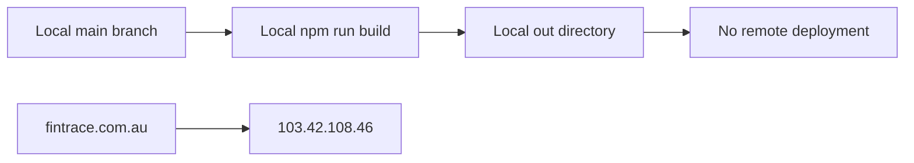

# FinTrace GitHub Pages Production Deployment Plan

<critical_warning>
> **CRITICAL WARNING:** `fintrace.com.au` currently resolves to `103.42.108.46`. The production cutover will replace that apex web-host record with GitHub Pages records. Preserve every Google Workspace MX record and all unrelated TXT records. If the cutover fails, restore the captured pre-change apex record without changing mail records.
</critical_warning>

<critical_warning>
> **CRITICAL WARNING:** `/internal-design/` and the candidate design routes will be unlinked and marked `noindex`, but they will not be private. The GitHub repository is public, and anyone who knows a route can open it. GitHub Pages does not provide access control for this setup.
</critical_warning>

<important_note>
> **IMPORTANT NOTE:** The user does not need to create a repository, GitHub token, Pages secret, deploy key, or API key. `Culpable/fintrace-root` is the public website repository, its `main` branch already contains the preserved local design-lab history, the local GitHub CLI is authenticated as `Culpable` with repository access, and GitHub Actions supplies deployment identity through `pages: write` plus `id-token: write`. The only likely user interruption is signing into the DNS control panel and approving 2FA if no reusable session exists.
</important_note>

## 1. Goal

Deploy the FinTrace static Next.js site to GitHub Pages at `https://fintrace.com.au/`, using the modern native GitHub Pages Actions workflow already proven by Bulma Root.

The public homepage must be the current Engine Network flagship. The design comparison gallery must move to `/internal-design/`; it and every non-production concept route must be absent from the sitemap, unlinked from the public homepage, and marked `noindex`.

The deployment must require the minimum possible user work:

| Responsibility | Owner |
| --- | --- |
| GitHub repository remote, commits, pushes, Pages configuration, workflow, deploy monitoring, custom-domain configuration, HTTPS enforcement | Agent |
| Route promotion, internal gallery move, metadata, sitemap, robots file, documentation, local and live validation | Agent |
| DNS record values, GitHub domain verification flow, propagation checks | Agent |
| DNS provider sign-in or 2FA approval, only if no existing authenticated session is available | User |
| API keys, GitHub secrets, deploy keys, personal access tokens | Not required |

The first live release must include the current validated Engine Network Round 5.1 and 5.2 working-tree changes so production matches the latest reviewed local state. Those pre-existing changes must be preserved and committed separately from deployment changes.

Overall success means:

- `https://fintrace.com.au/` serves the Engine Network homepage over enforced HTTPS.
- `https://www.fintrace.com.au/` redirects to the apex domain.
- A push to `main` automatically runs lint, builds the static export, uploads `out/`, and deploys it through GitHub Pages.
- `/internal-design/` links to all retained concepts, but neither the production homepage nor sitemap exposes the internal routes.
- Every internal route emits `noindex, nofollow` metadata.
- No user-supplied API key or repository secret exists for deployment.
- Existing Google Workspace mail routing remains unchanged.

---

## 2. Current State Analysis

### 2.1 FinTrace Application

- Repository root: `/Users/sacino/fintrace-root`.
- Local branch: `main`.
- Local Git remote: `git@github.com:Culpable/fintrace-root.git`.
- Remote repository: `https://github.com/Culpable/fintrace-root`.
- Remote state: public with the preserved website history on `main`; no Pages site is configured.
- Runtime: Node.js `22.23.1`, matching `package.json` and the local runtime.
- Static hosting prerequisites already exist in `next.config.ts`:
  - `output: 'export'`
  - `images.unoptimized: true`
  - `trailingSlash: true`
- `npm run build` outputs the site to `out/`.
- No `.github/workflows/` deployment workflow exists.
- No `robots.txt` or `sitemap.xml` source exists.
- No `metadataBase` or canonical production URL is configured.
- `src/app/page.tsx` currently renders the neutral design gallery.
- `src/app/engine-network/page.tsx` currently renders the chosen flagship.
- Every candidate design route is currently indexable.
- Every candidate design route links back to `/`, which currently means the gallery.

### 2.2 Current Working Tree

The working tree contains completed and validated Round 5.1 and 5.2 changes in:

- `src/app/engine-network/Scene.tsx`
- `documents/plans/fintrace_design_plan.md`
- `documents/learnings/engine_network_hero_rebalance_plan.md`

These changes must not be reverted, overwritten, or mixed into the deployment commit. They must be revalidated and recorded in their own scoped commit before the first production deployment.

### 2.3 Reference Implementations

#### Embeddings

- Repository: `/Users/sacino/embeddings`.
- Workflow: `.github/workflows/deploy.yml`.
- Pattern: legacy `peaceiris/actions-gh-pages` deployment to a `gh-pages` branch.
- Pages build type: `legacy`.
- Custom domain: `embeddings.au`.
- Repository Actions default permission: write.

#### Bulma Root

- Repository: `/Users/sacino/bulma-root`.
- Workflow: `.github/workflows/deploy.yml`.
- Pattern: native GitHub Pages artifact workflow using `actions/upload-pages-artifact` and `actions/deploy-pages`.
- Pages build type: `workflow`.
- Custom domain: `bulma.com.au`.
- Repository Actions default permission: read, with explicit workflow permissions.

The Bulma Root pattern is the correct source because it avoids a generated deployment branch, third-party deploy action, write-level repository default permissions, and a manually managed `GITHUB_TOKEN`.

### 2.4 Domain and DNS

- Target apex: `fintrace.com.au`.
- Current apex A record: `103.42.108.46`.
- Current nameservers: `ns1.nameserver.net.au`, `ns2.nameserver.net.au`, and `ns3.nameserver.net.au`.
- Registry registrar: Synergy Wholesale.
- No `www.fintrace.com.au` CNAME was observed.
- No apex AAAA record was observed.
- Google Workspace MX records exist and must be preserved:
  - Priority 1: `aspmx.l.google.com`
  - Priority 5: `alt1.aspmx.l.google.com`
  - Priority 5: `alt2.aspmx.l.google.com`
  - Priority 10: `alt3.aspmx.l.google.com`
  - Priority 10: `alt4.aspmx.l.google.com`
  - Priority 15: the existing Google verification MX host
- The current HTTPS endpoint does not complete a valid TLS handshake.

### 2.5 Current Flow



### 2.6 Core Problems

1. The local repository is not connected to its existing GitHub repository.
2. GitHub Pages is not enabled.
3. No automatic deployment workflow exists.
4. The public root route is still the internal comparison gallery.
5. Internal design routes lack indexing controls.
6. The production domain points to a different web host.
7. The site has no production canonical URL, sitemap, or robots metadata route.

### 2.7 Technical Constraints

- Preserve static export. Do not add server actions, API routes, middleware, runtime redirects, or runtime image optimisation.
- Keep `basePath` empty because the final site is hosted at the custom apex domain, not under `/fintrace-root/`.
- Preserve all existing route visual systems and WebGL behaviour.
- Use Server Components by default and keep browser logic in existing Client Components.
- Use the `vercel-react-best-practices` skill before implementing the React and Next.js route changes.
- Do not add reduced-motion conditionals.
- Do not edit generated `.next/` or `out/` files.
- Use `dev-browser` for required UI validation.
- Preserve unrelated collaborative changes.

### 2.8 Infrastructure That Can Be Reused

- FinTrace already produces a complete `out/` static export.
- The existing `package-lock.json` supports deterministic `npm ci`.
- GitHub CLI is authenticated as the repository owner.
- The remote repository already exists.
- Bulma Root provides a proven native Pages workflow structure.
- The Engine Network page already contains the complete production homepage.
- The current gallery already contains the full internal route register.

---

## 3. Desired State

### 3.1 Deployment Requirements

- **REQ-1 (MUST):** Preserve `origin` as `git@github.com:Culpable/fintrace-root.git` without changing the current `main` branch.
- **REQ-2 (MUST):** Configure GitHub Pages with `build_type: workflow`.
- **REQ-3 (MUST):** Deploy `out/` through a native GitHub Pages workflow triggered by pushes to `main` and by `workflow_dispatch`.
- **REQ-4 (MUST):** Use explicit workflow permissions:
  - `contents: read`
  - `pages: write`
  - `id-token: write`
- **REQ-5 (MUST):** Run `npm ci`, `npm run lint`, and `npm run build` before uploading the Pages artifact.
- **REQ-6 (MUST):** Pin the Actions workflow to Node.js `22.23.1`.
- **REQ-7 (MUST):** Use the `github-pages` deployment environment and expose `steps.deployment.outputs.page_url`.
- **REQ-8 (MUST):** Use deployment concurrency group `pages` with `cancel-in-progress: false`.
- **REQ-9 (MUST NOT):** Create a `gh-pages` branch.
- **REQ-10 (MUST NOT):** Add `peaceiris/actions-gh-pages`, the `gh-pages` npm package, a deploy key, a repository secret, or a user-provided API key.
- **REQ-11 (MUST NOT):** Add a `CNAME` file as deployment configuration. With a custom GitHub Actions Pages workflow, GitHub stores the custom domain in Pages settings and ignores `CNAME` files.

### 3.2 Public Route Requirements

- **REQ-12 (MUST):** Render the Engine Network flagship at `/`.
- **REQ-13 (MUST):** Keep the production root visually and behaviourally equivalent to the current `/engine-network/` page.
- **REQ-14 (MUST):** Remove the visible Design Lab chip from the production root.
- **REQ-15 (MUST):** Make the production header wordmark link to `/`.
- **REQ-16 (MUST):** Set the root canonical URL to `https://fintrace.com.au/`.
- **REQ-17 (MUST):** Set root metadata to production FinTrace wording, not Design Lab wording, using existing approved product claims.

### 3.3 Internal Design Route Requirements

- **REQ-18 (MUST):** Move the gallery to `/internal-design/`.
- **REQ-19 (MUST):** Keep all existing design routes available:
  - `/ledger/`
  - `/trace/`
  - `/clarity/`
  - `/engine/`
  - `/exhibit/`
  - `/chambers/`
  - `/engine-refined/`
  - `/engine-trace/`
  - `/engine-ledger/`
  - `/engine-network/`
  - `/engine-flow/`
- **REQ-20 (MUST):** Update every candidate route's Design Lab return link to `/internal-design/`.
- **REQ-21 (MUST):** Keep `/engine-network/` as the internal comparison URL while making its wordmark link to `/`.
- **REQ-22 (MUST):** Mark `/internal-design/` and all 11 candidate routes `noindex, nofollow`.
- **REQ-23 (MUST):** Add `noarchive` or the Next.js equivalent `nocache` to internal-route metadata.
- **REQ-24 (MUST):** Set `/engine-network/` canonical metadata to `https://fintrace.com.au/` because it duplicates the production root.
- **REQ-25 (MUST NOT):** Link to `/internal-design/` from the production root, header, footer, CTA, or public metadata.
- **REQ-26 (MUST NOT):** Add the internal gallery or any candidate route to the sitemap.

### 3.4 SEO Requirements

- **REQ-27 (MUST):** Set `metadataBase` to `https://fintrace.com.au`.
- **REQ-28 (MUST):** Generate `sitemap.xml` from `src/app/sitemap.ts` with exactly one URL: `https://fintrace.com.au/`.
- **REQ-29 (MUST):** Generate `robots.txt` from `src/app/robots.ts` and reference `https://fintrace.com.au/sitemap.xml`.
- **REQ-30 (MUST):** Allow crawlers to fetch internal routes so they can observe `noindex`; rely on route metadata and sitemap exclusion rather than `robots.txt` disallow rules.
- **REQ-31 (MUST):** Preserve trailing-slash output.

### 3.5 Domain Requirements

- **REQ-32 (MUST):** Verify `fintrace.com.au` under the `Culpable` GitHub account using GitHub's generated DNS TXT challenge before or during cutover.
- **REQ-33 (MUST):** Configure `fintrace.com.au` as the repository Pages custom domain.
- **REQ-34 (MUST):** Replace the current apex A record with all four GitHub Pages IPv4 records:
  - `185.199.108.153`
  - `185.199.109.153`
  - `185.199.110.153`
  - `185.199.111.153`
- **REQ-35 (MUST):** Add `www` as a CNAME pointing directly to `culpable.github.io`.
- **REQ-36 (MUST):** Preserve every MX and unrelated TXT record.
- **REQ-37 (MUST NOT):** Add a wildcard DNS record.
- **REQ-38 (MUST):** Enforce HTTPS only after GitHub reports the certificate approved and the DNS health check passes.
- **REQ-39 (MUST):** Confirm `www.fintrace.com.au` redirects to `https://fintrace.com.au/`.

### 3.6 Documentation Requirements

- **REQ-40 (MUST):** Update `AGENTS.md` so the production root and internal gallery locations are accurate.
- **REQ-41 (MUST):** Update `documents/plans/fintrace_design_plan.md` with the production route, internal route policy, GitHub repository, Pages workflow, domain, and deployment validation.
- **REQ-42 (MUST):** Update `README.md` with the live URL, deployment command flow, and route roles.
- **REQ-43 (MUST):** Update the `next.config.ts` comment so it describes active GitHub Pages deployment rather than a future possibility.

### 3.7 Defaults and Fallbacks

- **Default production URL:** `https://fintrace.com.au/`.
- **Default branch:** `main`.
- **Default publish source:** GitHub Actions artifact from `out/`.
- **Default public homepage:** Engine Network.
- **Default internal gallery:** `/internal-design/`.
- **Default canonical for duplicate Engine Network route:** `/`.
- **DNS fallback:** restore the captured pre-cutover apex A record `103.42.108.46` if GitHub Pages cannot serve the domain after the repository, workflow, Pages settings, and certificate checks have been exhausted.
- **Authentication fallback:** if the DNS control panel or GitHub web settings require a fresh login, pause only for the user to sign in or approve 2FA; continue all remaining configuration without asking the user to enter record values.
- **Pre-cutover verification:** use local static export and the successful Actions artifact. Do not add a temporary `/fintrace` base path solely to preview the project-site URL.

### 3.8 Verification Checklist

**Functional:**

- [ ] `/` renders Engine Network with no Design Lab link.
- [ ] `/internal-design/` renders the neutral gallery and links to all 11 retained routes.
- [ ] Every candidate route returns to `/internal-design/`.
- [ ] `/engine-network/` and `/` render the same flagship content.

**Indexing:**

- [ ] Root HTML is indexable and has canonical `https://fintrace.com.au/`.
- [ ] All 12 internal URLs emit `noindex, nofollow`.
- [ ] `sitemap.xml` contains only the production root.
- [ ] Root HTML contains no link to `/internal-design/`.

**Deployment:**

- [ ] Push to `main` triggers the Pages workflow.
- [ ] Workflow passes install, lint, build, artifact upload, and deploy.
- [ ] GitHub reports Pages `build_type: workflow`.
- [ ] No `gh-pages` branch exists.
- [ ] No deployment secret is added.

**Domain:**

- [ ] GitHub account reports `fintrace.com.au` verified.
- [ ] Apex resolves to the four GitHub Pages A records.
- [ ] `www` resolves through `culpable.github.io`.
- [ ] Existing Google Workspace MX records are unchanged.
- [ ] GitHub Pages DNS health passes.
- [ ] HTTPS is enforced and valid at the apex.
- [ ] `www` redirects to the apex.

**Quality:**

- [ ] `npm run lint` exits 0.
- [ ] `npm run build` exits 0 and produces the expected static files.
- [ ] `git diff --check` exits 0.
- [ ] Required local and live browser checks pass with zero page errors, console errors, or horizontal overflow.
- [ ] Documentation matches the deployed architecture.

---

## 4. Additional Context

### 4.1 User-Provided Decisions

- The user wants the same GitHub Pages outcome already used by Embeddings and Bulma Root.
- The user wants to do the minimum possible work and expects the agent to handle everything except unavoidable credentials or approval prompts.
- The target domain is `fintrace.com.au`.
- Engine Network must be the production homepage.
- The design lab and all other pages must remain available from `/internal-design/`.
- Internal pages must remain hidden from public navigation, marked `noindex`, and excluded from the sitemap.

### 4.2 Implementation Decisions

1. Use Bulma Root's native Pages architecture, updated to current official Pages action majors.
2. Do not copy Embeddings' legacy `gh-pages` branch deployment.
3. Do not add a `CNAME` file because custom Actions workflows use repository Pages settings for the domain.
4. Keep `basePath` empty because the custom apex is the production host, not `/fintrace-root/`.
5. Keep internal routes publicly reachable but unlinked and `noindex`; no password protection is added.
6. Reuse a single Engine Network presentation component for `/` and `/engine-network/` so production and internal comparison renders cannot drift.
7. Allow the shared presentation component to show the internal Design Lab chip only on `/engine-network/`, never on `/`.
8. Use a shared internal metadata constant so all internal routes receive the same robots policy.
9. Keep the existing product copy and visual system. This task does not add capabilities, proof claims, forms, analytics, or new marketing sections.
10. Preserve current Google Workspace mail DNS. The deployment does not create or verify the `hello@fintrace.com.au` mailbox.

### 4.3 Official Technical Sources

- GitHub custom Pages workflows: `https://docs.github.com/en/pages/getting-started-with-github-pages/using-custom-workflows-with-github-pages`
- GitHub custom domains: `https://docs.github.com/en/pages/configuring-a-custom-domain-for-your-github-pages-site/managing-a-custom-domain-for-your-github-pages-site`
- GitHub domain verification: `https://docs.github.com/en/pages/configuring-a-custom-domain-for-your-github-pages-site/verifying-your-custom-domain-for-github-pages`
- GitHub Pages REST API: `https://docs.github.com/en/rest/pages/pages`
- Next.js static exports: `https://nextjs.org/docs/app/guides/static-exports`
- Next.js trailing slashes: `https://nextjs.org/docs/app/api-reference/config/next-config-js/trailingSlash`

---

## 5. Implementation Plan

### Step 1: Preserve and Record the Current Reviewed Site State

**Objective:** Ensure the first deployment includes the validated Round 5.1 and 5.2 Engine Network work without overwriting or mixing it into deployment changes.

#### High-Level Approach

- Re-read `git status`, `git diff`, and the completed validation records before editing.
- Run the project validation gate against the existing working tree.
- Commit only the three existing Round 5.1 and 5.2 files in a dedicated scoped commit.
- Leave this deployment plan and all later deployment changes for separate commits.
- Do not revert, rename, or reformat unrelated files.

#### Success Criteria

- `npm run lint` exits 0 before deployment edits begin.
- `npm run build` exits 0 before deployment edits begin.
- `git diff --check` exits 0.
- The Round 5.1 and 5.2 commit contains only:
  - `src/app/engine-network/Scene.tsx`
  - `documents/plans/fintrace_design_plan.md`
  - `documents/learnings/engine_network_hero_rebalance_plan.md`
- `git status --short` no longer lists those three files after the scoped commit.
- No other pre-existing working-tree change is staged or committed.

### Step 2: Promote Engine Network to the Production Root

**Objective:** Serve the chosen Engine Network design at `/` while retaining `/engine-network/` for internal comparison without duplicating its implementation.

#### High-Level Approach

- Read and apply the `vercel-react-best-practices` skill before changing React or Next.js files.
- Extract the Engine Network page markup and static content from `src/app/engine-network/page.tsx` into a colocated Server Component such as `src/app/engine-network/EngineNetworkPage.tsx`.
- Give the shared component explicit presentation props:
  - Production home link is `/`.
  - Internal Design Lab chip visibility is controlled by a boolean.
  - Internal Design Lab chip destination is `/internal-design/`.
- Replace `src/app/page.tsx` with a production wrapper that renders the shared component without the Design Lab chip.
- Reduce `src/app/engine-network/page.tsx` to an internal route wrapper that renders the same component with the Design Lab chip.
- Keep `engine-network.css`, fonts, Hero, Scene, and all set-piece components colocated under `src/app/engine-network/`.
- Do not modify Engine Network animation timing, WebGL geometry, CSS, copy, or responsive behaviour.

#### Success Criteria

- `src/app/page.tsx` renders Engine Network and does not contain gallery markup.
- `src/app/engine-network/page.tsx` and `src/app/page.tsx` both render the same shared Engine Network Server Component.
- `/` contains no anchor whose destination is `/internal-design/`.
- `/engine-network/` contains exactly one Design Lab chip linking to `/internal-design/`.
- The Engine Network header wordmark links to `/` in both route contexts.
- `src/app/engine-network/Scene.tsx`, `Hero.tsx`, and `engine-network.css` receive no deployment-related behavioural change.
- Local browser screenshots at `1440x900` and `390x900` show `/` and `/engine-network/` with matching hero, section order, typography, colours, and WebGL rendering.

### Step 3: Move the Gallery and Mark Internal Routes

**Objective:** Retain the full design lab at `/internal-design/` while keeping it out of public navigation and search indexes.

#### High-Level Approach

- Move the current gallery implementation from `src/app/page.tsx` into `src/app/internal-design/page.tsx`.
- Move `src/app/gallery.css` to `src/app/internal-design/internal-design.css` and keep all styles under `.dsn-gallery`.
- Keep the current gallery content and links, including `/engine-network/` as the internal V4 comparison route.
- Add a shared metadata constant in `src/app/internal-design-metadata.ts` with:
  - `index: false`
  - `follow: false`
  - `nocache: true`
  - equivalent Googlebot settings
- Apply the shared internal robots policy to:
  - `src/app/internal-design/page.tsx`
  - `src/app/ledger/page.tsx`
  - `src/app/trace/page.tsx`
  - `src/app/clarity/page.tsx`
  - `src/app/engine/page.tsx`
  - `src/app/exhibit/page.tsx`
  - `src/app/chambers/page.tsx`
  - `src/app/engine-refined/page.tsx`
  - `src/app/engine-trace/page.tsx`
  - `src/app/engine-ledger/page.tsx`
  - `src/app/engine-network/page.tsx`
  - `src/app/engine-flow/page.tsx`
- Update every existing Design Lab chip or return link from `/` to `/internal-design/`.
- Set the internal `/engine-network/` canonical URL to `/`.

#### Success Criteria

- `npm run build` produces `out/internal-design/index.html`.
- `/internal-design/` contains links to all 11 candidate routes.
- All 11 candidate routes contain a return link to `/internal-design/`.
- Built HTML for `/internal-design/` and all 11 candidate routes contains robots metadata with `noindex` and `nofollow`.
- `out/engine-network/index.html` contains a canonical link for `https://fintrace.com.au/`.
- `out/index.html` contains no `/internal-design/` link.
- No candidate page visual copy, section order, animation, or CSS is changed except its Design Lab return URL.

### Step 4: Add Production Metadata, Robots, and Sitemap

**Objective:** Make only the production root discoverable and canonical.

#### High-Level Approach

- Update `src/app/layout.tsx`:
  - Set `metadataBase` to `new URL('https://fintrace.com.au')`.
  - Replace Design Lab default title and description with production FinTrace metadata grounded in existing Engine Network copy.
  - Keep `lang="en-AU"`.
- Define root metadata in `src/app/page.tsx`:
  - Production title.
  - Existing approved Engine Network description.
  - Canonical `/`.
  - Index and follow enabled.
- Add `src/app/sitemap.ts` returning exactly one entry for `https://fintrace.com.au/`.
- Add `src/app/robots.ts` that allows crawling and references `https://fintrace.com.au/sitemap.xml`.
- Keep internal routes crawlable so search engines can read their `noindex` tags.

#### Success Criteria

- `out/index.html` contains canonical `https://fintrace.com.au/`.
- `out/index.html` does not contain a `noindex` robots directive.
- `out/index.html` does not use a Design Lab page title.
- `out/sitemap.xml` contains exactly one `<url>` and exactly one `<loc>https://fintrace.com.au/</loc>`.
- `out/sitemap.xml` contains none of the internal route names.
- `out/robots.txt` references `https://fintrace.com.au/sitemap.xml`.
- `out/robots.txt` does not disallow the internal routes.

### Step 5: Synchronise Project Documentation

**Objective:** Make repository policy and system documentation match the new production architecture.

#### High-Level Approach

- Update `AGENTS.md`:
  - Production root is Engine Network.
  - Gallery is `/internal-design/`.
  - Gallery styling remains neutral and route-scoped.
  - Internal routes are public but unlinked and `noindex`.
  - Deployment environment is GitHub Pages at `fintrace.com.au`.
- Update `documents/plans/fintrace_design_plan.md`:
  - Record the user decision to promote Engine Network.
  - Update route inventory and navigation behaviour.
  - Record GitHub repository and Pages workflow.
  - Record domain, SEO policy, DNS safety, and completed validation.
  - Remove statements saying no deployment or remote exists.
- Update `README.md`:
  - Add the production URL.
  - Explain automatic deployment on pushes to `main`.
  - Describe `/` as Engine Network and `/internal-design/` as the unindexed comparison gallery.
  - Keep development commands accurate.
- Update the comment in `next.config.ts` to state that the static export is actively deployed to GitHub Pages.
- During execution, update this plan using the `track-implementation-plan-file` skill and apply completion markers only after each step's required validation passes.

#### Success Criteria

- `AGENTS.md`, `README.md`, `documents/plans/fintrace_design_plan.md`, and `next.config.ts` agree on:
  - Public root route.
  - Internal gallery route.
  - Static export.
  - GitHub Pages.
  - `fintrace.com.au`.
- No documentation claims the repository is local-only, lacks a remote, or lacks deployment after deployment is complete.
- No documentation describes the gallery as `/`.
- Documentation explicitly warns that noindex is not access control.
- `git diff --check` exits 0 after documentation updates.

### Step 6: Verify the Remote Repository and Enable Pages

**Objective:** Verify the preserved local history in the existing website repository and enable native workflow publishing without generating a failed Pages deployment.

#### High-Level Approach

- Verify the SSH remote:
  - `git remote get-url origin` must return `git@github.com:Culpable/fintrace-root.git`.
- Commit the route, SEO, and documentation readiness changes without the deployment workflow.
- Push the readiness commit to the established remote and preserve upstream tracking.
- Confirm the remote default branch is `main`.
- Create the Pages site through the GitHub Pages REST API with `build_type: workflow`.
- Confirm repository Actions default permission remains `read`.
- Do not create or configure a `gh-pages` branch.

#### Success Criteria

- `git remote -v` lists `origin` as `git@github.com:Culpable/fintrace-root.git` for fetch and push.
- `git status --branch --short` shows `main...origin/main`.
- `git ls-remote origin refs/heads/main` returns the pushed main commit.
- `gh api repos/Culpable/fintrace-root/pages` returns `build_type: workflow`.
- `gh api repos/Culpable/fintrace-root` returns `has_pages: true`.
- `git branch -a` contains no local or remote `gh-pages` branch.
- GitHub repository secrets contain no deployment secret added by this task.

### Step 7: Add the Native GitHub Pages Workflow

**Objective:** Automatically validate, build, and deploy every push to `main` using GitHub's first-party Pages pipeline.

#### High-Level Approach

- Create `.github/workflows/deploy.yml`.
- Use this workflow contract:
  - Name: `Deploy to GitHub Pages`.
  - Triggers: push to `main` and `workflow_dispatch`.
  - Permissions: `contents: read`, `pages: write`, `id-token: write`.
  - Concurrency: group `pages`, `cancel-in-progress: false`.
  - Build runner: `ubuntu-latest`.
  - Checkout: `actions/checkout@v4`.
  - Node setup: `actions/setup-node@v4`.
  - Node version: `22.23.1`.
  - npm cache: enabled with `package-lock.json`.
  - Pages setup: `actions/configure-pages@v5`.
  - Install: `npm ci`.
  - Validation: `npm run lint`.
  - Build: `npm run build`.
  - Artifact: `actions/upload-pages-artifact@v4` with path `out`.
  - Deploy: `actions/deploy-pages@v4`.
  - Environment: `github-pages`.
- Commit the workflow separately and push it to `main`.
- Monitor the triggered run to completion.

#### Success Criteria

- `.github/workflows/deploy.yml` matches the required trigger, permission, concurrency, build, artifact, and deploy contract.
- The workflow contains no user secret reference and no third-party deployment action.
- The first push containing the workflow triggers one Pages run on `main`.
- The workflow install, lint, build, upload, and deploy steps all conclude `success`.
- `gh run view` reports the deployed environment as `github-pages`.
- The Pages API reports status `built`.
- The deployed artifact contains `index.html`, `404.html`, `robots.txt`, `sitemap.xml`, `_next/`, and `internal-design/index.html`.

### Step 8: Verify the Domain and Cut DNS to GitHub Pages

**Objective:** Securely attach `fintrace.com.au`, preserve mail, and enable HTTPS with a reversible DNS change.

#### High-Level Approach

1. Capture the current DNS records through authoritative and public resolvers:
   - Apex A.
   - Apex AAAA.
   - `www` CNAME.
   - MX.
   - TXT.
   - CAA.
2. Use the authenticated GitHub browser session to open the `Culpable` profile Pages settings and add `fintrace.com.au` as a verified domain.
3. Add the exact GitHub-generated verification TXT host and value in the DNS provider.
4. Confirm the TXT record with `dig`, then complete GitHub verification and leave the TXT record in place.
5. Set the repository Pages custom domain to `fintrace.com.au` through the Pages API.
6. Replace the current apex A record `103.42.108.46` with the four GitHub Pages A records.
7. Add `www` CNAME `culpable.github.io`.
8. Do not change MX or unrelated TXT records.
9. Poll public DNS and the GitHub Pages health endpoint.
10. Poll the Pages certificate state.
11. Enable `https_enforced: true` only after the certificate state is approved.

If the DNS provider requires a new login, ask the user only to sign in or approve 2FA. Do not ask the user to determine record types, names, values, or deletion scope.

#### Success Criteria

- The GitHub profile Pages settings show `fintrace.com.au` as verified.
- The verification TXT record remains published.
- `gh api repos/Culpable/fintrace-root/pages` returns:
  - `cname: fintrace.com.au`
  - `build_type: workflow`
  - certificate state `approved`
  - `https_enforced: true`
- Public DNS returns exactly the four required GitHub Pages IPv4 addresses for the apex.
- Public DNS returns `culpable.github.io.` for the `www` CNAME.
- The six existing Google Workspace MX records remain present with the same priorities and hosts.
- No wildcard record is introduced.
- `gh api repos/Culpable/fintrace-root/pages/health` returns a passing DNS result.
- `curl -I https://fintrace.com.au/` completes with a valid certificate and an HTTP success response.
- `curl -I https://www.fintrace.com.au/` redirects to `https://fintrace.com.au/`.
- If the cutover must be reversed, restoring `103.42.108.46` returns the apex DNS to the recorded pre-change state without changing MX records.

### Step 9: Complete Local and Live Browser Verification

**Objective:** Prove the route promotion, internal design access, responsive behaviour, WebGL rendering, indexing controls, and live Pages delivery.

#### High-Level Approach

- Read and use the `dev-browser` skill.
- Follow the repository server policy:
  - Check `http://localhost:3004`.
  - Reuse the existing matching server.
  - Start `npm run dev` only if unavailable.
- Validate every changed route at `1440x900` and `390x900`.
- Use headed real-GPU Chromium for Engine Network.
- For the production root and internal Engine Network route:
  - Compare hero and section rendering.
  - Check WebGL canvas and static fallback transition.
  - Check fixed header, focus, navigation, animation, and overflow.
- For `/internal-design/`:
  - Check all 11 links.
  - Confirm the gallery remains visually neutral.
- For each candidate route:
  - Check the Design Lab return link resolves to `/internal-design/`.
  - Check zero console errors, page errors, and horizontal overflow.
- Repeat production-root checks against `https://fintrace.com.au/` after DNS and HTTPS complete.
- Scroll reveal, lazy, sticky, and fixed elements into view and let layout settle.

#### Success Criteria

- `npm run lint` exits 0 after all implementation changes.
- `npm run build` exits 0 and exports every retained route.
- `git diff --check` exits 0.
- Local `/` passes at `1440x900` and `390x900` with:
  - Engine Network visible.
  - One WebGL canvas after load.
  - Static fallback visible before or if WebGL is unavailable.
  - No Design Lab link.
  - No clipping or horizontal overflow.
  - Zero console and page errors.
- Local `/engine-network/` matches `/` at both viewports and contains the internal Design Lab chip.
- Local `/internal-design/` passes at both viewports and exposes 11 working design links.
- All 11 candidate routes pass at both viewports with return links to `/internal-design/`, zero errors, and zero horizontal overflow.
- Live `https://fintrace.com.au/` passes at `1440x900` and `390x900` with the same public-root assertions.
- Live `https://www.fintrace.com.au/` resolves through the expected redirect.
- No screenshot contains credentials, DNS values from an authenticated control panel, or environment secrets.

### Step 10: Verify the Deployed Contract and Hand Off

**Objective:** Confirm future pushes are automatic and provide a self-contained completion record.

#### High-Level Approach

- Re-read repository, Pages, workflow, domain, and DNS state after the live browser checks.
- Confirm the successful workflow was triggered by a push to `main`.
- Confirm no generated deployment branch exists.
- Confirm no deployment secrets or third-party deployment dependencies were added.
- Update `documents/plans/fintrace_design_plan.md` and this plan with final observed results.
- Run the `post-change-documentation-sync` skill because implementation changes the documented system architecture.
- Create the required post-work response report if the completed implementation benefits from navigable deployment evidence.
- Commit final documentation updates and push `main`.
- Monitor the documentation push's automatic deployment to prove the recurring path still works.

#### Success Criteria

- A second push to `main` triggers and completes the same Pages workflow without manual intervention.
- The Pages API still reports `status: built`, `build_type: workflow`, `cname: fintrace.com.au`, and `https_enforced: true`.
- `git branch -a` still contains no `gh-pages`.
- No repository deployment secret exists.
- Final documentation records:
  - Commit and workflow run.
  - Live apex and `www` behaviour.
  - DNS records changed and records preserved.
  - Local and live browser viewport results.
  - Lint, build, and static artefact assertion results.
  - Any user action that was actually required.
- The final response states that no API key was required and names any remaining user action. If the DNS and GitHub sessions were already authenticated, the remaining user action is none.

---

## 6. Testing Plan

### 6.1 Source-of-Truth Artefacts

No bug-specific regression input exists. The following files and external states are the source of truth for deployment parity and cutover safety:

| Artefact | Why It Matters | Expected Post-Implementation Behaviour |
| --- | --- | --- |
| `/Users/sacino/bulma-root/.github/workflows/deploy.yml` | Proven native Pages workflow in the same workspace | FinTrace uses the same build-artifact-deploy architecture, updated to current action majors and root working directory |
| `/Users/sacino/embeddings/.github/workflows/deploy.yml` | Proven legacy Pages workflow | FinTrace does not copy its `gh-pages` branch or third-party deploy action |
| `/Users/sacino/fintrace-root/next.config.ts` | Static export contract | `output`, `images.unoptimized`, and `trailingSlash` remain enabled |
| `/Users/sacino/fintrace-root/src/app/engine-network/page.tsx` | Current flagship source | Production `/` renders the same page through one shared component |
| `/Users/sacino/fintrace-root/src/app/page.tsx` | Current gallery source | Gallery content moves intact to `/internal-design/` |
| GitHub repository `Culpable/fintrace-root` | Existing remote target | Contains local history, uses `main`, Pages workflow enabled, no `gh-pages` branch |
| Current apex A `103.42.108.46` | DNS rollback source | Replaced only after capture; retained as the exact rollback value |
| Current Google Workspace MX set | Mail safety source | Remains unchanged after web-host cutover |
| User route decision | Product routing source | Engine Network at `/`; unlinked noindex lab at `/internal-design/` |

### 6.2 Static Artefact Assertions

No new unit test framework is required. The repository has no automated unit or Playwright suite, and the deployment contract is better verified through generated static files, GitHub Actions, DNS, and browser checks.

Run these assertions after `npm run build`:

1. Confirm required files:
   - `out/index.html`
   - `out/404.html`
   - `out/robots.txt`
   - `out/sitemap.xml`
   - `out/internal-design/index.html`
   - Each retained route's `index.html`
2. Confirm root indexing:
   - Root canonical is `https://fintrace.com.au/`.
   - Root does not contain `noindex`.
   - Root does not contain a link to `/internal-design/`.
3. Confirm internal indexing:
   - Every internal route contains `noindex`.
   - Every internal route contains `nofollow`.
4. Confirm sitemap:
   - Exactly one `<url>` entry.
   - No internal route strings.
5. Confirm gallery:
   - `/internal-design/` contains all 11 expected route hrefs.
6. Confirm duplicate handling:
   - `/engine-network/` canonical is the production root.

### 6.3 Local Validation Commands

```bash
npm run lint
npm run build
git diff --check
```

Expected:

- ESLint exits 0 with zero errors.
- Next.js completes the static export.
- Build output includes root, internal gallery, all retained concepts, robots, sitemap, 404, and icon routes.
- Git reports no whitespace errors.

### 6.4 GitHub Integration Scenarios

1. **Initial source push**
   - Action: Push readiness commits to `Culpable/fintrace-root`.
   - Expected: Remote `main` matches local `main`.
   - Verify: `git ls-remote`, GitHub repository API, and `git status --branch`.
2. **Pages enablement**
   - Action: Create the Pages site with `build_type: workflow`.
   - Expected: Pages API returns the workflow build type.
   - Verify: `gh api repos/Culpable/fintrace-root/pages`.
3. **Workflow push**
   - Action: Push `.github/workflows/deploy.yml`.
   - Expected: One workflow run starts from the `main` push and completes successfully.
   - Verify: `gh run list`, `gh run watch`, and `gh run view`.
4. **Recurring deployment**
   - Action: Push the final documentation commit.
   - Expected: The same workflow runs automatically without settings changes or manual dispatch.
   - Verify: A second successful push-triggered run and unchanged live site.

### 6.5 DNS and HTTPS Scenarios

1. **Domain verification**
   - Action: Publish GitHub's generated TXT record.
   - Expected: GitHub profile shows the domain verified.
   - Verify: Public `dig` result and GitHub Pages profile settings.
2. **Apex cutover**
   - Action: Replace `103.42.108.46` with the four GitHub Pages IPv4 records.
   - Expected: Public resolvers return only those four addresses.
   - Verify: `dig` through authoritative, Cloudflare, and Google resolvers.
3. **www redirect**
   - Action: Add `www` CNAME to `culpable.github.io`.
   - Expected: `https://www.fintrace.com.au/` redirects to the apex.
   - Verify: DNS lookup and `curl -I`.
4. **Mail preservation**
   - Action: Re-query MX after cutover.
   - Expected: All six Google Workspace MX records match the captured pre-change set.
   - Verify: Sorted before and after DNS outputs.
5. **HTTPS**
   - Action: Enable HTTPS after certificate approval.
   - Expected: Valid certificate, no TLS error, apex response succeeds.
   - Verify: Pages API, `curl -I`, and live browser.

### 6.6 Browser Matrix

| Route Group | Viewports | Required Checks |
| --- | --- | --- |
| `/` | `1440x900`, `390x900` | Engine Network parity, WebGL, fallback, fixed header, focus, animation, no internal link, no overflow, zero errors |
| `/engine-network/` | `1440x900`, `390x900` | Same flagship render, internal chip present, chip target correct, zero errors |
| `/internal-design/` | `1440x900`, `390x900` | Neutral gallery, 11 links, focus, no clipping, zero errors |
| Other 10 candidate routes | `1440x900`, `390x900` | Return link target, scroll/fixed behaviour, overflow, console/page errors |
| Live `https://fintrace.com.au/` | `1440x900`, `390x900` | Same production-root checks over Pages and HTTPS |

### 6.7 Final Pass Conditions

The implementation is complete only when:

- All local validation commands pass.
- All generated HTML and sitemap assertions pass.
- Both push-triggered GitHub Pages runs pass.
- Domain verification, DNS health, certificate approval, and HTTPS enforcement pass.
- Google Workspace MX records are unchanged.
- Every required local and live browser route passes at both required viewports.
- Documentation is synchronised.
- No user-provided API key, repository secret, deploy key, or `gh-pages` branch was introduced.
