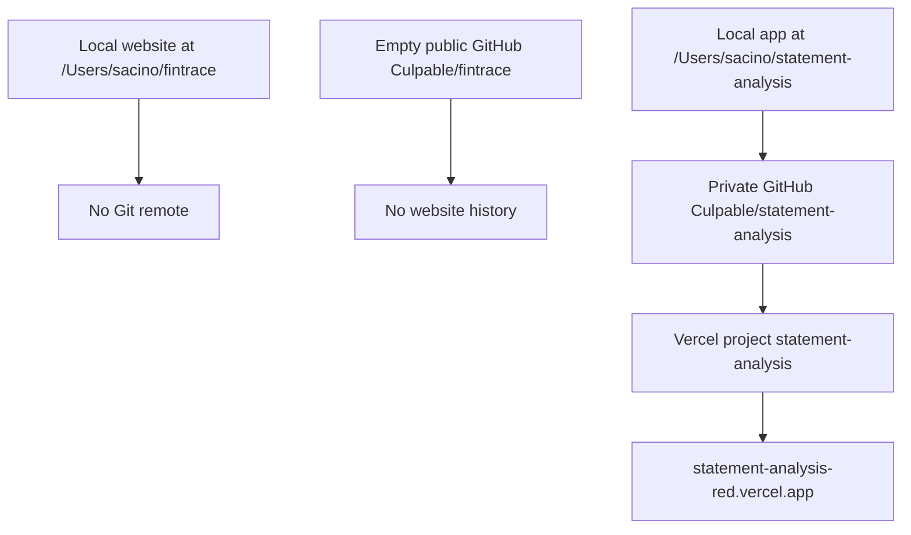

# FinTrace Repository, Path, GitHub, and Vercel Migration Plan

<critical_warning>
> **CRITICAL WARNING:** This migration must preserve both repositories, every committed Git object, every current working-tree change, ignored local data, the Statement Analysis production deployment, Vercel environment variables, Vercel domains, GitHub Actions history, GitHub secrets, GitHub environments, Beads data, and local pipeline artefacts. Do not delete or recreate either GitHub repository or the Vercel project. Do not use `git reset`, `git restore`, `git clean`, `git stash`, force-push, history rewriting, or permanent file deletion.
</critical_warning>

<critical_warning>
> **CRITICAL WARNING:** `Culpable/fintrace` is currently the empty public repository intended for the front-facing site, while `Culpable/statement-analysis` is the private application repository. The only safe GitHub order is to rename the empty public repository to `fintrace-root` first, then immediately rename the private application repository to `fintrace`. GitHub's redirect from the old `Culpable/fintrace` URL must not be relied on because that name will be reused by the application.
</critical_warning>

<critical_warning>
> **CRITICAL WARNING:** `https://fintrace.vercel.app` already resolves to an unrelated application and must never be used, assigned, presented as this project's domain, or written into `SA_PRODUCTION_API_URL`. The expected project-scoped candidate is `https://fintrace-jakes-projects-6b9958d5.vercel.app`, but it may be adopted only if Vercel assigns it to project ID `prj_equ0dpAv6bnn2xe7U1QjkQAzbqed` and the verified post-rename production deployment.
</critical_warning>

<critical_warning>
> **CRITICAL WARNING:** The app's root `.env` contains database and external-provider configuration, and some CLI modules imported by tests call the repository environment loader. Never run local tests, browser API operations, migrations, seeds, or processing commands with that file or inherited production credentials available. Use the isolated validation protocol in Section 6.5 and restore the exact `.env` bytes after every command.
</critical_warning>

<important_note>
> **IMPORTANT NOTE:** The user selected a full Vercel project rename, full local mirrors plus Git bundles, and preservation of historical or data-bearing Statement Analysis identifiers. Keep Beads issue IDs, the `statement-analysis` Beads prefix, blob object prefixes, database names, LangSmith project names, `SA_` GitHub secret names, historical artefacts, and legacy deployment records unchanged. Rename active repository, path, package, hosting, documentation, and product-facing identity references.
</important_note>

<important_note>
> **IMPORTANT NOTE:** Sizes, working-tree changes, object counts, deployment counts, environment-variable counts, aliases, and service availability in the Current State section are planning-audit observations, not constants. Re-query every mutable value immediately before execution and use the protected baseline manifests as the comparison source. Immutable repository and project IDs remain hard safety anchors.
</important_note>

## 1. Goal

Reorganise the two FinTrace repositories so they follow the same app-versus-root convention used by Bulma:

| Purpose | Current local path | Target local path | Current GitHub | Target GitHub |
| --- | --- | --- | --- | --- |
| Actual application | `/Users/sacino/statement-analysis` | `/Users/sacino/fintrace` | `Culpable/statement-analysis` | `Culpable/fintrace` |
| Front-facing website | `/Users/sacino/fintrace` | `/Users/sacino/fintrace-root` | Empty `Culpable/fintrace` target | `Culpable/fintrace-root` |

The agent must perform every safe local, GitHub, Vercel, documentation, validation, commit, and push action. User involvement is limited to authentication or two-factor approval if an existing GitHub or Vercel session cannot complete a required operation.

Overall success means:

- The application exists locally at `/Users/sacino/fintrace` and on GitHub as private repository `Culpable/fintrace`.
- The front-facing website exists locally at `/Users/sacino/fintrace-root` and on GitHub as public repository `Culpable/fintrace-root`.
- Both repositories retain their original Git histories, branches, working-tree changes, ignored files, file permissions, symlinks, and local artefacts.
- The application GitHub repository retains repository ID `1130187328`, its `main` branch history, merged pull request, Actions history, deployment history, secrets, environments, and visibility.
- The front-facing GitHub repository retains repository ID `1302542539` and public visibility, then receives the existing local website history.
- The existing Vercel project retains project ID `prj_equ0dpAv6bnn2xe7U1QjkQAzbqed`, team ID `team_CYuOZqt8EwNdBDVJSGRoE7Fh`, deployments, environment variables, domains, integrations, and production data while its project name changes from `statement-analysis` to `fintrace`.
- The existing production alias `statement-analysis-red.vercel.app` remains available as a tested fallback until a FinTrace-named production alias is verified and adopted.
- Infrastructure is migrated and proven before visible application branding changes from Statement Analysis to FinTrace.
- No database migration, data mutation, storage namespace migration, production reset, or destructive Git operation occurs.
- Verified pre-migration mirrors and Git bundles remain available after completion and are not deleted by this task.

---

## 2. Current State Analysis

### 2.1 Local Repositories

#### Front-facing website

- Current root: `/Users/sacino/fintrace`.
- Branch: `main`.
- Git remote: none.
- The planning-audit `HEAD` is `207068b0d306ad1695393a8ba6fdffc07d0e413f`.
- The planning-audit working tree contains this untracked migration plan. Collaborators may add or remove other changes before execution, so the live status must be recaptured.
- The repository is approximately `1.2G`, including ignored `.next`, `node_modules`, and `out` directories.
- It is a Next.js static-export design lab.
- Its package engine requires Node `>=22.23.1 <23`; Node 22.23.1 is installed through NVM.
- `documents/todo/fintrace_github_pages_deployment_plan.md` currently targets `Culpable/fintrace` and `/Users/sacino/fintrace`; that plan will become inaccurate after this migration unless it is retargeted to `fintrace-root`.
- Current path-sensitive active files include:
  - `AGENTS.md`
  - `documents/plans/fintrace_design_plan.md`
  - `documents/todo/engine_network_hero_rebalance_plan.md`
  - `documents/todo/fintrace_github_pages_deployment_plan.md`
  - `package.json`
  - `package-lock.json`

#### Actual application

- Current root: `/Users/sacino/statement-analysis`.
- Branch: `main`, tracking `origin/main`.
- Current origin: `git@github.com:Culpable/statement-analysis.git`.
- The planning-audit `HEAD` is `600c928fd4a61cbc8238c899f30c784a55ddc381`, matching `origin/main`.
- The planning-audit working tree contains unstaged visualisation work in:
  - `documents/visualizations/README.md`
  - `documents/visualizations/export_pngs.ts`
  - `documents/visualizations/export_sample_pngs.ts`
  - `documents/visualizations/verify_chart_14_16_layout.mjs`
- These changes must not be reverted, overwritten, or committed as part of the migration. Some contain active absolute paths, so migration edits may need to share a file with pre-existing user work.
- The repository is approximately `3.4G`, including:
  - A `1.2G` Python virtual environment.
  - Application workspaces and local uploads.
  - A `663M` Git directory.
  - Production input and analysis artefacts.
  - A `25M` Beads workspace.
- The repository has no untracked non-ignored files, but it has a large ignored local state that Git alone cannot preserve.
- The repository contains a Beads-managed linked worktree at `.git/beads-worktrees/main`.
- That worktree stores absolute references to `/Users/sacino/statement-analysis` and requires `git worktree repair` after the directory move.
- The Beads daemon currently identifies its workspace as `~/statement-analysis`.
- The running daemon owns `.beads/bd.sock`. macOS `ditto` ignores sockets, so `bd daemon stop` must remove this socket before the mirror is accepted.
- The Python virtual environment contains executable shebangs pointing to `/Users/sacino/statement-analysis/venv/bin/python`; moving the directory does not make that environment portable.
- The app's `.nvmrc`, runtime check, and CI require exact Node 22.13.0, which is distinct from the website's Node requirement.
- `.gitignore` ignores `venv/*`, not sibling names such as `venv-statement-analysis-preserved/*`. Keeping the old environment under a renamed directory inside the repository would therefore expose approximately `1.2G` as untracked files. Preserve it outside the active repository.
- No symlink target found during planning used either old repository root as an absolute target. Re-run this check before the move because ignored dependency trees can change.
- The app's visible product name remains Statement Analysis in its page title, sign-in card, application shell, navigation accessibility labels, tests, README, and design system.

### 2.2 GitHub State

| Property | Application repository | Front-facing repository |
| --- | --- | --- |
| Current name | `Culpable/statement-analysis` | `Culpable/fintrace` |
| Repository ID | `1130187328` | `1302542539` |
| Visibility | Private | Public |
| Default branch | `main` | `main` configured, but no Git refs exist |
| Data state | Full application history | Completely empty |
| Pages | Disabled | Disabled |
| Releases | None | None |
| Tags | None | None |

The application repository currently has:

- One merged pull request that must remain accessible after the rename.
- Two active workflow definitions: `CI` and `Process production jobs`.
- A planning-audit set of 128 GitHub Actions run IDs.
- A planning-audit set of 264 GitHub deployment IDs created primarily by Vercel.
- Repository secrets `SA_CRON_SECRET` and `SA_PRODUCTION_API_URL`.
- Environments `Preview`, `Production`, `Production – statement-analysis`, and `Production – statement-analysis-red`.
- A scheduled production-worker workflow running every five minutes.
- No GitHub Pages site, deploy keys, or repository webhooks.
- Authenticated GitHub permissions report `admin: true` and `push: true` for both repositories.
- The planning audit found no `action.yml`, `action.yaml`, or `workflow_call` trigger in the app repository, so its current default branch does not expose a callable GitHub Action or reusable workflow. The consumer search remains mandatory because branches or collaborating repositories may change before execution.
- Organisation-wide GitHub code search found no current `Culpable/statement-analysis` action or reusable-workflow consumer. This must be repeated at execution because GitHub does not redirect `uses:` references after a repository rename.

GitHub automatically redirects ordinary repository web and Git traffic after a rename, but the old empty `Culpable/fintrace` redirect will stop being usable when the application takes that name. Every local remote, integration, document, and deployment configuration must therefore use the new explicit URLs.

### 2.3 Vercel State

The application is linked to one existing Vercel project:

| Property | Current value | Required post-migration value |
| --- | --- | --- |
| Project ID | `prj_equ0dpAv6bnn2xe7U1QjkQAzbqed` | Unchanged |
| Team ID | `team_CYuOZqt8EwNdBDVJSGRoE7Fh` | Unchanged |
| Project name | `statement-analysis` | `fintrace` |
| GitHub repository ID | `1130187328` | Unchanged |
| GitHub repository slug | `statement-analysis` | `fintrace` |
| Git link `sourceless` | `true` | Unchanged |
| Production branch | `main` | Unchanged |
| Current stable domain | `statement-analysis-red.vercel.app` | Preserved as fallback |
| Node.js version | `22.x` | Unchanged |
| Current deployment plan | `pro` | Unchanged |
| Vercel team slug | `jakes-projects-6b9958d5` | Unchanged |

The planning audit found 24 environment-variable records across production, preview, and development targets. Their values must never be printed, copied into the plan, or recreated manually. Their IDs, keys, types, target assignments, branch assignments, custom-environment assignments, configuration IDs, and secret-safe content-hint IDs must be captured before migration and compared after migration. The execution-time baseline count and ID set, not the planning count of 24, define the preservation requirement.

The current environment keys include production credentials, database connection variables, blob access, API authentication, cron authentication, OpenAI, and Datalab settings. Their content hints currently identify Neon integration store `store_G0m2vPwyEX7PjV63`, integration configuration `icfg_WiAlRD3UlbxJA3uDDfCD6lil`, and Blob store `store_FD2DcaPIrspwdXln`. Renaming must update the existing Vercel project in place. Creating a replacement project would risk losing deployment history, aliases, environment variables, project integration state, and storage associations.

The latest production deployment currently has these aliases:

- Stable custom project domain: `statement-analysis-red.vercel.app`.
- Automatic project alias: `statement-analysis-jakes-projects-6b9958d5.vercel.app`.
- Automatic production-branch alias: `statement-analysis-git-main-jakes-projects-6b9958d5.vercel.app`.

After the project rename, the expected stable automatic candidate is `fintrace-jakes-projects-6b9958d5.vercel.app`. Vercel `.vercel.app` names are allocated on a first-come basis, and `fintrace.vercel.app` is already occupied by an unrelated application. Do not infer ownership from branding or an HTTP 200 response; verify alias-to-deployment and deployment-to-project identity through Vercel metadata.

No callable Vercel MCP resource or Vercel CLI executable was available during planning. An authenticated Vercel CLI token and linked `.vercel/project.json` do exist locally. During execution, use capabilities in this order:

1. A Vercel plugin or MCP integration if one is available in the execution environment.
2. The authenticated Vercel REST API using the existing project and team IDs.
3. The authenticated Vercel dashboard through the in-app browser.
4. The Vercel CLI through `npx` only if the first three methods cannot complete Git connection verification.

The planning audit verified `vercel` CLI `56.2.1` as the current npm release. Pin that exact version if the CLI fallback is required; do not run an unversioned or automatically newer package during the migration.

### 2.4 Path-Sensitive Systems

The migration affects more than the two directory names:

- `/Users/sacino/AGENTS.md` contains the workspace project catalogue and the old Statement Analysis path.
- `/Users/sacino/.codex/config.toml` trusts both old directory paths.
- The planning audit found no old-path or old-repository match in `.zshrc`, `.zprofile`, `.gitconfig`, `.ssh/config`, `~/.config`, or Cursor user settings. Recheck these active configuration locations at execution rather than assuming the result remains true.
- The front-facing repository policy and design plan contain absolute cross-repository paths.
- The front-facing GitHub Pages deployment plan contains the old website path and GitHub repository.
- The planning audit found no operational absolute path or GitHub URL from `/Users/sacino/fraud-detection` to the app. Its existing Statement Analysis wording describes historical input provenance and is not a path dependency.
- The app's README, AGENTS policy, Marker guide, shortcuts, report-graph guide, visualisation scripts, and package manifests contain old path or repository identity references.
- The app's nested Beads worktree contains absolute Git administrative paths.
- The app's Beads daemon records the current workspace path.
- The app has local Beads `pre-commit` and `post-merge` hooks under `.git/hooks`. The pre-commit hook runs `bd sync --flush-only` and can stage `.beads/issues.jsonl`, so every app commit must quiesce Beads, pre-flush the same state, review the final index, and inspect the resulting commit.
- The Python virtual environment is non-portable because installed console scripts have absolute shebangs.
- The app ignores only `venv/*`; a differently named preserved environment inside the repository would become visible as untracked data.
- `.vercel/project.json` identifies the existing Vercel project name and IDs.
- Cursor, Claude, and Codex retain historical session records under old path-derived folders. These history and cache records are not operational configuration and must not be mass-rewritten.
- Historical Beads issues, uploads, analysis outputs, learnings, token-count files, and generated deployment artefacts contain old paths. They are historical evidence and must not be rewritten merely for cosmetic consistency.

### 2.5 Current Flow



### 2.6 The Core Risk

The names must be swapped across local directories and GitHub without overwriting either source. The application also carries production hosting, credentials, schedules, storage references, a database connection, local ignored data, a non-portable Python environment, and path-sensitive Beads worktree metadata.

A rename-only approach without verified mirrors would protect committed Git history but would not protect ignored uploads, `.env` files, local Vercel state, Python packages, production inputs, analysis outputs, Beads databases, generated artefacts, or current working-tree changes. A replacement Vercel project would protect neither deployment history nor environment-variable continuity.

### 2.7 Technical and Operational Constraints

- Preserve both current working trees exactly, including pre-existing changes owned by the user or other collaborators.
- Use `trash`, never `rm`, if an unexpected removal becomes necessary. This plan does not require removal.
- Do not stop healthy pre-existing development servers that were not started by the migration. If one references either source directory, pause before the move and ask the user to close it.
- Stop the Beads daemon through `bd daemon stop` before copying or moving the app.
- Confirm `.beads/bd.sock` is absent after stopping Beads because `ditto` ignores sockets and pipes.
- Run the migration from `/Users/sacino` when renaming directories so neither source directory is the shell's active working directory.
- Use explicit absolute `workdir` or `git -C` arguments for every command after the first directory move. The active Codex task was opened from the website repository, so inherited working-directory state may become stale when that path is reassigned to the app.
- Fail closed if `/Users/sacino/fintrace-root`, any backup destination, or the preserved-venv destination exists before its corresponding move or copy. `ditto` merges existing directories and `mv` can nest a source inside an existing destination, so existence is not harmless.
- Keep the default branch `main`; do not create or switch branches.
- Keep the app private and the front-facing website public.
- Do not change Postgres, Neon, Vercel Blob, job object keys, production inputs, or any database schema.
- Do not run database migrations, seeds, cleanup, or production processing tests.
- Do not run local app validation with the app `.env` or inherited production database, storage, tracing, or provider credentials available. Tests must run through the fail-safe isolation-and-restore protocol in Section 6.5.
- Preserve the existing scheduled production-worker workflow and secret names.
- Keep static-export constraints in the front-facing website unchanged.
- Use Australian or British English according to each repository's policy.
- Apply app UI changes only after infrastructure validation passes.
- Use partial staging for migration hunks in files that already contain unrelated working-tree changes.
- Before every app commit, stop the Beads daemon, export issue state in direct mode, run the repository's pre-commit hook once, review the final index, commit with hooks enabled, inspect the committed diff, and restart Beads. This prevents the hook from adding unreviewed issue state after index review.
- If either repository has pre-existing staged changes at execution time, stop before editing or committing and ask the user to land or otherwise resolve them. Do not use a temporary index, stash, reset, restore, or a path-limited commit that could change the meaning of the user's staged state.
- Keep full mirrors and preserved virtual environments after completion; report them as removable only if the user later chooses to delete them.
- Create the backup root with mode `0700` under a restrictive `umask` because the mirrors contain `.env` files, private Git data, Vercel linkage, production inputs, and credentials-bearing local state.
- Treat the default backup root as same-volume operational rollback protection. It protects against rename and editing mistakes, but it is not off-device disaster recovery.
- Keep any migration helper code modular, single-purpose, and well-commented. Use imperative-mood comments for non-obvious safety logic, and do not introduce repo-wide search-and-replace scripts.

### 2.8 Existing Infrastructure That Can Be Reused

- GitHub CLI is authenticated as `Culpable`.
- The installed GitHub CLI is `2.73.0`; its local help confirms every planned flag for `repo rename`, `repo edit`, `secret set`, and `search code`. GitHub CLI `2.96.0` is the latest planning-time release, but upgrading the user's global CLI is unnecessary and outside this migration.
- GitHub repository rename operations are supported through `gh repo rename`.
- Both target GitHub names are achievable by first moving the empty public repository.
- The app repository's stable GitHub repository ID provides an immutable identity check for the Vercel Git connection. It does not guarantee that Vercel will refresh the repository slug automatically, so the link must be verified after the rename.
- Vercel REST authentication and project linkage already exist locally.
- The planning audit found no project named `fintrace` in the current Vercel team. Recheck immediately before the rename because project-name availability is mutable.
- The Mac has sufficient free disk space for full mirrors of both repositories.
- `ditto` can preserve local macOS directory metadata, regular-file hard links, ignored files, resource forks, extended attributes, quarantine metadata, and ACLs when those behaviours are explicitly enabled.
- `git bundle` can independently preserve every committed ref.
- Existing project validation commands cover runtime, formatting, lint, types, tests, builds, and production-dependency audit.
- The front-facing repository already has a detailed GitHub Pages deployment plan that can be retargeted rather than rewritten.

---

## 3. Desired State

### 3.1 Desired State Requirements

- **REQ-1 (MUST):** Create verified full local mirrors before any GitHub, Vercel, remote, or directory rename.
- **REQ-2 (MUST):** Create and verify `--all` Git bundles for both repositories before mutation.
- **REQ-3 (MUST):** Capture the user's Git state before the required Beads tracking mutation, then capture the complete post-tracking execution baseline before any repository, remote, path, source, GitHub, or Vercel mutation.
- **REQ-4 (MUST):** Rename GitHub repository ID `1302542539` from `Culpable/fintrace` to `Culpable/fintrace-root` while preserving public visibility.
- **REQ-5 (MUST):** Rename GitHub repository ID `1130187328` from `Culpable/statement-analysis` to `Culpable/fintrace` while preserving private visibility.
- **REQ-6 (MUST):** Preserve the application repository's branch SHA, pull request, Actions history, deployment history, secrets, environments, and scheduled workflow.
- **REQ-7 (MUST):** Rename local `/Users/sacino/fintrace` to `/Users/sacino/fintrace-root`, then rename `/Users/sacino/statement-analysis` to `/Users/sacino/fintrace`.
- **REQ-8 (MUST):** Preserve all pre-existing staged, unstaged, ignored, and untracked state across the local directory moves.
- **REQ-9 (MUST):** Set the app origin to `git@github.com:Culpable/fintrace.git`.
- **REQ-10 (MUST):** Add the website origin as `git@github.com:Culpable/fintrace-root.git` and push its existing committed `main` history without committing unrelated working-tree changes.
- **REQ-11 (MUST):** Repair the app's linked Beads worktree so every administrative path resolves under `/Users/sacino/fintrace`.
- **REQ-12 (MUST):** Restart Beads from the new app path while keeping `issue_prefix = statement-analysis`.
- **REQ-13 (MUST):** Rebuild the app's Python 3.12.12 virtual environment under the new path and preserve the old environment outside the active repository at `/Users/sacino/repository-rename-backups/fintrace-app-venv-preserved`.
- **REQ-14 (MUST):** Rename the existing Vercel project in place from `statement-analysis` to `fintrace`; project ID and team ID must remain unchanged.
- **REQ-15 (MUST):** Preserve the execution-baseline Vercel environment-variable ID set, targets, branch assignments, custom-environment assignments, content-hint store IDs, deployments, project domains, Git connection, build configuration, security configuration, and integration associations.
- **REQ-16 (MUST):** Preserve `statement-analysis-red.vercel.app` throughout the migration. Adopt `fintrace-jakes-projects-6b9958d5.vercel.app` only if Vercel assigns it to the same project and verified post-rename production deployment.
- **REQ-17 (MUST):** Update `SA_PRODUCTION_API_URL` only after the new production URL succeeds, without changing the secret name.
- **REQ-18 (MUST):** Update active local, package, repository, documentation, hosting, and product-facing identity references to FinTrace or FinTrace Root as appropriate.
- **REQ-19 (MUST):** Change branded, title-case visible app references from Statement Analysis to FinTrace only after the infrastructure gate passes.
- **REQ-20 (MUST):** Preserve generic descriptions of the activity "statement analysis" when they describe the work rather than the product name.
- **REQ-21 (MUST):** Preserve `statement-analysis/jobs`, database names, LangSmith project names, Beads IDs and prefix, `SA_` secret names, GitHub environment names, workflow concurrency group `statement-analysis-production-worker`, Datalab workflow identifiers, historical artefacts, and old deployment records.
- **REQ-22 (MUST):** Retarget the existing GitHub Pages plan to `/Users/sacino/fintrace-root` and `Culpable/fintrace-root`.
- **REQ-23 (MUST):** Update the global workspace project catalogue and Codex trusted-path configuration.
- **REQ-24 (MUST):** Keep all migration commits narrowly scoped and use partial staging where files contain pre-existing user changes.
- **REQ-25 (MUST):** Run every repository quality gate and integration verification before declaring the migration complete.
- **REQ-26 (MUST NOT):** Delete, archive, transfer, or recreate either GitHub repository or the Vercel project.
- **REQ-27 (MUST NOT):** Alter Git history, force-push, change branches, discard local work, or rewrite historical artefacts.
- **REQ-28 (MUST NOT):** Run a database migration, seed, reset, cleanup, or destructive production operation.
- **REQ-29 (MUST NOT):** Use `fintrace.vercel.app`; it belongs to an unrelated application.
- **REQ-30 (MUST):** Create any migration helper code as modular, single-purpose, well-commented code. Comments must explain non-obvious safety behaviour in imperative mood, and obvious string substitutions must not receive redundant comments.
- **REQ-31 (MUST):** Stop Beads and prove no socket, pipe, device, unsupported special file, or entry whose basename starts with `.nfs` or `.afpDeleted` remains in either source tree before `ditto` runs.
- **REQ-32 (MUST):** Search every accessible branch of every `Culpable` GitHub repository, plus active local workspace repositories, for action and reusable-workflow references to `Culpable/statement-analysis`; resolve or explicitly block on every match because GitHub does not redirect `uses:` references.
- **REQ-33 (MUST):** Close the MVP Release Gate after Steps 1-10 pass and before any Advanced branding work begins.
- **REQ-34 (MUST):** Create the backup root, manifest directory, wheelhouse, and protected-copy containers with mode `0700`, retain them after completion, and never log or publish their secret-bearing contents. Mirror roots may retain source metadata because the `0700` parent prevents traversal by other users.
- **REQ-35 (MUST):** Abort before local moves if any target path exists or if source and target directories are not on the same filesystem.
- **REQ-36 (MUST):** Preserve pre-existing unstaged files by comparing each untouched file byte-for-byte with its protected copy and reviewing an explicit migration-only diff for every pre-existing dirty file that must also receive a path or identity edit.
- **REQ-37 (MUST):** Preserve browser compatibility keys `sa-api-key`, `sa-sidebar-collapsed`, and `sa-job-access-token:` so the rename does not sign users out, reset sidebar preferences, or orphan cached job-access tokens.
- **REQ-38 (MUST):** Run every automated test, local browser check, and task-owned development service without production database, blob, provider, tracing, cron, or API credentials. Isolate repository `.env` files through a trap-backed protected helper, restore their exact bytes and metadata after each local command, verify CI does not map production secrets, and block if any relevant environment file exists outside the app repository.
- **REQ-39 (MUST):** Use exact Node 22.13.0 for the app and Node 22.23.1 for the front-facing website. Resolve and verify both NVM installations explicitly for every validation command rather than relying on whichever Node version the parent shell currently exposes.

### 3.2 Defaults and Fallbacks

- **Default execution owner:** The agent performs all local, GitHub, Vercel, validation, commit, and push work.
- **Default user interruption:** Only sign-in or two-factor approval if an authenticated GitHub or Vercel session is unavailable.
- **Default backup root:** `/Users/sacino/repository-rename-backups`.
- **Default website mirror:** `/Users/sacino/repository-rename-backups/fintrace-root-source`.
- **Default app mirror:** `/Users/sacino/repository-rename-backups/fintrace-app-source`.
- **Default preserved venv:** `/Users/sacino/repository-rename-backups/fintrace-app-venv-preserved`.
- **Default Python wheelhouse:** `/Users/sacino/repository-rename-backups/python-wheelhouse`.
- **Default app visibility:** Private.
- **Default website visibility:** Public.
- **Default branch:** `main` for both repositories.
- **Default Vercel strategy:** Update the existing project by immutable project ID; never create a replacement.
- **Default URL cutover:** Keep `statement-analysis-red.vercel.app` serving production until Vercel assigns `fintrace-jakes-projects-6b9958d5.vercel.app` to the verified post-rename deployment. If Vercel does not assign that alias, keep the old URL active and stop before changing the repository homepage or GitHub Actions secret.
- **Default identifier policy:** Rename active identity references; preserve internal namespaces and historical evidence.
- **Default branding sequence:** Infrastructure migration first, visible app branding second.
- **Backup collision fallback:** If any backup target already exists, stop and ask the user for a new non-destructive destination. Do not overwrite or delete the existing backup.
- **Integration fallback:** If Vercel does not update the repository slug automatically from the stable GitHub repository ID, reconnect the existing project through Vercel Git settings. Do not disconnect a functioning connection pre-emptively.
- **Disk-space gate:** Required free bytes equal the two source-tree sizes, both `.git/objects` sizes, the current app venv size, plus a 25% safety margin. Stop before copying if `df` reports less.
- **Backup scope:** The default backup root is on the same APFS data volume. It is sufficient for operational rollback after a bad rename or edit, but it does not replace an external or off-device backup.

Use this rollback matrix. Never improvise a different order:

| Last Completed Mutation | Required Response |
| --- | --- |
| No platform or path mutation | Fix the failed baseline or backup gate; leave source repositories unchanged |
| Public GitHub repository renamed to `fintrace-root`, app repository not yet renamed | Verify repository ID `1302542539`, then rename it back to `fintrace` |
| Both GitHub repositories renamed, local paths not moved | Rename repository ID `1130187328` back to `statement-analysis`, then repository ID `1302542539` back to `fintrace` |
| Website local directory moved, app local directory not yet moved | Move `/Users/sacino/fintrace-root` back to `/Users/sacino/fintrace`, then apply the appropriate GitHub rollback row |
| Both local directories moved, Vercel unchanged | Move `/Users/sacino/fintrace` back to `/Users/sacino/statement-analysis`, then move `/Users/sacino/fintrace-root` back to `/Users/sacino/fintrace`; repair the linked worktree at its restored path; then reverse GitHub names |
| Vercel project renamed, no migration commit pushed | Rename the same project ID back to `statement-analysis`, restore `.vercel/project.json`, reverse local paths, repair the worktree, then reverse GitHub names |
| Migration commits or URL-secret cutover pushed | Prefer a forward fix. Do not reverse names or commits automatically. If the new URL causes worker failure, reset only `SA_PRODUCTION_API_URL` to `https://statement-analysis-red.vercel.app`, verify the next scheduled run, and request user approval before any broader rollback |

### 3.3 Verification Checklist

**Preservation:**

- [ ] Full mirror checksum and symlink manifests match each source before mutation.
- [ ] Entry metadata, hard-link grouping, ACL, extended-attribute, and special-file manifests match each source before mutation.
- [ ] Both Git bundles pass `git bundle verify`.
- [ ] Pre-existing staged changes were absent at the execution gate.
- [ ] Every pre-existing dirty file is either byte-identical to its protected copy or differs only by the reviewed migration substitutions.
- [ ] At the post-move, pre-validation gate, ignored local file counts and critical directory sizes match the source baseline. Any later generated-output change is attributable to a required build command and the original bytes remain in the mirrors.
- [ ] Backup root and contents are private to the user with mode `0700` on the root.

**GitHub:**

- [ ] Repository IDs remain `1130187328` and `1302542539`.
- [ ] App is private at `Culpable/fintrace`.
- [ ] Website is public at `Culpable/fintrace-root`.
- [ ] App `main` SHA and history match the pre-migration manifest.
- [ ] The merged pull request, secrets, environments, Actions history, and deployment history remain.
- [ ] Every baseline workflow-run ID and deployment ID remains queryable; increasing counts do not substitute for ID-set comparison.
- [ ] Organisation-wide search finds no unresolved action or reusable-workflow reference to `Culpable/statement-analysis`.
- [ ] The website's committed local history is present on remote `main`.

**Local tooling:**

- [ ] `/Users/sacino/statement-analysis` is absent.
- [ ] `/Users/sacino/fintrace` resolves to the application `HEAD`, not the former website `HEAD`.
- [ ] `/Users/sacino/fintrace-root` resolves to the website `HEAD`.
- [ ] Git remotes point to the explicit new SSH URLs.
- [ ] Beads worktree paths and daemon workspace use `/Users/sacino/fintrace`.
- [ ] Beads issue prefix remains `statement-analysis`.
- [ ] Active Python console scripts contain no `/Users/sacino/statement-analysis` shebang.
- [ ] The preserved old virtual environment remains available outside the repository at `/Users/sacino/repository-rename-backups/fintrace-app-venv-preserved`.

**Vercel:**

- [ ] Project ID and team ID are unchanged.
- [ ] Project name is `fintrace`.
- [ ] Git link uses repository ID `1130187328` and slug `fintrace`.
- [ ] Every execution-baseline environment-variable record remains with the same ID, key, type, targets, branch assignment, custom-environment assignment, and content-hint association.
- [ ] The baseline Neon and Blob store IDs remain associated through the same environment content hints.
- [ ] The existing stable production domain remains assigned and healthy.
- [ ] `fintrace-jakes-projects-6b9958d5.vercel.app` is proven to belong to the same Vercel project and post-rename production deployment before active URL references change.
- [ ] `fintrace.vercel.app` is absent from operational configuration, secrets, repository metadata, product documentation, and accepted ownership evidence; it appears only in explicit migration warnings that identify it as unrelated.
- [ ] A production deployment from renamed GitHub `main` reaches `READY`.

**Code, UI, and documentation:**

- [ ] Package names are `fintrace`, `fintrace-api`, `fintrace-web`, and `fintrace-root` as appropriate.
- [ ] Visible app branding says FinTrace where the old product name was used.
- [ ] Generic references to the statement-analysis activity remain grammatically correct.
- [ ] Global workspace mappings and trusted paths use the new local paths.
- [ ] App and front-facing architecture documentation match the new repository roles.
- [ ] Historical files and internal namespaces are unchanged.
- [ ] Browser storage identifiers `sa-api-key`, `sa-sidebar-collapsed`, and `sa-job-access-token:` are unchanged and covered by regression assertions.
- [ ] New migration helper code is modular and well-commented, and no repo-wide replacement script was introduced.

---

## 4. Additional Context

### 4.1 User-Provided Context and Decisions

- The user described `/bulma` as equivalent to the actual application and `/bulma-root` as equivalent to the front-facing website.
- The requested final structure is `/fintrace` for the actual Statement Analysis application and `/fintrace-root` for the current FinTrace front-facing repository.
- The user requires the agent to do as much as possible with GitHub CLI, Vercel capabilities, browser automation, and local tooling.
- The user explicitly prioritises preservation: repository renaming is acceptable, but losing data is not.
- The user selected:
  - Full Vercel rename.
  - Preservation of internal and historical Statement Analysis identifiers.
  - Full local mirrors plus Git bundles.
  - Active product-facing references included in the rename scope.
- Visible app branding is sequenced after infrastructure because it is safer to prove repository, hosting, and rollback continuity before changing user-facing identity.

### 4.2 Decisions and Rejected Alternatives

1. **Use in-place GitHub renames, not new repositories.**
   - This preserves repository IDs, PRs, Actions, deployments, issues, and redirects.
   - Creating new repositories would require transferring history and reconstructing settings.
2. **Move the empty public repository first.**
   - `Culpable/fintrace` blocks the desired application name.
   - It is empty, so renaming it to `fintrace-root` is lossless.
3. **Use a full filesystem mirror in addition to Git.**
   - Git does not protect ignored uploads, production inputs, `.env`, `.vercel`, virtual environments, caches, Beads databases, or generated artefacts.
4. **Update the existing Vercel project by ID.**
   - Replacing it would risk environment variables, domains, deployments, storage links, and production continuity.
5. **Preserve the old production alias during cutover.**
   - This allows GitHub Actions and users to continue reaching the app while a new FinTrace alias is verified.
6. **Preserve internal namespaces.**
   - Renaming blob prefixes, database names, LangSmith projects, Beads IDs, or secret names would add data migration risk without improving the repository structure.
7. **Do not rewrite historical paths.**
   - Old paths inside audits, uploads, learnings, Beads history, and extraction manifests describe where artefacts actually existed.
8. **Do not commit unrelated existing work.**
   - Full mirrors and partial staging allow migration changes to be committed without taking ownership of unfinished visualisation or design work.
9. **Do not deploy the front-facing website as part of this repository rename.**
   - Its existing GitHub Pages plan remains the governing deployment plan.
   - This migration connects and pushes the website repository, then retargets that plan to `fintrace-root`.
10. **Do not use the shortest FinTrace Vercel hostname.**
    - `fintrace.vercel.app` already serves an unrelated application.
    - The project-scoped automatic hostname `fintrace-jakes-projects-6b9958d5.vercel.app` is the expected candidate because the current Vercel team slug is `jakes-projects-6b9958d5`.
    - Ownership must still be proven from Vercel deployment metadata before cutover.
11. **Treat object counts as diagnostics, not preservation proof.**
    - GitHub Actions runs, GitHub deployments, Vercel deployments, and environment variables can be added while the migration is in progress.
    - Preservation is proven when every immutable baseline ID remains present, even if the post-migration count is higher.
12. **Preserve the current browser storage keys.**
    - `sa-api-key`, `sa-sidebar-collapsed`, and `sa-job-access-token:` are existing session- or local-storage identifiers.
    - Renaming them would sign users out, reset sidebar preferences, or orphan cached job-access tokens, so they remain as legacy internal compatibility identifiers even though visible branding changes to FinTrace.

### 4.3 Tool and Authority Boundaries

- GitHub CLI may rename repositories, update remotes, inspect settings, set the existing URL secret, monitor Actions, and push scoped commits.
- The Vercel plugin, REST API, or authenticated dashboard may rename and inspect the existing project.
- Browser automation may be used for Vercel settings and UI verification.
- No tool may delete a repository, Vercel project, Vercel domain, database, blob data, backup, or local source directory.
- A failure of a verification gate pauses forward mutation. Rollback uses name reversal or the preserved mirrors, not destructive Git commands.

### 4.4 Verified External Contracts

The executor must re-open these authoritative references if command behaviour or response schemas differ at execution:

- [GitHub repository rename behaviour](https://docs.github.com/en/repositories/creating-and-managing-repositories/renaming-a-repository): ordinary web and Git traffic redirects, project-site URLs are an exception, old names must not be reused, and calls to actions hosted by a renamed repository are not redirected.
- [GitHub CLI `gh repo rename`](https://cli.github.com/manual/gh_repo_rename): `gh repo rename -R OWNER/REPO NEW-NAME --yes` is the supported non-interactive syntax.
- [GitHub CLI 2.96.0 release](https://github.com/cli/cli/releases/tag/v2.96.0): current planning-time release used to cross-check the installed CLI's command contracts; the migration does not require a global CLI upgrade.
- [Vercel Update an Existing Project API](https://vercel.com/docs/rest-api/reference/endpoints/projects/update-an-existing-project): rename the existing project with `PATCH /v9/projects/{idOrName}?teamId=...` and JSON body `{"name":"fintrace"}`.
- [Vercel project CLI](https://vercel.com/docs/cli/project): the supported CLI alternative is `vercel project rename statement-analysis fintrace`.
- [Vercel Git CLI](https://vercel.com/docs/cli/git): `vercel git connect` reconnects the Git repository from local Git configuration when dashboard or automatic linkage does not refresh.
- [Vercel local project linking](https://vercel.com/docs/cli/link): `vercel link --yes --project <project-name>` refreshes `.vercel/project.json`; use project name `fintrace`, the existing team scope, and then verify the immutable project ID in the linked file.
- [Vercel domains](https://vercel.com/docs/domains/working-with-domains): automatic `.vercel.app` domains derive from project names but are first-come and cannot be assumed available.
- [Vercel aliases](https://vercel.com/docs/cli/alias): aliases must be verified against a deployment; an HTTP response alone does not prove project ownership.
- [Vercel CLI 56.2.1 registry record](https://registry.npmjs.org/vercel/56.2.1): the audited CLI fallback is pinned to the current planning-time release rather than an unversioned `npx` install.
- Local macOS `man ditto`: `ditto` preserves regular-file hard links and documented metadata, ignores pipes, sockets, `.nfs*`, and `.afpDeleted*` entries, and merges into an existing destination. These behaviours drive the special-file, basename, and destination-absence gates.

---

## 5. Implementation Plan

### Step 1: Establish Migration Tracking and Capture the Live Scope

**Objective:** Create a durable execution record and ensure the migration follows the application repository's mandatory Beads workflow without using Beads to replace this cross-repository plan.

#### 1.1 High-Level Approach

- Start in the application repository and run `bd ready`.
- If a relevant migration issue exists, use it.
- Before creating or updating Beads records, capture a read-only user-state snapshot with `GIT_OPTIONAL_LOCKS=0 git status --porcelain=v2 --branch`, `GIT_OPTIONAL_LOCKS=0 git diff --binary`, and `GIT_OPTIONAL_LOCKS=0 git diff --binary --cached`. This separates pre-existing user work from the required tracking mutation.
- If no relevant issue exists, create the mandatory Beads structure:
  - Anchor epic: FinTrace repository and hosting identity migration.
  - MVP child epic: Lossless repository, path, GitHub, and Vercel migration.
  - Advanced child epic: Visible FinTrace application branding.
  - Under MVP, create focused workstream epics for preservation, GitHub/local rename, Vercel migration, local-tool repair, active-reference updates, Testing and QA, and Release readiness, with standalone executable tasks beneath them.
  - Put the MVP Release Gate task under Release readiness and block it with all required infrastructure and validation tasks.
  - Under Advanced, create focused branding implementation, automated validation, browser validation, and release-readiness tasks.
- Add hierarchy with `bd dep add <child-id> <parent-id> --type parent-child`.
- Add release blockers with `bd dep add <prerequisite-id> <release-gate-id> --type blocks`; do not reverse the dependency direction.
- Link both the current plan path `/Users/sacino/fintrace/documents/todo/fintrace_repository_and_hosting_migration_plan.md` and its post-move path `/Users/sacino/fintrace-root/documents/todo/fintrace_repository_and_hosting_migration_plan.md`.
- Run `bd show <selected-task>` and mark the first task `in_progress` before mutation.
- Treat Beads issue creation, dependency creation, notes, and status updates as the first permitted migration-owned mutations. Capture a second post-tracking Git baseline before any other mutation.
- Re-read `git status`, current remotes, repository metadata, Vercel metadata, running services, and disk capacity because collaborators may have changed state since planning.
- Use the `track-implementation-plan-file` skill during execution and update this plan only as validations pass.

#### 1.2 Success Criteria

- A Beads anchor has exactly two child epics named for MVP and Advanced scope.
- MVP contains Testing and QA and Release readiness epics, with an MVP Release Gate task under Release readiness.
- The MVP Release Gate is blocked by every required infrastructure and validation task.
- The selected first task is shown with `bd show` and has status `in_progress`.
- The Beads issue links both the current and post-move plan locations.
- The protected pre-tracking snapshot exists and records the user's state before Beads writes.
- The protected post-tracking snapshot exists and identifies the Beads-only delta as migration-owned.
- No mutation other than mandatory Beads tracking occurs before the post-tracking baseline and preservation gates.

### Step 2: Quiesce Path-Sensitive Processes and Capture Baselines

**Objective:** Freeze the source state sufficiently to make the mirrors and post-migration comparisons deterministic.

#### 2.1 High-Level Approach

- Run all baseline commands from `/Users/sacino`, not from a directory that will be renamed.
- Set `umask 077` and fail if `/Users/sacino/repository-rename-backups` or any fixed backup target already exists. Do not create a backup directory until the read-only path, filesystem, disk-space, and process gates pass.
- Assert that `/Users/sacino/fintrace` and `/Users/sacino/statement-analysis` are real directories, not symlinks, and that `/Users/sacino/fintrace-root` is absent.
- Compare `stat -f %d` device IDs for both source directories and each existing target parent. Require the device IDs to match before relying on atomic parent-directory moves; do not attempt to `stat` an absent target itself.
- Calculate the disk-space requirement from live `du -sk` values: both source trees plus both `.git/objects` directories plus the current app venv, then add 25%. Stop if live free space is lower.
- Check ports `3004`, `5173`, and `3000`. Use `lsof -a -d cwd -Fn` to identify processes whose current working directory is under either source repository, and inspect `lsof -nP -Fpcfan` output for open files beneath either source root.
- Do not terminate a healthy pre-existing development server. If one is tied to a source directory, pause and request that the user close it before continuing.
- Stop the Beads daemon through `bd daemon stop`.
- Confirm `.beads/bd.sock` is absent, then run the unsupported-special-file and ignored-basename inventories. `ditto` ignores sockets, pipes, and basenames beginning with `.nfs` or `.afpDeleted`; any match blocks copying.
- Create `/Users/sacino/repository-rename-backups`, `/Users/sacino/repository-rename-backups/manifests`, and `/Users/sacino/repository-rename-backups/protected-files` with mode `0700`.
- Treat the quiesced state after Beads shutdown as the execution filesystem baseline. Capture all remaining Git, file, GitHub, Vercel, and Python manifests only after no source-bound writer remains.
- Record current Git state for both repositories:
  - `GIT_OPTIONAL_LOCKS=0 git status --porcelain=v2 --branch`
  - `GIT_OPTIONAL_LOCKS=0 git diff --binary`
  - `GIT_OPTIONAL_LOCKS=0 git diff --binary --cached`
  - `GIT_OPTIONAL_LOCKS=0 git show-ref`
  - `GIT_OPTIONAL_LOCKS=0 git remote -v`
  - `GIT_OPTIONAL_LOCKS=0 git worktree list --porcelain`
  - Current `HEAD`.
- Verify SSH Git transport with `git ls-remote git@github.com:Culpable/statement-analysis.git` and compare `refs/heads/main` with the local app SHA. Verify the empty public target through GitHub API because an empty `ls-remote` result alone does not prove repository identity.
- Record local and global Git configuration relevant to remotes, includes, hooks, signing, credentials helpers, and push behaviour. Inventory every non-sample hook with its path, executable mode, and SHA-256 hash.
- Stop before further mutation if either cached diff is non-empty.
- Copy every pre-existing dirty file into `protected-files/website/<relative-path>` or `protected-files/app/<relative-path>` as appropriate. Copy `/Users/sacino/AGENTS.md` to `protected-files/global/AGENTS.md` and `/Users/sacino/.codex/config.toml` to `protected-files/global/.codex/config.toml`. Preserve metadata and record each source-to-copy mapping and SHA-256 hash.
- Re-scan active home configuration locations `.zshrc`, `.zprofile`, `.gitconfig`, `.ssh/config`, `~/.config`, and Cursor user settings for either old path or repository URL. If a new operational match appears, protect that exact file before Step 7 and add its targeted update to the manifest; do not scan or rewrite history and cache stores.
- Inventory the environment-file search path used by `apps/api/src/cli/loadEnv.ts` from the API workspace. Record paths, modes, and hashes without reading values into logs. The planning audit found the app root `.env` and no app-workspace `.env`; any `.env` outside the app repository on that search path blocks local tests.
- Record only the names, not values, of inherited database, Postgres, blob, Vercel, API-authentication, cron, Datalab, OpenAI, Google, Gemini, Codex, and LangSmith variables so the validation helper can unset them.
- Resolve the NVM binaries for app Node 22.13.0 and website Node 22.23.1. Record each `node --version`, `npm --version`, executable path, and SHA-256 hash.
- Record file, directory, symlink, hard-link group, tracked, untracked, ignored, ACL, extended-attribute, unsupported-special-file, and `ditto`-ignored basename inventories. The basename inventory must detect entries beginning with `.nfs` or `.afpDeleted`.
- Capture a secret-safe GitHub manifest containing:
  - Repository IDs, node IDs, names, visibility, settings, permissions, default branches, exact ref names and SHAs, tags, and releases.
  - Pull request and issue IDs.
  - Workflow IDs and paths, every accessible run ID, every deployment ID, Actions permission settings, secret names and update metadata, variable names and update metadata, environment IDs and names, environment secret and variable names, Pages state, deploy keys, hooks, and accessible branch protection or ruleset state.
  - Organisation-wide GitHub code-search results for `Culpable/statement-analysis`, `github.com/Culpable/statement-analysis`, and `uses: Culpable/statement-analysis`.
- Use API pagination for every list endpoint and store sorted immutable IDs. Do not rely on `gh` default result limits.
- Do not treat GitHub code search alone as exhaustive because it primarily reflects indexed branch content. Enumerate every accessible `Culpable` repository and branch, inspect workflow and action YAML blobs through the Git Trees and Git Blobs APIs, and scan active local workspace repositories for the same `uses:` forms. Record inaccessible repositories, API truncation, or rate-limit exhaustion as blockers.
- Capture a secret-safe Vercel manifest containing:
  - Project ID, team ID, team slug, project name, Git link, production branch, build settings, security settings, automatic aliases, project domains, every accessible deployment ID, and latest production commit.
  - Environment-variable IDs, keys, types, targets, branch assignments, custom-environment assignments, configuration IDs, and content-hint store or integration IDs, without values.
- Filter Vercel responses directly into the allowlisted metadata schema. Do not write raw environment API responses to disk or standard output because they may contain encrypted or decrypted values.
- Follow Vercel pagination cursors until exhaustion for environments, deployments, domains, and other list endpoints; a first response page is not a complete baseline.
- Capture `venv/bin/python --version`, `pip --version`, `pip freeze --all`, `sys.executable`, and `sys.base_prefix`. Resolve and checksum the base Python executable outside the repository. The planning audit found `/Users/sacino/.pyenv/versions/3.12.12/bin/python`; the execution manifest is authoritative.
- Require every frozen line to be an exact version pin supported by `pip wheel`. If an editable install, local path, VCS reference, or direct URL appears, stop and add its exact source artefact and integrity hash to the protected backup design before moving the repository.
- Fail if `/Users/sacino/repository-rename-backups/python-wheelhouse` exists, create it with mode `0700`, and build or download installable wheels for the exact frozen package set before any path move:
  - `/Users/sacino/statement-analysis/venv/bin/python -m pip wheel --wheel-dir /Users/sacino/repository-rename-backups/python-wheelhouse --requirement /Users/sacino/repository-rename-backups/manifests/frozen-requirements.txt`
- Stop if any exact requirement cannot produce a wheel for Python 3.12.12 on the current macOS architecture. Do not substitute a newer version.
- Record SHA-256 hashes for every wheel and verify them again immediately before installation.
- Re-run the disk-space gate after the wheelhouse exists, using current free bytes and excluding the already-created wheelhouse from the remaining requirement. Do not start the full mirrors unless the gate still passes.

#### 2.2 Success Criteria

- Baseline files exist under `/Users/sacino/repository-rename-backups/manifests`.
- The backup root, manifests directory, protected-files directory, and wheelhouse all have mode `0700`.
- No secret-safe manifest, command log, comparison output, Beads note, or evidence report contains a Vercel token, environment-variable value, GitHub secret value, API key, database password, or `.env` content. Exact mirrors and protected full-file copies may contain original secret-bearing source and therefore remain private under the backup root.
- The GitHub manifest records repository IDs `1130187328` and `1302542539`.
- The Vercel manifest records project ID `prj_equ0dpAv6bnn2xe7U1QjkQAzbqed`, team ID `team_CYuOZqt8EwNdBDVJSGRoE7Fh`, the complete execution-baseline environment-variable ID set, and the execution-baseline Neon and Blob store associations.
- The organisation-wide GitHub consumer manifest contains no unresolved action or reusable-workflow reference to `Culpable/statement-analysis`.
- Git configuration and hook manifests record the app's executable Beads `pre-commit` and `post-merge` hooks without exposing credential values.
- SSH Git transport can read the current app remote, and its `main` SHA matches the local baseline.
- The environment-file search-path manifest identifies every repository `.env`, finds no external `.env` in the loader's search path, and records only sensitive variable names.
- The runtime manifest identifies checksummed NVM Node and npm binaries for app Node 22.13.0 and website Node 22.23.1.
- `bd daemon status` reports the app daemon stopped before copying.
- `.beads/bd.sock` is absent; the special-file inventory contains no socket, pipe, block device, or character device; and the ignored-basename inventory contains no `.nfs*` or `.afpDeleted*` entry.
- No process other than the active migration shell holds a current working directory under either source path, and no unapproved process has an open writable file beneath either source root.
- The calculated free-space requirement passes.
- The post-wheelhouse free-space recheck also passes.
- `/Users/sacino/repository-rename-backups/python-wheelhouse` has mode `0700`, contains every exact requirement from `frozen-requirements.txt`, and matches its protected SHA-256 manifest.
- Both source directories remain present at the end of the step and are unchanged after the recorded quiesced baseline.

### Step 3: Create and Verify Full Preservation Backups

**Objective:** Create independently verifiable recovery sources for committed Git data and every local file before any rename.

#### 3.1 High-Level Approach

- Fail closed if any target already exists:
  - `/Users/sacino/repository-rename-backups/fintrace-root-source`
  - `/Users/sacino/repository-rename-backups/fintrace-app-source`
- Confirm `DITTONORSRC` is unset, set `DITTOABORT=1`, then use macOS `ditto --noclone --rsrc --extattr --acl --qtn` to create independent full mirrors:
  - `/Users/sacino/fintrace` to `fintrace-root-source`.
  - `/Users/sacino/statement-analysis` to `fintrace-app-source`.
- `--noclone` prevents an APFS clone from being mistaken for an independent full copy. The remaining explicit options preserve resource forks, extended attributes, ACLs, and quarantine metadata; `ditto` also preserves regular-file hard links.
- Include ignored directories, `.git`, `.env`, `.vercel`, uploads, production inputs, analysis data, Beads data, virtual environments, node modules, build outputs, symlinks, permissions, ownership, ACLs, extended attributes, and hard-link relationships.
- Create separate Git bundles:
  - `git -C /Users/sacino/fintrace bundle create /Users/sacino/repository-rename-backups/fintrace-root-all.bundle --all`
  - `git -C /Users/sacino/statement-analysis bundle create /Users/sacino/repository-rename-backups/fintrace-app-all.bundle --all`
- Create one small Python 3 standard-library manifest utility outside both repositories. Traverse with byte-safe filesystem APIs rather than parsing `find` output. Keep traversal, hashing, metadata capture, and comparison as separate functions, and add imperative-mood comments explaining filename encoding, symlink handling, ACL capture, extended-attribute hashing, and hard-link grouping.
- Generate deterministic relative-path JSONL manifests for every entry in each source and mirror. Include entry type, SHA-256 for regular-file bytes, mode, owner, group, BSD flags, size, modification time, creation time, symlink target, ACL text, extended-attribute names and value hashes, and a stable hard-link group identifier. Build each hard-link identifier from the sorted relative paths sharing a source device-and-inode pair so the identifier remains comparable after copy.
- Exclude only the source root's own inode and creation metadata from equality because the mirror root is newly created. Compare every descendant entry.
- Compare source and mirror manifests with `cmp`.
- Run `git -C <source> bundle verify <bundle>` for both bundles.
- Run `git fsck --full` in both source repositories and both mirror repositories.
- Record source and mirror byte sizes and regular-file counts.

#### 3.2 Success Criteria

- Both full mirror directories exist outside the source repositories.
- Source and mirror SHA-256 manifests are byte-identical for each repository.
- Source and mirror symlink-target manifests are byte-identical for each repository.
- Source and mirror descendant metadata, ACL, extended-attribute, and hard-link-group manifests are byte-identical.
- Source and mirror regular-file counts match.
- Both Git bundles pass `git bundle verify`.
- `git fsck --full` exits 0 in both source repositories and both mirrors before mutation.
- The backups contain each source repository's `.git`, ignored files, working-tree changes, and local environment state.
- The manifest utility is modular, well-commented, stored under the protected backup root, and not added to either repository.
- No source or backup file is deleted, moved, overwritten, or modified to make verification pass.

### Step 4: Rename the GitHub Repositories in the Only Safe Order

**Objective:** Free the `Culpable/fintrace` name and assign it to the existing private application repository without changing either repository ID.

#### 4.1 High-Level Approach

1. Reconfirm that `Culpable/fintrace` is repository ID `1302542539`, public, and has no Git refs. "Empty" means no branches or tags; preserve its repository settings, wiki setting, issue setting, labels, and any other platform metadata captured in the baseline.
2. Require `Culpable/fintrace-root` not to exist. If it resolves to any repository ID, stop rather than rename over or repurpose it.
3. Reconfirm `permissions.admin` and `permissions.push` are both `true` for both repositories.
4. Repeat the organisation-wide action and reusable-workflow consumer search. Stop if any unresolved `uses:` reference points to `Culpable/statement-analysis`.
5. Run:
   - `gh repo rename -R Culpable/fintrace fintrace-root --yes`
6. Verify repository ID `1302542539` now resolves as public `Culpable/fintrace-root` and its baseline settings are unchanged.
7. Immediately reconfirm that `Culpable/statement-analysis` is repository ID `1130187328` and private.
8. Run:
   - `gh repo rename -R Culpable/statement-analysis fintrace --yes`
9. Verify repository ID `1130187328` now resolves as private `Culpable/fintrace`.
10. Compare app refs, pull request IDs, issue IDs, workflow IDs, Actions run IDs, deployment IDs, secret metadata, variable metadata, environments, permissions, and workflow files with the baseline.
- If the first rename succeeds and the second rename fails, verify repository ID `1302542539` and immediately rename `Culpable/fintrace-root` back to `fintrace`. Do not continue to local or Vercel mutation.
- Do not create either repository name through `gh repo create`.
- Do not reuse the old `statement-analysis` name for another repository.

#### 4.2 Success Criteria

- `gh api repositories/1302542539` reports `full_name: Culpable/fintrace-root` and `visibility: public`.
- `gh api repositories/1130187328` reports `full_name: Culpable/fintrace` and `visibility: private`.
- The app `main` SHA matches the pre-migration GitHub manifest.
- The merged pull request remains accessible under `Culpable/fintrace`.
- All pre-migration GitHub secret names remain.
- All pre-migration GitHub environment names remain.
- Every baseline workflow-run ID and deployment ID remains queryable. New IDs may be present.
- Repository settings, Actions permissions, variable names, environment IDs, deploy keys, hooks, Pages state, and accessible protection settings match the baseline.
- Organisation-wide code search contains no unresolved action or reusable-workflow consumer using the old repository name.
- `Culpable/fintrace-root` was absent before the first rename and now resolves only to repository ID `1302542539`.
- No third repository was created.
- If either rename or verification fails, no local directory or Vercel mutation begins.

### Step 5: Rename Local Directories, Repair Git Metadata, and Set Remotes

**Objective:** Move each complete local repository into its intended path while preserving all working state and correcting path-sensitive Git metadata.

#### 5.1 High-Level Approach

- From `/Users/sacino`, use explicit absolute paths and never rely on the task's inherited working directory.
- Reconfirm immediately before moving:
  - `/Users/sacino/fintrace` is the website `HEAD` recorded in the baseline.
  - `/Users/sacino/statement-analysis` is the app `HEAD` recorded in the baseline.
  - `/Users/sacino/fintrace-root` does not exist as a file, directory, or symlink.
  - The Beads daemon remains stopped and no source-bound writer process has appeared.
- Run `mv /Users/sacino/fintrace /Users/sacino/fintrace-root`.
- Verify `/Users/sacino/fintrace` is now absent and `/Users/sacino/fintrace-root` has the website `HEAD`.
- Run `mv /Users/sacino/statement-analysis /Users/sacino/fintrace`.
- Verify the new paths against both recorded `HEAD` values before changing Git metadata.
- In the app, repair the nested Beads worktree:
  - `git -C /Users/sacino/fintrace worktree repair /Users/sacino/fintrace/.git/beads-worktrees/main`
- Update the app remote only if `origin` still matches the recorded old URL or its GitHub redirect:
  - `git -C /Users/sacino/fintrace remote set-url origin git@github.com:Culpable/fintrace.git`
- For the website remote:
  - If `origin` is absent, run `git -C /Users/sacino/fintrace-root remote add origin git@github.com:Culpable/fintrace-root.git`.
  - If `origin` already equals the exact target, leave it unchanged.
  - If it has any other value, stop and request direction rather than overwriting it.
- Reconfirm the remote website has no heads or tags immediately before first push.
- Push the website's existing committed `main` history:
  - `git -C /Users/sacino/fintrace-root push --porcelain -u origin refs/heads/main:refs/heads/main`
- Verify GitHub still reports `main` as the website default branch and that it now resolves to the pushed ref.
- If GitHub does not report `main`, first verify remote `refs/heads/main` matches the local website SHA, then run `gh repo edit Culpable/fintrace-root --default-branch main` and re-query the repository.
- Fetch both remotes and set remote HEAD:
  - `git -C /Users/sacino/fintrace fetch origin`
  - `git -C /Users/sacino/fintrace remote set-head origin -a`
  - `git -C /Users/sacino/fintrace-root fetch origin`
  - `git -C /Users/sacino/fintrace-root remote set-head origin -a`
- Compare post-move Git state and diffs with the baseline.
- Do not stage or commit current working-tree changes merely to make the push possible.

#### 5.2 Success Criteria

- `/Users/sacino/fintrace` is the application repository with app `HEAD`, `.git`, ignored data, and current working-tree changes.
- `/Users/sacino/fintrace-root` is the front-facing repository with website `HEAD`, `.git`, ignored data, and current working-tree changes.
- `/Users/sacino/statement-analysis` is absent.
- `/Users/sacino/fintrace` contains the app `HEAD` rather than the website `HEAD`; the reused path is validated by repository identity, not by path absence.
- No active source duplicate exists outside the two intentional protected mirrors.
- The app origin is exactly `git@github.com:Culpable/fintrace.git` for fetch and push.
- The website origin is exactly `git@github.com:Culpable/fintrace-root.git` for fetch and push.
- `git ls-remote` shows both expected `main` SHAs.
- `git worktree list --porcelain` contains no `/Users/sacino/statement-analysis` path.
- Post-move staged and unstaged binary diffs match their pre-migration baseline files.
- Tracked, ignored, regular-file, and symlink counts have not decreased.
- Every pre-existing dirty file is byte-identical to its protected copy because no source edit has occurred yet.
- No pre-existing working-tree change was committed by this step.

### Step 6: Repair Beads and Rebuild the Python Environment

**Objective:** Restore path-dependent local tooling without deleting its pre-migration state.

#### 6.1 High-Level Approach

##### Beads

- Verify the repaired linked worktree's `.git` file and main repository administrative file use `/Users/sacino/fintrace`.
- Verify the local `pre-commit` and `post-merge` hooks still match their baseline hashes, remain executable, and resolve the moved repository dynamically without an old absolute path.
- Run `bd doctor` and record issues that existed before the migration separately from path failures introduced by the move.
- Start the daemon from `/Users/sacino/fintrace`.
- Confirm `bd daemon status` reports workspace `~/fintrace`.
- Confirm `bd config list` still reports `issue_prefix = statement-analysis`.
- Do not rewrite `.beads/issues.jsonl`, issue IDs, or historical notes to FinTrace.

##### Python

- Fail closed if `/Users/sacino/repository-rename-backups/fintrace-app-venv-preserved` exists.
- Move the non-portable environment out of the active repository:
  - `/Users/sacino/fintrace/venv` to `/Users/sacino/repository-rename-backups/fintrace-app-venv-preserved`
- Verify the preserved environment's manifest against the `venv` subtree in `fintrace-app-source`.
- Use the checksummed base Python 3.12.12 executable recorded in the baseline, not the moved venv's `python` shim, to create a new active `/Users/sacino/fintrace/venv`.
- Re-verify the protected wheelhouse SHA-256 manifest before installation.
- Install from the protected wheelhouse without dependency re-resolution:
  - `/Users/sacino/fintrace/venv/bin/python -m pip install --no-index --find-links /Users/sacino/repository-rename-backups/python-wheelhouse -r /Users/sacino/repository-rename-backups/manifests/frozen-requirements.txt`
- Compare sorted `pip freeze --all` output with the protected frozen requirements.
- Verify `/Users/sacino/fintrace/venv/bin/marker --help` and `/Users/sacino/fintrace/venv/bin/marker_single --help`.
- Verify no executable or activation script in the active `venv/bin` contains the old repository path.
- Keep `fintrace-app-venv-preserved`; do not delete it or add it to either Git repository.

#### 6.2 Success Criteria

- `bd daemon status` reports a running daemon with workspace `~/fintrace`.
- `bd config list` reports `issue_prefix = statement-analysis`.
- `git worktree list --porcelain` lists the linked worktree only under `/Users/sacino/fintrace`.
- The Beads `pre-commit` and `post-merge` hooks retain their baseline hashes and executable modes.
- `bd show <migration-task>` succeeds after the move.
- `/Users/sacino/fintrace/venv/bin/python --version` reports Python 3.12.12.
- Active sorted `pip freeze --all` matches the captured package set exactly. Any unavailable package or version mismatch blocks continuation; recording a difference does not waive this gate.
- `rg '/Users/sacino/statement-analysis' /Users/sacino/fintrace/venv/bin` returns no matches.
- Marker console scripts resolve and return their help output without a bad-interpreter error.
- `/Users/sacino/repository-rename-backups/fintrace-app-venv-preserved` matches the original venv manifest and remains intact.
- No `venv-statement-analysis-preserved` or other preserved-environment directory appears as untracked content inside `/Users/sacino/fintrace`.

### Step 7: Update Active Paths, Repository Identity, Packages, and Global Configuration

**Objective:** Make active development and operational configuration use the new repository roles while preserving historical evidence and internal namespaces.

#### 7.1 High-Level Approach

##### Global configuration

- Verify protected copies and checksums of `/Users/sacino/AGENTS.md` and `/Users/sacino/.codex/config.toml` exist before editing either file.
- Update `/Users/sacino/AGENTS.md`:
  - Replace the Statement Analysis workspace entry with FinTrace App, short name `FT`, at `/fintrace`.
  - Add FinTrace Root, short name `FT Root`, at `/fintrace-root`.
  - Follow the existing workspace-catalogue structure used by the other projects: heading, `Refer to as`, `Short Name`, `Location`, and `Background`. Do not add GitHub repository fields.
  - Update Fraud Detection's workspace-catalogue dependency description to refer to the FinTrace App, formerly Statement Analysis, without changing the Fraud Detection repository, code, or data.
- Update `/Users/sacino/.codex/config.toml` trusted project keys:
  - `/Users/sacino/fintrace` for the app.
  - `/Users/sacino/fintrace-root` for the website.
- Apply targeted replacements to any additional active home configuration file added to the Step 2 manifest. Edit only the recorded operational match and verify the rest of the protected file is unchanged.
- Do not edit Claude, Cursor, or Codex historical session files and caches.

##### Front-facing repository

- Update:
  - `AGENTS.md`
  - `README.md`
  - `documents/plans/fintrace_design_plan.md`
  - `documents/todo/engine_network_hero_rebalance_plan.md`
  - `documents/todo/fintrace_github_pages_deployment_plan.md`
  - `documents/todo/fintrace_repository_and_hosting_migration_plan.md`
  - `package.json`
  - `package-lock.json`
- Change the package name to `fintrace-root`.
- Retarget every active website path to `/Users/sacino/fintrace-root`.
- Retarget every cross-repository product source path to `/Users/sacino/fintrace`.
- Retarget the GitHub Pages plan from `Culpable/fintrace` to `Culpable/fintrace-root`.
- Update that deployment plan's current state so it no longer claims the local repository has no remote or that the remote is empty after this migration.
- Do not manually edit generated `.next/` or `out/` content even when it contains old absolute paths. Required lint/build commands may regenerate those ignored directories; the pre-migration bytes remain recoverable from `fintrace-root-source`.

##### Application repository

- Update:
  - `README.md`
  - `AGENTS.md`
  - `package.json`
  - `package-lock.json`
  - `apps/api/package.json`
  - `apps/web/package.json`
  - `documents/guides/_report_graphs.md`
  - `documents/visualizations/README.md`
  - `documents/visualizations/export_pngs.ts`
  - `documents/visualizations/export_sample_pngs.ts`
- The three visualisation files above already contain pre-existing user changes at planning time. Apply only the exact path substitution through the protected-copy and partial-staging protocol. `documents/visualizations/verify_chart_14_16_layout.mjs` is also pre-existing dirty but has no active old path in the planning audit, so leave it byte-identical unless execution-time search proves otherwise.
- Use package names:
  - `fintrace`
  - `fintrace-api`
  - `fintrace-web`
- Update the app's `AGENTS.md` current project identity from Statement Analysis or SA to FinTrace App or FinTrace as appropriate, with short name `FT` and local path `/Users/sacino/fintrace`. Do not add a GitHub repository field. Preserve `statement-analysis` only where the plan explicitly protects an internal namespace, compatibility identifier, or historical record.
- Update clone, `cd`, virtual-environment, export-script, and active repository examples.
- Limit this phase to repository, path, package, hosting, and operational identity. Do not replace visible title-case Statement Analysis product branding until Step 11.
- Reconcile the app's hosting description with live Vercel metadata. The planning audit found a Pro deployment even though the current app `AGENTS.md` says Hobby; use the execution-time project metadata as the source of truth.
- Preserve:
  - `JOB_OBJECT_STORAGE_PREFIX=statement-analysis/jobs`
  - `LANGSMITH_PROJECT=statement-analysis`
  - Database names.
  - Datalab workflow names.
  - Beads IDs and prefix.
  - GitHub environment names and workflow concurrency group `statement-analysis-production-worker`.
  - Historical learning, upload, analysis, and audit artefacts.

##### Staging discipline

- Use `apply_patch` for targeted edits. Do not run a repository-wide replacement command.
- For a clean file, review its complete migration diff.
- For a pre-existing dirty file, diff the protected full-file copy against the edited working file and confirm that every added difference is one of the exact planned path or identity substitutions.
- If a file already has unrelated changes, edit only the migration lines and use partial staging.
- Inspect `git diff --cached` before every commit.
- Leave unrelated pre-existing hunks unstaged and unchanged.

#### 7.2 Success Criteria

- `/Users/sacino/AGENTS.md` contains distinct FinTrace App (`FT`) and FinTrace Root (`FT Root`) entries with the correct roles and paths, `/fintrace` for the app and `/fintrace-root` for the website, using the same field structure as the other workspace projects and no GitHub repository fields.
- `/Users/sacino/fintrace/AGENTS.md` identifies the current project as FinTrace App or FinTrace, uses short name `FT`, and points to `/Users/sacino/fintrace` without adding a GitHub repository field or rewriting protected internal or historical `statement-analysis` identifiers.
- `/Users/sacino/.codex/config.toml` contains trusted entries for both new paths and no active trusted entry for `/Users/sacino/statement-analysis`.
- Website package manifests use `fintrace-root`.
- App package manifests use `fintrace`, `fintrace-api`, and `fintrace-web`.
- Visible application branding remains Statement Analysis through the infrastructure commit; only repository, path, package, hosting, and operational references change in this step.
- Active website documentation uses `/Users/sacino/fintrace-root` and `Culpable/fintrace-root` for the website role, while `/Users/sacino/fintrace` and `Culpable/fintrace` remain valid only when they explicitly refer to the app.
- Active app setup and operational documentation contains no obsolete clone, `cd`, venv, or export command using `/Users/sacino/statement-analysis`.
- Preserved internal constants and historical artefacts are unchanged.
- `git diff --cached` for each migration commit contains only migration-owned hunks.
- Every untouched pre-existing dirty file is byte-identical to its protected copy.
- Every intentionally edited pre-existing dirty file differs from its protected copy only by the enumerated migration substitutions.
- New helper code, if any, is modular and well-commented.

### Step 8: Rename the Existing Vercel Project In Place

**Objective:** Move the production hosting identity to FinTrace without replacing the project or losing environment, deployment, domain, integration, or storage state.

#### 8.1 High-Level Approach

- Re-query the Vercel team and confirm no project named `fintrace` exists.
- Confirm team ID `team_CYuOZqt8EwNdBDVJSGRoE7Fh` still has slug `jakes-projects-6b9958d5`. If the slug changed, stop before mutation and update the scoped CLI commands and admissible project-alias decision throughout this plan.
- Address the existing project by immutable ID `prj_equ0dpAv6bnn2xe7U1QjkQAzbqed`.
- Prefer the Vercel plugin if available.
- Otherwise call the documented endpoint:
  - `PATCH https://api.vercel.com/v9/projects/prj_equ0dpAv6bnn2xe7U1QjkQAzbqed?teamId=team_CYuOZqt8EwNdBDVJSGRoE7Fh`
  - JSON body: `{"name":"fintrace"}`
  - Send the existing access token only in the `Authorization: Bearer` header and never print the header, token, full response environment values, or shell tracing.
- The authenticated dashboard's General settings or `npx --yes vercel@56.2.1 project rename statement-analysis fintrace --scope jakes-projects-6b9958d5` are permitted alternatives when REST authentication is unavailable.
- If dashboard interaction is required, use the `dev-browser` skill in a named `vercel-migration-admin` session. Do not capture screenshots containing account settings, tokens, environment values, or integration credentials.
- Change only the project `name` field. A `409` response, unexpected response shape, or any changed field outside the documented server-managed rename effects stops the migration.
- Do not create, transfer, disconnect, pause, or delete a project.
- Re-query the project and compare:
  - Project ID and team ID.
  - GitHub repository ID.
  - Environment-variable ID set.
  - Environment-variable targets, branch assignments, custom-environment assignments, and content-hint store or integration IDs.
  - Project-domain set.
  - Latest deployment IDs.
  - Build configuration.
  - Security, protection, Git-provider, and resource configuration.
  - Production branch.
- Confirm whether the Git link resolves the renamed repository slug automatically. The stable repository ID is a verification anchor, not a guarantee that the slug updates.
- If the link retains a stale slug or a push does not trigger a deployment, repair the existing Git connection through Vercel Git settings or `npx --yes vercel@56.2.1 git connect --cwd /Users/sacino/fintrace --scope jakes-projects-6b9958d5`; do not disconnect a functioning connection pre-emptively.
- Refresh local `.vercel/project.json` with the existing project ID. Preferred CLI form:
  - Use the planning-audited Vercel CLI version `56.2.1`.
  - Run `npx --yes vercel@56.2.1 link --yes --project fintrace --scope jakes-projects-6b9958d5 --cwd /Users/sacino/fintrace`.
  - If CLI use is unavailable, make a targeted JSON edit to `projectName` only and verify `projectId`, `orgId`, and `settings` are unchanged.

#### 8.2 Success Criteria

- Vercel reports project name `fintrace`.
- Vercel project ID remains `prj_equ0dpAv6bnn2xe7U1QjkQAzbqed`.
- Vercel team ID remains `team_CYuOZqt8EwNdBDVJSGRoE7Fh`.
- Git link reports `org: Culpable`, `repo: fintrace`, `repoId: 1130187328`, `productionBranch: main`, and the execution-baseline `sourceless` value.
- The post-migration environment-variable metadata contains every execution-baseline record ID with identical keys, types, targets, branch assignments, custom-environment assignments, and content-hint associations.
- The Neon store, Neon integration configuration, and Blob store IDs match the execution baseline.
- `statement-analysis-red.vercel.app` remains assigned and verified.
- Pre-migration deployment IDs remain queryable.
- `.vercel/project.json` uses project name `fintrace` and the original project and organisation IDs.
- No second FinTrace or Statement Analysis Vercel project was created.

### Step 9: Commit and Push the Infrastructure Identity Changes

**Objective:** Publish narrowly scoped identity updates and prove GitHub and Vercel automation from the renamed repositories.

#### 9.1 High-Level Approach

- Before the first app validation, create `/Users/sacino/repository-rename-backups/helpers/with-isolated-app-env.sh`, `/Users/sacino/repository-rename-backups/helpers/start-isolated-app-dev.sh`, a private hold directory, and an initially empty private validation home with mode `0700`. Keep both helpers outside the repositories, modular, single-purpose, executable, and well-commented.
- The helper must:
  - Refuse to run if any manifest-listed repository `.env` is missing, has changed hash or metadata, or already exists in the hold directory.
  - Refuse to run if the API environment loader can discover an `.env` outside `/Users/sacino/fintrace`.
  - Move each manifest-listed in-repository `.env` to a collision-free path in the private hold directory through a same-filesystem rename.
  - Install `EXIT`, `HUP`, `INT`, and `TERM` traps that restore every held file in reverse order and verify its original SHA-256, mode, owner, group, ACL, and extended attributes.
  - Execute the requested command from `/Users/sacino/fintrace` through `env -i`, setting `HOME` to the empty validation home and constructing `PATH` from the checksummed Node 22.13.0 NVM bin directory plus required system binary directories. Pass only that `PATH`, `TMPDIR`, `USER`, `LOGNAME`, `SHELL`, locale variables, and `CI=1`. Do not expose the user's normal home configuration or pass database, storage, provider, tracing, cron, Vercel, or API credentials.
  - Never enable shell tracing or print environment values.
- Before every isolated command, perform recovery first: if a prior interrupted run left a held `.env` while its source path is absent, restore and verify it before doing anything else. A conflicting file at both source and hold paths is a blocker, not an overwrite case.
- `start-isolated-app-dev.sh` must check the canonical health endpoints, start only missing web or API services as child processes, record their PIDs, forward termination signals, and stop only those task-owned children. Run it as one child of `with-isolated-app-env.sh` so concurrent dev servers share one isolated environment and one `.env` restoration trap.
- Verify the isolated environment resolves Node 22.13.0 and npm, then use this helper for every local app validation command in Steps 9-12.
- Re-read `.github/workflows/ci.yml` immediately before the first push. Require the quality job to expose no repository, environment, database, storage, provider, or production-processing secret to test or build steps; the planning audit found none.
- In each repository, run the required validation commands before committing.
- Reconfirm both real Git indexes were clean at the pre-edit gate. If either has acquired staged changes from another collaborator, stop before committing.
- Update the completed MVP workstream tasks with validation evidence.
- For every app commit in Steps 9-12, use `/Users/sacino/fintrace` as the explicit working directory and follow this exact Beads-aware commit protocol:
  1. Run `bd daemon stop` and require `.beads/bd.sock` to be absent.
  2. Run `bd --no-daemon sync --check`, `bd --no-daemon sync`, and the executable `.git/hooks/pre-commit` once before final index review. Do not use `bd sync --full` because it can pull, commit, and push outside the plan's explicit Git sequence.
  3. Stage only migration-owned files and hunks, including reviewed migration-owned Beads JSONL changes.
  4. Review `git diff --cached --binary` after the manual hook run.
  5. Record the staged blob IDs for `.beads/issues.jsonl` and `.beads/interactions.jsonl` when present.
  6. Commit with hooks enabled.
  7. Inspect `git show --format= --binary HEAD` and require the committed Beads blob IDs to equal the recorded staged blob IDs, proving the hook added no unreviewed content.
  8. Restart Beads from `/Users/sacino/fintrace`, verify workspace `~/fintrace`, and confirm `issue_prefix = statement-analysis`.
- Create separate commits for:
  - Front-facing repository path, package, policy, and plan retargeting.
  - Application repository path, package, hosting, operational documentation identity, and migration-owned Beads records.
- Include this migration plan in the front-facing repository commit so the execution record is not left untracked.
- Push both `main` branches.
- Record each pushed commit SHA.
- Monitor the app `CI` workflow run whose `head_sha` equals the pushed app commit and whose event is `push`.
- Confirm the app push triggers a Vercel production deployment in the same project with Git metadata matching the pushed commit SHA and renamed repository.
- Observe a `Process production jobs` run whose workflow ID equals the execution baseline, event is `schedule`, `created_at` is later than the app infrastructure push, and `head_sha` equals the pushed app infrastructure commit. Verify it succeeds under `Culpable/fintrace`. Do not invoke `workflow_dispatch`; that endpoint performs production work.
- Do not commit the user's unrelated visualisation or design work.

#### 9.2 Success Criteria

- `git status --short --branch` in each repository shows correct upstream tracking.
- Each commit diff contains only planned migration changes.
- Every untouched pre-existing dirty file remains byte-identical to its protected copy.
- Every dirty file that received a migration edit differs from its protected copy only by the reviewed path or identity substitutions.
- Both pushes succeed without force.
- The app `CI` run for the pushed commit SHA concludes `success`.
- A Vercel deployment from `Culpable/fintrace` `main` reaches `READY` in project ID `prj_equ0dpAv6bnn2xe7U1QjkQAzbqed`.
- The Vercel deployment metadata identifies the exact pushed commit SHA.
- An automatically scheduled `Process production jobs` workflow run created after the app infrastructure push, with `head_sha` equal to that commit, concludes `success`.
- Repository secret names and environment names remain present.
- The pushed app commit contains the migration-owned Beads records created through this step and no unrelated Beads change.
- Every isolated app validation restored each repository `.env` with its original bytes and metadata, and no validation process inherited production credentials.
- The pushed CI workflow maps no production secret into its quality job, and the exact app commit's tests/build run without production credentials.

### Step 10: Establish the FinTrace Production Alias and Update Active URL References

**Objective:** Adopt a FinTrace-named production URL without losing the existing production endpoint or interrupting scheduled processing.

#### 10.1 High-Level Approach

- Inspect the successful Step 9 production deployment's `alias` and `automaticAliases` metadata.
- Adopt only `https://fintrace-jakes-projects-6b9958d5.vercel.app`, and only when Vercel metadata proves all three identities:
  - The alias is attached to project ID `prj_equ0dpAv6bnn2xe7U1QjkQAzbqed`.
  - The alias resolves to the successful post-rename production deployment.
  - That deployment's Git metadata identifies the exact Step 9 app commit SHA from `Culpable/fintrace` `main`.
- Treat `https://fintrace.vercel.app` as forbidden even if it returns HTTP 200. It belongs to an unrelated application.
- If the expected project-scoped alias is absent, keep `statement-analysis-red.vercel.app` as the active URL, leave the repository homepage and GitHub secret unchanged, keep the MVP Release Gate open, and stop for user direction. Do not invent, claim, or assign a different hostname in this migration.
- Verify both candidate and fallback aliases before changing any consumer:
  - The web root returns HTTP 200.
  - `/health` returns HTTP 200 with the exact JSON body `{"status":"ok"}`.
- Update active application URL references and `apps/api/src/__tests__/apiSecurity.test.ts` to use `https://fintrace-jakes-projects-6b9958d5.vercel.app`.
- Do not add a production-host allowlist or alter runtime CORS logic. The current same-origin check compares the request origin with the live host and is host-agnostic; only the regression fixture is identity-sensitive.
- Run the targeted API security test, use the Step 9 Beads-aware commit protocol to create a scoped app commit containing only the URL, test, and migration-owned tracking changes, push it, and wait for:
  - The exact commit's GitHub `CI` run to conclude `success`.
  - A production deployment for that exact commit to reach `READY` in the existing Vercel project.
  - The candidate alias to resolve to that exact deployment.
- Set the GitHub repository homepage only after the updated deployment passes:
  - `gh repo edit Culpable/fintrace --homepage "https://fintrace-jakes-projects-6b9958d5.vercel.app"`
- Record the existing secret's `updated_at` metadata without attempting to read its value. Wait until the next whole second so GitHub's timestamp resolution can distinguish the update, then replace its value through standard input without a trailing slash:
  - `printf '%s' 'https://fintrace-jakes-projects-6b9958d5.vercel.app' | gh secret set SA_PRODUCTION_API_URL --repo Culpable/fintrace`
- Confirm the secret's `updated_at` changed and both secret names remain. GitHub does not expose the stored secret value, so the following scheduled workflow run is the functional verification.
- Observe a `Process production jobs` run whose workflow ID equals the baseline, event is `schedule`, `created_at` is later than the secret update, and `head_sha` equals the current app `main` URL-update commit. Require `success`. Do not invoke `workflow_dispatch`.
- GitHub schedules can be delayed. Continue monitoring without treating a five-minute gap as failure; if no qualifying run appears within 30 minutes, record an external scheduling blocker, keep the MVP Release Gate open, and ask for direction without manually dispatching production work.
- If that scheduled run fails after the cutover, immediately reset only `SA_PRODUCTION_API_URL` to `https://statement-analysis-red.vercel.app`, observe the next automatically scheduled run, keep the old alias assigned, and keep the MVP Release Gate open. Do not continue to branding.
- Keep `statement-analysis-red.vercel.app` assigned throughout this migration.
- Close the MVP Release Gate with links to the manifests, exact commit SHA, CI run, Vercel deployment, URL checks, and scheduled-run evidence only after every Step 1-10 criterion passes.
- Run `bd sync --check` and `bd sync` after closing the gate. Carry only those migration-owned closure records into the Step 11 branding commit; do not end the execution session with the gate closure left unpushed.

#### 10.2 Success Criteria

- `fintrace-jakes-projects-6b9958d5.vercel.app` is attached to project ID `prj_equ0dpAv6bnn2xe7U1QjkQAzbqed` and the verified production deployment for the exact URL-update commit SHA.
- The candidate application root returns HTTP 200 and `/health` returns HTTP 200 with exact body `{"status":"ok"}`.
- `fintrace.vercel.app` was not assigned, documented as this project's domain, or written into code, configuration, repository metadata, or secrets.
- `statement-analysis-red.vercel.app` remains assigned and healthy.
- `gh repo view Culpable/fintrace` reports `https://fintrace-jakes-projects-6b9958d5.vercel.app` as the homepage.
- `gh secret list --repo Culpable/fintrace` still lists `SA_PRODUCTION_API_URL` and `SA_CRON_SECRET`.
- The `SA_PRODUCTION_API_URL` secret metadata has a later `updated_at` than the pre-cutover baseline.
- A scheduled production-worker run with `created_at` later than the `SA_PRODUCTION_API_URL` update and `head_sha` equal to the URL-update commit succeeds.
- `apps/api/src/__tests__/apiSecurity.test.ts` uses the new project-scoped FinTrace host and passes without a runtime allowlist change.
- The URL and test updates are committed and pushed separately from the Step 9 infrastructure commit, and the exact commit's CI and Vercel deployment pass.
- No Vercel domain or GitHub secret is deleted.
- The MVP Release Gate is closed with validation evidence before Step 11 begins.
- The gate-closure records have been exported to tracked Beads JSONL and are ready for the Step 11 commit.

### Step 11: Rename Visible Application Branding in a Separate Advanced Phase

**Objective:** Change the active product-facing app identity from Statement Analysis to FinTrace only after infrastructure, hosting, and automation are proven.

#### 11.1 High-Level Approach

- Confirm the MVP Release Gate is closed and its evidence includes the successful URL-cutover scheduled run. Do not start Advanced work while the gate is open.
- Select the Advanced branding task with `bd show`, mark it `in_progress`, and keep its acceptance and validation notes current.
- Read and apply `/Users/sacino/fintrace/DESIGN.md`, `/Users/sacino/fintrace/documents/reference/brand_naming_background.md`, and `vercel-react-best-practices` before React edits.
- Update active branded product references in these confirmed files:
  - `apps/web/index.html`
  - `apps/web/src/components/auth/api-credential-gate.tsx`
  - `apps/web/src/components/layout/app-shell.tsx`
  - `apps/web/src/__tests__/api-auth.test.tsx`
  - `apps/web/src/__tests__/app-shell.test.tsx`
  - `apps/web/src/__tests__/use-job-access-persistence.test.tsx`
  - `scripts/check-node-runtime.mjs`
  - `scripts/__tests__/runtime-contract.test.mjs`
  - `README.md`
  - `AGENTS.md`
  - `DESIGN.md`
  - `documents/guides/_datalab_markdown_pipeline.md`
  - `documents/guides/_datalab_integration.md`
  - `documents/guides/_production_run_orchestrator.md`
  - `documents/guides/_openai_structured_output_pipeline.md`
  - `documents/guides/_langsmith_tracing.md`
  - `documents/guides/_openai_marker_conversion_pipeline.md`
  - `documents/guides/_shortcuts.md`
  - `documents/guides/_marker_cli.md`
- Update any additional active source or documentation match discovered by the Section 6.9 audit only when it is clearly a product-name reference. Add the file and rationale to the Advanced Beads task before editing.
- Replace branded title-case "Statement Analysis" with "FinTrace".
- Change the visible application-shell badge from `SA` to `FT`.
- Preserve lowercase "statement analysis" where it describes the type of work rather than the product.
- Preserve browser compatibility identifiers `sa-api-key`, `sa-sidebar-collapsed`, and `sa-job-access-token:`. Add or retain explicit regression assertions for the exact key strings.
- Preserve the internal Datalab workflow name `Statement Analysis Extraction (Scoped)` and every other identifier listed in REQ-21.
- Preserve the app's restrained litigation-review design, interaction patterns, stage labels, source-traceability wording, and service-not-software positioning.
- Do not change capabilities, pricing, claims, visual design, routes, workflow logic, storage, API contracts, or database behaviour.
- Keep technical shorthand `SA` only where it is needed to interpret historical commands, Beads IDs, secret names, or legacy artefacts; label it as legacy internal shorthand in active documentation.
- Reuse the existing component and test modules for string-only changes. Do not create a new component abstraction solely for branding text.
- Keep all changed code modular and well-commented. Add imperative-mood comments only where a preserved legacy identifier is non-obvious; do not add comments that merely restate a string substitution.
- Run the targeted web branding tests and runtime-contract test, then run every application command in Section 6.5 before staging the branding commit.
- Use the Step 9 Beads-aware commit protocol, then commit and push this branding phase separately. Include only the exported MVP-gate closure, Advanced-task progress, and other migration-owned Beads records.
- Monitor the exact branding commit SHA through GitHub CI and the existing Vercel project deployment.

#### 11.2 Success Criteria

- The browser title is `FinTrace`.
- The sign-in heading is `Sign in to FinTrace`.
- Desktop and mobile shell product identity displays `FinTrace`.
- The visible shell badge displays `FT`.
- The mobile navigation accessible name uses FinTrace.
- `apps/web/src/__tests__/api-auth.test.tsx`, `apps/web/src/__tests__/app-shell.test.tsx`, `apps/web/src/__tests__/use-job-access-persistence.test.tsx`, and `scripts/__tests__/runtime-contract.test.mjs` assert the intended FinTrace identity or preserved compatibility keys and pass.
- Generic workflow sentences may still use "statement analysis" only as a common noun.
- `DESIGN.md` identifies FinTrace as the product while preserving every existing design rule.
- `sa-api-key`, `sa-sidebar-collapsed`, `sa-job-access-token:`, and `Statement Analysis Extraction (Scoped)` remain unchanged.
- No product capability, proof point, price, route, API, storage, database, or workflow behaviour changes.
- No new component abstraction or runtime dependency is introduced for string-only branding changes.
- Changed code remains modular, and comments explain only non-obvious compatibility behaviour.
- The branding commit is separate from the infrastructure migration commit.
- The branding commit contains the exported MVP-gate closure and Advanced-task records without unrelated Beads changes.
- App CI and the Vercel production deployment for the exact branding commit SHA succeed after the branding push.

### Step 12: Run Full Validation, Synchronise Documentation, and Close the Migration

**Objective:** Prove preservation and operational continuity across local files, Git, GitHub, Vercel, Actions, app runtime, website build, Beads, Python tooling, and visible branding.

#### 12.1 High-Level Approach

- Run all commands in the Testing Plan.
- Compare all pre- and post-migration manifests.
- Re-run the role-aware Section 6.9 audit for the former app path, the reused website path, both target paths, and old repository URLs.
- Classify remaining hits:
  - Allowed internal namespace.
  - Allowed historical evidence.
  - Defect requiring correction.
- Use `dev-browser` for the app's significant visible branding changes at desktop `1440x900` and mobile `390x900`.
- Follow the app server policy and reuse healthy existing services. Start only missing services owned by the task.
- Use a headed browser for the Vercel production app.
- Update:
  - This plan's execution state through `track-implementation-plan-file`.
  - `/Users/sacino/fintrace-root/documents/plans/fintrace_design_plan.md` with the repository-role, path, and branding decisions made by this migration.
  - `/Users/sacino/fintrace/AGENTS.md`, `README.md`, `DESIGN.md`, and the active operational guides listed in Step 11.
- Run `post-change-documentation-sync` because the task changes repository identity, hosting, paths, and active product documentation.
- Run `post-work-response` for a navigable preservation and migration evidence report.
- Keep any plan step whose required validation has not passed at `PENDING TESTING`; never mark incomplete or blocked validation as completed.
- The MVP Release Gate must already be closed before this step. Close the Advanced branding task and its validation tasks only after every Advanced check passes, then close the anchor epic.
- Review both repositories and create final narrowly scoped close-out commits for migration-owned documentation, plan execution state, evidence-report references, and exported Beads records that changed after the branding commit. Use the Step 9 Beads-aware commit protocol for the app close-out commit. Do not fold unrelated working-tree changes into either commit.
- Push both close-out commits. Require GitHub CI for the exact final app commit to pass. If Vercel creates a deployment for the close-out commit, require it to reach `READY`; if an existing configured ignore rule suppresses that deployment, record the rule and prove the last deployed branding commit remains the current healthy production deployment.
- Repeat the new and fallback alias health checks after the final pushes.
- Keep backup mirrors, bundles, manifests, and preserved virtual environment.
- State in the final handoff that the default backup is on the same APFS volume and is operational rollback protection, not off-device disaster recovery.

#### 12.2 Success Criteria

- Every preservation, GitHub, local-tooling, Vercel, code, UI, and documentation checklist item passes.
- No pre-migration Git ref, working-tree hunk, ignored critical artefact, GitHub setting, Vercel environment record, domain, or deployment required by this plan is missing.
- Both repository quality gates pass.
- App browser checks pass at `1440x900` and `390x900` with zero page errors, console errors, clipping, or horizontal overflow.
- The live Vercel app passes root, sign-in, and `/health` checks under the new primary alias.
- The old production alias remains healthy.
- `rg` finds no obsolete active path or repository reference outside explicitly documented internal namespaces and historical evidence.
- The Beads MVP Release Gate remains closed with its Step 1-10 evidence; the Advanced branding task and anchor epic are closed with separate Advanced validation evidence.
- Final app and website close-out commits contain only migration-owned documentation, plan, evidence, and Beads changes and are pushed without force.
- GitHub CI succeeds for the exact final app commit; any Vercel deployment created for that commit reaches `READY`, or the documented deployment-ignore rule proves why the last healthy branding deployment remains current.
- The final handoff identifies the backup directories, preserved old virtual environment, validation helpers, empty environment-hold directory, and private validation home, states that they were intentionally not deleted, and records the same-volume backup limitation.

---

## 6. Testing Plan

### 6.1 Source-of-Truth Preservation Artefacts

These are the primary regression artefacts for proving that nothing was lost:

| Artefact | Why It Matters | Expected Post-Migration Behaviour |
| --- | --- | --- |
| `/Users/sacino/fintrace` before execution | Complete current website source, Git history, ignored build state, and user changes | Every descendant byte, link target, mode, ACL, extended attribute, and hard-link group matches `fintrace-root-source`; the source then moves intact to `/Users/sacino/fintrace-root` |
| `/Users/sacino/statement-analysis` before execution | Complete application source, Git history, production inputs, uploads, Beads, environments, and user changes | Every descendant byte, link target, mode, ACL, extended attribute, and hard-link group matches `fintrace-app-source`; the source then moves intact to `/Users/sacino/fintrace` |
| Website and app binary Git diffs | Exact staged and unstaged working-tree state | Post-move diffs match before migration edits; unrelated hunks remain after migration commits |
| Protected copies of every dirty file | Separates pre-existing user work from migration substitutions in shared files | Untouched files remain byte-identical; intentionally edited files contain only reviewed migration-owned differences |
| Protected active home-configuration copies | Protects `/Users/sacino/AGENTS.md`, `/Users/sacino/.codex/config.toml`, and any newly discovered operational old-path reference outside either Git repository | Post-edit differences are limited to the recorded repository-role, path, and trusted-path changes |
| Website and app `--all` Git bundles | Independent committed-history recovery source | Both verify and contain the pre-migration refs |
| GitHub repository ID `1302542539` | Identity of the empty public website target | Becomes `Culpable/fintrace-root`, remains public, and receives website `main` |
| GitHub repository ID `1130187328` | Identity of the production application repository | Becomes `Culpable/fintrace`, remains private, and preserves branch and platform history |
| Vercel project ID `prj_equ0dpAv6bnn2xe7U1QjkQAzbqed` | Identity of the production app and its deployment state | Remains the same project while its name and Git slug change to FinTrace |
| Vercel environment metadata manifest | Proves credentials and configuration records were retained without exposing values | Every execution-baseline record ID, key, type, target, branch assignment, custom-environment assignment, configuration ID, and content-hint association remains |
| Vercel store and integration identifiers | Protects the live storage associations without exposing credentials | Neon store `store_G0m2vPwyEX7PjV63`, integration configuration `icfg_WiAlRD3UlbxJA3uDDfCD6lil`, and Blob store `store_FD2DcaPIrspwdXln` remain associated |
| `statement-analysis-red.vercel.app` | Existing stable production fallback | Remains assigned and returns HTTP 200 throughout and after migration |
| `fintrace-jakes-projects-6b9958d5.vercel.app` | Only admissible FinTrace-named cutover candidate | Used only after Vercel proves it belongs to the same project and exact successful production deployment |
| `fintrace.vercel.app` | Known unrelated application | Never used as ownership evidence or written into operational code, metadata, product documentation, or secrets; allowed only in explicit migration warnings |
| `.git/beads-worktrees/main` administrative files | Demonstrate the linked worktree's old absolute path dependency | Repaired to `/Users/sacino/fintrace` and passes Git/Beads checks |
| `.beads/bd.sock`, special-file inventory, and ignored-basename inventory | Detects entries that `ditto` cannot preserve | Beads is stopped, the socket is absent, no unsupported special file remains, and no basename starts with `.nfs` or `.afpDeleted` before copying |
| `.beads/issues.jsonl` and Beads database | Durable application task history | Remains unchanged except new migration issues and notes |
| Pre-migration `pip freeze --all` | Exact Python environment package source | New active venv matches the package set under the new path |
| Old venv console-script shebangs | Demonstrate why the moved environment is not portable | New active environment contains no old path; old environment is preserved at `/Users/sacino/repository-rename-backups/fintrace-app-venv-preserved` |
| Repository `.env` manifest and isolated validation helpers | Prevents tests and browser services from loading production credentials while protecting the original local environment | Every isolated command runs with an allowlisted empty environment, then restores exact `.env` bytes and metadata |
| `documents/todo/fintrace_github_pages_deployment_plan.md` | Governing future website deployment plan | Retargeted to FinTrace Root without executing the deployment in this migration |

<critical_warning>
> **CRITICAL WARNING:** Do not replace the full source directories, Git diffs, GitHub repository IDs, Vercel project ID, or Vercel environment metadata with synthetic fixtures. The real local directories and live platform objects are the regression sources of truth for this migration.
</critical_warning>

### 6.2 Preservation and Git Validation

| Test Case | Command or Location | Expected Result |
| --- | --- | --- |
| Full mirror files | Source and mirror SHA-256 manifests | `cmp` exits 0 for both repositories |
| Full mirror symlinks | Source and mirror symlink-target manifests | `cmp` exits 0 for both repositories |
| Full mirror metadata | Deterministic descendant mode, owner, group, ACL, extended-attribute, and hard-link manifests | `cmp` exits 0 for both repositories |
| Unsupported entries | Source-tree socket, pipe, device, special-entry, `.nfs*`, and `.afpDeleted*` inventories | Both inventories are empty after Beads stops and before `ditto` runs |
| Git bundles | `git bundle verify <bundle>` | Exits 0 for both bundles |
| Source Git integrity | `git fsck --full` | Exits 0 before and after the move |
| App working state | Binary staged and unstaged diff plus protected dirty-file comparison | Untouched dirty files remain byte-identical; shared files contain only enumerated migration-owned differences |
| Website working state | Binary staged and unstaged diff plus protected dirty-file comparison | Untouched dirty files remain byte-identical; shared files contain only enumerated migration-owned differences |
| Worktree repair | `git worktree list --porcelain` | No old app path remains |
| Local Git hooks | Baseline and post-move path, mode, and SHA-256 comparison | Beads `pre-commit` and `post-merge` hooks remain executable and unchanged |
| Beads-aware commits | Staged and committed Beads blob-ID comparison | Each app commit contains exactly the reviewed Beads JSONL blobs |
| Isolated validation | `.env` source/hold manifests and child-process environment inspection | No production credential is available to tests or task-owned dev services; `.env` hashes and metadata match after restoration |
| Explicit remotes | `git remote -v` | App points to `Culpable/fintrace`; website points to `Culpable/fintrace-root` |
| Remote branches | `git ls-remote origin refs/heads/main` | Matches the expected local `main` SHA |

### 6.3 GitHub Integration Validation

1. **Repository identity**
   - Action: Query both repositories by numeric ID.
   - Expected: IDs are unchanged and names/visibility match the target table.
   - Verify: `gh api repositories/1130187328` and `gh api repositories/1302542539`.
2. **App history**
   - Action: Compare pre- and post-rename `main` SHA and refs.
   - Expected: No ref is missing or changed by the rename.
   - Verify: GitHub API branch response and local bundle.
3. **Pull request and platform data**
   - Action: Query PRs, issues, Actions, deployments, environments, secret metadata, variables, settings, permissions, hooks, deploy keys, Pages, and accessible protection state.
   - Expected: Every immutable execution-baseline ID and name remains available with unchanged protected metadata. Higher counts are allowed but do not prove preservation.
   - Verify: Compare sorted baseline and post-migration ID sets through `gh` and the REST API.
4. **Website history publication**
   - Action: Push existing website `main`.
   - Expected: `Culpable/fintrace-root` remote `main` matches local committed history.
   - Verify: `git ls-remote`, repository API default branch, and local tracking state.
5. **Scheduled worker continuity**
   - Action: Observe a scheduled run after rename and again after URL secret update.
   - Expected: `Process production jobs` concludes `success` both times.
   - Verify: `gh run list` and `gh run view`.
6. **Organisation action consumers**
   - Action: Repeat GitHub code search, enumerate workflow and action YAML on every accessible organisation branch through Git Trees and Git Blobs APIs, and search active local workspace repositories.
   - Expected: No unresolved action or reusable-workflow consumer references `Culpable/statement-analysis`; no repository, branch, or API page was skipped.
   - Verify: Protected manifests record repository and branch coverage, untruncated API traversal, local paths searched, and classification of every match.

### 6.4 Vercel Integration Validation

1. **Same-project rename**
   - Action: Query the project by immutable ID before and after rename.
   - Expected: Same ID and team, name `fintrace`.
2. **Git connection**
   - Action: Inspect project `link`.
   - Expected: Same GitHub repository ID, slug `fintrace`, owner `Culpable`, production branch `main`, and execution-baseline `sourceless` value.
3. **Environment preservation**
   - Action: Compare sorted metadata records.
   - Expected: Every execution-baseline ID, key, type, target, branch assignment, custom-environment assignment, configuration ID, and content-hint store or integration association remains.
4. **Domain preservation**
   - Action: Query project domains and send health requests.
   - Expected: `statement-analysis-red.vercel.app` remains assigned, verified, and healthy.
5. **New primary alias**
   - Action: Inspect `alias` and `automaticAliases` on the exact successful production deployment.
   - Expected: `fintrace-jakes-projects-6b9958d5.vercel.app` belongs to the unchanged project and exact pushed commit, returns HTTP 200 at root, and returns exact JSON `{"status":"ok"}` from `/health`.
   - Failure rule: If the expected alias is absent, stop before homepage or secret changes. Never use `fintrace.vercel.app`.
6. **Deployment continuity**
   - Action: Push an app migration commit.
   - Expected: A production deployment from renamed `main` reaches `READY` in the same project.
7. **Secret consumer**
   - Action: Update `SA_PRODUCTION_API_URL` only after the new URL passes.
   - Expected: The next scheduled GitHub worker run succeeds.

### 6.5 Application Automated Tests

Use the existing Node, Vitest, ESLint, TypeScript, and build toolchain. Do not add another test framework.

Every command in this section must run through `/Users/sacino/repository-rename-backups/helpers/with-isolated-app-env.sh`. The helper's restoration check is part of each command's pass condition. Never run these commands directly while a repository `.env` or inherited production credential is available.

#### Full validation commands

```bash
/Users/sacino/repository-rename-backups/helpers/with-isolated-app-env.sh npm run runtime:check
/Users/sacino/repository-rename-backups/helpers/with-isolated-app-env.sh npm run format:check
/Users/sacino/repository-rename-backups/helpers/with-isolated-app-env.sh npm run lint
/Users/sacino/repository-rename-backups/helpers/with-isolated-app-env.sh npm run typecheck
/Users/sacino/repository-rename-backups/helpers/with-isolated-app-env.sh npm test
/Users/sacino/repository-rename-backups/helpers/with-isolated-app-env.sh npm run audit:production
/Users/sacino/repository-rename-backups/helpers/with-isolated-app-env.sh npm run build
/Users/sacino/repository-rename-backups/helpers/with-isolated-app-env.sh git diff --check
```

Expected:

- Every command exits 0.
- After every command, each held `.env` is restored with its original hash and metadata and the hold directory contains no file.
- Tests use the renamed package workspaces without workspace-resolution errors.
- No command can discover a production `.env`, inherit production credentials, connect to a production database, or invoke a paid provider.
- Builds do not write to or migrate any database.
- No test requires exposing production credentials.

#### Targeted branding and hosting tests

| Test Location | Framework | What It Validates | Command |
| --- | --- | --- | --- |
| `apps/web/src/__tests__/api-auth.test.tsx` | Vitest and Testing Library | Sign-in heading uses FinTrace and `sa-api-key` remains the session compatibility key | `/Users/sacino/repository-rename-backups/helpers/with-isolated-app-env.sh npm test -w apps/web -- src/__tests__/api-auth.test.tsx` |
| `apps/web/src/__tests__/app-shell.test.tsx` | Vitest and Testing Library | Desktop, mobile, badge, and accessible navigation identity use FinTrace while the legacy preference key remains compatible | `/Users/sacino/repository-rename-backups/helpers/with-isolated-app-env.sh npm test -w apps/web -- src/__tests__/app-shell.test.tsx` |
| `apps/web/src/__tests__/use-job-access-persistence.test.tsx` | Vitest and Testing Library | `sa-job-access-token:` remains the persistent token prefix across module reloads | `/Users/sacino/repository-rename-backups/helpers/with-isolated-app-env.sh npm test -w apps/web -- src/__tests__/use-job-access-persistence.test.tsx` |
| `apps/api/src/__tests__/apiSecurity.test.ts` | Vitest and Supertest | Same-origin requests accept the verified project-scoped FinTrace host without a runtime allowlist change | `/Users/sacino/repository-rename-backups/helpers/with-isolated-app-env.sh npm test -w apps/api -- src/__tests__/apiSecurity.test.ts` |
| `scripts/__tests__/runtime-contract.test.mjs` | Node test runner | Renamed workspace still enforces the app's exact Node 22.13.0 contract and reports FinTrace in active runtime messages | `/Users/sacino/repository-rename-backups/helpers/with-isolated-app-env.sh npm run test:runtime` |

### 6.6 Front-Facing Website Validation

```bash
zsh -lc 'source "$HOME/.nvm/nvm.sh" && nvm use 22.23.1 >/dev/null && cd /Users/sacino/fintrace-root && node --version && npm run lint'
zsh -lc 'source "$HOME/.nvm/nvm.sh" && nvm use 22.23.1 >/dev/null && cd /Users/sacino/fintrace-root && npm run build'
zsh -lc 'source "$HOME/.nvm/nvm.sh" && nvm use 22.23.1 >/dev/null && cd /Users/sacino/fintrace-root && git diff --check'
```

Expected:

- ESLint exits 0.
- `node --version` reports `v22.23.1`.
- Next.js completes the static export.
- Static export constraints remain unchanged.
- Package and lockfile resolve under package name `fintrace-root`.
- No code or documentation still treats `Culpable/fintrace` as the website repository.
- The GitHub Pages deployment plan consistently targets `Culpable/fintrace-root`.

### 6.7 Local Tooling Validation

| Tool | Verification | Expected Result |
| --- | --- | --- |
| Codex | Inspect `/Users/sacino/.codex/config.toml` and open both new paths | Both paths are trusted and usable |
| Workspace catalogue | Inspect `/Users/sacino/AGENTS.md` | FinTrace App and FinTrace Root roles are correct |
| Beads | `bd doctor`, `bd daemon status`, `bd show <id>` | No old-path failure; daemon uses `~/fintrace`; issue prefix preserved |
| Git worktree | `git worktree list --porcelain` | All worktree paths use `/Users/sacino/fintrace` |
| Python | Activate the new venv, compare `pip freeze --all`, run Python, pip, `marker --help`, and `marker_single --help`, then inspect the preserved path | Python 3.12.12; exact captured package set; no bad interpreter or old shebang; preserved old venv remains at `/Users/sacino/repository-rename-backups/fintrace-app-venv-preserved` |
| Vercel link | Inspect `.vercel/project.json` | Project name `fintrace`; original project and organisation IDs |

### 6.8 Browser Verification

Use the `dev-browser` skill and follow the app's server policy.

1. Check `http://localhost:5173` and `http://localhost:3000/health`.
2. Reuse healthy existing listeners.
3. If either listener is missing, start all missing services through one long-running invocation:
   - `/Users/sacino/repository-rename-backups/helpers/with-isolated-app-env.sh /Users/sacino/repository-rename-backups/helpers/start-isolated-app-dev.sh`
4. Require the task-owned API to start with no `DATABASE_URL`, provider credential, blob credential, API key, or tracing credential. Do not start the API against an ambiguous, shared, or production database.
5. Use two named browser sessions at each viewport:
   - `fintrace-unauthenticated`: clear `sa-api-key`, load the root, and verify the FinTrace sign-in screen.
   - `fintrace-shell-branding`: set `sa-api-key` in session storage to a synthetic non-secret sentinel, navigate directly to `/jobs/new`, and verify shell branding without submitting a job or treating the sentinel as authenticated. This exercises the client shell without reading credentials or production data.
6. Verify at `1440x900` and `390x900`:
   - Sign-in screen displays FinTrace.
   - Application shell displays FinTrace and badge `FT`.
   - At mobile width, open the navigation sheet, wait for layout to settle, and verify its accessible title and visible identity use FinTrace.
   - The layout has no clipping or horizontal overflow.
   - The page and console contain zero unexpected errors; an intentionally unavailable API must not be exercised during the `/jobs/new` branding check.
7. Repeat the unauthenticated and synthetic-shell branding checks on `https://fintrace-jakes-projects-6b9958d5.vercel.app` only after Vercel metadata proves it belongs to the unchanged project and exact successful deployment.
8. Verify both the new candidate and `https://statement-analysis-red.vercel.app` with `curl`: root returns HTTP 200 and `/health` returns HTTP 200 with exact body `{"status":"ok"}`.
9. Confirm no browser check, screenshot, repository metadata, or validation record treats `https://fintrace.vercel.app` as this application's domain.
10. Clear the synthetic session-storage value when each shell-branding session ends.
11. Stop only task-owned dev-service PIDs. Require the isolation helper's trap to restore and verify every held `.env`.
12. Do not include credentials, environment values, API keys, synthetic storage values, or authenticated control-panel content in screenshots.

### 6.9 Active-Reference Audit

Search the new active repositories and global configuration for:

- `/Users/sacino/statement-analysis`
- `/Users/sacino/fintrace`
- `/Users/sacino/fintrace-root`
- `Culpable/statement-analysis`
- `Culpable/fintrace`
- `Culpable/fintrace-root`
- `fintrace.vercel.app`
- `statement-analysis-red.vercel.app`
- Branded title-case `Statement Analysis`
- Visible standalone `SA` labels

Classify references by role, not by string alone. `/Users/sacino/fintrace` and `Culpable/fintrace` are required app identities after the migration and are defects only when active website documentation still uses them for the front-facing repository. `/Users/sacino/fintrace-root` and `Culpable/fintrace-root` are required only for the front-facing repository.

Every remaining old-identity match must be assigned to one of these allowed categories:

1. Historical evidence or generated historical artefact.
2. Preserved internal namespace or legacy identifier.
3. Generic common-noun description of statement analysis work.

Search generated `.next/` and `out/` content only as diagnostic evidence; do not edit those directories. Also exclude editor, Codex, Claude, and Cursor history from mutation, but record why any match is non-operational. Every match in active source, configuration, policy, tests, or documentation must be reviewed individually.

Any active path, remote, package, hosting, or product-brand match outside the allowed role or historical categories fails the migration. Any operational use of `fintrace.vercel.app` fails unconditionally.

### 6.10 Rollback Validation

Before closing the migration, prove that the rollback inputs remain available:

- Both full mirror directories are readable.
- Both Git bundles still verify.
- Baseline manifests are readable.
- The old Vercel alias is healthy.
- The preserved old virtual environment exists outside the active repository.
- Protected copies of pre-existing dirty files and every edited active home-configuration file remain readable.
- The exact rollback-matrix row applicable to every completed mutation is copied into the Beads issue.
- GitHub rename reversal commands and local directory reversal order are documented in the Beads issue.
- The documented rollback command is `printf '%s' 'https://statement-analysis-red.vercel.app' | gh secret set SA_PRODUCTION_API_URL --repo Culpable/fintrace`; it resets the secret through standard input without exposing a value in logs.
- The plan records that pushed migration commits or a completed URL cutover require a forward fix unless the user explicitly approves broader reversal.
- No backup or preserved environment has been deleted.
