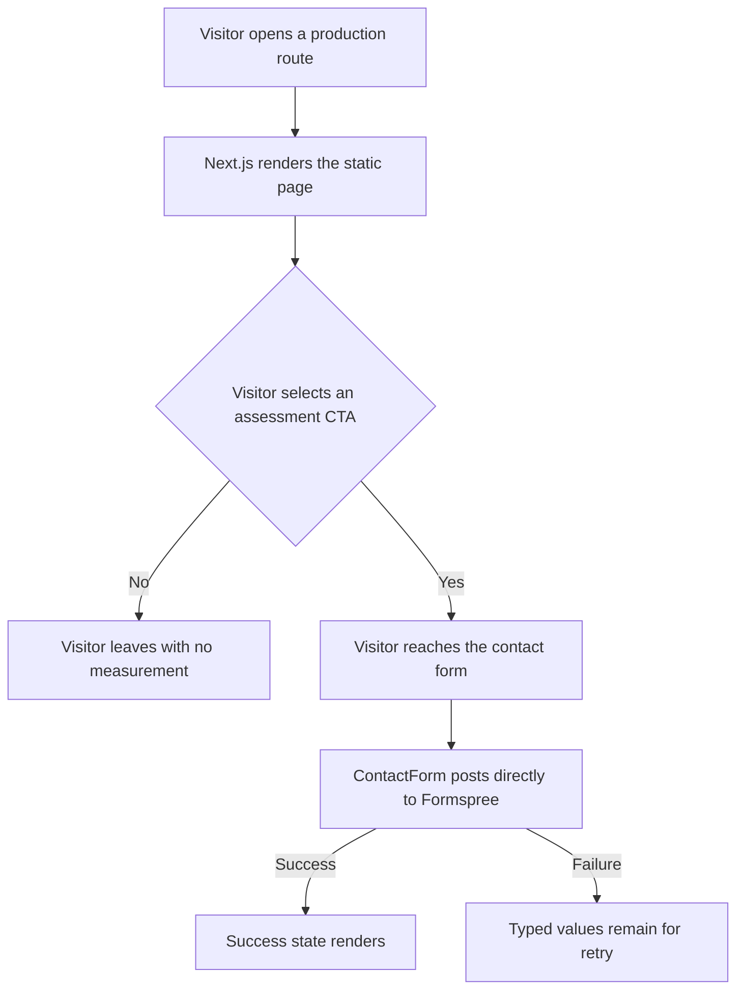
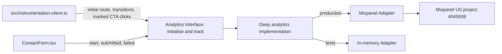

# Mixpanel Analytics Integration Plan 🧪 **PENDING TESTING**

<important_note>
> **IMPORTANT NOTE:** Use the existing dedicated FinTrace Mixpanel project in the US region. Its project ID is `4045938` and its public browser token is `eb76617a49248a0cd7e6958ec234d01b`. The user explicitly chose to check this public token into the client configuration rather than inject it through GitHub Actions. The token is expected to be visible in browser code and must never be replaced with a Mixpanel service-account credential, project secret, or private key.
</important_note>

## 1. Goal

Integrate Mixpanel into the FinTrace Root static website so the business can measure a small, stable conversion funnel without changing the visible design or collecting matter details.

The completed integration must:

- Record one canonical page-view event for each production route exposure.
- Record assessment CTA use and the start, confirmed success, or failure of a matter enquiry.
- Use the dedicated US-region FinTrace Mixpanel project.
- Keep every visitor anonymous and never call Mixpanel identification or People methods.
- Never send contact-form values, matter classifications, raw URLs, query strings, hashes, referrers, or advertising identifiers.
- Exclude Mixpanel autocapture, heatmaps, and session replay.
- Fail open so analytics loading or delivery failures never block navigation, animation, or Formspree submission.
- Preserve the Next.js static export, Server Module defaults, existing production design, and GitHub Pages deployment.
- Add an automated test surface at the analytics Module Interface, then pass `npm test`, `npm run lint`, `npm run build`, and the complete required browser matrix.

---

## 2. Current State Analysis

### 2.1 Current Implementation Overview

FinTrace Root is a Next.js 16.1.5 and React 19.2.4 App Router site exported as static files to `out/` and deployed to GitHub Pages. The repository has no server runtime, database, or analytics dependency. `src/app/layout.tsx` remains a Server Module, and browser behaviour is isolated in colocated Client Modules such as `src/app/contact/ContactForm.tsx`.

The public surface is:

| Page key | Route | Primary conversion role |
| --- | --- | --- |
| `home` | `/` | Explain the service and direct visitors to assessment |
| `about` | `/about/` | Establish trust and direct visitors to assessment |
| `engagement` | `/engagement/` | Explain engagement and direct visitors to assessment |
| `contact` | `/contact/` | Collect the matter-assessment enquiry |
| `not_found` | Root `not-found` | Recover an unknown route |

`src/app/contact/ContactForm.tsx` posts directly from the browser to Formspree. The form contains name, work email, organisation, matter type, approximate volume, and free-text matter details. None of those values may enter analytics.

`AGENTS.md` and `DESIGN.md` currently describe Formspree as the only approved runtime request and record analytics as unconfigured. Mixpanel therefore requires architecture-document updates in the same implementation task even though it makes no visible design change.

The repository currently has no `test` script or automated test directory. Its required validation is ESLint, static build, and browser verification.

### 2.2 Current Flow



There is currently no measurement at any point in this flow.

### 2.3 Reference Implementations

The user required inspection of the existing Embeddings and MineSeek Root integrations before planning FinTrace.

| Reference | Useful pattern to retain | Defect or risk not to copy |
| --- | --- | --- |
| `/Users/sacino/embeddings/src/lib/mixpanelClient.js` | Dynamic SDK import, production gating, `track_pageview: false`, local-storage persistence, replay disabled by default | Hard-coded taxonomy spread across callers, leaked SDK globals, stale documentation, query-string page properties |
| `/Users/sacino/embeddings/src/instrumentation-client.js` | Client instrumentation without converting the root layout into a Client Module | Event listeners pass browser `Event` objects into the page-path argument, and fast first navigation can be missed |
| `/Users/sacino/embeddings/src/app/contact/ContactForm.jsx` | Explicit form-lifecycle events without direct contact PII | Inconsistent event property values and no central runtime schema |
| `/Users/sacino/mineseek-root/src/lib/analytics.js` | A project-owned tracking wrapper | The raw SDK remains exposed, so callers bypass the intended seam |
| `/Users/sacino/mineseek-root/src/components/MixpanelProvider.jsx` | Central page tracking | Initial loads produce two page-view event names, splitting counts and funnels |
| `/Users/sacino/mineseek-root/src/lib/mixpanelClient.js` | Production-only initialisation | 100% session replay, permissive text/media capture, and unsupported configuration |

The FinTrace implementation must reuse the performance shape, not the exact code: defer the SDK, emit explicit events, keep one canonical taxonomy, and hide Mixpanel behind one deep analytics Module.

### 2.4 Core Problem

The website cannot currently answer whether a visitor saw a key page, selected an assessment CTA, began an enquiry, or completed it. Copying either sibling implementation would introduce known duplicate-page-view, data-collection, locality, and testing defects.

The required solution is a deep analytics Module with a small Interface. Its Implementation must concentrate SDK loading, one-time initialisation, queuing, route normalisation, event validation, property sanitisation, and failure isolation. This creates leverage for every route caller and locality for future analytics changes.

### 2.5 Technical Constraints

- Preserve `output: 'export'`, `images.unoptimized: true`, and `trailingSlash: true` in `next.config.ts`.
- Preserve `src/app/layout.tsx` as a Server Module.
- Use Next.js 16 client instrumentation for global analytics startup and route transitions.
- Use `mixpanel-browser/src/loaders/loader-module-core` so the active client bundle cannot load the session recorder.
- Defer the Mixpanel SDK import until the browser is idle, while queuing explicit events raised before the adapter is ready.
- Keep Mixpanel production-only. Local development and automated tests must use a no-op or in-memory Adapter and must not pollute the production project.
- Do not expose Mixpanel on `window`, export the raw SDK, or let route Modules import Mixpanel directly.
- Do not introduce a consent banner, privacy route, analytics preference control, or new user-facing copy.
- Do not change existing animation mechanisms or add `prefers-reduced-motion` handling.
- Any edit to `src/app/engine-network/Hero.tsx`, including analytics data attributes, triggers the seven-viewport hero validation matrix defined in `DESIGN.md`.
- Do not perform a live Formspree submission during validation. Stub Formspree success and failure in browser checks.

### 2.6 Current External Guidance

- Mixpanel’s current browser package is `mixpanel-browser` 2.81.0. Its standard bundle includes recorder dependencies, while the documented core loader excludes session-recording capability.
- Mixpanel defaults include `autocapture: false`, `track_pageview: false`, cookie persistence, IP geolocation, and no default opt-out. This plan must set every material analytics option explicitly instead of relying on defaults.
- Next.js 16 supports `src/instrumentation-client.ts` and the `onRouterTransitionStart(url, navigationType)` hook for App Router navigation observation.
- Vercel’s React guidance requires non-critical analytics to load after hydration rather than block the initial bundle.

---

## 3. Desired State

### 3.1 Desired State Requirements

- **REQ-1 (MUST):** Add `mixpanel-browser` at `^2.81.0` and lock the resolved package in `package-lock.json`.
- **REQ-2 (MUST):** Send events only to US project `4045938` using checked-in public token `eb76617a49248a0cd7e6958ec234d01b` and Mixpanel’s US browser ingestion host.
- **REQ-3 (MUST):** Expose a small project-owned analytics Interface and keep Mixpanel SDK loading, configuration, queuing, validation, and error isolation inside its Implementation.
- **REQ-4 (MUST):** Use a Mixpanel Adapter in production and an in-memory Adapter in automated tests, creating a real seam with two Adapters.
- **REQ-5 (MUST):** Emit only `Page Viewed`, `Assessment CTA Clicked`, `Matter Enquiry Started`, `Matter Enquiry Submitted`, and `Matter Enquiry Submission Failed`.
- **REQ-6 (MUST):** Set `track_pageview: false` and emit exactly one project-owned `Page Viewed` event for the initial route and each distinct client-side production-route transition.
- **REQ-7 (MUST):** Map every raw location to `home`, `about`, `engagement`, `contact`, or `not_found` before the event crosses the analytics seam. Never send the raw location.
- **REQ-8 (MUST):** Track only assessment CTAs explicitly marked with stable data attributes. Do not track ordinary navigation, the home-page process anchor, the 404 recovery link, or every click.
- **REQ-9 (MUST):** Emit `Matter Enquiry Started` once per form mount on the visitor’s first form interaction, without recording the field or value.
- **REQ-10 (MUST):** Emit `Matter Enquiry Submitted` only after Formspree returns `response.ok`.
- **REQ-11 (MUST):** Emit one `Matter Enquiry Submission Failed` event for a failed request, using only `failure_stage: response` for non-2xx Formspree responses or `failure_stage: network` for thrown network failures.
- **REQ-12 (MUST):** Use anonymous Mixpanel device identity with `persistence: localStorage`. Never call `identify`, `alias`, `people`, `set_group`, or any profile method.
- **REQ-13 (MUST):** Set `ip: false`, `autocapture: false`, `track_pageview: false`, `record_sessions_percent: 0`, `save_referrer: false`, `store_google: false`, `stop_utm_persistence: true`, and `ignore_dnt: false`.
- **REQ-14 (MUST):** Exclude raw URLs, query strings, hashes, referrers, UTM values, click IDs, form field names, form values, Formspree payloads, and Formspree error text from every event.
- **REQ-15 (MUST):** Use the core Mixpanel loader and prove the built client output contains no rrweb or session-recorder chunk.
- **REQ-16 (MUST):** Treat adapter import, initialisation, and delivery failures as non-fatal. No analytics promise may be awaited by navigation or the form state machine.
- **REQ-17 (MUST):** Run analytics only in production. Development and tests must not send requests to the live FinTrace Mixpanel project.
- **REQ-18 (MUST):** Do not add visitor consent, opt-out, analytics-preference, or privacy-notice UI.
- **REQ-19 (MUST):** Set the Mixpanel project’s event retention to 12 months and verify the setting before live validation.
- **REQ-20 (MUST):** Preserve all existing user-facing text, CSS, layout, metadata descriptions, animations, contact fields, Formspree behaviour, static-export settings, and deployment behaviour.
- **REQ-21 (MUST):** Update `AGENTS.md` and `DESIGN.md` so they record Mixpanel as an approved browser request, the analytics Module ownership, the event and data-minimisation contract, the new automated test command, and the removal of “analytics unconfigured” drift.

### 3.2 Event Contract

Every event receives these common project-owned properties:

| Property | Allowed value |
| --- | --- |
| `site` | `fintrace-root` |
| `environment` | `production` |
| `schema_version` | `1` |
| `page` | `home`, `about`, `engagement`, `contact`, or `not_found` |

Event-specific properties are restricted to:

| Event | Additional properties | Emission point |
| --- | --- | --- |
| `Page Viewed` | None | Initial production load and each distinct client-side route transition |
| `Assessment CTA Clicked` | `placement: header | hero | section | footer`; `destination: contact | contact_enquire` | Delegated click handler on an explicitly marked assessment CTA |
| `Matter Enquiry Started` | `placement: form` | First form interaction per mount |
| `Matter Enquiry Submitted` | `placement: form` | After a confirmed `response.ok` Formspree response |
| `Matter Enquiry Submission Failed` | `placement: form`; `failure_stage: response | network` | One event after a failed Formspree attempt |

Mixpanel-required SDK properties such as the project token, anonymous distinct ID, SDK name, SDK version, browser, OS, and device class may remain. Project-owned event properties must be accepted from the tables above only. Configure Mixpanel’s property blacklist to remove `$current_url`, `$referrer`, `$referring_domain`, `$initial_referrer`, `$initial_referring_domain`, all UTM fields, `gclid`, `fbclid`, and `msclkid`.

### 3.3 Module and Data Flow



The external analytics seam belongs inside the analytics Module. Callers know only the typed event Interface and its fail-open behaviour. They do not know the project token, SDK methods, queue lifecycle, property blacklist, or delivery host.

### 3.4 Defaults and Fallbacks

- **Production default:** Queue valid events immediately, load the Mixpanel core Adapter after browser idle, initialise once, then flush the queue in order.
- **Development default:** Accept calls through the same Interface but perform no external request.
- **Test default:** Inject an in-memory Adapter and assert observable events through the Module Interface.
- **SDK load failure:** Clear or cap the in-memory queue, record no event, throw no caller-visible error, and leave the site fully functional.
- **Blocked delivery:** Navigation and Formspree state transitions continue without waiting for Mixpanel.
- **Do Not Track:** Respect the browser signal by retaining `ignore_dnt: false`.
- **Unknown path:** Map to `not_found`; never send the unknown path.
- **Repeated same-page transition:** Do not emit a duplicate `Page Viewed` event.

### 3.5 Verification Checklist

**Functional:**

- [ ] The five approved event names are the only project-owned event names emitted.
- [ ] Initial load and each distinct App Router transition emit one `Page Viewed` event.
- [ ] Marked assessment CTAs emit one click event before navigation without blocking navigation.
- [ ] Enquiry start, confirmed submit, response failure, and network failure emit the specified events in the specified order.

**Data minimisation:**

- [ ] Captured Mixpanel payloads contain no form values, matter categories, organisation, email, free text, raw URL, query, hash, referrer, UTM value, or click ID.
- [ ] No SDK request performs user identification, profile creation, autocapture, heatmap collection, or session replay.

**Compatibility:**

- [ ] `src/app/layout.tsx` remains a Server Module.
- [ ] Static export and GitHub Pages deployment settings remain unchanged.
- [ ] All existing routes, links, animations, focus states, and contact-form states behave as before.

**Operations and documentation:**

- [ ] US project `4045938` retains events for 12 months.
- [ ] One authorised synthetic validation event appears in Mixpanel Live View.
- [ ] `AGENTS.md` and `DESIGN.md` match the implemented network, module, testing, and data-minimisation contracts.

---

## 4. Additional Context

### 4.1 User Decisions

The blindspot pass resolved the following decisions:

- Use a minimal conversion funnel rather than page views only or broad engagement tracking.
- Use a dedicated FinTrace Mixpanel project rather than sharing the Embeddings or MineSeek project.
- Use the existing US-region project with ID `4045938`.
- Check the public project token into client configuration rather than using a GitHub repository variable.
- Run Mixpanel without visitor opt-in, opt-out, consent UI, analytics preferences, or a privacy notice, “akin to embeddings”.
- Retain event data for 12 months.
- Permit one clearly labelled synthetic event to verify the token, region, and Live View ingestion.
- Keep a full privacy notice out of scope.

### 4.2 Deliberately Rejected Patterns

- Do not reuse either sibling project token or mix multiple brands in one Mixpanel project.
- Do not emit Mixpanel’s automatic `$mp_web_page_view` alongside a project-owned page event.
- Do not expose a raw Mixpanel instance or `window.mixpanel`.
- Do not add a public debug route.
- Do not record raw query strings for attribution.
- Do not add generic link tracking, scroll depth, broad engagement events, referral classification, user profiles, or People properties.
- Do not enable recorder-capable imports, session replay, heatmaps, or autocapture.
- Do not use source-text regex tests as the primary proof of analytics behaviour. Test emitted outcomes through the analytics Interface.

---

## 5. Implementation Plan

### Step 1: Configure the Mixpanel Project and Dependency 🧪 **PENDING TESTING**

**Objective:** Establish the approved external project settings and install only the browser dependency needed by the production Adapter.

#### 1.1 High-Level Approach

- In Mixpanel project `4045938`, verify the region is US and set event retention to 12 months.
- Run `npm install mixpanel-browser@^2.81.0` from the repository root so `package.json` and `package-lock.json` record the dependency.
- Do not add environment variables, GitHub Actions variables, project secrets, service-account credentials, or deployment workflow token wiring.
- Treat `eb76617a49248a0cd7e6958ec234d01b` as a public browser token and keep all private Mixpanel credentials outside the repository.

**Success Criteria:**

- `package.json` contains `mixpanel-browser` with range `^2.81.0`, and `npm ci` installs the lockfile without modification.
- Mixpanel project `4045938` reports US residency and 12-month retention in its project settings.
- `rg -n "eb76617a49248a0cd7e6958ec234d01b" .github` and `rg -n "eb76617a49248a0cd7e6958ec234d01b" --glob '.env*' .` return no deployment secret or environment-file copy; the token exists only in the project-owned client configuration, this plan, and generated build output.
- `.github/workflows/deploy.yml` retains its current triggers, permissions, static `out/` artefact, and GitHub Pages deployment target; later test wiring adds no Mixpanel environment value or credential.

### ~~Step 2: Build the Deep Analytics Module~~ ✅ **COMPLETED**

**Objective:** Concentrate all vendor and event complexity behind a small, typed, fail-open Interface.

#### 2.1 High-Level Approach

- Create `src/lib/analytics/core.ts` with the typed event contract, production-route normalisation, common-property injection, queueing, one-time initialisation, duplicate page suppression, property allowlists, and adapter-failure isolation.
- Define the internal `AnalyticsAdapter` seam in `core.ts`. Its minimum Interface should initialise once and accept a validated event name plus validated properties.
- Create `src/lib/analytics/client.ts` as the browser-facing facade. Export only `initialiseAnalytics()` and `trackAnalytics(event)` to production callers.
- Keep the checked-in project ID, public token, US host, production gating, idle loading, and dynamic `mixpanel-browser/src/loaders/loader-module-core` import inside `client.ts`.
- Configure Mixpanel explicitly with the values in REQ-13 and the property blacklist in Section 3.2.
- Cap any pre-initialisation queue at 50 events and discard the oldest event if the cap is exceeded so a blocked SDK cannot grow memory without limit.
- Do not await Mixpanel tracking from the public Interface. Catch adapter import, initialisation, and tracking failures inside the Implementation.

**Success Criteria:**

- Production callers can import only `initialiseAnalytics()` and `trackAnalytics(event)` from `src/lib/analytics/client.ts`; no raw SDK object or arbitrary string-based tracking method is exported.
- `src/lib/analytics/client.ts` imports Mixpanel only through a dynamic import of `mixpanel-browser/src/loaders/loader-module-core`.
- The production Adapter uses token `eb76617a49248a0cd7e6958ec234d01b`, US host `https://api-js.mixpanel.com`, local-storage persistence, disabled automatic page views, disabled autocapture, zero replay, disabled IP geolocation, disabled referrer/marketing persistence, and `ignore_dnt: false`.
- The core Module rejects or strips every event name, property name, and enum value outside Section 3.2 before the production Adapter receives it.
- Repeated `initialiseAnalytics()` calls initialise the Adapter once, valid pre-load events flush once in original order, and a 51st queued event drops the oldest event.
- An Adapter rejection or thrown error produces no caller-visible rejection and changes no navigation or form state.

### ~~Step 3: Add Global Route and CTA Instrumentation~~ ✅ **COMPLETED**

**Objective:** Track canonical page exposure and explicit assessment CTA use without hydrating production Server Modules.

#### 3.1 High-Level Approach

- Create `src/instrumentation-client.ts` using Next.js 16’s client instrumentation convention.
- On initial browser execution, submit the current pathname to `trackAnalytics` for canonical mapping and schedule `initialiseAnalytics()` with `requestIdleCallback` plus a finite timeout, falling back to `setTimeout` where idle callbacks are unavailable.
- Export `onRouterTransitionStart(url, navigationType)` and pass the supplied URL string to the analytics Module. Do not install the Embeddings history monkey patches or pass browser `Event` objects into route tracking.
- Install one guarded delegated click listener for `[data-analytics-cta]`. Read only allowlisted `placement` and `destination` values, then emit `Assessment CTA Clicked`.
- Add stable data attributes to assessment links in:
  - `src/app/engine-network/Hero.tsx`
  - `src/app/engine-network/EngineNetworkPage.tsx`
  - `src/app/engine-network/SiteChrome.tsx`
  - `src/app/about/page.tsx`
  - `src/app/engagement/page.tsx`
- Do not mark ordinary header/footer navigation, the home process anchor, the about-to-engagement link, the contact submit button, or the 404 home link as assessment CTAs.

**Success Criteria:**

- An initial visit to each public route emits exactly one `Page Viewed` event with the correct page enum and no raw path.
- Client navigation between any two production pages emits exactly one additional `Page Viewed` event for the destination.
- Query-only, hash-only, and repeated same-page transitions do not create an additional page event.
- An unknown path emits `page: not_found` without transmitting the unknown path.
- Each explicitly marked assessment link emits one `Assessment CTA Clicked` event with an allowed placement and destination before navigation continues.
- `src/app/layout.tsx` remains a Server Module and receives no `'use client'` directive.
- No production page Module imports `mixpanel-browser` directly.

### ~~Step 4: Instrument the Contact-Form Lifecycle~~ ✅ **COMPLETED**

**Objective:** Measure the enquiry funnel while preserving the existing retry-safe Formspree state machine and excluding all matter data.

#### 4.1 High-Level Approach

- Update `src/app/contact/ContactForm.tsx` to import only `trackAnalytics` from the project-owned client facade.
- Use a ref to emit `Matter Enquiry Started` once on the first form interaction per mount. Do not include the target field, field name, or value.
- Distinguish a non-2xx Formspree response from a thrown network failure using an internal failure-stage value without changing existing user-facing error copy.
- Emit `Matter Enquiry Submitted` only after `response.ok` and before or after the existing reset/status update without awaiting analytics.
- Emit one `Matter Enquiry Submission Failed` in the existing failure path with only `failure_stage: response | network`.
- Preserve the six visible fields, three hidden fields, submission guard, typed-value retention, success reset, accessibility roles, and Formspree endpoint.

**Success Criteria:**

- First form interaction emits one start event; subsequent focus, input, change, and retry interactions during the same mount emit none.
- A stubbed HTTP 200 Formspree response emits one submitted event and retains the current successful reset/status behaviour.
- A stubbed non-2xx response emits one failed event with `failure_stage: response` and retains every typed value.
- A stubbed network exception emits one failed event with `failure_stage: network` and retains every typed value.
- Captured events contain no name, email, email domain, organisation, matter type, volume, message, field name, field count, request body, response body, status text, or thrown error text.
- A throwing or blocked analytics Adapter does not change the Formspree request, success state, error state, or retry behaviour.

### ~~Step 5: Add Interface-Level Automated Tests~~ ✅ **COMPLETED**

**Objective:** Make the analytics Module Interface the regression test surface without adding a third-party test framework.

#### 5.1 High-Level Approach

- Add `test/analytics.test.ts` using Node 22’s built-in `node:test` runner and TypeScript stripping.
- Test `src/lib/analytics/core.ts` with an in-memory Adapter that records initialisation and emitted events.
- Cover production and development modes, queued delivery, one-time initialisation, queue cap, route normalisation, page de-duplication, event/property allowlists, form-event payloads, and adapter failure.
- Add `npm test` as `node --test test/*.test.ts` in `package.json`.
- Add an `npm test` step to `.github/workflows/deploy.yml` after `npm ci` and before lint/build so a failing analytics Interface test blocks publication.
- Keep tests observable through the analytics Interface. Do not assert private SDK state or rely primarily on source-text regular expressions.

**Success Criteria:**

- `npm test` executes `test/analytics.test.ts` and exits with zero failures on Node 22.23.1.
- Tests prove that development mode sends zero events to an Adapter configured as external.
- Tests prove that production initialises once, flushes queued events once and in order, caps the queue at 50, and suppresses duplicate page events.
- Tests prove that unknown paths map to `not_found` and that raw paths, queries, hashes, referrers, click IDs, and unexpected properties never reach the in-memory Adapter.
- Tests prove that every approved event accepts only the enums in Section 3.2 and that invalid values are dropped without throwing to the caller.
- Tests prove that import, initialise, and track failures are fail-open.
- `.github/workflows/deploy.yml` runs `npm test`, `npm run lint`, and `npm run build` before uploading `out/`, with its triggers, permissions, and deployment target unchanged.

### ~~Step 6: Synchronise Architecture and Design Documentation~~ ✅ **COMPLETED**

**Objective:** Make the project’s binding instructions and visual implementation contract truthful after analytics becomes a production dependency.

#### 6.1 High-Level Approach

- Update `AGENTS.md` to:
  - Add Mixpanel’s browser POSTs as an approved runtime network exception beside Formspree.
  - Record the anonymous minimal-funnel contract and the prohibition on form values, identification, autocapture, heatmaps, and replay.
  - Record the ownership of the analytics Module and Next client instrumentation.
  - Replace “no automated suite exists” with the focused Node test command while retaining lint, build, and browser requirements.
- Update `DESIGN.md` to:
  - Add the analytics Module and `src/instrumentation-client.ts` to the source map.
  - Record invisible CTA data attributes and contact-form lifecycle instrumentation without claiming a visual change.
  - Add Mixpanel to approved runtime network exceptions.
  - Remove “analytics remain unconfigured” from known drift.
  - Record production-only, anonymous, explicit-event tracking and the intentionally absent consent/privacy UI.
  - Add analytics payload and bundle checks to design verification without changing CSS, copy, or visual-state claims.
- Do not change `src/lib/metadata.ts`, `src/app/sitemap.ts`, `src/app/robots.ts`, or add a privacy route because the user kept privacy UI out of scope.

**Success Criteria:**

- `AGENTS.md` names Formspree and Mixpanel as the only approved runtime request classes and lists `npm test`, `npm run lint`, and `npm run build` as required automated checks.
- `DESIGN.md` identifies the exact analytics owner files, five-event taxonomy, production-only behaviour, US project region, anonymous persistence, and excluded data/capabilities.
- Neither document claims analytics are unconfigured, that Formspree is the sole runtime request, or that no automated test suite exists.
- No production copy, metadata, sitemap entry, robots rule, CSS token, layout rule, or animation contract changes.

### Step 7: Validate the Complete Integration 🧪 **PENDING TESTING**

**Objective:** Prove the Module contract, static build, bundle composition, production-route behaviour, contact-form resilience, and live Mixpanel project wiring.

#### 7.1 Automated Validation

Run from `/Users/sacino/fintrace-root`:

```bash
npm test
npm run lint
npm run build
```

Inspect the generated client assets without editing `.next/` or `out/`:

```bash
rg -n "mixpanel-recorder|@mixpanel/rrweb|rrweb-record" out/_next/static .next/static
```

The recorder search must return zero matches attributable to shipped application chunks. If a dependency manifest or source map produces a match, inspect the importing chunk and prove no recorder module is reachable from the production entry before accepting the result.

#### 7.2 Browser Validation

- Apply the `dev-browser` skill.
- Check `http://localhost:3004` before starting a server. Reuse a matching server or run `npm run dev` from the repository root and stop only a server started by this task.
- Verify `/`, `/about/`, `/engagement/`, `/contact/`, and an unknown route at `1440x900` and `390x900`.
- Check zero console errors, zero page errors, zero horizontal overflow, intact focus visibility, intact links, responsive layout, and unchanged animation behaviour.
- Because `Hero.tsx` receives analytics attributes, also run the complete hero matrix at `1440x900`, `1998x750`, `2560x1080`, `3425x1245`, `1024x768`, `900x1080`, and `390x900`, plus the existing live-resize, forced-WebGL-failure, and offscreen/hidden lifecycle checks in `DESIGN.md`.
- Intercept Formspree in the browser. Return a synthetic 200 response for success, a synthetic non-2xx response for response failure, and abort the request for network failure. Do not submit a real enquiry.
- In development mode, confirm that CTA and form interactions perform zero requests to Mixpanel’s ingestion host.
- Confirm that blocking the Mixpanel host does not alter any link destination, animation, or form state.

#### 7.3 Live Mixpanel Validation

- After automated and browser checks pass, send exactly one event named `FinTrace Integration Validation` directly to the Mixpanel US ingestion endpoint using the public token and a synthetic distinct ID that cannot be confused with a visitor.
- Include `site: fintrace-root`, `environment: validation`, `schema_version: 1`, and `project_id: 4045938`; include no URL, referrer, browser, form, or person data.
- Confirm the single event appears in project `4045938` Live View and that the project reports 12-month retention.
- Do not add `FinTrace Integration Validation` to the production event union or expose a debug route, button, window global, or production UI for sending it.

**Success Criteria:**

- `npm test`, `npm run lint`, and `npm run build` each exit with status 0.
- The static export completes with the required `output`, image, and trailing-slash settings unchanged.
- Built application chunks contain the Mixpanel core implementation but no reachable rrweb or session-recorder implementation.
- All five route states pass desktop and mobile browser checks, and the complete hero matrix passes because `Hero.tsx` changed.
- Stubbed Formspree success, response failure, and network failure preserve the existing form contract and produce no live enquiry.
- Development browser checks send zero Mixpanel requests, and a blocked analytics host causes no functional regression.
- Exactly one `FinTrace Integration Validation` event appears in the dedicated US project with only the approved synthetic properties.
- `git diff --check` exits with status 0, and `git status --short` shows only files intentionally changed for this integration.

---

## 6. Testing Plan

### 6.1 Source-of-Truth Artefacts

This is a new feature, not a production defect, so there is no failing production input to preserve. The following repository artefacts are the primary sources of truth for the planned behaviour:

| Artefact | Why it matters | Expected post-change behaviour |
| --- | --- | --- |
| `src/app/layout.tsx` | Defines the server-owned root shell | Remains a Server Module while client instrumentation runs separately |
| `src/app/contact/ContactForm.tsx` | Owns Formspree submission and retry-safe states | Adds generic lifecycle events without changing fields, values, copy, or state outcomes |
| `src/app/engine-network/Hero.tsx` | Owns the main assessment CTA and triggers the hero matrix when edited | Gains only stable analytics attributes and remains visually identical |
| `src/app/engine-network/SiteChrome.tsx` | Owns shared header and footer assessment links | Marks only assessment links and preserves all destinations and visible labels |
| `AGENTS.md` | Binding architecture, network, and validation policy | Records the second approved runtime request and new test command |
| `DESIGN.md` | Production design and interaction contract | Records analytics ownership and removes stale analytics drift |
| `/Users/sacino/embeddings/src/instrumentation-client.js` | Reference for deferred global analytics | Its Event-object navigation bug and fast-navigation loss are not reproduced |
| `/Users/sacino/mineseek-root/src/components/MixpanelProvider.jsx` | Reference for route tracking | Its duplicate initial page-view taxonomy is not reproduced |

### 6.2 Automated Interface Tests

| Test case | Test location | Framework | Expected result | Command |
| --- | --- | --- | --- | --- |
| Production initialisation and queue flush | `test/analytics.test.ts` | Node `node:test` | Adapter initialises once and receives queued events once in order | `npm test` |
| Development isolation | `test/analytics.test.ts` | Node `node:test` | Live Adapter receives zero initialisation or tracking calls | `npm test` |
| Canonical page mapping | `test/analytics.test.ts` | Node `node:test` | Known paths map to four page enums; all other paths map to `not_found` | `npm test` |
| Page de-duplication | `test/analytics.test.ts` | Node `node:test` | Initial and distinct transitions emit once; repeated same-page routes emit none | `npm test` |
| Event/property validation | `test/analytics.test.ts` | Node `node:test` | Only the five event names and documented enum properties reach the Adapter | `npm test` |
| Sensitive-data exclusion | `test/analytics.test.ts` | Node `node:test` | Raw URLs, queries, hashes, referrers, click IDs, and unexpected form properties are removed | `npm test` |
| Queue bound | `test/analytics.test.ts` | Node `node:test` | Queue contains at most 50 events and drops the oldest on overflow | `npm test` |
| Fail-open Adapter | `test/analytics.test.ts` | Node `node:test` | Import, initialisation, and track failures produce no caller-visible throw | `npm test` |

### 6.3 Browser Integration Scenarios

1. Initial route and client navigation
   - Action: Open each production route, then use internal links to navigate between pages.
   - Expected: Every page remains visually and functionally unchanged; development sends no Mixpanel request.
   - Verify: `dev-browser` at `1440x900` and `390x900`, plus console, page-error, overflow, and focus checks.

2. Assessment CTA
   - Action: Select each marked header, hero, section, and footer assessment CTA.
   - Expected: Every CTA reaches `/contact/` or `/contact/#enquire` exactly as before and no click is blocked by analytics.
   - Verify: `dev-browser` URL and focus checks; automated in-memory Adapter assertions cover the emitted event contract.

3. Contact success
   - Action: Fill the form with synthetic values and intercept Formspree with HTTP 200.
   - Expected: Existing success state renders, the form resets, and no real Formspree or Mixpanel request is made.
   - Verify: `dev-browser` at both required viewports.

4. Contact response failure
   - Action: Fill the form and intercept Formspree with a non-2xx response.
   - Expected: Existing error state renders, every typed value remains, and retry remains available.
   - Verify: `dev-browser` at both required viewports.

5. Contact network failure
   - Action: Fill the form and abort the intercepted Formspree request.
   - Expected: Existing error state renders, every typed value remains, and retry remains available.
   - Verify: `dev-browser` at both required viewports.

6. Analytics unavailable
   - Action: Block `https://api-js.mixpanel.com` while navigating and exercising all form states.
   - Expected: No console or page error escapes the analytics Module; navigation, animation, and form behaviour remain unchanged.
   - Verify: `dev-browser` network and error inspection.

7. Live project wiring
   - Action: Send the one authorised synthetic validation event directly to the US endpoint.
   - Expected: One event appears in project `4045938` Live View with only the synthetic allowlisted properties.
   - Verify: Mixpanel Live View and project settings.

---

## 7. Implemented Solution

### 7.1 Implementation Summary

- Added `src/lib/analytics/core.ts` as the typed analytics Interface and deep implementation for route normalisation, event reconstruction, duplicate-page suppression, bounded pre-load queuing, one-time initialisation, and fail-open adapter handling.
- Added `src/lib/analytics/client.ts` as the production-only Mixpanel Adapter. It dynamically imports the core-only browser loader, sends to the US host, disables automatic collection and recorder capabilities, and blocks vendor marketing, referrer, URL, UTM, and advertising-click enrichment.
- Added `src/instrumentation-client.ts` for the initial page view, App Router transitions, deferred SDK initialisation, and capture-phase delegated assessment CTA tracking. Capture phase preserves the intended CTA-then-destination event order for Next.js links.
- Updated `ContactForm.tsx` to emit the first-interaction, confirmed-submission, response-failure, and network-failure lifecycle events without awaiting analytics or including form data.
- Marked only the approved assessment links in the shared Engine Network components and the About and Engagement routes. Existing labels, destinations, styles, layout, and animation logic remain unchanged.
- Added eight Node Interface tests, the `npm test` script, and a deployment test step before lint and build.
- Updated `AGENTS.md` and `DESIGN.md` with the approved Mixpanel request, module ownership, anonymous five-event contract, excluded data and capabilities, and required validation commands.

### 7.2 Validation Results

- `npm test` passed all 8 tests.
- `npm run lint` passed with zero errors.
- `npm run build` completed the static export with all 11 routes.
- A clean `npm ci` preserved the lockfile byte-for-byte.
- Recorder bundle inspection found no `mixpanel-recorder`, `@mixpanel/rrweb`, or `rrweb-record` matches in shipped client assets.
- Desktop and mobile checks passed for `/`, `/about/`, `/engagement/`, `/contact/`, and the root not-found route with no horizontal overflow, page errors, layout regressions, or Mixpanel development requests.
- The seven-viewport hero matrix, live resize, forced WebGL fallback, offscreen pause/resume, and simulated hidden-document pause/resume checks passed. The forced renderer failure produced Three.js’s existing development diagnostic before the scene fallback caught the failure; the static fallback and page content remained intact.
- Stubbed Formspree success, response failure, and network failure preserved the existing reset or retry-safe value-retention behaviour and made no real Formspree request.
- Header, hero, section, and footer assessment CTAs retained their existing destinations. Blocking or omitting analytics caused no navigation, animation, or form-state regression.
- Exactly one authorised `FinTrace Integration Validation` event was accepted by the US endpoint and appeared in Mixpanel project `4045938` with the intended synthetic identity and no location enrichment.
- `git diff --check` and the consolidated post-change audit report validation passed.

### 7.3 Post-Change Audit

- Fixed a confirmed vendor-enrichment gap by disabling Mixpanel marketing tracking and first-touch marketing updates, and by retaining the complete current UTM and advertising-click identifier blacklist as defence in depth.
- Fixed a confirmed Next.js ordering risk by registering the delegated CTA listener in capture phase so the CTA event enters the analytics queue before client navigation starts.
- Retained the plan-specified analytics Interface as the automated regression boundary. A production SDK transport test remains an optional recommendation because the plan explicitly rejects tests centred on Mixpanel’s private SDK state.
- Consolidated the two independent audit reports at `documents/todo/bugs/codex/combined_bug_sweep_20260721_m4q8v2n6.xml`.

### 7.4 Remaining External Requirement

Mixpanel project `4045938` is the correct US-region FinTrace project and its public token is correctly wired. The signed-in project and organisation settings identify the current subscription as Growth but expose no event-retention control, so the required 12-month retention setting could not be configured or positively verified. Step 1, Step 7, and this plan remain `🧪 **PENDING TESTING**` until that account-level capability is available or Mixpanel support confirms the project’s effective retention period.
