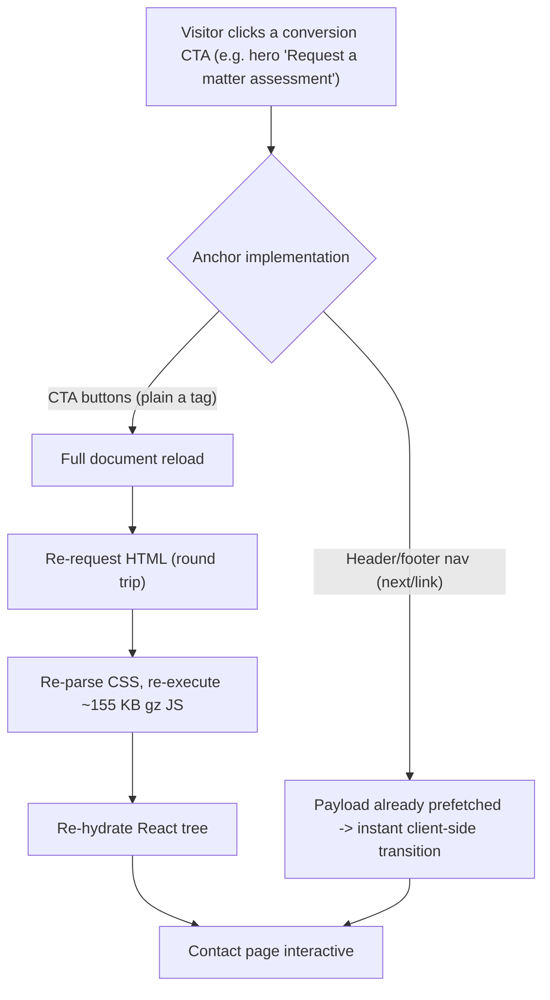

# ~~Production Site Speed Optimisation Plan~~ ✅ **COMPLETED**

<critical_warning>
> **CRITICAL WARNING:** This plan must produce ZERO visual, copy, layout, or interaction-feel change on any route. Every change is a mechanical substitution (anchor implementation, lossless image bytes). `DESIGN.md:127` states: “Any hero CTA change, even attribute-only, triggers the full seven-viewport hero matrix” — Step 2 changes the hero CTA’s element implementation, so the full seven-viewport hero matrix in `DESIGN.md:197` is mandatory before this work is complete.
</critical_warning>

<important_note>
> **IMPORTANT NOTE:** `SiteHeader` (`src/app/engine-network/SiteChrome.tsx`) receives `contactHref="#enquire"` on the contact page (`src/app/contact/page.tsx:26`) and defaults to `/contact/` everywhere else. The header’s gold button must therefore handle BOTH a route href and a same-page hash href. Only route-target hrefs become `next/link`; same-page hash anchors stay plain `<a>` (see REQ-2).
</important_note>

## 1. Goal

Make navigation between the FinTrace production routes effectively instant by converting the conversion-path CTA buttons from plain `<a>` tags (full document reloads) to `next/link` (prefetched client-side transitions), and shrink the social-share image losslessly. The site’s runtime animation systems are already exemplary (visibility-paused rAF loops, DPR caps, allocation-free frames, full WebGL disposal) — this plan deliberately does not touch them.

Done means:
- Every internal route-target CTA click performs a client-side navigation with no full document reload, and `/contact/#enquire` still lands scrolled to the enquiry form.
- Nothing looks or behaves differently to a visitor: identical markup classes, hover/press/focus states, copy, and scroll behaviour.
- `npm run lint` and `npm run build` pass; the browser verification matrices in Section 6 pass.
- The OG image at `public/images/og/fintrace-og.png` is pixel-identical but smaller in bytes.

---

## 2. Current State Analysis

### 2.1 Current Implementation Overview

FinTrace Root is a fully static Next.js 16 App Router export (`output: 'export'`, `trailingSlash: true`, `images.unoptimized: true` in `next.config.ts`) deployed to GitHub Pages at `https://fintrace.com.au/` via `.github/workflows/deploy.yml`. There is no server runtime; the only runtime network request is the contact form’s browser-side POST to Formspree.

Production routes: `/` (renders `src/app/engine-network/EngineNetworkPage.tsx`), `/about/`, `/engagement/`, `/contact/`, and the root `not-found`. All share the `.dsn-engine-network` design system, `src/app/engine-network/fonts.ts` (Bricolage Grotesque + Fragment Mono via `next/font/google`, both preloaded), and the `SiteHeader`/`SiteFooter` chrome in `src/app/engine-network/SiteChrome.tsx`.

Measured baseline from the current static export (`out/`, chunk hashes change per build — treat as indicative magnitudes, not stable names):

| Asset group (homepage) | Raw bytes | Gzipped |
| --- | --- | --- |
| HTML `out/index.html` | 60,572 | ~13 KB |
| CSS (3 stylesheets) | 58,081 | ~12.5 KB |
| Initial JS (8 async chunks incl. React/Next runtime) | ~539,000 | ~155 KB |
| Three.js scene chunk (dynamic, fetched post-hydration) | 524,923 | 130,305 |
| Fonts (2 preloaded woff2) | 56,412 | already compressed |
| Route prefetch payloads (`index.txt` files) | 15–29 KB each | — |
| OG image `public/images/og/fintrace-og.png` (1200×630 PNG, crawler-fetched only) | 288,413 | — |

Navigation today is split-brained:
- `SiteHeader` nav links and `SiteFooter` links already use `next/link` → prefetched (via the exported `.txt` RSC payloads), instant client-side transitions.
- Every conversion CTA is a plain `<a>` → full document reload: re-request HTML, re-parse CSS, re-execute ~155 KB gz of JS, re-hydrate.

Complete inventory of internal plain `<a>` elements on production routes:

| # | File:line | Element | Target | Action |
| --- | --- | --- | --- | --- |
| 1 | `src/app/engine-network/SiteChrome.tsx:20` | `<a className="eng-btn-gold eng-btn-sm" href={contactHref}>` “Request assessment” | `/contact/` (default) or `#enquire` (on contact page) | Convert conditionally (Step 1) |
| 2 | `src/app/engine-network/Hero.tsx:119` | `<a className="eng-btn-gold" href="/contact/">` “Request a matter assessment” | `/contact/` | Convert (Step 2) |
| 3 | `src/app/engine-network/Hero.tsx:122` | `<a className="eng-btn-ghost" href="#process">` | same-page anchor | KEEP as `<a>` |
| 4 | `src/app/engine-network/EngineNetworkPage.tsx:333` | `<a className="eng-btn-gold eng-btn-loop" href="/contact/">` | `/contact/` | Convert (Step 3) |
| 5 | `src/app/engine-network/EngineNetworkPage.tsx:336` | `<a className="eng-btn-ghost" href="/contact/#enquire">` | `/contact/#enquire` | Convert (Step 3) |
| 6 | `src/app/about/page.tsx:124` | `<a className="eng-btn-gold eng-btn-loop" href="/contact/">` | `/contact/` | Convert (Step 4) |
| 7 | `src/app/about/page.tsx:127` | `<a className="eng-btn-ghost" href="/engagement/">` | `/engagement/` | Convert (Step 4) |
| 8 | `src/app/engagement/page.tsx:156` | `<a className="eng-btn-gold eng-btn-loop" href="/contact/">` | `/contact/` | Convert (Step 5) |
| 9 | `src/app/engagement/page.tsx:159` | `<a className="eng-btn-ghost" href="/contact/#enquire">` | `/contact/#enquire` | Convert (Step 5) |

Note: `EngineNetworkPage.tsx` is also rendered by the internal lab route `/engine-network/`; the Step 3 conversion benignly applies there too. No other lab route is in scope.

### 2.2 Current Flow

### 2.3 The Core Problem

The highest-intent clicks on the site — the assessment/enquiry CTAs — take the slowest navigation path, while the low-intent header/footer links take the fast one. GitHub Pages compounds this: it serves every asset with `Cache-Control: max-age=600` and no `immutable`, so even a repeat navigation minutes later revalidates assets (304 round trips). On a 4G connection a CTA click costs several hundred milliseconds to multiple seconds of white-screen/reload where a `next/link` transition would be near-instant and preserve the running page.

### 2.4 Affected User Scenarios

| Scenario | Today | After |
| --- | --- | --- |
| Visitor reads homepage hero, clicks “Request a matter assessment” | Full reload of `/contact/` | Instant client-side transition (payload prefetched when CTA entered viewport) |
| Visitor finishes homepage CTA plate, clicks “Start an enquiry” (`/contact/#enquire`) | Full reload, browser jumps to form | Client-side transition, scrolled to `#enquire` form plate |
| Visitor on `/about/` clicks “See the engagement shape” (`/engagement/`) | Full reload | Instant transition |
| Social crawler fetches OG image | 288 KB PNG | Same pixels, fewer bytes |

### 2.5 Technical Constraints

- Preserve `output: 'export'`, `images.unoptimized: true`, `trailingSlash: true` (`next.config.ts`); no server actions, API routes, or runtime network assets. Do not edit generated `.next/` or `out/` files.
- `AGENTS.md` code standards: British English with curly apostrophe `’` in frontend copy (no copy changes are expected in this plan); imperative-mood comments only where logic is non-obvious; apply the `vercel-react-best-practices` skill to changed React code.
- `DESIGN.md` contracts that must remain true: every public contact action targets `/contact/` or its `#enquire` anchor (`DESIGN.md:127`); button classes `.eng-btn-gold`, `.eng-btn-loop`, `.eng-btn-sm`, `.eng-btn-ghost` and their hover/press behaviour (`DESIGN.md:124-125`); the CTA label is always “Request a matter assessment” (`DESIGN.md:179`).
- Verification standard (`AGENTS.md` testing rules + `DESIGN.md:193-197`): `npm run lint` zero errors; `npm run build` completes the static export; browser checks with the `dev-browser` skill at 1440×900 and 390×900 for every changed route; the SEVEN-viewport hero matrix (1440×900, 1998×750, 2560×1080, 3425×1245, 1024×768, 900×1080, 390×900) for any hero change; zero console/page errors; zero horizontal overflow.
- Dev server policy: check `http://localhost:3004` first; reuse a matching server; otherwise `npm run dev` from the repo root. Stop only servers you started.
- `next/link` is production-proven in this exact codebase (`SiteChrome.tsx` nav/footer) and the exported `.txt` prefetch payloads already exist for all production routes, so no export-compatibility risk is introduced.

### 2.6 Existing Infrastructure That Can Be Reused

- `next/link` import and usage pattern already in `src/app/engine-network/SiteChrome.tsx:1,17-19,42-48` — copy this pattern exactly.
- Exported RSC prefetch payloads (`out/index.txt`, `out/about/index.txt`, `out/contact/index.txt`, `out/engagement/index.txt`) — these are what make `Link` prefetch work on the static host; nothing new to build.
- `dev-browser` skill for the browser matrices; existing lint/build commands.

---

## 3. Desired State

### 3.1 Desired State Requirements

- **REQ-1 (MUST)**: Inventory rows 2, 4, 5, 6, 7, 8, 9 (Section 2.1) render via `next/link` with unchanged `className`, unchanged href target, and unchanged child content.
- **REQ-2 (MUST)**: Same-page hash anchors stay plain `<a>`: `Hero.tsx:122` (`#process`) and the `SiteHeader` gold button when `contactHref` is a hash (`#enquire` on the contact page). The `SiteHeader` button becomes `Link` only when `contactHref` starts with `/`.
- **REQ-3 (MUST)**: Clicking any converted CTA performs a client-side navigation — a JS sentinel set on `window` before the click survives the navigation — and `/contact/#enquire` targets end with the `#enquire` form plate scrolled into view.
- **REQ-4 (MUST NOT)**: No change to rendered visuals, button classes, hover/press/focus styling, copy, DOM structure (beyond the anchor being rendered by `Link`), scroll behaviour, or any animation. No change to `Hero.tsx`’s scene loading: the Three.js scene continues to load for every visitor (explicit user decision — see 4.1).
- **REQ-5 (MUST)**: `npm run lint` exits with zero errors and `npm run build` completes the static export into `out/` without errors.
- **REQ-6 (SHOULD)**: `public/images/og/fintrace-og.png` is recompressed losslessly: pixel-identical (ImageMagick `compare -metric AE` result `0`), same path and filename, byte size strictly smaller than 288,413.
- **REQ-7 (MUST)**: `DESIGN.md` remains truthful in the same task: re-read `DESIGN.md:124-127` and the validation table at `DESIGN.md:193-197` after the change; update wording only if any statement has become false, and record the fresh hero-matrix run wherever DESIGN.md records verification evidence.

### 3.2 Defaults and Fallbacks

- **Defaults**: `Link` keeps its default prefetch behaviour (viewport-triggered in production builds; disabled automatically in dev — this is expected and not a defect). No `scroll` prop overrides: default scroll-to-top on route change matches today’s full-reload behaviour, and hash hrefs scroll to the target element.
- **Fallback order**: if client-side hash navigation to `/contact/#enquire` misbehaves under the static export (wrong scroll position, no scroll), STOP converting the two hash-target CTAs (inventory rows 5 and 9), leave them as plain `<a>`, convert only the plain-route CTAs, and report the observed behaviour back in the plan file instead of improvising.
- **Compatibility**: `Link` renders a real `<a href="...">`, so open-in-new-tab, copy-link, and crawler behaviour are unchanged.

### 3.3 Verification Checklist

**Functional:**
- [x] All seven converted CTAs navigate client-side (sentinel survives) to the correct URL.
- [x] `/contact/#enquire` CTA lands with the enquiry form plate (`id="enquire"`) in view.
- [x] Header button on `/contact/` still jumps to `#enquire` on the same page.
- [x] `#process` hero ghost button still scrolls to the process section on `/`.
- [x] Contact form still submits (Formspree POST unaffected — POST observed firing to `https://formspree.io/f/xwvgoenw`; live submission deliberately skipped, sending state and retry-safe error panel verified instead).

**Defaults/Fallbacks:**
- [x] No `prefetch={false}` or `scroll` props introduced anywhere.

**Compatibility:**
- [x] Rendered DOM for each converted button is an `<a>` with identical `className` and href as before (diff the rendered HTML attribute-for-attribute).
- [x] OG image pixels identical (`compare -metric AE` = 0), path unchanged.

**Ops/Docs:**
- [x] `npm run lint` zero errors; `npm run build` succeeds.
- [x] Seven-viewport hero matrix run and standard two-viewport checks recorded; `DESIGN.md` truthful.

---

## 4. Additional Context

### 4.1 User-Provided Context

- The user asked for speed improvements that “DO NOT degrade any of the existing functionality or aesthetic polish of the website”. Aesthetic and functional parity is a hard gate, not a preference.
- Scope decision: **production routes only** (`/`, `/about/`, `/engagement/`, `/contact/`, 404). The ten internal design-lab routes are explicitly out of scope.
- Reduced-motion decision: the user was offered gating the Three.js hero scene behind `prefers-reduced-motion` (saving those users the 130 KB gz download and showing the designed static SVG fallback) and **declined — the scene must load for everyone**. Do not add any reduced-motion gating to the hero.
- CDN decision: GitHub Pages cannot serve custom cache headers (`max-age=600`, no `immutable`, gzip only). Fixing that requires fronting the site with a CDN (e.g. Cloudflare) — a DNS/infra change the user chose to **document as out of scope**. No infra steps belong in this plan; this paragraph is that documentation.

### 4.2 Background and Decisions

The full speed audit (recon of all production sources plus the built `out/` export) found the codebase already strongly optimised at runtime; the following were **considered and rejected**, so do not re-audit or implement them:

- **Eager kick-off of the Three.js chunk fetch**: `Hero.tsx:9` uses `next/dynamic` with `ssr: false`; the import fires during hydration render, which is already the earliest possible moment without knowing the content-hashed chunk URL (Turbopack provides no stable preload hook for it). Realistic gain is tens of milliseconds; the designed static fallback already covers the load window. Not worth doing.
- **Selective `three` imports**: `Scene.tsx` uses `WebGLRenderer`, which pulls the bulk of the three.js core regardless of import style. Negligible saving, real breakage risk.
- **Font changes**: exactly two subset woff2 files (~56 KB total), both preloaded, `display: 'swap'`, self-hosted via `next/font`. Already optimal; any change risks FOUT differences (aesthetic regression).
- **Framework JS reduction**: the ~155 KB gz initial JS is the Next.js App Router hydration baseline; not reducible without a framework change.
- **Runtime animation work**: `Scene.tsx`, `TraceDiagram.tsx`, `LedgerPlate.tsx`, `Stat.tsx`, and `Reveal.tsx` all already pause when offscreen or hidden (IntersectionObserver + visibilitychange), cap DPR at 2, allocate nothing per frame, and dispose WebGL resources. The CSS infinite sheens (`engine-network.css:137,236,506,921,1180,1267-1279`) and the header’s `backdrop-filter: blur(6px)` (`engine-network.css:549`) are deliberate aesthetic contracts (`DESIGN.md:102,124`) with negligible cost — leave untouched.
- **React Compiler / experimental Next flags**: marginal benefit for this component tree; adds build-pipeline risk to a stable site.
- **Lab-route optimisation and export-size trimming**: `out/` totals 6.9 MB across all routes, but per-route isolation means production visitors never pay for lab assets. Deploy size is not a visitor-facing cost.
- **`prefers-reduced-motion` CSS gating**: bundled with the declined hero decision; out of scope.

Executor notes:
- Follow the `vercel-react-best-practices` skill for the `Link` conversions (it is the repo-mandated skill for changed React code; the conversions align with its internal-navigation guidance).
- `AGENTS.md` warns that unexpected concurrent file changes by other collaborators are normal — continue working and leave them untouched.

---

## 5. Implementation Plan

### Step 1: SiteHeader gold button — conditional Link

**Objective:** Make the header’s “Request assessment” button navigate client-side on `/`, `/about/`, and `/engagement/`, while keeping its same-page `#enquire` jump on `/contact/`.

#### 1.1 High-Level Approach
- In `src/app/engine-network/SiteChrome.tsx`, render the gold button as `<Link className="eng-btn-gold eng-btn-sm" href={contactHref}>` when `contactHref.startsWith('/')`, and keep the existing plain `<a>` otherwise. `Link` is already imported in this file.
- Add one imperative comment explaining the conditional (route hrefs get prefetched client-side transitions; hash hrefs must stay native same-page jumps).

**Success Criteria:**
- On `/`, `/about/`, `/engagement/`: rendered header button is `<a class="eng-btn-gold eng-btn-sm" href="/contact/">` with text “Request assessment”, and clicking it navigates without a document reload (sentinel test, Section 6.3).
- On `/contact/`: rendered header button is a plain `<a href="#enquire">` (no Link), and clicking scrolls to the form plate without changing the pathname.
- `npm run lint` passes.

### Step 2: Hero gold CTA — Link conversion (triggers hero matrix)

**Objective:** Convert the primary homepage conversion click to a client-side transition.

#### 2.1 High-Level Approach
- In `src/app/engine-network/Hero.tsx`, import `Link` from `next/link` and replace only line 119’s `<a className="eng-btn-gold" href="/contact/">` with `<Link className="eng-btn-gold" href="/contact/">`. Leave line 122’s `#process` ghost anchor untouched.
- Do not touch anything else in `Hero.tsx` — especially not the `dynamic(() => import('./Scene'), { ssr: false })` scene loading (user decision, Section 4.1).

**Success Criteria:**
- Rendered hero CTA is `<a class="eng-btn-gold" href="/contact/">Request a matter assessment</a>`; clicking navigates client-side (sentinel survives).
- `#process` button still smooth-jumps to the process section without any URL route change.
- The full seven-viewport hero matrix (Section 6.3, per `DESIGN.md:197`) passes: one canvas per load, composition matches recorded baselines, labels crisp, headline clear of the gate, zero console/page errors, zero horizontal overflow.

### Step 3: Homepage CTA plate — Link conversion

**Objective:** Convert both closing-CTA buttons on the homepage (and, benignly, on the internal `/engine-network/` lab route which renders the same component).

#### 3.1 High-Level Approach
- In `src/app/engine-network/EngineNetworkPage.tsx`, replace line 333’s `<a className="eng-btn-gold eng-btn-loop" href="/contact/">` and line 336’s `<a className="eng-btn-ghost" href="/contact/#enquire">` with `Link` equivalents. `Link` is already imported in this file.

**Success Criteria:**
- Both buttons render as `<a>` with unchanged classes/hrefs; both navigate client-side; the `#enquire` variant lands with the form plate in view (element with `id="enquire"` within viewport after navigation settles).
- The `eng-btn-loop` sheen animation still plays on the gold button (visual check).

### Step 4: About page CTAs — Link conversion

**Objective:** Convert the about page’s closing CTA pair.

#### 4.1 High-Level Approach
- In `src/app/about/page.tsx`, add `import Link from 'next/link'` and convert line 124 (`/contact/`, gold loop) and line 127 (`/engagement/`, ghost).

**Success Criteria:**
- Both render with unchanged classes/hrefs; both navigate client-side (sentinel survives); `/engagement/` transition lands at top of page (default scroll), matching today’s reload behaviour.

### Step 5: Engagement page CTAs — Link conversion

**Objective:** Convert the engagement page’s closing CTA pair.

#### 5.1 High-Level Approach
- In `src/app/engagement/page.tsx`, add `import Link from 'next/link'` and convert line 156 (`/contact/`, gold loop) and line 159 (`/contact/#enquire`, ghost).

**Success Criteria:**
- Both render with unchanged classes/hrefs; both navigate client-side; the `#enquire` variant lands with the form plate in view.

### Step 6: Lossless OG image recompression

**Objective:** Reduce the 288,413-byte social-share PNG without changing a single pixel.

#### 6.1 High-Level Approach
- First preserve the comparison baseline outside the repo: `cp public/images/og/fintrace-og.png /tmp/fintrace-og.original.png`.
- Recompress `public/images/og/fintrace-og.png` in place with a lossless optimiser: prefer `oxipng -o max --strip safe`; `zopflipng` is an acceptable alternative. If neither tool is installed and cannot be installed (e.g. `brew install oxipng`), SKIP this step and record that in this plan file — do not use lossy tools and do not add npm dependencies.
- Keep the exact path `public/images/og/fintrace-og.png` (mandated by `AGENTS.md`).

**Success Criteria:**
- `magick compare -metric AE /tmp/fintrace-og.original.png public/images/og/fintrace-og.png null:` reports exactly `0` (use `compare` without the `magick` prefix on ImageMagick 6).
- New byte size is strictly less than 288,413; file remains 1200×630 8-bit sRGB PNG at the same path.

### Step 7: Documentation truthfulness and final validation

**Objective:** Satisfy the repo’s documentation-synchronisation rule and close out validation.

#### 7.1 High-Level Approach
- Re-read `DESIGN.md:124-127` (button contracts), `DESIGN.md:133` (navigation section), and `DESIGN.md:185-197` (verification records and matrices). Update any sentence made false by the conversions (behavioural statements — “targets `/contact/`”, classes, labels — remain true, so expect at most an evidence-log addition for the fresh hero-matrix run, in DESIGN.md’s existing style and voice).
- Run the full validation battery (Section 6) and fix anything it surfaces before declaring completion.

**Success Criteria:**
- `npm run lint` → zero errors. `npm run build` → static export completes into `out/` without errors.
- Every checkbox in Section 3.3 is verifiably true.
- No statement in `DESIGN.md` contradicts the shipped behaviour.

---

## 6. Testing Plan

### 6.1 Source-of-Truth Regression Artefacts

No bug or failing input motivated this plan, so there are no failure artefacts; the sources of truth are the current production files and contracts this plan must preserve:

- `src/app/engine-network/SiteChrome.tsx:20`, `src/app/engine-network/Hero.tsx:119,122`, `src/app/engine-network/EngineNetworkPage.tsx:333,336`, `src/app/about/page.tsx:124,127`, `src/app/engagement/page.tsx:156,159` — the exact anchors being converted; their rendered classes, hrefs, and child copy are the parity baseline. Expected post-change behaviour: identical rendering, client-side navigation.
- `src/app/contact/page.tsx:26` (`<SiteHeader contactHref="#enquire" />`) and `src/app/contact/page.tsx:60` (`id="enquire"` form plate) — prove the hash-anchor contract. Expected: header button on contact stays a native anchor; `#enquire` CTAs land on this element.
- `DESIGN.md:124-127,193-197` — button and verification contracts that must remain true.
- `public/images/og/fintrace-og.png` (288,413 bytes, 1200×630) — the byte-reduction baseline and the pixel-identity reference.

<critical_warning>
> **CRITICAL WARNING:** Verify against the real routes and the exact elements listed above — do not verify on synthetic pages or by unit-testing `Link` in isolation. The pixel-identity check for the OG image must compare against the ORIGINAL `fintrace-og.png` bytes (copied to `/tmp/fintrace-og.original.png` before optimising); do not regenerate the image from any other source.
</critical_warning>

### 6.2 Automated Validation

The repository has no unit/integration/Playwright suite (`AGENTS.md`); validation is lint, build, and browser checks.

| Check | Command (repo root) | Expected Result |
| --- | --- | --- |
| Lint | `npm run lint` | Exit 0, zero errors |
| Static export | `npm run build` | Completes; `out/` regenerated without errors |
| OG pixel identity | `magick compare -metric AE /tmp/fintrace-og.original.png public/images/og/fintrace-og.png null:` | Prints `0` |
| OG size reduction | `stat -f%z public/images/og/fintrace-og.png` | Value < 288413 |

### 6.3 Browser Verification (dev-browser skill)

Server policy: reuse `http://localhost:3004` if already serving this repo; otherwise start `npm run dev`. Note `Link` prefetch is disabled in dev by design — the client-side-navigation sentinel still proves the behaviour. Optionally serve the built export (`python3 -m http.server 3010 --directory out`) to additionally observe production prefetch of `.txt` payloads in the network log.

1. Client-side navigation sentinel — for EACH converted CTA (header button on `/`, `/about/`, `/engagement/`; hero CTA on `/`; CTA-plate pair on `/`; about pair; engagement pair):
   - Action: evaluate `window.__navSentinel = 'alive'`, click the CTA, wait for the target view to settle.
   - Expected: URL is the target route; `window.__navSentinel` still equals `'alive'` (a full reload would clear it); zero console/page errors.
   - Verify: for `#enquire` targets, `document.getElementById('enquire').getBoundingClientRect()` intersects the viewport.
2. Contact-page header hash jump:
   - Action: on `/contact/`, click the header “Request assessment” button.
   - Expected: pathname unchanged, page scrolled to the form plate; the button is a native anchor (no reload semantics changed — sentinel check not required but URL hash becomes `#enquire`).
3. Homepage `#process` ghost button:
   - Action: click “See how the engine works”.
   - Expected: scrolls to the process section; route unchanged.
4. Standard two-viewport matrix (per `AGENTS.md`/`DESIGN.md:195-196`) at 1440×900 and 390×900 for `/`, `/about/`, `/engagement/`, `/contact/`: full scroll with reveals settled; zero console/page errors; zero horizontal overflow; animations render; focus outline visible on the converted buttons (tab to each); single-line proof stats and no clipped labels at 390×900.
5. Seven-viewport hero matrix (mandatory — Step 2 touched the hero CTA; `DESIGN.md:197`) at 1440×900, 1998×750, 2560×1080, 3425×1245, 1024×768, 900×1080, 390×900 on `/`: one WebGL canvas per load; composition matches recorded baselines; constellation labels crisp; headline clear of the gate; the static fallback shows first and the scene cross-fades in; zero console/page errors. Use a headed real-GPU browser for these WebGL checks.
6. Contact form regression at 1440×900:
   - Action: fill required fields, submit (or verify the POST fires to `https://formspree.io/f/xwvgoenw` via the network log without completing a live submission if avoiding test noise; if avoided, verify the `sending` state renders and record that a live submit was skipped).
   - Expected: form behaviour identical to baseline; no hydration warnings in console.

---

## Implemented Solution

Implemented and verified 2026-07-19. Every change was a mechanical substitution with zero visual, copy, layout, or interaction-feel change; all validation gates passed.

### Files changed

- `src/app/engine-network/SiteChrome.tsx` — header gold button renders `<Link>` when `contactHref` starts with `/` (default `/contact/`), and keeps the plain `<a>` for hash hrefs (`#enquire` on the contact page). One imperative comment explains the conditional.
- `src/app/engine-network/Hero.tsx` — added `import Link from 'next/link'`; hero gold CTA (`/contact/`) converted to `Link`. The `#process` ghost anchor and the `dynamic(() => import('./Scene'), { ssr: false })` scene loading are untouched.
- `src/app/engine-network/EngineNetworkPage.tsx` — CTA-plate pair converted (`/contact/` gold loop, `/contact/#enquire` ghost); `Link` was already imported. Benignly applies to the internal `/engine-network/` lab route which renders the same component.
- `src/app/about/page.tsx` — added `Link` import; converted the closing pair (`/contact/` gold loop, `/engagement/` ghost).
- `src/app/engagement/page.tsx` — added `Link` import; converted the closing pair (`/contact/` gold loop, `/contact/#enquire` ghost).
- `public/images/og/fintrace-og.png` — recompressed losslessly in place with `oxipng -o max --strip safe` (oxipng 10.1.1, installed via `brew install oxipng`): 288,413 → 236,567 bytes (−18.0%), pixel-identical (`magick compare -metric AE` = 0 against the pre-change copy at `/tmp/fintrace-og.original.png`), still 1200×630 8-bit sRGB at the same path.
- `DESIGN.md` — added a Navigation bullet recording the Link/native-anchor split, and recorded the fresh 2026-07-19 seven-viewport hero-matrix run in Design Verification. No existing statement had become false.
- `documents/todo/speed_optimisation_plan.md` — this record; checklist ticked; title marked completed.

### Behavioural change

- All seven route-target conversion CTAs now perform prefetched client-side transitions instead of full document reloads. Rendered DOM is unchanged (`Link` renders a real `<a>` with identical class, href and child copy — confirmed attribute-for-attribute in the rebuilt `out/` export). Default `Link` props only: no `prefetch` or `scroll` overrides.
- Same-page hash anchors remain native: hero `#process`, and the contact page's header button (`#enquire`).

### Validation evidence

- `npm run lint` — exit 0, zero errors. `npm run build` — static export completed into `out/` without errors.
- Client-side navigation sentinel (`window.__navSentinel` survives the click) passed for all seven converted CTAs: header button from `/`, `/about/`, `/engagement/`; hero CTA; homepage CTA-plate pair; about pair; engagement pair. Both `/contact/#enquire` targets landed with the `id="enquire"` form plate in the viewport. About → `/engagement/` settles at `scrollY` 0. Contact-page header button stays a native anchor: pathname unchanged, hash `#enquire`, form plate in view. `#process` scrolls to the process section with the route unchanged.
- Production-build check (built `out/` served on :3010): viewport-triggered prefetch of the exported RSC `.txt` payloads for `/contact/`, `/about/` and `/engagement/` observed in the network log; hero CTA click navigated client-side (sentinel survived).
- Standard two-viewport matrix at 1440×900 and 390×900 on `/`, `/about/`, `/engagement/`, `/contact/`: full scroll with all reveals settled, zero console/page errors, zero horizontal overflow, `eng-sheen` loop animation live on gold loop buttons, 1px `--gold-bright` focus outline (offset 3px) verified via keyboard Tab on every converted button, single-line proof stats and no clipped labels at 390×900.
- Seven-viewport hero matrix (headed real-GPU Chromium) at 1440×900, 1998×750, 2560×1080, 3425×1245, 1024×768, 900×1080, 390×900: one WebGL canvas per load, static fallback painted first with the scene cross-fading in (`is-ready`), composition and constellation labels matching the recorded baselines, headline clear of the gate, zero console/page errors, zero horizontal overflow.
- Contact form regression at 1440×900: POST fired to `https://formspree.io/f/xwvgoenw` (intercepted; live submission deliberately skipped to avoid inbox noise), `Sending` button state, loading status and `aria-busy` rendered, retry-safe error panel appeared with every typed value preserved, zero hydration warnings.

### Pending or skipped validations

- Live Formspree submission: deliberately skipped (matches the standing user decision recorded in `DESIGN.md` — the production success path remains unproven until the first real enquiry).
- GitHub Pages cache headers/CDN: documented out of scope in Section 4.1; no infra change made.
